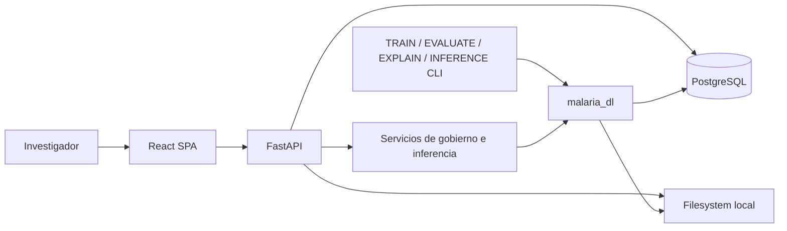
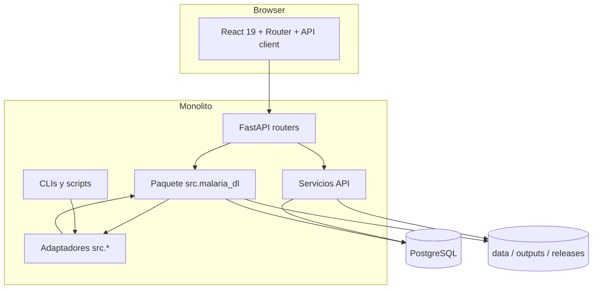

# Evaluación del estado actual — Prompt 0

> **Estado documental:** `HISTORICAL_AUDIT`
> **Uso operativo:** No; no describe el repositorio ni el runtime actuales.
> **Snapshot:** `main@092a237497615ac3f1e775a61c54c6d6417dd515`, 423 archivos versionados.

## Resumen ejecutivo

Snapshot auditado: rama `main`, commit `092a237497615ac3f1e775a61c54c6d6417dd515`, working tree inicialmente limpio, 423 archivos versionados, macOS Darwin arm64. La solución es un monolito modular académico con tres superficies: paquete ML Python, API FastAPI y SPA React. Su activo principal es la trazabilidad reproducible de clasificación celular: runs, checkpoints, checksum, calibración, explicabilidad, linaje y gobierno. No existe aún el pipeline de frotis completo.

Hechos verificados:

- `src/malaria_dl/` es el paquete canónico; casi todos los módulos `src/*.py` son adaptadores, pero siguen siendo contrato activo para CLIs, tests y también imports internos canónicos.
- `cell_detection/` sólo contiene `README.md` y `__init__.py`: no hay detector, RBCNet, tiling, NMS, segmentación, boxes ni crops.
- `check_image_quality()` mide tamaño, brillo medio, contraste y blur laplaciano; sólo rechaza archivos inaccesibles/corruptos. No hay política versionada, persistencia propia ni bloqueo integrado.
- `image_analysis_jobs` modela proveniencia y estados, pero no es una cola. La inferencia se ejecuta sincrónicamente en `TraceableInferenceService.infer()`.
- Hay dos conceptos Etapa 2 parcialmente superpuestos: deployment gobernado (`deployed_model_versions`) y publicación reversible (`stage2_model_publications`). La UI denomina ambos “Productivo Etapa 2”.
- La publicación ligera exige TRAIN y EVALUATE terminados; el deployment exige además contrato técnico, checksum, mapping, artefacto cargable, smoke test y slot gobernado.
- No hay autenticación, autorización ni roles. Actor y requester son texto aportado por el cliente.
- No hay Docker, Compose, CI versionado, Alembic, worker, broker ni `StorageProvider`.
- El frontend tiene rutas de experimentación, gobierno y dataset, pero no menú Frotis, muestra, upload completo, calidad, progreso, visor científico ni revisión experta.

## Alcance y metodología

Se inspeccionaron los 423 archivos versionados y, en profundidad, entrypoints, módulos Python, routers, servicios, migraciones 001–029, tests, scripts, configuración, releases y consumidores frontend. Se contrastaron nombres con símbolos, SQL, imports y tests. La documentación previa se trató como evidencia histórica. No se ejecutaron operaciones con escritura en PostgreSQL, descarga, TRAIN, EVALUATE ni EXPLAIN completos.

Etiquetas usadas: **hecho** = constatación directa; **inferencia** = conclusión derivada; **riesgo** = efecto adverso; **recomendación** = acción futura; **pendiente** = decisión a formalizar.

## Snapshot y entorno

| Elemento | Valor verificado |
|---|---|
| Git | `main` / `092a237497615ac3f1e775a61c54c6d6417dd515` |
| Working tree inicial | limpio |
| Python host / ML / backend | 3.14.4 / 3.12.13 / 3.14.4 |
| Node / npm | 22.23.1 / 10.9.8 |
| PostgreSQL | cliente `psql` 17.9; servidor no consultado |
| SO | Darwin 25.5.0 arm64 |
| Migraciones | scripts SQL numerados hasta 029; no Alembic |

`.env` locales existen y están ignorados; no se leyeron ni se reproducen secretos. Los defaults de `backend_api/app/db.py` y `malaria_dl/persistence/database.py` difieren, incluso en usuario y nombre de variable.

## Topología y entrypoints

| Área | Entry point / consumidor |
|---|---|
| Backend | `backend_api/app/main.py:app`; `scripts/start_backend.sh` ejecuta Uvicorn |
| Frontend | `frontend/src/main.tsx` → `App.tsx`; Vite |
| TRAIN | `run_train_all_models.py`; `malaria_dl.training.cli`; adaptador `src/train.py` |
| EVALUATE | `run_evaluate_all_trainings.py`; `malaria_dl.evaluation.cli`; adaptador `src/evaluate.py` |
| EXPLAIN | `run_explain_all_trainings.py`; `malaria_dl.explainability.cli`; adaptador `src/explain.py` |
| Inferencia | `malaria_dl.inference.cli`, `predictor.py`, `traceable.py`; endpoint POST de job |
| DB | `scripts/init_db.py`; migraciones en `db/init`; scripts destructivos separados |
| Release | `scripts/release_model.py`, gobierno API y servicios `governance/services/*` |
| Validación | `scripts/validate.sh` |

El arco Canon → Legacy es real y problemático: por ejemplo `malaria_dl/inference/traceable.py` importa `src.model_governance`, `src.model_deployment_service` y `src.db`. Por ello los adaptadores aún no pueden retirarse.

## Flujos reales

### TRAIN

`run_train_all_models.py`/`malaria_dl.training.cli` llama a `training/trainer.py`: carga el split físico mediante `data/loaders.py`, aplica preprocessing/augmentation, crea modelos de `models/architectures.py`, entrena con callbacks y política de checkpoint, guarda outputs y registra run, historial, métricas, artefactos y checkpoint mediante `persistence/tracking.py` y `run_repository.py`. El dataset actual es TFDS Malaria/células ya recortadas; no hay `patient_id`.

### EVALUATE

`run_evaluate_all_trainings.py`/`evaluation/cli.py` resuelve checkpoint, ejecuta `evaluator.py`, conserva score positivo como `probability_parasitized`, calcula matriz, métricas clínicas y calibración de threshold, persiste resultados y vincula `evaluates_checkpoint_from` en `run_lineage`. Tests de mapping, threshold, métricas y lineage caracterizan este flujo.

### EXPLAIN

`run_explain_all_trainings.py`/`explainability/cli.py` selecciona casos en `case_selection.py` y ejecuta Grad-CAM, LIME y SHAP desde `pipeline.py`. Registra `explainability_results`, artefactos y relación `explains_checkpoint_from`. Es batch/CLI, no automático al inferir ni endpoint de creación. API y frontend sólo consultan resultados.

### Inferencia

Hay dos variantes:

1. `inference/predictor.py` soporta carga, preprocessing, threshold, TTA/ensemble en módulos asociados, CSV, uploads y explicabilidad externa.
2. `TraceableInferenceService.infer()` resuelve un deployment, verifica ruta y SHA-256, mapping `0=uninfected/1=parasitized`, crea run y job, carga/cachea TensorFlow, clasifica **una imagen de `dataset_split_images`**, persiste `predictions` y finaliza todo dentro de la misma llamada. No usa control de calidad, detector ni worker.

El endpoint `POST /api/image-analysis-jobs` llama directamente a este servicio. Por tanto “job” no implica ejecución asíncrona.

### Publicación “Productivo Etapa 2”

Existen tres carriles:

1. Gobierno formal: `model_versions` → contrato → validación/aprobación → `deployed_model_versions`, con aliases, smoke, activación, rollback y triggers.
2. Availability: `Stage2ModelAvailabilityService` crea paquete en `releases/stage2` y deployment `stage2/default`; su variante técnica usa `releases/production` y `production/champion`.
3. Publication: `Stage2PublicationService` escribe `stage2_model_publications` y eventos append-only. Elegibilidad funcional: TRAIN completed + EVALUATE completed + identidad gobernada. Admite múltiples modelos activos, uno por model version; no define default.

**Contradicción**: `GET /api/stage2/models` usa publicaciones, mientras inferencia trazable resuelve deployments. Una publicación puede estar activa sin deployment inferible y viceversa. El índice de deployment permite un slot activo por `(deployment_name, environment, alias)` y el índice adicional sólo un `production/champion`; publicaciones permiten múltiples activos. No hay constraint transversal.

**Recomendación Prompt 1**: declarar `stage2_model_publications` como catálogo de candidatos y un único deployment `stage2/default` como selección inferible predeterminada, o unificar ambos mediante una vista/servicio transaccional. Nunca inferir sólo desde publicación.

## Arquitectura ML canónica y compatibilidad

`src/malaria_dl` concentra lógica en `common`, `config`, `data`, `models`, `training`, `evaluation`, `explainability`, `inference`, `persistence` y `governance`. Los adaptadores `src/*.py` en su mayoría sustituyen `sys.modules` o reexportan símbolos. Excepciones con lógica heredada todavía real: `execution_types.py`, `model_execution_config.py`, `model_metadata.py` y envoltorios explícitos de servicios. `src/model_governance/*` también es compatibilidad.

Consumidores activos: scripts DB/dataset, numerosos tests, run scripts y módulos canónicos. Dependencias externas razonables incluyen notebooks/automatizaciones que importen `src.train`, `src.models`, etc. Estrategia segura: congelar su API, agregar tests de contrato, migrar primero imports internos a `src.malaria_dl.*`, emitir deprecación durante al menos un ciclo y medir uso antes de retirar.

## Detección y crops

La búsqueda de RBCNet, YOLO, Faster R-CNN, U-Net, NMS, tiling y contratos de boxes no encontró implementación. `cell_detection/README.md` lo declara frontera sin detector. Columnas bbox y `detector_model_version_id` en `predictions` son reserva de esquema, no pipeline. No existen tests de detección/crops. Deben crearse `CellDetector`, adaptador de anotaciones, detector simulado, tiler, conversor global, NMS, detection runs, detections y Crop Generator.

## Calidad de imagen

`data/quality_control.py:check_image_quality` maneja missing/no-file/corrupto, resolución mínima 64×64, brillo `<0.08`/`>0.92`, contraste `<0.03`, blur `<0.0005`. Los thresholds son argumentos sólo para tamaño y literales para el resto. No mide exposición por colas, saturación, contenido útil ni densidad celular. Una warning no cambia `passed`; no hay policy id/version, tabla de assessments, API, UI ni gate de detector. `image_analysis_jobs.quality_*` sólo reserva campos JSON/estado.

## Backend

`main.py` incluye 11 routers. Hay GET de salud, dashboard, runs, catálogo, dataset, métricas, explicabilidad, predictions, observabilidad y artefactos; gobierno agrega numerosos POST. CORS sólo permite orígenes localhost 5173 y métodos GET/POST, coherente con los métodos actuales, pero incompatible con futuros PATCH/DELETE. SQL es texto parametrizado; filtros dinámicos usan allowlists. Operaciones de gobierno usan `engine.begin()`, lecturas usan conexiones independientes. No hay middleware de auth, roles, correlation ID o logging estructurado. `safe()` convierte excepciones diversas a HTTP 409 y puede ocultar clasificación operativa.

La API no es “solo lectura”: gobierno, publicación, deployment e inferencia escriben. OpenAPI existe por FastAPI, pero no hay contratos versionados ni paginación uniforme. `X-Requester`/actor no autentican identidad.

## Frontend

`App.tsx` registra 15 vistas y redirects legacy. Sólo Resumen, Ejecuciones, Dataset y Datasets/modelos están visibles en `navigationConfig.ts`; las demás páginas son alcanzables por URL o enlaces internos. `api.ts` centraliza fetch y tipos en `types/api.ts`. Las pruebas son mayoritariamente caracterización estática con `node:test`, no DOM/E2E real.

No existe ruta o menú Frotis, Nueva muestra, muestra/listado, upload completo, calidad, progreso, visor pan/zoom, boxes, inspector/carrusel, anotación/revisión ni reporte de frotis.

## PostgreSQL

Los scripts definen 32 tablas, 28 declaraciones de vista (27 nombres únicos por reemplazo de una vista), 9 funciones nominales (una redefinida), 9 triggers y 122 índices declarados. Objetos centrales: runs/metrics/history, datasets/splits/images, predictions, artifacts, explainability, clinical tracking, lineage, governance, deployments, image jobs y publicaciones Etapa 2.

No existen entidades de paciente/sujeto, muestra, lámina, laboratorio/dispositivos/sesión, imagen de frotis, assessment de calidad, tile, detection/detection run, crop, resultado agregado, revisión/anotación, reporte, pipeline version ni auditoría general. `predictions` mezcla legado, imagen y célula; extenderla para detecciones/revisión produciría conflicto semántico. Las vistas `inference_runs` y `cell_predictions` no son tablas independientes.

Las migraciones son SQL idempotente con `schema_migrations` y checksum aplicadas por script propio. No hay grafo down/revision ni transacciones uniformes tipo Alembic. Los duplicados de 023–027 en `docs/` son copias históricas.

## Almacenamiento

Ubicaciones reales: `malaria_dl_local_project/data`, `outputs`, `releases/{production,stage2}`, raíz `data/prediction_uploads` y artefactos referenciados por BD. `backend_api/app/services/artifacts.py` permite sólo raíces resueltas conocidas y valida archivo/MIME; dataset browser también confina rutas. Releases verifican checksum y copian atómicamente, pero outputs/uploads generales pueden escribirse y no existe política global de inmutabilidad/retención.

No existe `StorageProvider`; rutas físicas aparecen en BD y algunos payloads internos. La migración a object storage requiere IDs/URI lógicos, metadata y checksums desacoplados del path.

## Dataset

El registro cubre TFDS Malaria, split físico reproducible por seed, archivos, dimensiones y checksum opcional; `dataset_split_images` y browser ofrecen trazabilidad/paginación. No hay patient/sample/slide/source identity ni regla de leakage por paciente. El NIH/NLM Thin Blood Smears Pf con Point Set/Polygon Set e imágenes completas no está incorporado; no existen parsers ni export de detección. Debe descargarse sólo en Prompt 7, con licencia/proveniencia, parser caracterizado y manifest por `patient_id`.

## Explicabilidad

Grad-CAM, LIME y SHAP están implementados y testeados sobre imágenes celulares. La asociación usa run/image/prediction y artefactos; API/galería son lectura. No existe scheduler, generación automática por prioridad, endpoint on-demand, presupuesto/cancelación ni composición de crop con contexto original. Reutilizar algoritmos mediante adaptador a crop; extender persistencia y UI.

## Seguridad, infraestructura y observabilidad

- Sin autenticación, autorización, roles, rate limit o protección CSRF.
- Upload helper genera nombre UUID y confina directorio, pero no establece límite de tamaño ni validación MIME fuerte antes de decodificar.
- SQL de API usa parámetros y allowlists; riesgo principal es autorización y exposición de artefactos, no una inyección verificada.
- Defaults de DB incluyen credenciales académicas y difieren entre procesos.
- No Dockerfile, Compose, CI/GitHub Actions, Redis, worker, Makefile, formatter/linter/type-check Python configurado, backups o restore.
- `/health` verifica proceso; no readiness integral de filesystem/model/broker. `/errors` y `/logs` leen tablas, pero no hay logging estructurado ni correlation middleware.

## Pruebas y línea base

| Comando | Resultado | Evidencia |
|---|---|---|
| `./scripts/validate.sh` | PASS | 368 ML, 1 skip; 7 backend; build Vite |
| `python -m unittest discover -s malaria_dl_local_project/tests` | PASS dentro de validate | Python ML 3.12.13, TensorFlow CPU |
| `backend_api/.venv/bin/python -m unittest discover -s backend_api/tests` | NO CONCLUYENTE | La ejecución adicional no constituye una línea base válida; se conserva como evidencia sólo la suite backend ejecutada por `validate.sh` |
| `npm --prefix frontend test` | PASS | 59/59 |
| `npm --prefix frontend run build` | PASS dentro de validate | TypeScript + Vite, 98 módulos |
| E2E PostgreSQL opt-in | BLOCKED/omitido | requiere flags, IDs y BD efímera; no se habilitó para proteger datos |

Fortalezas: alta cobertura unitaria de clasificación, convención clínica, checkpoints, calibración, lineage, gobierno, checksum y frontend de experimentos. Vacíos críticos: pipeline de frotis, modelo de dominio, almacenamiento abstracto, cola/worker, seguridad y operación reproducible.

## Recomendaciones arquitectónicas a formalizar en ADR

| Tema | Alternativas | Recomendación | Costo / riesgo |
|---|---|---|---|
| Cola/broker | Celery, RQ, Dramatiq; Redis o PostgreSQL | **Decisión cerrada por Baseline v1.1:** cola PostgreSQL con `FOR UPDATE SKIP LOCKED`, lease, heartbeat y workers | Medio; operar claim/reaper propios |
| Progreso | polling, SSE, WebSocket | polling inicialmente; SSE después si latencia lo exige | Bajo; evita infraestructura bidireccional |
| Migraciones | SQL propio, Alembic | adoptar Alembic sin reescribir 001–029; baseline en 029 | Medio; reconciliar checksums |
| Jobs | reemplazar/extender | extender identidad/proveniencia, crear tabla de attempts/events; no usar transacción HTTP como executor | Medio |
| Predictions | extender o nuevas tablas | `detections`, `cell_crops`, `cell_predictions`, `image_level_results`; vista compatible sobre legado | Alto si se sigue sobrecargando |
| Dominio | JSON vs relacional | subjects pseudónimos, samples, slides, capture sessions, full_smear_images y dispositivos normalizados | Medio |
| Detector | función concreta vs interfaz | protocolo `CellDetector` con resultado bbox/confidence/model provenance | Bajo |
| RBCNet | fork, import directo, adaptador | adaptador aislado; no atribuir clasificación | Medio/licencia |
| Fallback | anotaciones oficiales | adapter Point/Polygon como detector de referencia y ground truth | Bajo |
| Storage | paths o provider | `StorageProvider` (`put_immutable`, `open`, `stat`, `uri`, `checksum`) y filesystem inicial | Medio |
| Modelo default | publicación o deployment | múltiples publicaciones; exactamente un deployment `stage2/default` inferible | Bajo si se unifica transaccionalmente |
| Rollback | mutar modelo o alias | nueva revisión de deployment/alias; nunca mutar artefacto | Bajo |
| Calidad | literales o policy | policy versionada persistida; hard reject sólo reglas validadas, warning revisable | Medio científico |
| XAI | todo automático o selectivo | Grad-CAM automático para sospechosas; LIME/SHAP prioritario/on-demand con presupuesto | Alto de cómputo |
| Auth/roles | local, OIDC | OIDC académico si disponible; fallback local Argon2 + sesión/JWT corta. Roles viewer, analyst, expert, publisher, admin | Medio |
| Reportes | HTML/PDF mutable | manifest JSON inmutable + HTML/PDF derivado versionado | Medio |
| Legacy | retiro inmediato o facade | facade congelada, telemetría/deprecación, migración interna y retiro por release mayor | Bajo |

## Conclusiones verificadas

La Etapa 1 no debe reemplazarse: su clasificador, contratos clínicos, gobierno, linaje, artefactos y XAI son reutilizables. La Etapa 2 requiere una capa de dominio y pipeline nueva integrada al mismo monolito, no una aplicación paralela. Los cinco bloqueantes son: ADR de identidad Productivo Etapa 2, modelo relacional de muestra/frotis, `StorageProvider` inmutable, ejecución asíncrona recuperable y contrato de detector/dataset. La seguridad debe entrar antes de exponer escrituras o revisión humana.
