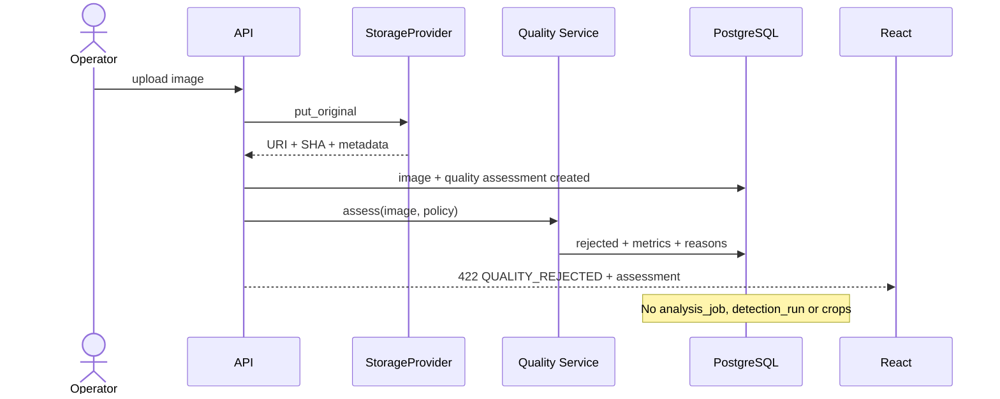
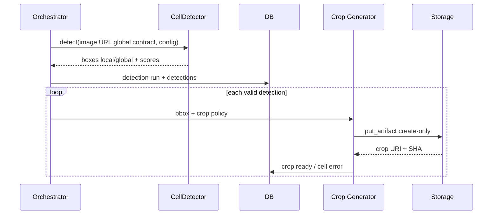
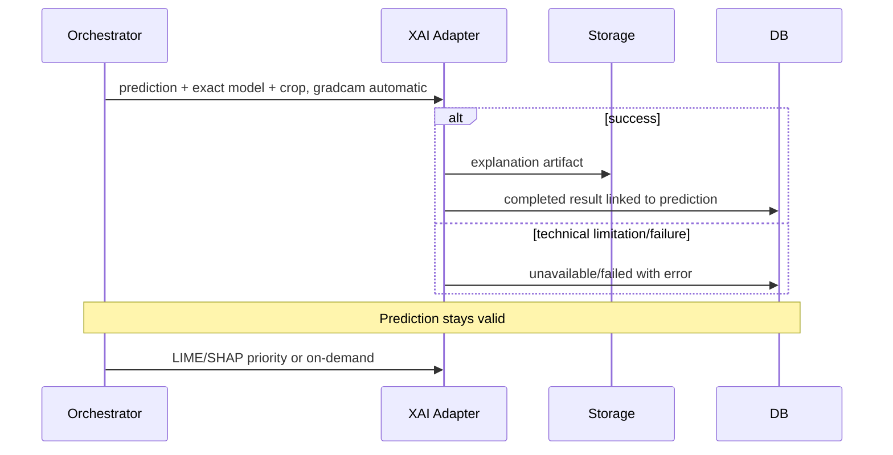
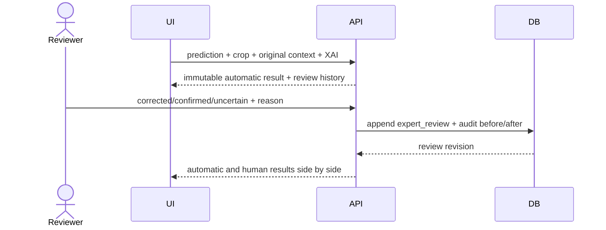
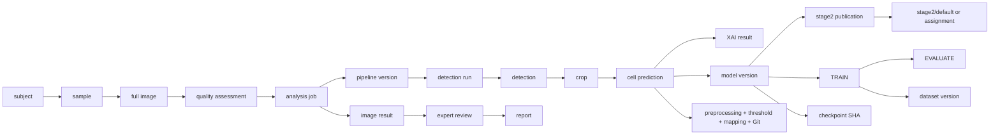
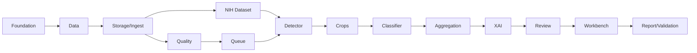

# Secuencias de análisis — Entrega 2

## Imagen rechazada por calidad



## Flujo completo aceptado

```mermaid
sequenceDiagram
  actor U
  participant API
  participant Q as Quality
  participant DB
  participant W as Worker
  participant S as Storage
  Q-->>API: accepted assessment
  U->>API: create analysis job
  API->>DB: created + assignments; queued
  W->>DB: atomic claim + lease
  W->>S: open original
  W->>DB: detecting
  W->>DB: detections progressively
  W->>S: put crops
  W->>DB: crops ready progressively
  W->>DB: predictions per crop/model
  W->>S: put explanations
  W->>DB: aggregate + completed/partial
  API-->>U: polling state/cells/result
```

## Detección y crops



## Multimodelo

```mermaid
sequenceDiagram
  participant O as Orchestrator
  participant G as Governance Resolver
  participant M1 as Primary classifier
  participant M2 as Additional classifier
  participant DB
  O->>G: resolve frozen assignments
  G-->>O: active publications + checkpoint snapshots
  par per assignment
    O->>M1: batch crops
    M1-->>DB: individual predictions
  and
    O->>M2: batch crops
    M2-->>DB: individual predictions
  end
  Note over DB: Results remain parallel; no ensemble
```

## Explicabilidad



## Revisión humana



## Linaje completo



## Fallos parciales

- Detector total: job `failed`, sin clasificación, retry permitido.
- Detección/crop individual: demás células continúan; cierre `partial_failure`.
- Batch clasificación: retry; si persiste, dividir; completed no se duplica.
- Modelo: otros assignments continúan; resultado de modelo partial/failed.
- XAI: prediction válida; XAI failed/unavailable y retry on-demand.
- Aggregator: conservar entradas; reconstrucción idempotente; job partial.
- Report: job permanece completed/partial; report failed regenerable.

## Dependencia entre prompts



