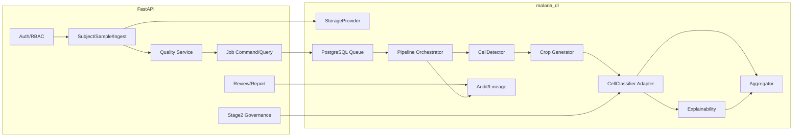

# Diagrama de componentes — Entrega 2

> **Estado documental:** `HISTORICAL_AUDIT`
> **Uso operativo:** No; diagrama objetivo de Architecture Baseline v1.1.
> **Snapshot:** Entrega 2, previo a la implementación incremental.

Responsabilidades:

- `Quality Service` crea un assessment versionado antes del job.
- `PostgreSQL Queue` sólo reserva, arrienda y recupera jobs.
- `Pipeline Orchestrator` coordina stages; no implementa algoritmos.
- `CellDetector` retorna regiones candidatas, nunca clases parasitized/uninfected.
- `CellClassifier Adapter` conserva `0=uninfected`, `1=parasitized`.
- `Explainability` falla de forma no destructiva.
- `Aggregator` usa denominadores explícitos y lenguaje no diagnóstico.
- `Audit/Lineage` registra identidad, before/after, actor y correlación.
