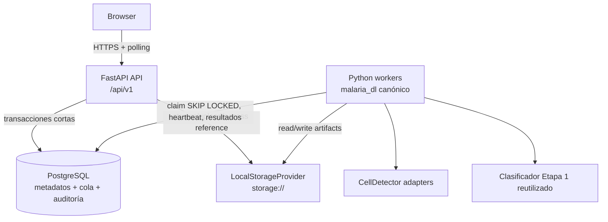

# Diagrama de contenedores — Entrega 2

> **Estado documental:** `HISTORICAL_AUDIT`
> **Uso operativo:** No; diagrama objetivo de Architecture Baseline v1.1.
> **Snapshot:** Entrega 2, previo a la implementación incremental.

Estado actual: `backend_api/app/main.py`, React/Vite, PostgreSQL y filesystem ya existen; `TraceableInferenceService.infer()` es síncrono. Estado objetivo: API y workers son procesos del mismo monolito modular, comparten contratos, pero la API nunca ejecuta el pipeline pesado.

No se incorporan Redis, Celery, RQ, Dramatiq, RabbitMQ, object storage cloud ni WebSocket/SSE en el MVP.
