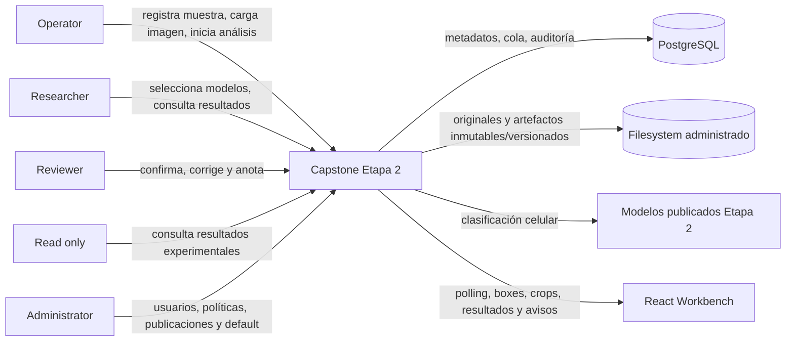

# Diagrama de contexto — Entrega 2

Estado: objetivo aprobado para Architecture Baseline v1.1. La plataforma es una **plataforma científica experimental de apoyo al análisis de imágenes microscópicas de frotis sanguíneo**.

Límites:

- No diagnostica, no reemplaza al microscopista y no integra LIS/HIS.
- PostgreSQL no almacena imágenes como `BYTEA`.
- La calidad rechazada termina antes de crear un `analysis_job`.
- Cada corrección humana se conserva aparte del resultado automático.

