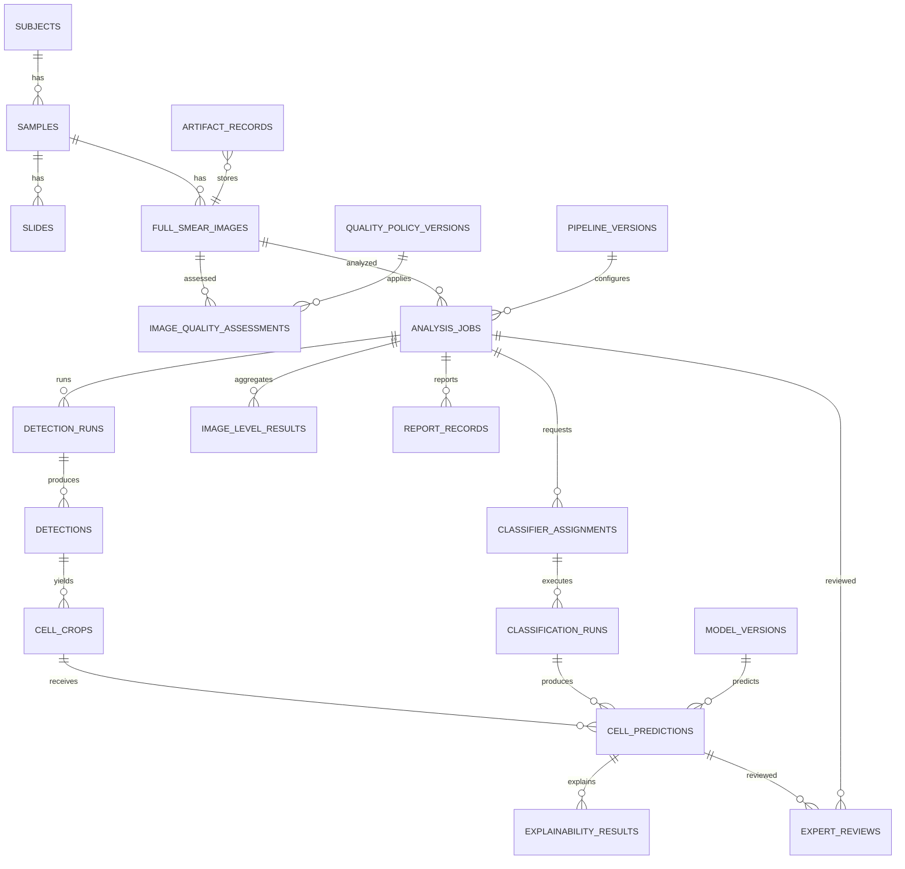

# Modelo conceptual de datos — Entrega 2

> **Estado documental:** `HISTORICAL_AUDIT`
> **Uso operativo:** No; modelo conceptual, no contrato del schema actual.
> **Snapshot:** Entrega 2 / Architecture Baseline v1.1.

Estado: objetivo conceptual; no constituye migración. Campos comunes salvo catálogos inmutables: UUID `id`, `created_at`, `created_by`, `updated_at` cuando el objeto sea mutable y `correlation_id`. Históricos críticos usan `ON DELETE RESTRICT`; borrado lógico sólo donde se indica. Índices siempre incluyen PK/FK y consultas descritas.

|Entidad|Propósito e identidad|Atributos principales|Relaciones/cardinalidad|Restricciones, mutabilidad, eliminación, índices y owner|
|---|---|---|---|---|
|`subjects`|Sujeto pseudonimizado; UUID|pseudonym, status|1:N samples|pseudonym unique, sin PII; mutable estado, restrict si tiene samples; idx status; Domain|
|`samples`|Muestra; UUID|subject_id, collected_at opcional, metadata allowlist|N:1 subject, 1:N slides/images|código pseudónimo unique por contexto; versionable, restrict; idx subject/date; Domain|
|`slides`|Lámina; UUID|sample_id, stain, preparation metadata|N:1 sample, 1:N capture sessions/images|sin identidad clínica en path; restrict; idx sample; Domain|
|`laboratories`|Catálogo laboratorio académico; UUID|code, name no clínico, status|1:N capture sessions|code unique; retire, no delete; idx status; Admin|
|`microscope_devices`|Microscopio; UUID|laboratory_id, manufacturer/model, serial pseudónimo, calibration|1:N sessions|versionado/retire; idx lab/status; Admin|
|`camera_devices`|Cámara; UUID|laboratory_id, manufacturer/model, sensor|1:N sessions|versionado/retire; idx lab/status; Admin|
|`capture_sessions`|Contexto de captura; UUID|slide/lab/microscope/camera, settings snapshot|N:1 cada catálogo, 1:N images|snapshot inmutable; restrict; idx slide/time; Operator|
|`full_smear_images`|Original completo; UUID|sample_id, slide_id?, capture_session_id?, original_artifact_id, width/height/MIME/SHA/status|N:1 sample; 1:N QC/jobs/detections|artifact/checksum required, bytes inmutables; restrict; unique checksum según policy; idx sample/status; Ingest|
|`quality_policy_versions`|Policy QC inmutable; UUID/version|metrics, thresholds, algorithm/git/version|1:N assessments/pipelines|published immutable, retire only; unique version/checksum; Science/Admin|
|`image_quality_assessments`|Ejecución QC; UUID|image/policy, status, decision, metrics, reasons, started/completed|N:1 image/policy|append-only; accepted/rejected/failed; idx image/time/decision; Quality|
|`pipeline_versions`|Snapshot ejecutable; UUID/version|stage configs, quality/crop/aggregation policies, git, environment, retry/progress weights|1:N jobs|immutable after publish; checksum unique; Pipeline owner|
|`analysis_jobs`|Unidad de reconocimiento; UUID|campos del diseño de cola|N:1 accepted image/pipeline; 1:N events/runs/assignments/results|priority 1–100, idempotency unique, state checks; no delete; queue indexes; Orchestrator|
|`analysis_job_events`|Historial append-only; UUID|job, type, before/after, actor/worker, attempt/error/time|N:1 job|UPDATE/DELETE prohibited; idx job/time/type; Audit|
|`detector_model_versions`|Identidad detector; UUID|name/version/artifact/checksum/framework/config/schema|1:N detection runs|inmutable/retire; checksum; no implica clasificación; ML governance|
|`detection_runs`|Ejecución detector; UUID|job/image/detector/pipeline/config/status/counts/errors|N:1 job/image/detector; 1:N detections|unique job+detector+config revision; immutable closure; idx job/status; Detection|
|`detections`|Región candidata; UUID|run/image, bbox original/adjusted, score/label, tile/offset, algorithm version, status|N:1 run/image; 0:N crops|xywh global valid, cell_index unique per run; immutable; idx image/run/score; Detection|
|`cell_crops`|Crop derivado; UUID|detection/image/artifact, source/effective bbox, policy, padding, width/height/SHA/status|N:1 detection; 1:N predictions|ready requiere artifact/checksum; regenerar crea fila; idx detection/status; Crop|
|`classifier_assignments`|Modelos pedidos; UUID|job, publication, model version, role, order, snapshots|N:1 job/publication/model; 1:N classification runs|unique job+publication; primary máximo uno; immutable; Orchestrator|
|`classification_runs`|Ejecución por assignment/batch; UUID|job/assignment/model/checkpoint, preprocessing, threshold, mapping, git/status|N:1 assignment; 1:N predictions|snapshots required; append-only closure; idx job/model/status; Classification|
|`cell_predictions`|Predicción automática individual; UUID|run/crop/model/publication/checkpoint, labels, probabilities, threshold, confidence/time/status|N:1 crop/run/model; 1:N XAI/reviews|probabilities [0,1], mapping fixed, unique run+crop+model; immutable, restrict; Classification|
|`image_level_results`|Agregado experimental versionado; UUID|job/policy, automatic_status, counts/percentages/durations/partial|N:1 job; 1:N model result payload/records conceptuales|denominators explicit; new revision on rebuild; idx job/revision; Aggregation|
|`explainability_runs`|Ejecución XAI; UUID|job/model/method/version/mode/parameters/status|N:1 job/model; 1:N results|method/mode enums; immutable closure; idx job/method; XAI|
|`explainability_results`|Explicación concreta; UUID|run/prediction/crop, artifact/checksum/status/error|N:1 prediction/run|una por prediction+run+method; immutable; failure non-destructive; XAI|
|`expert_reviews`|Revisión celular o general; UUID|scope, prediction/job, status/label/comment, reviewer, supersedes, reason|N:1 prediction o job; self history|exactly one scope; append-only; idx target/time/reviewer; Reviewer|
|`review_annotations`|Anotación adicional; UUID|review/target, type, bbox/text/payload|N:1 review; target detection/image/job|append-only; no reentrenamiento automático; Reviewer|
|`report_records`|Reporte versionado; UUID|job/review?, status, format, manifest/artifact, version, generated_by|N:1 job; artifact|new record on regenerate; no overwrite; idx job/version; Reports|
|`artifact_records`|Registro portable de bytes; UUID|storage URI/provider/type/owner/run/MIME/size/SHA/status/provenance|polimórfico controlado a owners|SHA required; original immutable; regenerate new UUID; idx owner/type/SHA/status; Storage|
|`audit_events`|Auditoría transversal; UUID|actor/roles/action/resource/before/after/reason/outcome/correlation/time|referencia lógica a recursos|append-only; idx actor/resource/time/correlation; Security|
|`model_versions`|Clasificador gobernado existente|checkpoint, SHA, mapping, signatures/status|TRAIN/artifact/publications/runs|reutilizar y extender sólo si contrato central; triggers actuales; Governance|
|`stage2_model_publications`|Catálogo autorizado existente|model/TRAIN/EVALUATE/checkpoint/status/history|1:N assignments; 0:N slot revisions|activa para inferir; desactivación bloqueada si default; Governance|
|`deployed_model_versions`|Revisión slot existente|publication futura, env/alias/snapshots/status/history|default → publicación|máximo uno activo por contexto; immutable revision; Governance|
|`runs`|Envelope ejecución existente|type/status/config/timestamps/git|TRAIN/EVALUATE/XAI/inference|reutilizar; jobs especializados enlazan runs; Tracking|
|`run_lineage`|Relaciones existentes|parent/child/type/model/artifact|N:M runs|append-only/restrict; extender relationship types; Tracking|

## No sobrecargar `predictions`

La tabla actual y vista `cell_predictions` de migración 026 permanecen para inferencia legacy. Etapa 2 usa tabla especializada `cell_predictions`, con FK obligatoria a crop/run/model y predicción inmutable. Una vista/adaptador puede unir ambas para consultas históricas, sin escritura dual.

## Coordenadas canónicas

```json
{"x":120,"y":340,"width":48,"height":48}
```

- Formato identificado `pixel_xywh_top_left_v1`; píxeles de imagen original, origen superior izquierdo, x derecha, y abajo.
- `width,height > 0`; `x,y >= 0`; `x+width <= image_width`, `y+height <= image_height`.
- Bbox original = salida global antes de margin; adjusted = clipping/normalización post-NMS; crop bbox = adjusted + margin antes de clipping.
- Tile conserva `tile_id`, offset `(offset_x,offset_y)` y bbox local. Global: `x=local_x+offset_x`, `y=local_y+offset_y`.
- Padding registra top/right/bottom/left cuando el crop deseado excede límites; effective bbox siempre está dentro de imagen.
- NMS usa IoU de boxes globales: intersección/unión; threshold/config y algoritmo versionados.
- Coordenadas normalizadas opcionales son derivadas y rotuladas, nunca sustituyen xywh canónico.

## ER conceptual



## Reproducibilidad y linaje

Cada cierre registra: `git_commit`, `environment`, `dataset_version`, `pipeline_version`, `detector_version`, `classifier_version`, `checkpoint_sha256`, `preprocessing_version`, `threshold_policy_version`, `label_mapping_version`, `quality_policy_version`, `crop_policy_version`, `aggregation_policy_version`, seed cuando aplique, `executed_at`, `executed_by`, `correlation_id`.

Cadena verificable: subject → sample → image → QC → job/pipeline → detection run/detection → crop → classification run/prediction → XAI → image result → review → report; prediction → model version → publication → default/assignment → TRAIN/EVALUATE → checkpoint → dataset/preprocessing/threshold/mapping/Git.
