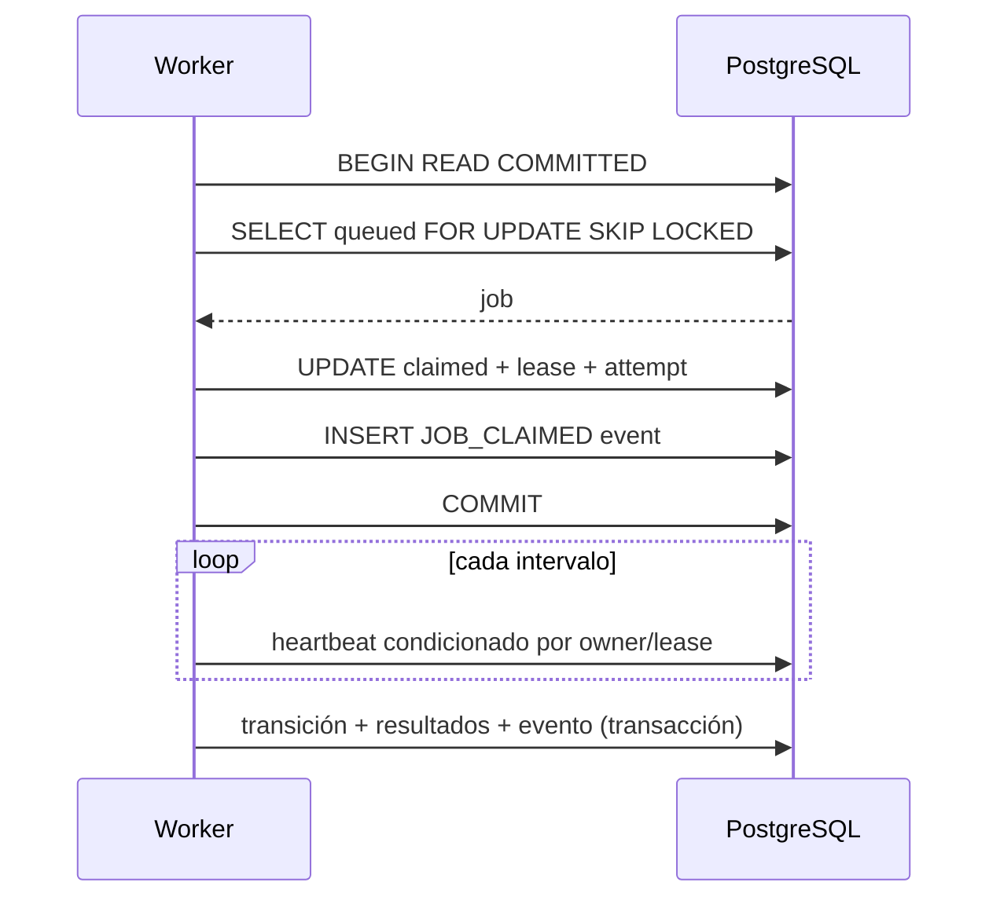

# Diseño de cola PostgreSQL — Entrega 2

> **Estado documental:** `HISTORICAL_AUDIT`
> **Uso operativo:** No; diseño conceptual no materializado como worker con leases.
> **Snapshot:** Entrega 2 / Architecture Baseline v1.1.

Estado: decisión aprobada; diseño conceptual, sin SQL productivo.

## Contrato de `analysis_jobs`

Campos obligatorios conceptuales:

`id`, `image_id`, `quality_assessment_id`, `pipeline_version_id`, `priority` (1–100), `status`, `idempotency_key`, `requested_models` (snapshot ordenado de publicaciones/roles), `created_at`, `queued_at`, `claimed_at`, `started_at`, `completed_at`, `cancelled_at`, `available_at`, `worker_id`, `lease_expires_at`, `heartbeat_at`, `attempt_count`, `max_attempts` (default 3), `progress_current`, `progress_total`, `progress_percent`, `current_stage`, `last_error_code`, `last_error_message`, `correlation_id`, `created_by`, `updated_at`.

`requested_models` se normalizará mediante `classifier_assignments`; el campo del job es snapshot de petición, no fuente relacional única. Se reutiliza conceptualmente `image_analysis_jobs`, pero su semántica legacy se preserva; Prompt 3 decidirá extensión física o tabla nueva `analysis_jobs` sin sobrecargar estados históricos.

## Claim atómico

Orden inmutable:

```sql
ORDER BY priority DESC, created_at ASC
```

Algoritmo dentro de una transacción corta `READ COMMITTED`:

1. Seleccionar un job `queued`, `available_at <= now()`, no cancelado y con intentos disponibles mediante `FOR UPDATE SKIP LOCKED LIMIT 1`.
2. Actualizar esa fila a `claimed`; fijar `worker_id`, `claimed_at`, `heartbeat_at`, `lease_expires_at`, incrementar `attempt_count`.
3. Insertar evento `JOB_CLAIMED` en la misma transacción.
4. Commit antes de leer imágenes o ejecutar ML.

No se mantiene un lock DB durante inferencia. El worker sólo opera si `(job_id, worker_id, lease)` sigue vigente.



## Lease, heartbeat y recuperación

- Lease inicial: configurable por stage; debe exceder al menos tres intervalos de heartbeat.
- Heartbeat: actualización condicional `WHERE worker_id=:self AND status no terminal`.
- El reaper busca `claimed` o stages activos con `lease_expires_at < now()`.
- Si `attempt_count < max_attempts` y el error/stage es retryable: limpia owner/lease, fija `queued`, calcula `available_at`, registra `LEASE_EXPIRED_REQUEUED`.
- Si alcanzó máximo: `failed`, `completed_at`, error `QUEUE_MAX_ATTEMPTS_EXCEEDED`.
- Espera progresiva aprobada: `min(base * 2^(attempt_count-1), cap) + jitter`, valores configurables y persistidos en pipeline version.

## Idempotencia y prevención de doble ejecución

- API exige `Idempotency-Key` para creación; unicidad conceptual por `(created_by, image_id, pipeline_version_id, normalized_requested_models, idempotency_key)`.
- Mismo key + mismo payload devuelve el job existente; payload distinto responde 409.
- Cada operación de stage tiene clave natural: detection run/job/config; crop/detection/policy; prediction/classification run/crop/model; explanation/prediction/method/run; aggregate/job/policy.
- Writers usan insert-on-conflict/read-existing y validan checksum/payload.
- Un worker con lease perdido no puede consolidar resultados: cada commit verifica ownership o usa fencing token `attempt_count`.

## Caídas

- **Después de artefacto, antes de DB**: el artifact queda huérfano temporal con owner intent; reconciliador lo enlaza si checksum/key coincide o lo marca regenerable para limpieza. Nunca sobrescribe.
- **Después de DB prediction**: retry detecta clave natural completed y no vuelve a inferir; continúa desde la siguiente unidad.
- **Durante batch**: persistencia individual por crop/model; batch se divide al reintentar si el error es de datos.
- **Después de aggregate**: clave job/policy devuelve resultado existente.

## Cancelación

API cambia a `cancelling` e inserta evento. Worker comprueba entre unidades/batches, no inicia nuevas tareas y finaliza `cancelled`; artefactos ya consolidados permanecen. Job queued puede ser cancelado por un reaper/command handler sin claim. Completed no se cancela. Retry de cancelled crea un job nuevo.

## Progreso

`progress_total` se fija tras detección y puede pasar de desconocido a conocido una vez. `progress_current` es trabajo celular completado del stage; `percent` se calcula con pesos versionados por stage, es monotónico y `[0,100]`. Counts se derivan de entidades, no sólo del contador mutable.

Contrato polling:

```json
{
  "analysis_job_id": "00000000-0000-4000-8000-000000000001",
  "image_id": "00000000-0000-4000-8000-000000000002",
  "status": "classifying",
  "current_stage": "classifying",
  "progress": {"current": 42, "total": 185, "percent": 22.7},
  "counts": {"detected": 185, "cropped": 179, "classified": 42, "explained": 18, "failed": 2},
  "started_at": "2026-07-26T14:00:00Z",
  "updated_at": "2026-07-26T14:01:00Z",
  "estimated_completion": null,
  "terminal": false,
  "errors": []
}
```

## Eventos y auditoría

`analysis_job_events` es append-only: enqueue, claim, heartbeat-expiry (no cada heartbeat), stage transitions, retry scheduled, cancellation requested/completed, partial/failed/completed, priority/model selection changes. Contiene before/after, attempt, actor, worker, error, correlation y timestamp. Heartbeats ordinarios quedan en la fila y métricas, evitando volumen excesivo.

## API de cells incremental

`GET /api/v1/analysis-jobs/{id}/cells` usa cursor estable `(updated_at,detection_id)`; acepta `updated_after`, `limit` (1–200), `status`, `model_version_id`, `review_status`, `min_probability`, `sort=updated_at|probability|cell_index`. Devuelve detecciones aunque crop/predictions/explanations sean `null`, además de errores por célula y `next_cursor`. Polling recomendado: job cada 1–3 s activo con backoff; cells con cursor. `ETag`/`If-None-Match` queda permitido sin alterar estados.

## Cierre

- `completed`: detector válido, agregado completo y todas las asignaciones requeridas cerradas; fallos XAI tolerados se exponen pero no fuerzan parcial si la policy los declara no bloqueantes.
- `partial_failure`: existe resultado cuantitativo reproducible, pero una o más células/modelos/crops obligatorios fallaron.
- `failed`: no existe resultado cuantitativo válido (detector total, storage crítico o agregador irrecuperable tras intentos).
