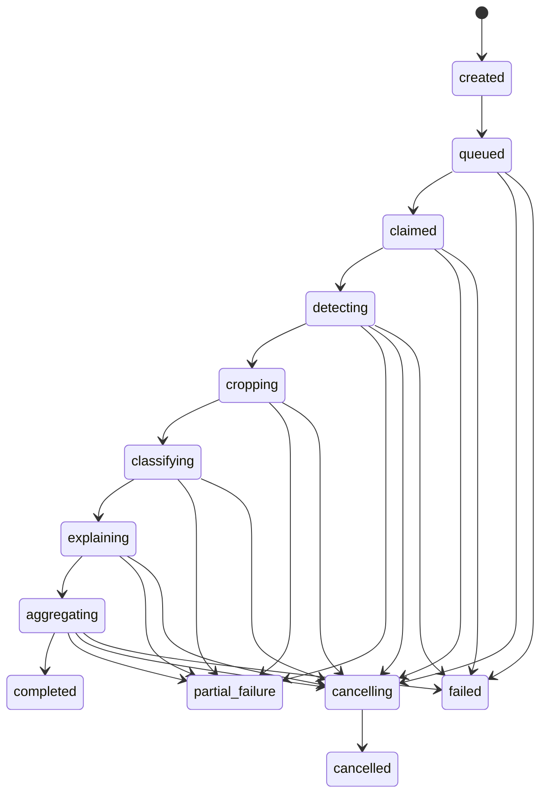

# Máquinas de estados — Entrega 2

> **Estado documental:** `HISTORICAL_AUDIT`
> **Uso operativo:** No; estados conceptuales, no enums/constraints actuales.
> **Snapshot:** Entrega 2 / Architecture Baseline v1.1.

## Reglas comunes

Toda transición persiste `occurred_at`, actor (`user_id`, `worker_id` o `system`), `correlation_id`, estado anterior/nuevo y datos obligatorios en un evento append-only. Los estados terminales no se reabren: retry crea un nuevo attempt o una nueva revisión/ejecución. Cancelación es cooperativa y sólo afecta trabajo no consolidado.

## 1. Imagen

|Estado|Anterior|Siguiente|Actor/datos obligatorios|Terminal/retry/cancel|
|---|---|---|---|---|
|uploading|—|stored, upload_failed|API; sample, MIME, tamaño|No; upload idempotente|
|stored|uploading|quality_pending|Storage; URI/checksum/dimensiones|No|
|quality_pending|stored|quality_accepted, quality_rejected|Quality Service; assessment|No|
|quality_accepted|quality_pending|analysis_available|API; assessment accepted|No|
|quality_rejected|quality_pending|—|Quality Service; razones/policy|Sí para ese assessment; nueva evaluación permitida|
|analysis_available|quality_accepted|—|Job Service; job id|Sí como estado de imagen; jobs adicionales permitidos|
|upload_failed|uploading|—|API; error|Sí; nueva carga|

## 2. Evaluación de calidad

`created → processing → accepted | rejected | failed`. Sólo `accepted` habilita job. `rejected` es terminal y conserva métricas/razones. `failed` admite nueva evaluación, no detección. Actor: Quality Service; obligatorios: `quality_policy_version_id`, checksum original, métricas, decision y timestamps.

## 3. Analysis job

La calidad **no forma parte del job**. Los estados `quality_checking` y `quality_rejected` no pertenecen a esta máquina; pertenecen al assessment/imagen. Esta separación evita que el mismo job signifique ingesta y reconocimiento.

|Estado|Anterior permitido|Siguiente|Actor/datos|Terminal; retry/cancel|
|---|---|---|---|---|
|created|—|queued|API; image accepted, pipeline, models, priority, idempotency|No; cancel antes de queue elimina sólo intención mediante evento, no fila|
|queued|created, lease recovery, retry|claimed, cancelling, failed|API/reaper; `queued_at`,`available_at`|No; cancel sí|
|claimed|queued|detecting, queued, cancelling, failed|Worker; worker/lease/attempt|No; lease expirada requeue|
|detecting|claimed|cropping, partial_failure, failed, cancelling|Worker; detection run|No; fallo total retry|
|cropping|detecting|classifying, partial_failure, cancelling|Worker; counts|No; fallos unitarios continúan|
|classifying|cropping|explaining, partial_failure, cancelling|Worker; assignments/runs|No; batch retry/split|
|explaining|classifying|aggregating, partial_failure, cancelling|Worker; XAI counts|No; XAI no invalida predicción|
|aggregating|explaining o classifying si XAI no solicitado|completed, partial_failure, failed, cancelling|Worker; result/version|No; agregación idempotente|
|cancelling|cualquier no terminal salvo created|cancelled|API solicita, worker confirma|No; no nuevos stages|
|completed|aggregating|—|Worker; result y counts completos|Sí; retry crea job nuevo|
|partial_failure|stage activo|—|Worker; resultado parcial y errores|Sí; retry crea job nuevo o task on-demand|
|failed|queued/claimed/detecting/aggregating|—|Worker/reaper; error|Sí; retry crea attempt/job según error|
|cancelled|cancelling|—|Worker/reaper; cancelled_at|Sí|

`started_at` se fija al entrar en `detecting`; `completed_at` en terminales excepto `cancelled_at`. `updated_at` cambia en cada heartbeat/transición.

## 4. Detección

`pending → processing → completed | no_detections | partial_failure | failed`. `no_detections` es resultado válido pero conduce al agregado `inconclusive`, no a clasificación. `failed` total hace job `failed`; parcial permite crops válidos y job final `partial_failure`.

## 5. Crop

`pending → generating → ready | invalid_bbox | empty_crop | failed | excluded`. `ready` y estados de rechazo son terminales para ese crop; regenerar crea otro `cell_crop` con nueva policy/artifact. Cancelación evita iniciar pendientes, no borra ready.

## 6. Clasificación

Por `(classification_run_id,crop_id,model_version_id)`: `pending → processing → completed | failed | excluded`. Unicidad impide duplicado. Retry de failed conserva el registro/attempt y sólo crea una predicción nueva si cambia run/config; completed nunca se sobrescribe.

## 7. Explicabilidad

`not_requested → pending → processing → completed | failed | unavailable`. On-demand puede pasar de `not_requested`, `failed` o `unavailable` a un nuevo `explainability_run`; el resultado previo permanece. Fallo no altera `cell_prediction`.

## 8. Agregación

`pending → processing → completed | partial_failure | failed`. Exige cierre de assignments clasificables. Retry crea nueva revisión de resultado ligada a la misma policy y preserva la anterior. `partial_failure` registra denominadores y exclusiones.

## 9. Revisión

Cada revisión es append-only con estado `pending | confirmed | corrected | uncertain | excluded | second_review_requested`. Una segunda revisión crea otra fila con `supersedes_review_id`; nunca cambia `model_predicted_label`. La revisión general usa `parasitized | uninfected | inconclusive | requires_second_review | excluded`, rotulada como revisión experta, no diagnóstico.

## 10. Reporte

`requested → generating → completed | failed | superseded`. Fallar no cambia el job. Regenerar crea `report_record` y artifact nuevos; un reporte anterior puede quedar `superseded` pero sigue accesible y verificable.

## Invariantes

- No existe transición quality rejected → queued.
- No existe completed/partial/failed/cancelled → estado activo.
- Sólo el worker dueño de un lease vigente cambia stages.
- El reaper sólo requeue/failed jobs con lease expirada.
- API cambia prioridad/cancelación, no marca stages completados.
- Resultado parcial nunca se presenta como completo.
