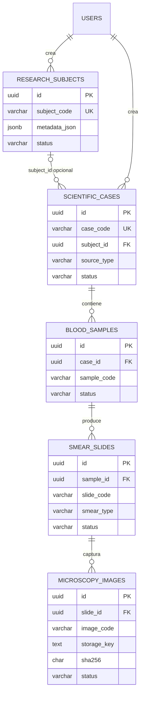

# Modelo científico de Etapa 2

Las relaciones son `RESTRICT`; no existen endpoints DELETE. Los binarios viven fuera de
PostgreSQL. `microscopy_images` registra identidad, ubicación lógica, integridad y metadata
técnica. No representa una predicción ni altera la convención futura
`0=uninfected`, `1=parasitized`, `raw_model_score=probability_parasitized`.

## Trazabilidad

`GET /api/v1/scientific/cases/{id}/traceability` ejecuta un join ordenado y arma
caso/sujeto/muestras/frotis/imágenes. La respuesta no incluye `storage_key`, rutas absolutas,
actores ni metadata libre.

Prompt 4 incorpora `image_ingestion_batches`, procedencia externa separada y
metadata técnica detectada. `microscopy_images.id` queda como identidad estable
para futuros análisis; los binarios permanecen fuera de PostgreSQL.
# Extensión Prompt 5

`microscopy_analysis_runs` referencia sujeto, caso, muestra, frotis y lote.
`microscopy_analysis_run_images` congela inputs; assessments, eventos y
decisiones conservan resultados técnicos y trazabilidad append-only.

# Extensión Prompt 8

`cell_classification_runs` enlaza analysis/detection y una publicación activa.
Los runs nuevos usan snapshot publication-first v2; el deployment de snapshots
v1 se conserva sólo como identidad histórica. Sus inputs congelados producen
`cell_predictions`; explicaciones, summaries, eventos y reviews se relacionan
por FK `RESTRICT`. Predicción y summary automático son inmutables. La revisión
de clasificación es independiente de `scientific_reviews`.

Los PNG Grad-CAM viven en storage local. PostgreSQL conserva solamente claves
relativas, SHA-256, tamaño y dimensiones.
