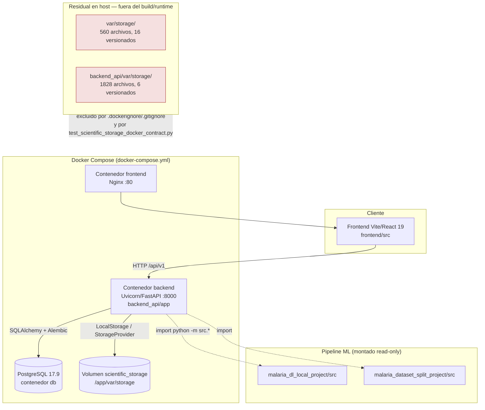

# Auditoría técnica de arquitectura — Sistema Capstone Malaria IA

Fecha: 2026-09-08
Rama: `main`
Commit base: `d71bded2` (RESET MALARIA SMEAR ANALYSIS)
Autor: revisión asistida (Claude Code), rol arquitecto de software senior

> **Nota de método.** Este documento no repite desde cero un inventario de código
> muerto que ya existe y está vigente: `docs/codebase_dead_code_and_legacy_audit.md`
> (2026-08-24, commit base `0cb483ff`) es una auditoría exhaustiva de 834 archivos,
> todavía mayormente válida. Este informe la trata como línea base, la actualiza con
> los cuatro commits posteriores (`c0b7686b` unificación STORAGE_ROOT, `a9d60ead`
> auditoría de modelos, `a99ffcd5` postgresql-client, `d71bded2` reset de frotis) y
> añade lo que esos commits introdujeron: `docker-compose.yml` productivo, Alembic con
> head nuevo, y la herramienta de reset controlado. `docs/audits/obsolete_files_audit.md`
> (2026-07-25) queda superada por ambos documentos y no se vuelve a citar como fuente.

---

## 1. Resumen ejecutivo

El sistema ya completó, en código y en tests, la unificación del almacenamiento
científico hacia un único root canónico: el volumen Docker nombrado `scientific_storage`
montado en `/app/var/storage` dentro del contenedor `backend`. Esta unificación
(commit `c0b7686b`, 2026-09-02) está reforzada por un test de contrato dedicado
(`backend_api/tests/test_scientific_storage_docker_contract.py`) que falla si alguien
reintroduce una ruta legacy en `docker-compose.yml` o el `Dockerfile`. **El código de
producción ya no lee ni escribe en `var/storage/` ni `backend_api/var/storage/`** —
verificado por grep exhaustivo sobre `backend_api/app`, `malaria_dl_local_project/src`
y `scripts/`.

Lo que queda pendiente no es código, es **estado físico residual en el host**: los
directorios `var/storage/` (8.5 MB, 560 archivos, mtime más reciente 2026-08-10) y
`backend_api/var/storage/` (18 MB, 1.828 archivos, mtime más reciente 2026-08-29) siguen
en el árbol de trabajo, con 22 binarios de esos directorios todavía **versionados en
Git** (16 bajo `var/storage/`, 6 bajo `backend_api/var/storage/`, 3.8 MB en total). Ambas
fechas de modificación son anteriores a la unificación del 2 de septiembre, lo que indica
que dejaron de recibir escritura en cuanto el contrato cambió — son un remanente
histórico, no un flujo activo paralelo.

El hallazgo de mayor severidad de esta pasada **no es de storage sino de CI**: el job
`alembic-static` de `.github/workflows/ci.yml` (línea 48) exige `heads == ['20260812_02']`,
pero el repositorio ya tiene 21 migraciones con head real `20260901_01`. Ese gate lleva
al menos dos migraciones (`20260829_01`, `20260901_01`) sin corregirse — o CI está roto
en `main`, o dejó de ejecutarse, lo que en un sistema de trazabilidad clínica es en sí
mismo un hallazgo de integridad de proceso.

También se confirma que `docker-compose.override.yml` se fusiona automáticamente en
cualquier `docker compose up`, lo que significa que el "único modo soportado" que
documenta el README nunca ejercita en la práctica ni la imagen productiva del backend
(usa `--reload` y bind mounts de código) ni el frontend servido por Nginx (lo reemplaza
por un contenedor Node con `vite dev`).

Prioridades:

| # | Hallazgo | Impacto |
|---|---|---|
| 1 | CI de Alembic (`ci.yml:48`) valida un head desactualizado | **Alto** — gate de integridad de esquema roto |
| 2 | Override de Compose se aplica siempre; no hay ruta productiva ejercitada | **Alto** — el flujo "soportado" documentado no es el que corre en dev |
| 3 | 22 binarios legacy versionados en Git bajo rutas ya deprecadas | **Medio** — deuda conocida y documentada (`local_storage.md:16-19`), pendiente "Storage B.4" |
| 4 | Directorios `var/storage/`, `backend_api/var/storage/` con datos residuales no versionados (26.5 MB) | **Medio** — limpieza de host pendiente, sin riesgo funcional activo |
| 5 | Posible inconsistencia DB↔storage canónico (2.550/2.590 referencias `missing_before_reset` según `smear_analysis_reset.md:48`) | **Alto** — riesgo de integridad de datos si se confirma en el entorno real |
| 6 | Componentes/scripts huérfanos sin consumidor (frontend y ML) | **Bajo-Medio** — deuda técnica menor, ya con precedente de limpieza |

---

## 2. Mapa de arquitectura actual



**Capas principales:**

- **Backend (`backend_api/app/`)**: FastAPI con 19 routers en `app/routes/` (`analysis`,
  `artifacts`, `auth`, `catalog`, `cell_analysis`, `cell_classification`, `dashboard`,
  `dataset`, `dataset_versions`, `explainability`, `governance`, `health`, `metrics`,
  `observability`, `predictions`, `runs`, `scientific`, `scientific_validation`), capa
  de servicios (`app/services/*.py`, 22 módulos), repositorios (`app/repositories/`),
  esquemas Pydantic (`app/schemas/`) y configuración centralizada (`app/config.py`).
- **Persistencia**: PostgreSQL 17.9, gobernado por Alembic (`alembic/`, 21 revisiones,
  head único `20260901_01`) más un baseline histórico de 22 SQL crudos en
  `malaria_dl_local_project/db/init/` que ya no se ejecutan (ver §5).
- **Storage científico**: `StorageProvider`/`LocalStorage` (ADR-003) sobre un único root
  (`STORAGE_ROOT`), con capas especializadas: `cell_crop_storage.py`,
  `cell_explanation_storage.py`, `model_explanation_storage.py`.
- **Pipeline ML** (`malaria_dl_local_project/`, `malaria_dataset_split_project/`):
  entrenamiento/evaluación/explicabilidad vía `python -m src.*`, montado read-only en el
  contenedor backend salvo `releases/` (escribible, gobernado).
- **Frontend** (`frontend/src/`): React 19 + Vite 7 + TypeScript 5.8, `main.tsx` →
  `router.ts` → páginas/componentes.
- **Operación**: `Makefile`, `scripts/db/*.sh` (status, migrate, backup), `scripts/storage/*`
  (reconciliación y reset controlado de frotis).

---

## 3. Estado del almacenamiento científico: canónico vs. legacy

### 3.1 Contrato vigente (confirmado en código y tests)

```text
scientific_storage (volumen Docker) → /app/var/storage (STORAGE_ROOT, dentro del contenedor)
```

`STORAGE_PROVIDER=local` y `STORAGE_ROOT=/app/var/storage` se fijan en
[docker-compose.yml:33-36](../../docker-compose.yml) y se validan en el arranque del
backend: [backend_api/app/config.py:126](../../backend_api/app/config.py) exige que
`STORAGE_ROOT` sea una ruta absoluta (`_required_absolute_path`), y
[backend_api/app/services/local_storage.py:158-197](../../backend_api/app/services/local_storage.py)
verifica en runtime que la cadena de directorios exista y confine todas las claves
(`resolve_verified`, `UnsafeStorageKeyError`). No hay lectura de variables alternativas
ni descubrimiento de otras raíces — confirmado también en
[docs/operations/smear_analysis_reset.md:33](../operations/smear_analysis_reset.md):
*"El único root operativo es el `STORAGE_ROOT` configurado por Compose (...). Los
directorios históricos del repositorio `var/storage/` y `backend_api/var/storage/` no
se leen, montan, copian ni eliminan desde esta herramienta"*.

### 3.2 Tabla de referencias encontradas

| Ruta / patrón | Ubicación | Rol | Clasificación |
|---|---|---|---|
| `STORAGE_ROOT=/app/var/storage` | `.env.example:29`, `backend_api/.env.example:9` | Valor por defecto documentado para Docker | **Canónico** |
| `STORAGE_ROOT: /app/var/storage` + `scientific_storage:/app/var/storage` | `docker-compose.yml:34,36,55` | Definición del volumen y env del servicio `backend` | **Canónico** |
| `mkdir -p /app/var/storage` | `backend_api/Dockerfile:32` | Crea el mountpoint vacío con owner `capstone` | **Canónico** |
| `_required_absolute_path("STORAGE_ROOT")` | `backend_api/app/config.py:126` | Falla cerrado si falta o es relativa | **Canónico** (guardia) |
| `resolve_verified`, `UnsafeStorageKeyError`, boundaries de cleanup | `backend_api/app/services/local_storage.py:158,162,194,197,256,443` | Contrato de lectura/escritura/cleanup confinado | **Canónico** |
| `get_settings().storage_root` | `scripts/storage/reconcile_cell_crops.py:58`, `reconcile_cell_explanations.py:93` | Scripts de reconciliación usan exclusivamente el root canónico | **Canónico** |
| `root_value = os.environ.get("STORAGE_ROOT")` | `scripts/storage/reset_smear_analysis.py:1008-1009` | La herramienta de reset exige `STORAGE_ROOT` y no discute rutas alternativas | **Canónico** |
| `var/storage`, `var/storage/**`, `backend_api/var/storage`, `backend_api/var/storage/**` | `.dockerignore:11-14` | Excluye ambas rutas legacy del build context | **Legacy — exclusión activa** |
| `/var/storage/{namespace}/`, `/backend_api/var/storage/{namespace}/` (×5 namespaces) | `.gitignore:44-53` | Evita que nuevo contenido runtime bajo esas rutas se versione | **Legacy — exclusión activa** |
| `test_compose_declares_one_private_read_write_scientific_volume_for_backend`, `test_scientific_roots_are_excluded_from_build_context_and_future_git_adds`, `test_dockerfile_prepares_empty_mountpoint_for_non_root_user` | `backend_api/tests/test_scientific_storage_docker_contract.py:65-138` | Test de contrato: falla si Compose/Dockerfile reintroducen las rutas legacy | **Legacy — guardado por test** |
| `'var/storage', './var/storage', 'backend_api/var/storage'` (parametrize) | `backend_api/tests/test_scientific_storage_config.py:30-43` | Ejemplos usados para probar el rechazo genérico de rutas relativas en `STORAGE_ROOT` | **Legacy — usado solo como ejemplo negativo** |
| `'var/storage/cell-crops/x', 'backend_api/var/storage/cell-crops/x'`, lista `forbidden` | `backend_api/tests/test_smear_reset_tool.py:671,829` | La herramienta de reset debe rechazar explícitamente ambas raíces si aparecieran | **Legacy — bloqueado explícitamente** |
| *"Los roots históricos `var/storage` y `backend_api/var/storage` quedan fuera del build context y no se montan. Los 22 binarios ya rastreados son deuda conocida y se retirarán del índice en Storage B.4"* | `docs/engineering/local_storage.md:16-19` | Documentación que reconoce la deuda y anuncia una fase futura | **Legacy — documentado, con plan pendiente** |
| Directorio `var/storage/` en disco: 560 archivos, 8.5 MB, 16 versionados en Git, mtime máx. 2026-08-10 | Árbol de trabajo (no en `git log` reciente) | Datos residuales de ejecuciones locales previas a `c0b7686b` | **Legacy — residuo físico, sin escritura activa** |
| Directorio `backend_api/var/storage/` en disco: 1.828 archivos, 18 MB, 6 versionados en Git, mtime máx. 2026-08-29 | Árbol de trabajo | Datos residuales de ejecuciones locales previas a `c0b7686b` | **Legacy — residuo físico, sin escritura activa** |

### 3.3 Verificación de que el código de producción no usa las rutas legacy

Grep exhaustivo sobre `backend_api/app/`, `malaria_dl_local_project/src/` y `scripts/`
(excluyendo tests y documentación) no encontró ninguna lectura/escritura hardcodeada de
`var/storage` o `backend_api/var/storage`. Todas las apariciones de esos literales fuera
de `.gitignore`/`.dockerignore` están en **tests que verifican su exclusión** o en
**documentación que registra la migración**. La unificación del commit `c0b7686b` está
limpia.

### 3.4 Riesgo de integridad no resuelto: DB vs. storage canónico

`docs/operations/smear_analysis_reset.md:48` documenta una cifra concreta del propio
sistema: de **2.590 referencias de storage esperadas** en base de datos, sólo **40** se
clasifican `canonical_present` (archivo presente y verificado bajo `STORAGE_ROOT`) y
**2.550** quedan `missing_before_reset` (referencia válida en BD, sin archivo en el root
canónico). El documento aclara que esas ausencias son "un subconjunto" de lo que existe
en las tres raíces (canónica + dos legacy), pero **la herramienta de reset no verifica
si esos archivos están físicamente en `var/storage/` o `backend_api/var/storage/`**, sólo
constata que no están en el volumen `scientific_storage`. Esto es compatible con la
hipótesis de que gran parte del contenido real de esas 2.550 referencias vive todavía en
las rutas legacy y **nunca se copió al volumen Docker** cuando se introdujo
`scientific_storage`. Es el hallazgo más importante para el plan de consolidación (§7):
antes de considerar "legacy" esos directorios como pura basura, hay que confirmar cuántas
de esas 2.550 referencias resuelven contra ellos.

---

## 4. Buenas prácticas a preservar / reutilizar

1. **Configuración fail-fast, sin defaults inseguros**
   [`backend_api/app/config.py:60-194`](../../backend_api/app/config.py). `Settings` es un
   `dataclass(frozen=True)` construido una sola vez (`from_env`) con validación explícita
   de cada variable (`_bool`, `_int`, `_float`, `_required_absolute_path`, `_origins`).
   `JWT_SECRET` no tiene default (línea 116-118); `CORS_ORIGINS` rechaza `*` y esquemas no
   HTTP(S) (línea 55-56); `AUTH_MODE=disabled` exige una bandera explícita de inseguridad
   (línea 114-115). Patrón reutilizable para cualquier módulo nuevo que necesite leer
   configuración de entorno.

2. **Contrato de storage confinado y auditable (ADR-003)**
   `LocalStorage` (`backend_api/app/services/local_storage.py`) separa `stage` /
   `promote` / `resolve_verified` / `cleanup`, usa nombres impredecibles y permisos
   `0700`/`0600` para temporales, promoción por hard-link atómico *create-only* (nunca
   sobrescribe), y descriptor `O_NOFOLLOW` para checksums cuando la plataforma lo soporta.
   Este patrón es la base correcta para cualquier storage adicional futuro (ver
   oportunidad de generalizarlo en §5.4).

3. **Test de contrato de infraestructura como guardia contra regresión**
   `backend_api/tests/test_scientific_storage_docker_contract.py` parsea literalmente
   `docker-compose.yml` y el `Dockerfile` para impedir que alguien reintroduzca una ruta
   legacy, un volumen nombrado adicional o un mount `ro` sobre el storage científico. Es
   un patrón valioso de "test como documentación ejecutable" que otros contratos de
   infraestructura (p. ej. red, backups) podrían adoptar.

4. **PostgreSQL con guardas explícitas contra defaults**
   `docker-compose.yml:9-11` usa la sintaxis `${VAR:?message}` para `POSTGRES_USER`,
   `POSTGRES_PASSWORD` y `POSTGRES_DB`: el compose aborta en vez de arrancar con un
   default silencioso. `db` no publica puertos al host (sin bloque `ports:`), reduciendo
   superficie de ataque en desarrollo.

5. **Migraciones lineales con gate de topología**
   21 revisiones Alembic sin bifurcaciones ni merge points (verificado recorriendo
   `down_revision` de cada archivo en `alembic/versions/`), con una migración
   `20260726_00_legacy_029_baseline.py` que hace *stamp* del baseline SQL histórico sin
   re-ejecutarlo — evita doble fuente de verdad de esquema. `malaria_dl_local_project/scripts/init_db.py`
   aborta explícitamente con `SystemExit` si se invoca, dejando claro que Alembic es la
   única vía. Buen patrón de "deprecar en el propio código", no sólo en documentación.

6. **Reset controlado con manifiesto versionado y máquina de estados**
   `scripts/storage/reset_smear_analysis.py` (contrato en
   `docs/operations/smear_analysis_reset.md`) es un ejemplo notable de ingeniería para
   operaciones destructivas en un sistema clínico: transacción única, revalidación de
   guardas dentro de la transacción, manifiesto `manifest_version=2` con SHA-256 de cada
   archivo objetivo, máquina de recuperación de seis estados, `fsync` de padres antes y
   después de cada `unlink`, y verificación de que el commit de BD precede siempre al
   borrado físico. Este nivel de rigor debería ser la referencia para cualquier futura
   operación destructiva sobre datos clínicos (incluida la consolidación de storage del
   §7).

7. **Separación explícita de capacidades legacy vs. vigentes documentada en código**
   Los adaptadores `malaria_dl_local_project/src/*.py` son *shims* deliberados
   (`_implementation = import_module("src.malaria_dl.xxx.yyy")`) documentados en
   `malaria_dl_local_project/docs/legacy_compatibility.md:7`, no código muerto accidental.
   Es un patrón limpio para mantener compatibilidad de CLI pública sin duplicar lógica.

---

## 5. Código no utilizado

Verificado de forma independiente (grep + AST + cruce con consumidores reales); se marca
la confianza de cada hallazgo.

### 5.1 Frontend

| Archivo | Hallazgo | Confianza |
|---|---|---|
| `frontend/src/components/reports/UnlinkedRunsSection.tsx:6,20,24` | Componente completo (`UnlinkedRunsSectionProps`, `UnlinkedRunsSection`) sin ningún importador en `frontend/src` (confirmado: no aparece en `App.tsx` ni `router.ts`; la única otra mención es un listado en `docs/model_governance_stage0_audit.md:1245`, no una importación) | **Alta** — candidato a eliminar |
| `frontend/src/components/cell-review/SmearAnalysisResultsView.tsx` | **Corrección a un hallazgo de agente de análisis**: no tiene importadores de aplicación, pero SÍ está cubierto explícitamente por dos tests (`frontend/tests/smear-analysis-history.test.mjs:9,42` y `frontend/tests/smear-analysis-results-view.test.mjs:6,14`) que verifican el contenido exacto del shim de compatibilidad, y ya fue evaluado y retenido deliberadamente en `docs/codebase_dead_code_and_legacy_audit.md:107,134` (`LEGACY_REQUIRED` / `DUPLICATED → REVIEW/KEEP`) | **Baja** como candidato a eliminar — mantener; si se quiere retirar, es una decisión de producto sobre compatibilidad de URLs, no limpieza de código muerto |

### 5.2 Backend FastAPI

| Archivo | Hallazgo | Confianza |
|---|---|---|
| `backend_api/app/routes/catalog.py:33-34` | `/models/comparison` y alias `/api/models/comparison` — el frontend (`frontend/src/services/api.ts:1307`) sólo consume la ruta sin `/api` | **Media** — verificar si hay consumidores externos antes de retirar el alias |
| `backend_api/app/routes/runs.py` (múltiples pares, p. ej. líneas 288-289, 482-483, 636-637, 745-748) | Mismo patrón sistemático de endpoints duplicados con/sin prefijo `/api`; el frontend usa sólo las rutas sin `/api` | **Media** — mismo patrón que catalog.py; probablemente compatibilidad retro intencional, no confirmar como muerto sin revisar consumidores externos/API pública |
| `backend_api/app/services/detectors/connected_components_v1.py:415` | `info = path.stat()` asignado sin uso | **Alta**, impacto trivial |
| `backend_api/app/services/image_quality.py:131,136` | `except ... as exc` con `exc` no referenciado | **Alta**, trivial |
| `backend_api/app/services/microscopy_analysis.py:118` | `run = _dict(...)` sin uso en esa rama | **Alta**, trivial |

### 5.3 Pipeline ML

| Archivo | Hallazgo | Confianza |
|---|---|---|
| `malaria_dl_local_project/src/model_governance/reconcile_training_versions.py` (56 líneas) | CLI real (`argparse`, `--dataset-version-id`, `--dry-run`) que escribe estado de gobernanza de modelos (`finalize_training_model_version`), **sin ninguna referencia** en README, `docs/legacy_compatibility.md`, Makefile, scripts ni tests — a diferencia de los demás adaptadores `src.*`, que sí están documentados como CLI pública soportada | **Alta** — huérfano confirmado; en un sistema con gobernanza de modelos como eje de trazabilidad, un script no documentado que puede alterar `model_version` es un riesgo, no sólo deuda técnica. Documentar su propósito o eliminarlo |
| `malaria_dl_local_project/src/malaria_dl/evaluation/clinical_metrics.py:521` | `report_dict` asignado sin uso | **Alta**, trivial |
| `malaria_dl_local_project/src/malaria_dl/data/loaders.py:17` | `TFDS_ORIGINAL_CLASS_NAMES` importado sin uso | **Media** |

**No marcar como muertos** (confirmado explícitamente): los ~30 adaptadores planos en
`malaria_dl_local_project/src/*.py` (`calibrate.py`, `svm_features.py`, `config.py`,
etc.) son shims públicos documentados (§4.7); ejecutables sólo vía `python -m src.*` y
por tanto sin importadores internos por diseño.

### 5.4 SQL y duplicación de utilidades

- Los cuatro SQL duplicados que la auditoría de 2026-07-25 señalaba como ambiguos
  (`docs/023_schema_migrations_baseline.sql`, `025_deployed_model_versions.sql`,
  `026_inference_jobs.sql`, `027_model_governance_backfill_constraints.sql`) **ya no
  existen** bajo `docs/` — hallazgo resuelto, no requiere acción.
- `malaria_dl_local_project/db/init/` conserva 22 SQL históricos (001-029) que ya no se
  ejecutan (`init_db.py` aborta, §4.5); coexisten como evidencia de fundación de esquema
  junto a Alembic. Es deuda documental aceptable, no deuda ejecutable.
- **Cálculo de SHA-256 reimplementado en al menos 5 puntos** sin utilidad compartida:
  `backend_api/app/services/local_storage.py:115,325,359`,
  `malaria_dl_local_project/src/malaria_dl/governance/releases.py:24` (`sha256_file`),
  `malaria_dl_local_project/src/malaria_dl/inference/uploads.py:69`
  (`compute_file_checksum`), `malaria_dl_local_project/src/malaria_dl/data/registry.py:44`
  (`compute_file_checksum`, implementación distinta con el mismo nombre). Oportunidad de
  centralizar en un helper común, con la salvedad de que `backend_api` y
  `malaria_dl_local_project` son paquetes Python independientes hoy (requeriría una
  librería compartida o aceptar la duplicación entre servicios).
- **Patrón `stage → validar → promote → resolve → cleanup` triplicado** en
  `backend_api/app/services/cell_crop_storage.py`, `cell_explanation_storage.py` y
  `model_explanation_storage.py` sobre `LocalStorage`, con validación PNG casi idéntica.
  Candidato razonable a una clase base `ImageArtifactStorage` parametrizada por
  `build_key`, reduciendo ~150 líneas duplicadas — no es código muerto, es oportunidad de
  reutilización.

---

## 6. Puntos de mejora priorizados

### Alto impacto

1. **CI de Alembic desactualizado — `.github/workflows/ci.yml:48`.**
   ```python
   assert heads == ['20260812_02'], f'expected head 20260812_02, found {heads}'
   ```
   El head real es `20260901_01` (21 revisiones totales, confirmado recorriendo
   `down_revision` de cada archivo en `alembic/versions/`). El job `alembic-static` está
   roto desde que se añadieron `20260829_01_persist_training_release_status.py` y
   `20260901_01_single_evaluation_training_parent.py`. En un sistema donde la trazabilidad
   de esquema es explícitamente un objetivo de diseño (ADR-001, ADR-016), un gate de CI
   que ya no protege lo que dice proteger es un riesgo de integridad de proceso, no sólo
   un detalle de tooling. **Acción**: actualizar la constante a `20260901_01` (o mejor,
   leerla de un archivo de referencia versionado para no repetir este problema).

2. **`docker-compose.override.yml` se aplica siempre y contradice el modo "único
   soportado".** El override (líneas 1-27) reemplaza `--reload` sobre código montado en
   modo lectura-escritura y sustituye el frontend Nginx por un contenedor `node:20` con
   `vite dev`. Docker Compose lo fusiona automáticamente sin flags adicionales. El README
   documenta `docker compose up -d` como única forma soportada de operar el sistema, pero
   con el override presente **nunca se ejercita la imagen productiva real** (ni el
   `CMD` del Dockerfile del backend ni el Nginx del frontend). **Acción**: documentar
   explícitamente un `docker compose -f docker-compose.yml up -d` (sin override) como el
   modo productivo, y el modo con override como "desarrollo local", con esa distinción
   verificada en algún test de contrato similar al de storage.

3. **Riesgo de integridad DB↔storage no resuelto — `docs/operations/smear_analysis_reset.md:48`.**
   2.550 de 2.590 referencias de storage en base de datos son `missing_before_reset`
   contra el volumen canónico. Antes de cualquier limpieza de `var/storage/` o
   `backend_api/var/storage/`, hay que confirmar si esas referencias resuelven contra los
   directorios legacy (ver plan §7).

### Impacto medio

4. **Contradicción README vs. Makefile sobre disponibilidad de Alembic.** El README
   describe los comandos Alembic como "pendientes de habilitación", pero
   `Makefile:25-26` y `scripts/db/migrate.sh:5-14` ya los invocan activamente. Corregir la
   documentación para que no desaliente ejecutar migraciones que en realidad son el
   mecanismo vigente.

5. **`JWT_SECRET` idéntico entre `.env` (raíz) y `backend_api/.env`.** Ambos archivos no
   están versionados (confirmado con `git ls-files`), pero comparten literalmente el
   mismo valor entre dos contextos de ejecución (Compose vs. backend local). Generar
   secretos independientes por contexto reduce el radio de una fuga.

6. **Asimetría de validación entre `STORAGE_ROOT` y `ARTIFACTS_ROOT`.**
   `backend_api/app/config.py:126` exige `STORAGE_ROOT` absoluto y sin default; la línea
   127 acepta `ARTIFACTS_ROOT` con default relativo `"./var/artifacts"` sin la misma
   validación de ruta absoluta. Para un sistema que ya endureció el contrato de storage
   científico, dejar `ARTIFACTS_ROOT` con un contrato más débil es una inconsistencia que
   vale la pena cerrar en la misma pasada de endurecimiento.

7. **Dockerfile de una sola etapa y sin pin de patch/digest.** `backend_api/Dockerfile`
   no separa build/runtime (herramientas de compilación quedan en la imagen final) y usa
   `python:3.12-slim` sin fijar versión de parche ni digest, lo que permite que una
   reconstrucción futura traiga una base distinta sin control explícito.

8. **Ausencia de healthcheck en `backend` y `frontend`.** Sólo `db` define `healthcheck`
   (`docker-compose.yml:14-18`); `frontend` depende de `backend` sin
   `condition: service_healthy`, arriesgando errores transitorios tras un despliegue.

9. **Dependencias ML desactualizadas.** `malaria_dl_local_project/requirements.txt` fija
   `tensorflow==2.17.1` (mediados de 2024) y restringe `numpy<2.0`; conviene evaluar CVEs
   conocidos y el costo de actualizar antes de que la brecha crezca más.

### Impacto bajo

10. `viejo-compose.yaml` — archivo ya autodocumentado como `SUPERSEDED` con
    `services: {}` (líneas 1-4); sin referencias operativas activas (sólo se cita en
    `docs/codebase_dead_code_and_legacy_audit.md:108` como evidencia histórica). Mover a
    un directorio de archivo o eliminar.
11. `restart: always` en los tres servicios en vez de `unless-stopped`; sin límites de
    recursos (`mem_limit`/`cpus`) pese a compartir host con cargas de ML.
12. Posible desalineación entre el volumen `./backups:/app/backups:ro`
    (`docker-compose.yml:37`) y el destino real de `scripts/db/backup.sh`, que por
    defecto escribe en `${CAPSTONE_BACKUP_DIR:-${TMPDIR:-/tmp}/capstone-backups}` — si no
    se exporta `CAPSTONE_BACKUP_DIR=./backups` explícitamente, los backups pueden quedar
    en `/tmp` del host sin relación con el mount de solo lectura del contenedor.
13. `reconcile_training_versions.py` sin documentar (ver §5.3) — riesgo de gobernanza más
    que de rendimiento, pero de bajo esfuerzo de resolución (documentar o eliminar).

---

## 7. Plan de consolidación de almacenamiento

El objetivo es cerrar formalmente lo que la propia documentación del repositorio ya
anuncia como pendiente ("Storage B.4" en `docs/engineering/local_storage.md:18`), sin
arriesgar datos clínicos/científicos.

**Fase 0 — Confirmar el contrato vigente (ya completada).** El código de producción,
Docker Compose, `.dockerignore`/`.gitignore` y los tests de contrato ya tratan
`scientific_storage`/`STORAGE_ROOT=/app/var/storage` como única raíz. No se requiere
cambio de código para esto — sólo se documenta aquí como base del resto del plan.

**Fase 1 — Reconciliar referencias de base de datos contra las tres raíces (bloqueante).**
1. Extender temporalmente `scripts/storage/reconcile_cell_crops.py` y
   `reconcile_cell_explanations.py` (o un script nuevo de sólo lectura, nunca los
   existentes en modo escritura) para que, además de `get_settings().storage_root`,
   acepten un segundo y tercer root de **solo lectura** apuntando a `var/storage/` y
   `backend_api/var/storage/` del host, y reporten para cada referencia
   `missing_before_reset` documentada en `smear_analysis_reset.md:48` si el archivo
   existe en alguna de las dos raíces legacy, con su SHA-256.
2. Producir un informe (`docs/audits/storage_reconciliation_<fecha>.md`) con el
   desglose: cuántas de las 2.550 referencias faltantes resuelven en `var/storage/`,
   cuántas en `backend_api/var/storage/`, y cuántas no existen en ninguna raíz (pérdida
   real de datos, si la hay).
3. **No tocar ningún archivo en esta fase.** Es puramente diagnóstica.

**Fase 2 — Migrar los archivos recuperables al volumen canónico.**
1. Para cada referencia `missing_before_reset` que resuelva en una raíz legacy con
   SHA-256 coincidente con el esperado en BD: copiar (no mover) el archivo al mismo
   `storage_key` relativo bajo el volumen `scientific_storage` montado, usando el mismo
   patrón *create-only* que ya usa `LocalStorage.promote` (hard link o copia atómica +
   rename, nunca sobrescritura).
2. Ejecutar de nuevo la reconciliación de la Fase 1 y confirmar que la cifra de
   `canonical_present` sube exactamente en la cantidad migrada, sin cambios en
   `invalid_or_unsafe` ni `ambiguous`.
3. Este paso requiere acceso al volumen Docker real (no al bind del host), por lo que
   debe ejecutarse dentro del contenedor `backend` o mediante un contenedor auxiliar con
   el mismo volumen montado en lectura-escritura.

**Fase 3 — Congelar y retirar del índice Git los 22 binarios legacy versionados.**
1. Confirmar (Fase 1-2) que los 22 archivos versionados bajo `var/storage/` y
   `backend_api/var/storage/` ya tienen equivalente verificado en el volumen canónico o
   son prescindibles (p. ej. explicaciones de ejecuciones ya no referenciadas).
   `docs/engineering/local_storage.md:16-19` ya anticipa este retiro.
2. `git rm` de esos 22 archivos en una rama dedicada, con el commit citando este informe
   y el de reconciliación de la Fase 1. Mantener las carpetas fuera de Git de aquí en
   adelante (`.gitignore` ya las cubre).

**Fase 4 — Purga física de los directorios legacy del host.**
1. Sólo tras confirmar la Fase 2 (todo lo recuperable ya está en el volumen canónico) y
   la Fase 3 (Git ya no versiona nada bajo esas rutas): mover (no borrar directamente)
   `var/storage/` y `backend_api/var/storage/` a un backup fuera del repositorio
   (`CAPSTONE_BACKUP_DIR` o similar) con fecha, y dejar los directorios vacíos o
   eliminarlos.
2. Ejecutar la suite completa de tests (`backend_api/tests`, en particular
   `test_scientific_storage_docker_contract.py` y `test_scientific_storage_config.py`)
   para confirmar que nada dependía de la presencia física de esas rutas fuera de los
   propios tests que las prohíben.
3. Actualizar `docs/engineering/local_storage.md` para reflejar que la deuda "Storage
   B.4" quedó saldada, con fecha y referencia al commit de purga.

**Validaciones obligatorias antes de cada fase destructiva (3 y 4):** backup de
PostgreSQL reciente (`make db-backup`), snapshot de checksums de los archivos a mover
(ya calculado en la Fase 1), y ejecución de la suite de tests de storage y de la
herramienta `smear-reset-plan` en modo `--dry-run` para confirmar que no aparecen nuevas
referencias `invalid_or_unsafe` tras el movimiento.

**Riesgos del plan:**
- Si alguna de las 2.550 referencias `missing_before_reset` no resuelve en ninguna raíz,
  es evidencia de pérdida de datos histórica **anterior a este plan**, no causada por él;
  debe documentarse y comunicarse antes de continuar, no ocultarse en el conteo agregado.
- La Fase 2 modifica contenido de un volumen Docker con datos potencialmente ligados a
  auditoría (`audit_events`); debe ejecutarse con el mismo nivel de rigor transaccional
  que ya usa `reset_smear_analysis.py`, no como una copia manual ad hoc.

---

## 8. Recomendaciones finales y próximos pasos

1. **Corregir el head de Alembic en CI** (`ci.yml:48`) — es el fix de menor esfuerzo y
   mayor riesgo de esta auditoría; hacerlo primero.
2. **Aclarar el modo productivo de Compose** frente al override de desarrollo, con un
   test de contrato análogo al de storage si se quiere que la distinción sea verificable
   automáticamente.
3. **Ejecutar la Fase 1 del plan de consolidación de storage antes de cualquier otra
   acción sobre `var/storage/`** — es diagnóstica, de bajo riesgo, y resuelve la
   incertidumbre real (¿hay datos huérfanos o sólo hay redundancia?).
4. **Tratar `reconcile_training_versions.py` como una decisión pendiente de gobernanza**,
   no como limpieza de código muerto: documentarlo formalmente o retirarlo, dado que
   opera sobre `model_version`.
5. Las demás oportunidades de reutilización (helper SHA-256 común, clase base para el
   patrón `stage/promote/resolve/cleanup`) son mejoras de mantenibilidad válidas pero no
   urgentes; abordarlas en una pasada de refactor separada, con la suite de tests de
   storage como red de seguridad ya existente.
6. Este documento y `docs/codebase_dead_code_and_legacy_audit.md` (2026-08-24) deberían
   fusionarse conceptualmente la próxima vez que se actualice cualquiera de los dos, para
   evitar que un tercer documento de auditoría quede desalineado del código como ya le
   ocurrió al de 2026-07-25.
