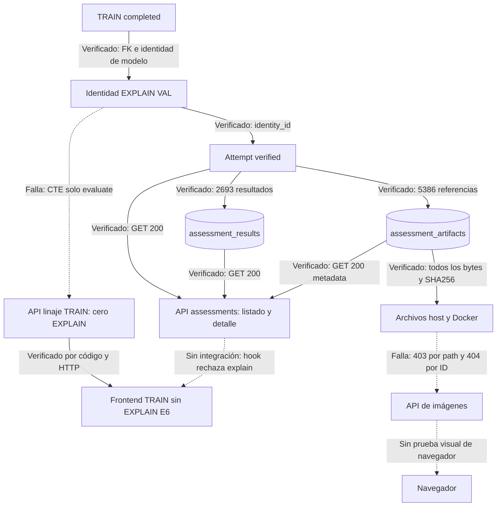

# CELL-EXPLAIN-01 — Auditoría PostgreSQL → API → Frontend

Estado documental: `HISTORICAL_AUDIT`. Fecha: 2026-10-08. Evidencia obtenida en el entorno activo; comprobación de archivos a las 22:27 UTC (19:27 America/Santiago).

Alcance: diagnóstico de solo lectura. No constituye autorización ni implementación de la propuesta. Se modifican únicamente este informe y su entrada en `docs/README.md`.

Identificadores auditados:

| Entidad | ID |
|---|---|
| TRAIN | `bbbd5b60-afaa-4034-a504-a60ed642aafe` |
| EVALUATE VAL | `dded6222-12ae-407a-82c6-601e265e3f7d` |
| EXPLAIN VAL | `ceaa29af-cb60-4be2-8a67-01b9c9382cda` |
| Dataset version | `d8c0cab5-09dd-597f-9de7-7ca01aee2ec2` |

## A. Resumen ejecutivo

**EXPLAIN está correctamente persistido y es recuperable. La información se interrumpe en la proyección de linaje que consume la interfaz, y existe un segundo bloqueo independiente al servir los artefactos.**

1. PostgreSQL confirma `kind=explain`, `state=verified`, asociación con el TRAIN solicitado, split `val`, método `gradcam`, 2.693 resultados y 5.386 artefactos. Los hashes recalculados de los registros coinciden con la verificación informada. Los 5.386 archivos existen en el host y son visibles en Docker; sus tamaños y SHA-256 coinciden con PostgreSQL.
2. Los cuatro GET `/assessments` existentes recuperan el listado por TRAIN, el detalle, los resultados y los metadatos de artefactos del EXPLAIN. No falta una API básica de lectura.
3. La proyección compartida `LINEAGE_SOURCES_CTES` excluye `kind=explain` mediante `WHERE i.kind = 'evaluate'`. Los conteos y las tarjetas de explicabilidad solo incorporan hijos históricos de `runs/run_lineage`. Para este TRAIN no existen esos hijos. El GET de linaje devuelve `evaluation_count=1`, `explainability_count=0`, `explainabilities=[]`.
4. El detalle de TRAIN pide `/runs/{TRAIN}/explainability`, cuya fuente es el linaje histórico y `vw_visual_explainability_audit`; devuelve cero resultados. El frontend no conecta las lecturas de resultados/artefactos de `/assessments`. Si se abre el EXPLAIN a través de la ruta E6 existente, `useAssessment` rechaza expresamente `kind !== 'evaluate'`.
5. No es una exclusión general de `verified`: EVALUATE E6 ya admite ese estado. EXPLAIN carece de integración y de contrato específico para su verificación sin métricas de clasificación.
6. `/artifacts/file?artifact_id=<overlay>` devuelve **404**, porque solo consulta `artifacts`, mientras los IDs están en `assessment_artifacts`. Por ruta macOS devuelve **403**, porque la ruta rebajada a Docker queda fuera de las raíces permitidas. **El volumen sí contiene los archivos; no se necesita regenerarlos.**

No se ejecutó TRAIN, EVALUATE ni EXPLAIN; no se alteraron base de datos, código, protocolos, seeds, thresholds, splits, artefactos ni modelos productivos. No se abrió contenido científico de TEST. Las lecturas de identidades VAL incluyen metadatos agregados del dataset (su descriptor enumera tamaños de splits); no se consultaron muestras, resultados ni archivos TEST.

## B. Evidencia PostgreSQL

### Entorno y método

Se inspeccionaron los servicios ya activos con `docker compose ps`: PostgreSQL, backend y frontend estaban en ejecución. Las consultas directas se efectuaron desde el backend, con `psycopg`, `autocommit=True` y opción de conexión `default_transaction_read_only=on`. Todas las sentencias enviadas por la auditoría fueron `SELECT`; no se invocaron métodos de escritura de repositorios ni servicios. Los GET `/assessments` usan además la transacción de lectura propia de la aplicación (`app/db.py:80`), que configura el modo de transacción y timeouts y termina con rollback, sin DML.

Resultado: base `malaria_experiments`, rol `capstone_v2_runtime`, PostgreSQL **17.9**, Linux aarch64. Se inspeccionaron `information_schema.columns` y `pg_constraint` antes de consultar los registros.

### Tablas reales y relaciones

| Tabla | Datos y relaciones observadas |
|---|---|
| `assessment_identities` | `id`, `identity_hash`, `training_run_id`, `kind`, `identity` JSONB, `canonical_identity`, `structural_hash`, `created_at`. FK `training_run_id → runs.id`; `kind` admite `evaluate/explain`. CHECK vincula el TRAIN del JSON con la columna y el hash con el JSON canónico. |
| `assessment_attempts` | `id`, FK `identity_id`, `ordinal`, `state`, `artifact_root`, `verification` JSONB, `cause`, timestamps y campos del propietario. Estados permitidos: `active/verified/failed/interrupted`; `verified` exige verificación no nula. UNIQUE por identidad/ordinal y raíz de artefactos. |
| `assessment_results` | PK `(attempt_id,sample_id)`, FK al intento y `payload` JSONB. CHECK de igualdad entre `sample_id` y su representación en payload. |
| `assessment_artifacts` | PK `(attempt_id,sample_id,role)`, FK al intento, `artifact_id` único, `payload` JSONB. CHECK de SHA-256, tamaño positivo y `state=finalized`. No es la tabla histórica `artifacts`. |
| `assessment_campaign_consumers` | Referencias `campaign_id`, `member_id`, `identity_id`; la API puede filtrar por consumidor de campaña. No se necesitó leer sus filas. |
| `assessment_final_locks` | Esquema con `id`, `identity_hash`, `evidence`, `created_at`. No se leyeron sus registros; no participa en esta auditoría VAL. |
| `runs`, `run_lineage`, `artifacts` | TRAIN, relaciones históricas entre runs y catálogo histórico de archivos. Se consultaron exclusivamente el TRAIN y las referencias del EXPLAIN auditado. |

La relación resultado–artefacto por muestra se comprobó en los payloads; no debe confundirse con una FK compuesta que el esquema inspeccionado no tiene. Las FK principales intento→identidad→TRAIN sí existen.

### Resultados observados

| Verificación | Resultado |
|---|---|
| TRAIN | Existe, `run_type=training`, `status=completed`, dataset solicitado. |
| Identidad EXPLAIN | `e27a118c-68f0-4edd-8a68-c29dd338dabc`; hash `93223bb309e8aa31daf71aab2045b08a3389b773046d94330103897539026170`. |
| Intento EXPLAIN | Existe; ordinal 1, `verified`, `cause=null`. |
| Inicio / finalización | `2026-10-08T22:19:30.808670Z` / `2026-10-08T22:22:08.057444Z`. |
| Asociación TRAIN | Columna `training_run_id` y `identity.model.training_run_id` contienen el TRAIN solicitado. |
| Dataset / split / propósito | Dataset solicitado; `val`; `development`; 2.693 muestras en identidad. |
| Método | `gradcam`, versión `e6_attribution_v1`, capa `conv2d`, clase 1, `score_explained=raw`. |
| Resultados | 2.693; conjunto de muestras exactamente igual al de la identidad. |
| Artefactos | 5.386: 2.693 `map` y 2.693 `overlay`; referencias por resultado coinciden con sus artefactos registrados. |
| Verificación de resultados | SHA-256 recalculado `1f552ccc9788f9ead484d7c0e078c60f11620a03e408d8d2bdb9dcfc561367d5`, coincide. |
| Verificación de metadatos de archivos | Hash recalculado `8cd3d213c1d87e6e6d707fdfb4414ac877988ab730a4d9eac44b08ce3c2780ef`, coincide. |
| Registro histórico del intento | Ninguna fila `runs.id=EXPLAIN`; ningún hijo `run_lineage.parent_run_id=TRAIN`. Es coherente con persistencia E6 independiente. |
| IDs de artefactos en `artifacts` | 0 de 5.386. |

EVALUATE existe y sigue `verified`, con 2.693 resultados en su verificación. EXPLAIN y EVALUATE tienen **el mismo objeto de modelo/checkpoint, dataset, muestras y split**. El checkpoint identificado es `4294d2b2-690b-5884-a3cb-fc7f0eb3653d`, versión de modelo `3ffcb0ec-324f-43fb-8521-d55cbe81f229`, SHA-256 `b27d794028914408e186b6703140f8e4c204fe67471801f2dfa9b3a2033b18f3`.

**Límite de la asociación con EVALUATE:** `identity.evaluation` de EXPLAIN es `null`. Los protocolos son `c213_val_evaluation_v1` y `c213_val_explain_v1` (este último añade `methods:["gradcam"]`); ambos declaran umbral 0,5, pero el hash de procedencia de `decision.source` difiere. No se puede afirmar que EXPLAIN esté formalmente vinculado al attempt EVALUATE. Esto no rompe su vínculo con TRAIN ni explica la invisibilidad. No se propone modificar la identidad inmutable ni reconstruir una asociación a posteriori.

### Consultas reproducibles

Las variables `:explain`, `:evaluate`, `:train` representan los UUID de la cabecera. En la ejecución se usaron parámetros enlazados de psycopg o UUID literales; no concatenación de entradas externas.

```sql
SELECT current_database(), current_user, version();

SELECT table_name, column_name, data_type
FROM information_schema.columns
WHERE table_schema='public' AND table_name IN (
  'assessment_identities','assessment_attempts','assessment_results',
  'assessment_artifacts','assessment_campaign_consumers','assessment_final_locks')
ORDER BY table_name, ordinal_position;

SELECT conrelid::regclass::text, conname, pg_get_constraintdef(oid)
FROM pg_constraint
WHERE conrelid IN ('assessment_identities'::regclass,
  'assessment_attempts'::regclass,'assessment_results'::regclass,
  'assessment_artifacts'::regclass)
ORDER BY 1,2;

SELECT a.id,a.identity_id,a.state,a.ordinal,a.artifact_root,a.verification,
       a.started_at,a.finished_at,i.kind,i.training_run_id,
       i.identity->'dataset',i.identity->>'split',i.identity->'explanation',
       i.identity->'evaluation',i.identity->'model',
       jsonb_array_length(i.identity->'samples')
FROM assessment_attempts a JOIN assessment_identities i ON i.id=a.identity_id
WHERE a.id IN (:explain,:evaluate);

SELECT id,run_type,status,dataset_version_id FROM runs WHERE id=:train;
SELECT payload FROM assessment_results WHERE attempt_id=:explain ORDER BY sample_id;
SELECT payload FROM assessment_artifacts WHERE attempt_id=:explain ORDER BY sample_id,role;
SELECT identity FROM assessment_identities
WHERE id=(SELECT identity_id FROM assessment_attempts WHERE id=:explain);

SELECT count(*) FROM artifacts WHERE id IN (
  SELECT artifact_id FROM assessment_artifacts WHERE attempt_id=:explain);
SELECT l.child_run_id,l.relationship_type,r.run_type
FROM run_lineage l JOIN runs r ON r.id=l.child_run_id WHERE l.parent_run_id=:train;
SELECT id,run_type FROM runs WHERE id=:explain;

SELECT x.identity->'model'=e.identity->'model',
       x.identity->'dataset'=e.identity->'dataset',
       x.identity->'samples'=e.identity->'samples',
       x.identity->'decision'=e.identity->'decision',
       x.identity->'protocol'=e.identity->'protocol',
       x.identity->>'split'=e.identity->>'split'
FROM assessment_identities x JOIN assessment_attempts xa ON xa.identity_id=x.id
CROSS JOIN assessment_identities e JOIN assessment_attempts ea ON ea.identity_id=e.id
WHERE xa.id=:explain AND ea.id=:evaluate;

SELECT a.id,i.identity->'decision',i.identity->'protocol',i.identity->'evaluation',
       i.identity->>'purpose'
FROM assessment_attempts a JOIN assessment_identities i ON i.id=a.identity_id
WHERE a.id IN (:explain,:evaluate);

SELECT pg_get_viewdef('vw_visual_explainability_audit'::regclass,true);
```

Sobre las listas recuperadas se contaron roles y muestras, se compararon referencias de artefactos y se calcularon hashes con JSON canónico (`sort_keys=True`, separadores `(',',':')`, UTF-8, `ensure_ascii=False`, `allow_nan=False`). Se compararon los bytes de cada archivo con su SHA-256 registrado. No se invocó `service.verify()` ni ningún runtime científico.

## C. Evidencia Backend

### Repository y servicios Python

`malaria_dl_local_project/src/malaria_dl/assessment/repository.py` contiene `AssessmentRepository(CampaignRepository)`:

| Función / líneas | Responsabilidad |
|---|---|
| `reserve`, 69–127 | Persiste identidad e intento con referencia TRAIN; reutiliza intento `active/verified` de identidad exacta. |
| `attempt`, 129–140 | Lee intento por `attempt_id`. |
| `identity`, 142–148 | Lee JSON científico por `identity_id`. |
| `results`, 150–158 | Lee todos los payloads por intento, ordenados por muestra. |
| `artifacts`, 160–168 | Lee todos los payloads por intento, ordenados por muestra/rol. |
| `write_batch`, 170–202; `artifact`, 204–216 | Persistencia por muestra y artefacto. Solo inspección de código, no invocación. |
| `finish`, 218–232 | Persiste `verified/failed/interrupted` y verificación. Solo inspección. |

No hay en esta clase un método dedicado a listar EXPLAIN por TRAIN. **La funcionalidad ya existe en `routes/assessments.py:list_assessments`**, que une identidades e intentos y devuelve ambos tipos. Se puede filtrar `kind=explain` al consumir sus páginas; el endpoint no ofrece filtro `kind` propio. No hace falta inventar otro catálogo ni materializar runs históricos.

`assessment/service.py:165–223` diferencia verificación EVALUATE (predicciones/métricas, sin artefactos) de EXPLAIN (cobertura de muestras, dos artefactos por muestra, referencias y hashes). `run:226–278` finaliza ambos como `verified`. `prepare` comprueba una evaluación explícita solo si se suministra `evaluation_id` (106–122); ese vínculo es opcional. No se ejecutó ninguna de estas funciones.

### Endpoints existentes

Rutas relativas a la raíz de API. Las rutas de runs tienen también alias `/api/runs/...` donde lo declara `routes/runs.py`. Todos los endpoints de la tabla son GET, salvo la última fila, identificada solo para excluirla del plan de lectura.

| Ruta / método | Función o servicio | Fuente | Parámetros principales | Respuesta | EXPLAIN E6 |
|---|---|---|---|---|---|
| GET `/assessments` | `routes.assessments.list_assessments` (14–39), SQL directo en transacción de lectura | `assessment_identities` + `assessment_attempts`; consumidores opcionales | `training_run_id`, `campaign_id`, `limit≤500`, `offset` | `items`: identidad, hash, TRAIN, `kind`, `attempt_id`, `state`, ordinal; `contract` | **Sí**, listado por TRAIN probado. |
| GET `/assessments/{attempt_id}` | `assessment` (43–62) | Identidad + intento | UUID de intento | `id`, `identity_id`, `identity`, `kind`, TRAIN, estado, verificación, raíz y fechas; elimina owner/host/pid | **Sí**, probado. |
| GET `/assessments/{attempt_id}/results` | `results` (66–83) | `assessment_results` | intento, `limit≤1000`, `offset` | `items` con muestra, paciente, especificación, resultado e IDs de artefactos | **Sí**, probado. |
| GET `/assessments/{attempt_id}/artifacts` | `artifacts` (87–104) | `assessment_artifacts` | intento, `limit≤1000`, `offset` | `items` con UUID, muestra, rol, ruta, estado, bytes, SHA-256; sin URL de contenido | **Sí**, metadatos; no sirve binarios. |
| GET `/runs/{run_id}` | `routes.runs.get_run` (653–700) | `runs`, `run_metrics`, `artifacts`, `training_history`, `errors` | run ID, datasource | `run`, `metrics`, `artifacts`, `training_history`, `errors` | No incluye assessments. |
| GET `/runs/training-summaries` | `get_training_summaries` → `list_training_summaries` | `runs`, proyección compartida, linaje, métricas | datasource, limit | TRAIN resumidos, conteos evaluation/explainability | EVALUATE E6 sí; EXPLAIN E6 no. |
| GET `/runs/{training_run_id}/lineage-children` | `get_lineage_children` → `get_training_lineage_children` | CTE compartido y `run_lineage`, resultados históricos | TRAIN, datasource, limit | conteos, `evaluations`, `explainabilities`, `truncated` | **No**, exclusión demostrada. |
| GET `/runs` y `/runs/grouped-lineage` | `list_runs` / `grouped_run_lineage_payload` | `runs` y relaciones históricas | datasource, filtros/limit según ruta | historial de runs / agrupación de runs | No constituyen historial de intentos E6; usar `/assessments`. |
| GET `/runs/{run_id}/clinical-metrics`, `/clinical-summary` | `get_run_clinical_metrics`, `get_run_clinical_summary` | métricas clínicas y relaciones de runs | run ID, datasource | métricas/resumen EVALUATE histórico | No EXPLAIN E6; EVALUATE E6 tiene su `verification`. |
| GET `/runs/{run_id}/artifacts` y `/artifacts-summary` | `get_run_artifacts_summary` | `vw_run_artifacts_summary` | run ID, datasource | `items` de artefactos | No `assessment_artifacts`. |
| GET `/runs/{run_id}/explainability` | `get_run_explainability` (856–963), `enrich_explainability_items` | `RUN_EXPLAINABILITY_SCOPE_SQL`, `runs/run_lineage`, `vw_visual_explainability_audit` | run ID, datasource, method, case_type, limit≤500, offset, compact | `items`, `total`, `limit`, `offset` | **No**, devuelve vacío para TRAIN auditado. |
| GET `/runs/{run_id}/scientific-results` | `read_scientific_results` | `evaluations`, resultados científicos v2 y `xai_artifacts` ligados a evidencia | run ID, datasource | conjuntos de resultados/evidencias v2 | No lectura de estas tablas `assessment_*`. |
| GET `/explainability` | `routes.explainability.explainability` (221) | `explainability_results`, `vw_explainability_summary` | datasource, limit | `summary`, `items` de explicabilidad histórica | No EXPLAIN E6. |
| GET `/explainability/cases`, `/cases/false-positives`, `/cases/false-negatives`, `/cases/low-confidence`, `/cases/summary`, `/gallery` | funciones homónimas; `paged_view_response`, `enrich_explainability_items` | `vw_visual_explainability_audit` | run ID/filtros y paginación según ruta | casos, galería o resumen de casos | Sin integración con EXPLAIN E6. |
| GET `/artifacts/file` | `artifact_file` → `resolve_artifact_reference` | `artifacts` por ID, o resolver de ruta confinada | datasource, artifact_id o path | `FileResponse` de imagen validada | Bloqueado para estos archivos: 404 por ID / 403 por ruta. |
| POST `/api/v1/explainability/cases/{id}/gradcam` | `generate_case_gradcam` → `case_gradcam_service.generate` | generación para casos del flujo existente | ID de caso y autorización | nuevo Grad-CAM | **No invocado**; no es lectura del EXPLAIN persistido. |

Las rutas de assessments ya resuelven la necesidad funcional de lectura, aunque contienen SQL directo y no declaran `response_model`: es una limitación arquitectónica existente, no la causa del defecto. Cualquier extensión debe respetar rutas→servicios→repositorios y reutilizar sus consultas sin reescribir el pipeline científico.

### GET ejecutados contra el proceso activo

Se utilizó HTTP real desde el contenedor hacia `127.0.0.1:8000`, sin TestClient, mocks ni arranque de otra API.

| Solicitud | Respuesta observada |
|---|---|
| `/assessments?training_run_id=TRAIN` | 200; exactamente EVALUATE y EXPLAIN, ambos `verified`. |
| `/assessments/EXPLAIN` | 200; `kind=explain`, `verified`, TRAIN correcto, verificación exacta. |
| `/assessments/EXPLAIN/results?limit=1` | 200; muestra `000f6007-9330-5085-972a-247631c541c6`, método gradcam, clase 1, capa conv2d, dos IDs de artefactos. |
| `/assessments/EXPLAIN/artifacts?limit=2` | 200; map `.npy` y overlay `.png` de esa muestra. |
| `/runs/TRAIN/lineage-children` | 200; evaluations contiene el intento EVALUATE; `evaluation_count=1`, `explainability_count=0`, `total_count=1`, `explainabilities=[]`, `truncated=false`. |
| `/runs/TRAIN/explainability?limit=1` | 200; `items=[]`, `total=0`. |
| `/artifacts/file?artifact_id=15a1778c-4b74-4d5d-af96-40908a982baf` | 404; «Artefacto no encontrado.» |
| `/artifacts/file?path=<ruta absoluta del mismo PNG>` | 403; «Artefacto fuera de la carpeta permitida.» |

No se ejecutaron GET globales de resultados científicos ni endpoints que pudieran enumerar contenido TEST. Los endpoints restantes de la tabla se acreditan por inspección estática, no como pruebas HTTP realizadas.

## D. Evidencia Frontend

### Flujo existente

La pantalla de ejecuciones `Runs.tsx` carga resúmenes con `api.getTrainingSummaries` (línea 300) y, al expandir, hijos con `api.getTrainingLineageChildren` (133). `TrainingRunGroupCard.tsx:125–156` renderiza EVALUATE E6 con `AssessmentEvaluationCard`, pero todas las explicaciones se tratan como runs históricos (`run.run_id` → `RunLineageChildCard`). No aplica un filtro adicional que pudiera recuperar el EXPLAIN omitido por backend.

`RunDetail.tsx:507–529` consulta `api.getRunExplainability(datasource, runId, {limit:500, compact:true})`; asigna directamente `response.items` y `response.total`. La sección de explicabilidad (1013–1074) admite filas y enlaces visuales, pero la respuesta real está vacía. La carga es opcional, con error/reintento y hasta 500 elementos; no hay un diseño que exija cargar automáticamente los 2.693 resultados.

La pantalla `/modelo-ia/explicabilidad`, `Explainability.tsx:268–279`, usa los clientes de galería/casos históricos. Cuenta con tabla, galería, imágenes, filtros y `CaseExplainabilityView`, pero no transforma los payloads E6. Sus opciones de generación Grad-CAM corresponden al POST existente, que no debe usarse para recuperar esta ejecución.

### Contratos, hooks e identificadores

| Elemento | Evidencia y consecuencia |
|---|---|
| `frontend/src/services/api.ts:1081–1083` | `getAssessment` llama `/assessments/{attemptId}`. No hay métodos para listar assessments por TRAIN ni leer sus `/results` y `/artifacts`. |
| `frontend/src/hooks/useAssessment.ts:20–24` | Rechaza tanto ID diferente como `data.kind !== 'evaluate'`. El EXPLAIN responde con ID correcto, pero es rechazado por tipo. |
| `frontend/src/pages/AssessmentDetail.tsx:14–37` | Se presenta como «Evaluación E6» y reutiliza métricas/matriz de evaluación; no muestra método ni artefactos EXPLAIN. |
| `frontend/src/types/api.ts:397–405` | `AssessmentDetail.kind` ya permite `evaluate/explain`, pero su identity no modela explicación/dataset y hereda la verificación de EVALUATE. |
| `frontend/src/types/api.ts:377–381` | `AssessmentVerification.metrics` es obligatorio; falta `artifacts_hash`. El JSON EXPLAIN real tiene count, sha256 y artifacts_hash, sin metrics. |
| `frontend/src/types/api.ts:355–363,408–415` | `explainabilities` solo admite `ExplainabilityLineageChild`, basado en run ID/status y `run_type=explainability`; no un intento E6 con `state`. |
| `frontend/src/components/reports/RunLineageChildCard.tsx:127–134` | Navega mediante `onRunSelect(run.run_id)`. Sustituir ese valor por attempt ID enviaría a un detalle `runs` inexistente. |
| `frontend/src/router.ts:15`; `App.tsx:96` | Ruta E6 existente `/modelo-ia/evaluaciones/e6/:attemptId`, dirigida a `AssessmentDetail`. No hay ruta específica EXPLAIN E6. |
| `frontend/src/components/reports/AssessmentEvaluationCard.tsx:10–16` | Ya reconoce `verified` para mostrar métricas EVALUATE. |
| `frontend/src/components/StatusBadge.tsx:5–7` | Muestra literalmente el estado recibido. No exige `completed` ni excluye `verified`. No se encontró estilo específico `status-verified`; es aspecto visual, no causa de ocultación. |

Respuestas a las comprobaciones solicitadas: la UI consulta explicabilidad histórica, **no los resultados EXPLAIN E6**; la integración E6 está limitada a EVALUATE. No existe evidencia de un descarte general de `verified` ni de esperar `completed` en el hook E6. El problema de identidad es `run_id` frente a `attempt_id`, más el rechazo explícito por `kind`. Los componentes Grad-CAM existen y están conectados a otro contrato de datos. La API de assessments sí devuelve los datos, pero el flujo normal del TRAIN no los solicita; un acceso manual al detalle E6 los rechaza.

No se instrumentó una sesión de navegador ni se realizó una captura visual: el comportamiento descrito se deriva del código real y de las respuestas HTTP, no de una prueba visual E2E.

## E. Evidencia de artefactos

`assessment/runtime.py:139–177`, función `save_artifacts`, crea por muestra un array float32 `.npy` con rol `map` y un PNG con rol `overlay`. Los nombres son UUID de artefacto. El guardado usa archivo temporal, sincronización y enlace sin sobrescritura; el payload final contiene ruta, tamaño y hash. `assessment/service.py:254–269` enlaza esos IDs al resultado y persiste sus metadatos.

Raíz registrada en PostgreSQL:

```text
/Users/julio/Desktop/Archivo/Magister UAI/Capstone MIA 2025 2/Desarrollo/SW/capstone/malaria_dl_local_project/artifacts/assessments/ceaa29af-cb60-4be2-8a67-01b9c9382cda
```

Raíz equivalente visible desde Docker:

```text
/app/malaria_dl_local_project/artifacts/assessments/ceaa29af-cb60-4be2-8a67-01b9c9382cda
```

| Nivel | Evidencia |
|---|---|
| Registrado en PostgreSQL | 5.386 payloads, roles completos, referencias correctas, hash del catálogo coincidente. |
| Existente en host | 5.386 archivos: 2.693 PNG + 2.693 NPY; 506.796.322 bytes totales. Se inspeccionó solo el directorio de este intento. |
| Accesible como archivo desde backend Docker | 5.386 archivos presentes; 5.386 tamaños correctos; SHA-256 de los 5.386 contenidos coincide. No se decodificaron imágenes ni se abrió el dataset. |
| Servido como imagen HTTP | No: el PNG de muestra devuelve 404 por ID y 403 por ruta absoluta. |
| Visualizable por navegador mediante esa API | Bloqueado por las respuestas anteriores. No se verificó una sesión real de navegador/proxy. |

El PNG de muestra es `15a1778c-4b74-4d5d-af96-40908a982baf.png` (21.451 bytes, SHA-256 `23a1a82d26c82b12c7297e3b8a4d1200985fe33d2abbbb7fc27d438a88bbfc26`). Su mapa es `7dbd400a-0f8a-481f-9b83-9af23ea741aa.npy` (160.128 bytes).

`backend_api/app/services/artifacts.py:55–106` ya contempla rebajar rutas macOS mediante el sufijo `malaria_dl_local_project`. Sin embargo, las raíces activas permitidas son `/app/malaria_dl_local_project/outputs`, `/app/malaria_dl_local_project/data`, `/app/data`, `/app/data/prediction_uploads`, `/app/var/artifacts` y `/app/var/storage/model-explanations`. Ninguna incluye `malaria_dl_local_project/artifacts/assessments`. Por ello la incompatibilidad real es de **resolución autorizada de almacenamiento**, no de ausencia de un mount.

`resolve_artifact_by_id` (109–126) consulta únicamente `artifacts`. `resolve_artifact_reference` (129–141) da prioridad al ID sobre la ruta; enviar ambos parámetros no evita el 404. `validate_served_artifact` (144–156) solo admite PNG/JPEG/WebP y verifica MIME. Un NPY no es imagen de navegador: no es necesario servirlo para mostrar el overlay.

Existen piezas reutilizables: resolver y validación MIME de `services/artifacts.py`, `FileResponse` en `routes/artifacts.py`, `LocalStorage.resolve/resolve_verified` (`services/local_storage.py:192–238`) y verificadores de tamaño/hash. `ModelExplanationStorage` administra persistencia de otra familia de explicaciones; reutilizar su escritor para copiar estos archivos no es necesario. La corrección mínima debe resolver las referencias E6 existentes, conservando confinamiento y verificación, sin mover ni regenerar archivos.

## F. Diagrama del flujo real



La asociación EVALUATE→EXPLAIN no se dibuja como vínculo verificado: `identity.evaluation=null`. Sí está demostrado que ambos pertenecen al mismo TRAIN/checkpoint/dataset/VAL.

## G. Hallazgos

Las líneas corresponden al código inspeccionado durante esta auditoría; los paths son relativos a la raíz del repositorio.

| ID / clasificación | Hallazgo | Archivo, función y evidencia |
|---|---|---|
| H1 — Confirmado | Persistencia E6 completa y verificable; no pérdida en escritura. | `malaria_dl_local_project/src/malaria_dl/assessment/repository.py`, `attempt/results/artifacts`, 129–168; `service.py`, `verify/run`, 165–278. SELECT y hashes reales B/E. |
| H2 — Confirmado, causa primaria | La proyección de linaje omite EXPLAIN E6 por tipo. | `backend_api/app/repositories/assessment_lineage.py`, `LINEAGE_SOURCES_CTES`, 11–25: `WHERE i.kind='evaluate'`. |
| H3 — Confirmado | Conteos y ensamblado solo admiten EXPLAIN histórico; cambiar únicamente el WHERE sería incorrecto, pues contaría/convertiría EXPLAIN como EVALUATE. | `backend_api/app/services/lineage_children.py`, `LINEAGE_CHILDREN_SQL` 69–80 y `get_training_lineage_children` 416–438; `services/training_summaries.py`, SQL 60–75; `schemas/lineage_children.py`, `TrainingLineageChildren`. GET devuelve 1 evaluación y 0 explicaciones. |
| H4 — Confirmado | Existe API de lectura E6 funcional, desaprovechada para EXPLAIN en UI. | `backend_api/app/routes/assessments.py`, cuatro handlers, 13–104; GET 200 del intento, resultados y artefactos. |
| H5 — Confirmado | El detalle de TRAIN utiliza fuente histórica sin `assessment_*`. | `backend_api/app/routes/runs.py`, `RUN_EXPLAINABILITY_SCOPE_SQL` 48–113 y `get_run_explainability` 856–963; `frontend/src/pages/RunDetail.tsx`, efecto 507–529. GET vacío. |
| H6 — Confirmado | El hook rechaza `kind=explain`; contratos y navegación de tarjetas EXPLAIN no soportan attempt E6. | `frontend/src/hooks/useAssessment.ts`, `useAssessment`, 20–24; `types/api.ts` 355–415; `TrainingRunGroupCard.tsx` 149–155; `RunLineageChildCard.tsx` 127–134. |
| H7 — Confirmado | No hay bloqueo general del estado `verified`. | `AssessmentEvaluationCard.tsx`, `AssessmentEvaluationSummary`, 10–16; `StatusBadge.tsx`, 5–7; predicado backend en `assessment_lineage.py:23`. |
| H8 — Confirmado, bloqueo adicional | Los archivos íntegros no se sirven por catálogo/raíz incompatibles. | `backend_api/app/services/artifacts.py`, `ALLOWED_ARTIFACT_ROOTS` 30–38, `resolve_artifact_path` 55–106, `resolve_artifact_by_id` 109–126. GET 403/404 y 5.386 archivos verificados desde Docker. |
| H9 — Confirmado | EXPLAIN no referencia formalmente el intento EVALUATE; los protocolos y hash de procedencia difieren. | `assessment/service.py`, preparación 105–122, vínculo opcional; `assessment/contracts.py`, `identity`, 100–138; SELECT de ambos JSON. No es causa de invisibilidad. |
| H10 — Sin evidencia | Error adicional de sesión del navegador, proxy o cache del usuario. | No se inspeccionó una sesión de navegador. No hace falta suponerlo para explicar el defecto ya reproducido. |

No se requiere elevar hipótesis «probables» a causa raíz: los bloqueos descritos están demostrados. Las pruebas HTTP de imágenes corresponden a un PNG representativo; la validación física y de hashes cubrió los 5.386 archivos.

## H. Propuesta mínima de corrección — no implementada

### 1. Correcciones obligatorias

1. **Añadir una proyección EXPLAIN E6 separada en el linaje existente**, reutilizando las lecturas de assessments y su política de selección por identidad (verified primero, si no, último ordinal). Mantener discriminación `kind` y `source_kind`, `attempt_id`, `state`, método/split/dataset y `verification.count`. Actualizar conteos de resúmenes y respuesta de hijos para que EXPLAIN entre en `explainabilities`, sin alterar el CTE de evaluaciones usado por Stage 2. No basta quitar el filtro de `evaluate`.
2. **Conectar el frontend a esos intentos y a los GET ya existentes.** Incorporar variante tipada para verificación EXPLAIN (`count`, `sha256`, `artifacts_hash`, sin métricas inventadas), tarjeta y detalle con navegación por `attempt_id`. Reutilizar `AssessmentDetail` mediante discriminación por `kind` y una ruta apropiada. Mostrar método, VAL, `verified`, 2.693 resultados y acceso paginado a overlays. El detalle TRAIN debe ofrecer acceso visible al EXPLAIN asociado; su bloque histórico no debe afirmar que no hay explicaciones cuando sí hay E6. Reutilizar piezas visuales que acepten imagen/metadatos sin exigir predicciones o clases de error inexistentes.
3. **Resolver y servir el contenido E6 ya registrado.** Extender `/artifacts/file` mediante una lectura de `assessment_artifacts` por UUID (con contexto del intento), reutilizando resolución, MIME y `FileResponse`. Admitir de forma confinada la raíz de assessments y rebajar referencias macOS a la raíz Docker configurada. Validar pertenencia a la raíz del intento y metadatos; no habilitar paths arbitrarios. Mostrar overlays PNG; conservar mapas NPY como referencias científicas, sin ampliar innecesariamente el servidor de imágenes.

Archivos previstos para cambios (alcance concreto a confirmar al implementar):

| Área | Archivos |
|---|---|
| Proyección y conteos | `backend_api/app/repositories/assessment_lineage.py`, `backend_api/app/services/lineage_children.py`, `backend_api/app/services/training_summaries.py`. |
| Contrato backend | `backend_api/app/schemas/assessment_lineage.py`, `backend_api/app/schemas/lineage_children.py`; reutilizar las consultas de `routes/assessments.py` en la capa de lectura existente cuando corresponda. |
| Contenido de artefactos | `backend_api/app/services/artifacts.py`, repository de lectura de assessments en la capa existente; `routes/artifacts.py` solo si cambia el contrato HTTP. |
| Contratos y clientes frontend | `frontend/src/types/api.ts`, `frontend/src/services/api.ts`, `frontend/src/hooks/useAssessment.ts`. |
| Tarjetas, detalle y navegación | `frontend/src/components/reports/TrainingRunGroupCard.tsx`, variante E6 de tarjeta; `frontend/src/pages/Runs.tsx` (mapas que hoy asumen run_id), `frontend/src/pages/AssessmentDetail.tsx`, `frontend/src/pages/RunDetail.tsx`, `frontend/src/router.ts`, `frontend/src/App.tsx`. |
| Pruebas de regresión | Extender contratos en `backend_api/tests/test_lineage_children_api.py`, `test_training_summaries_api.py`, `test_artifacts_api.py`, pruebas E6 pertinentes y `frontend/tests/e6-lineage.test.mjs` / `run-detail-explainability.test.mjs`, según implementación final. |

Plan: primero contrato/proyección de lectura; después servicio de imágenes existentes; después conexión UI y paginación; finalmente validación de aceptación aislada y GET sobre estos UUID. No se necesita crear otro repository científico ni migrar registros a `runs/artifacts`.

### 2. Mejoras opcionales

- Filtro `kind` y conteo total en `/assessments`; filtros `sample_id/role` en artefactos para simplificar paginación por muestra. Hoy se pueden usar limit/offset sin nuevos endpoints. Los límites de resultados y artefactos cuentan unidades distintas: dos artefactos por resultado; enlazar por IDs, no por posición ni por un mismo offset asumido.
- Adaptar la galería global de explicabilidad al contrato E6. No es requisito para mostrar la ejecución asociada y sus overlays desde TRAIN.
- Uniformar servicios, repositorios y `response_model` de endpoints de assessments como mejora localizada; no rediseñar todos los endpoints durante esta corrección.
- Etiqueta visual «Verificado»/estilo para `verified`, preservando el valor canónico.

### 3. Elementos que no requieren cambios

- Base de datos, tablas, migraciones e identidades científicas; los datos existentes bastan.
- Pipeline TRAIN/EVALUATE/EXPLAIN, método Grad-CAM, seed, thresholds, protocolos, splits y checkpoints.
- Archivos generados y mounts activos: existen y son legibles en Docker. No copiar ni regenerar.
- Clasificación celular, selección de modelos productivos y reglas de elegibilidad/activación de Stage 2.
- Semántica histórica `run_id` y `completed`: conservarla junto al contrato E6, sin convertir estados ni fabricar runs.
- El vínculo opcional `identity.evaluation=null`: mostrar honestamente la asociación TRAIN comprobada, sin atribuir a EXPLAIN las métricas EVALUATE ni reescribir identidad.

## I. Criterios de aceptación posteriores

1. Al abrir/expandir el TRAIN auditado, el resumen y sus hijos incluyen un EXPLAIN E6 con `attempt_id=ceaa29af-cb60-4be2-8a67-01b9c9382cda`, `kind=explain`, `state=verified`, Grad-CAM, VAL y 2.693 resultados. Conteos no duplican identidades ni mezclan EVALUATE y EXPLAIN.
2. El enlace abre un detalle por attempt ID y muestra estado verificado sin exigir `completed`, sin rechazo por `kind`, sin tratar el intento como `runs.id` y sin presentar métricas de clasificación no existentes.
3. Resultados/artefactos se leen con paginación. Cada overlay mantiene sample ID, artifact ID y attempt ID; no se exige cargar las 2.693 imágenes a la vez. `artifacts_hash` se preserva.
4. El PNG representativo devuelve HTTP 200, `Content-Type: image/png` y bytes cuyo SHA-256 coincide con PostgreSQL. El navegador realmente muestra el overlay desde el backend Docker. IDs inexistentes, archivo ausente y rutas fuera del ámbito reciben errores explícitos. El mapa NPY no se presenta como imagen ni dispara conversión científica.
5. EVALUATE `dded6222-12ae-407a-82c6-601e265e3f7d` conserva `verified`, count 2.693, hash `5aebe6e3e04c86e2825eb10329f4fa245ab32ad85ac2bb19dbea4a75bcc925c3` y sus métricas actuales; su tarjeta y Stage 2 no cambian de significado. Los runs históricos siguen funcionando.
6. Todas las operaciones de la UI de lectura son GET. No llaman al POST de generación Grad-CAM ni a TRAIN/EVALUATE/EXPLAIN; el listado de intentos, estados, hashes y archivos del ámbito permanece igual antes/después de navegar.
7. Las comprobaciones se limitan a estos intentos VAL. No se abre dataset TEST ni endpoints globales que devuelvan su contenido. Pruebas automatizadas que creen fixtures se ejecutarán solo en infraestructura de pruebas aislada y mediante Makefile, nunca contra la base operativa; los chequeos sobre esta base serán SELECT/GET.
8. Se añade una prueba visual real de navegador para cerrar el límite de evidencia de esta auditoría, incluidas paginación y errores de imágenes, sin activar modelos ni lanzar generación.

**Cierre:** causa primaria y bloqueo de imágenes demostrados. No se modificó código ni base de datos, y no se implementó ninguna corrección. La implementación queda pendiente de autorización del usuario.
