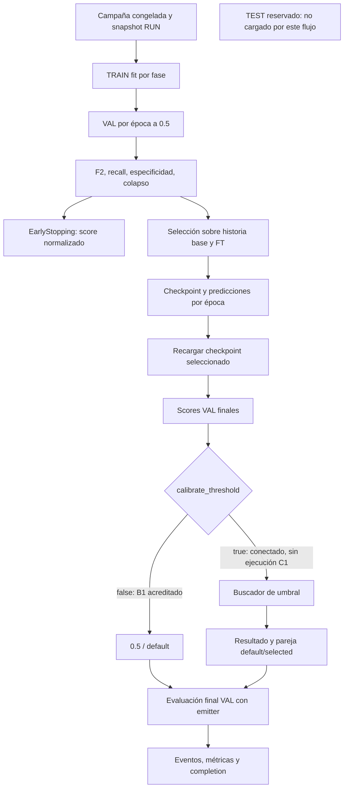
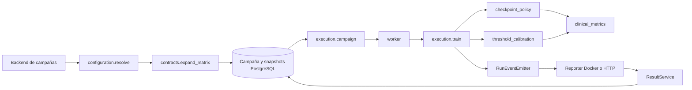
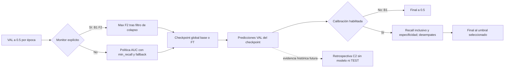
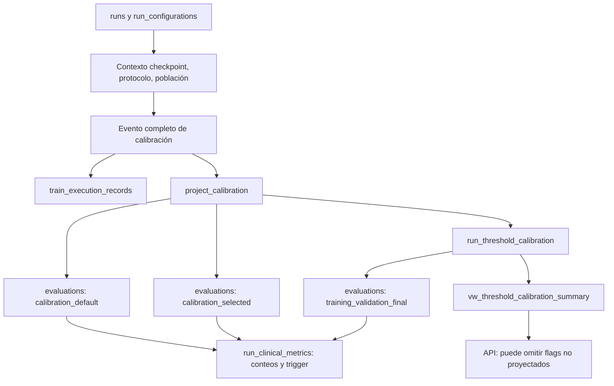

# C1 — Auditoría de calibración clínica (Thresholding Clínico)

Estado documental: `HISTORICAL_AUDIT`. Fecha de inspección: 2026-10-04. Proyecto Capstone SW-v3. C2 es una propuesta pendiente de aprobación independiente.

**Metodología: auditoría estática, sin ejecución de código, pruebas ni consultas PostgreSQL.**

Se inspeccionaron fuentes, JSON, DDL, pruebas y archivos históricos B1; sólo se escribieron los cinco documentos C1. No se ejecutaron calibraciones ni cálculos experimentales nuevos. En adelante **I=IMPLEMENTADO**, **C=CONECTADO**, **G=CONFIGURADO**, **P=PERSISTIDO** (operación localizada en código), **H=EJECUCIÓN HISTÓRICA ACREDITADA** por archivos B1, **NV=NO VERIFICADO**, **NI=NO IMPLEMENTADO** en el componente indicado. Una clasificación P no acredita una escritura nueva; H no significa reconsulta C1. Las inferencias y riesgos potenciales se rotulan expresamente.

Referencias `M/` = `malaria_dl_local_project/src/malaria_dl/`, `T/` = `malaria_dl_local_project/tests/`, `B1/` = `results/benchmarks/cpu_historical/`. Los rangos son líneas de los archivos inspeccionados; no se atribuye automáticamente el código actual al runtime histórico. HEAD observado: `abd9aae0378c0aca0e178b5e2d3d2138411d1dcb`. B1 consigna runtime `8411be7e71944370d017c96cc277e2b844c3de6e` y snapshot `2026-10-04T12:56:54.183938+00:00`. Había cambios de trabajo ajenos en backend/frontend al iniciar la revisión; C1 no los modificó.

## 1. Resumen ejecutivo

El objetivo es determinar cómo se configura, selecciona, aplica y persiste el umbral clínico y si puede reutilizarse la implementación para calibrar posteriormente los scores VAL históricos. **I/C:** `find_threshold_for_target_recall` ya existe y está conectado al ejecutor después de recargar el checkpoint seleccionado. Busca sensibilidad `>= target_recall`, prioriza especificidad y desempata por precision, F2, balanced accuracy y umbral. No maximiza Youden J.

**G/H:** B1 utilizó 0.5, calibración desactivada, 12 combinaciones y 396 épocas. Ningún resultado final VAL alcanza 0.98. Los archivos B1 acreditan 2693 scores VAL por checkpoint seleccionado y linaje suficiente en aquel snapshot; su disponibilidad actual es **NV**. La calibración retrospectiva es técnicamente viable a partir de esa evidencia sin entrenar ni cargar modelos, pero no a partir de métricas agregadas únicamente.

Las brechas principales son la relajación de especificidad al no existir solución conjunta, validación insuficiente de entradas del calibrador, discrepancia `>=` frente a `>` en E7, criterio de cierre basado en selección a .5 y omisión de campos en la proyección v2 leída por API. La configuración pública fija `none`, aunque el contrato admite `threshold_grid`. Existe además un selector E7 de umbral con semántica distinta; no se necesita un tercero.

La conclusión es **reutilizar y corregir el mecanismo existente antes de activarlo en nuevas campañas**. La inspección estática acredita lógica y conexiones, no ejecución correcta de la rama habilitada ni seguridad clínica. Los documentos complementarios amplían inventario, SQL y plan, pero este consolidado contiene el diagnóstico completo y su evidencia esencial.

## 2. Contexto del proyecto Capstone

### 2.1 Objetivo del diagnóstico de malaria

**G:** el protocolo `malaria_dl_local_project/configs/science/e7_v1.json:1–18` estudia clasificación de imágenes celulares parasitadas y no infectadas. La unidad de predicción es la imagen celular, no el diagnóstico integral del paciente. Esta auditoría evalúa una regla de decisión del software; no establece eficacia diagnóstica clínica.

### 2.2 Clasificación binaria: parasitized y uninfected

**I:** `M/config/clinical_labels.py:3–7` fija `uninfected=0`, `parasitized=1`, score escalar `probability_parasitized`. La matriz clínica usa ese orden. Invertir etiquetas o interpretar el score como P(uninfected) invertiría sensibilidad y decisión; el linaje del mapping es parte del contrato de reutilización.

### 2.3 Arquitecturas Custom CNN, VGG16 y DenseNet121

**H:** B1 combina las tres arquitecturas con Adam, AdamW, SGD y Adadelta, semilla 47 (`B1/HALLAZGOS_B1.md:9,39–52`). Custom CNN se entrenó sin pesos preentrenados y sin fine-tuning; VGG16/DenseNet121 usan ImageNet y fase de fine-tuning (`:72–78`). Los adaptadores (`M/models/adapters.py:51–112`) conectan construcción y compilación por fase. Las diferencias observadas corresponden a recetas completas, no al efecto aislado de un optimizador.

### 2.4 Separación de TRAIN, VALIDATION y TEST

**I/C:** `M/execution/train.py:66–92` rechaza `evaluate_best_on_test` y sólo crea datasets train/val. TRAIN ajusta pesos y usa aumento; VAL alimenta selección y calibración final. **G:** E7 reserva TEST para una decisión previamente congelada. C1 no inspeccionó imágenes ni accesos reales al conjunto TEST; la inexistencia de exposición histórica externa al flujo auditado es **NV**.

### 2.5 Objetivo clínico: sensibilidad ≥ 98 %

El objetivo de este encargo es inclusivo: `recall >= 0.98`. **I:** el buscador TRAIN implementa esa desigualdad (`threshold_calibration.py:200–205`). **G/I:** el JSON E7 define operador `>` y `science/statistics.py:155` también exige `>0.98`. No son criterios equivalentes en general. En B1 ninguno cumple ambos; el distinto operador no cambia ese resultado histórico.

## 3. Fundamento clínico del Thresholding

### 3.1 Probabilidad predicha y decisión diagnóstica

La decisión binaria del código es \(\hat y_i(t)=\mathbf{1}[s_i\ge t]\), con \(s_i=P_\text{modelo}(\mathrm{parasitized}\mid x_i)\). **I:** `clinical_metrics.py:93–106`. El nombre «probabilidad» y la salida sigmoid no demuestran que los scores estén calibrados probabilísticamente; sólo identifican el significado esperado por el contrato.

### 3.2 Umbral fijo de 0.5

**I/G:** 0.5 aparece como DEFAULT_THRESHOLD en el calibrador (línea 23), como valor de CheckpointPolicyConfig (44), en la receta versionada y de forma explícita en `execution/train.py:100,189,214,275,285`. En el flujo gobernado la selección está fijada a .5; no es un umbral clínico estimado. Calibración apagada conserva .5 en la evaluación final.

### 3.3 Falsos positivos y falsos negativos

Un FN es una célula etiquetada parasitized cuya decisión es uninfected; un FP es la situación inversa. Bajar el umbral puede reducir FN e incrementar FP sobre el mismo conjunto. Esta relación matemática no cuantifica consecuencias asistenciales, prevalencia real o costo por paciente; esas magnitudes no se acreditan en los archivos auditados.

### 3.4 Sensibilidad y especificidad

La sensibilidad mide detección entre positivos reales; la especificidad mide negativos correctamente descartados. El objetivo aislado de sensibilidad puede cumplirse trivialmente prediciendo todo parasitized. Por eso no basta `target_recall_satisfied=true`: debe evaluarse especificidad, colapso y factibilidad conjunta. **I:** el código calcula esas métricas, pero no aplica un gate clínico conjunto antes de usar el fallback.

### 3.5 Riesgos de una calibración incorrecta

Los riesgos demostrables en la lógica son confundir operadores, relajar restricciones y perder advertencias en proyección. Los efectos de esos problemas sobre decisiones clínicas reales son **NV**. En particular, calibrar sobre TEST invalidaría su función de evaluación reservada; el flujo TRAIN auditado lo impide, pero la función numérica por sí sola desconoce la procedencia de los arrays.

### 3.6 Diferencia entre optimización estadística y validación clínica

Seleccionar un umbral que cumple una proporción en VAL es optimización empírica. No demuestra sensibilidad poblacional mínima, estabilidad por paciente, transportabilidad a otro centro ni utilidad clínica. **H:** B1 es exploratorio con una semilla y VAL reutilizada; no se calcularon intervalos nuevos ni se emitió aprobación clínica.

## 4. Fundamento matemático

### 4.1 Matriz de confusión: TP, TN, FP y FN

\[
C(t)=\begin{pmatrix}TN(t)&FP(t)\\FN(t)&TP(t)\end{pmatrix},\qquad
n=TN+FP+FN+TP.
\]

Filas reales y columnas predichas, orden [uninfected,parasitized]. **I:** `clinical_metrics.py:261–266`; **P:** el guard SQL deriva esta matriz desde conteos (`alembic_v2/baseline/04_functions.sql:1146`).

### 4.2 Recall o sensibilidad

\[R(t)=\frac{TP(t)}{TP(t)+FN(t)}.\]

Describe la fracción de células positivas detectadas. **I:** `_safe_divide` retorna cero si falta soporte positivo; **P:** SQL usa `NULLIF` y produce null. Son semánticas distintas de ausencia de estimación, aunque coinciden con ambos soportes presentes.

### 4.3 Especificidad

\[S(t)=\frac{TN(t)}{TN(t)+FP(t)}.\]

Describe la fracción de células negativas clasificadas como negativas. Su ausencia de soporte debe distinguirse de desempeño cero; TRAIN Python actualmente la convierte en cero, mientras SQL v2 la conserva indefinida.

### 4.4 Precision

\[P(t)=\frac{TP(t)}{TP(t)+FP(t)}.\]

Es el valor predictivo positivo empírico de esa población, dependiente de su composición. Se usa como segundo desempate del buscador después de especificidad; no se puede trasladar directamente a otra prevalencia.

### 4.5 F2-score

\[F_\beta=\frac{(1+\beta^2)PR}{\beta^2P+R},\qquad
F_2=\frac{5TP}{5TP+4FN+FP}.\]

F2 pondera FN más que FP en esta expresión, sin representar por sí solo un costo clínico validado. **I:** `clinical_metrics.py:317–324` llama `fbeta_score(beta=2.0)`. El buscador acepta beta como argumento pero no cambia la fórmula. El resolver y CheckpointPolicyConfig sí rechazan beta distinto de 2.

### 4.6 Curva ROC y ROC-AUC

\[\mathrm{TPR}(t)=R(t),\quad \mathrm{FPR}(t)=1-S(t),\quad
\mathrm{AUC}=\Pr(s_+>s_-)+\tfrac12\Pr(s_+=s_-).\]

La AUC resume ordenación de scores, no acredita recall a un umbral específico. **I:** el calibrador TRAIN no usa `roc_curve` para candidatos; llama métricas que calculan ROC-AUC con sklearn. `science/statistics.py:98–122` sí exporta ROC y convierte umbrales no finitos a None. Los valores `val_auc` de Keras y `val_roc_auc_parasitized` no se sustituyen indiscriminadamente; B1 documenta esa diferencia (`HALLAZGOS_B1.md:35`).

### 4.7 Estadístico J de Youden

\[J(t)=R(t)+S(t)-1.\]

**NI en los selectores auditados:** ninguno maximiza explícitamente J. Balanced accuracy \((R+S)/2\) es monotónica en J, pero en el buscador TRAIN aparece sólo después de especificidad, precision y F2; no convierte su objetivo primario en Youden. No corresponde anunciar «calibración Youden» para este software.

### 4.8 Restricción de sensibilidad mínima

\[\mathcal F_R=\{t\in\mathcal T:R(t)\ge r_0\},\quad
\mathcal F=\{t\in\mathcal F_R:S(t)\ge s_0\}.\]

El segundo conjunto se aplica si min_specificity no es None. **I:** comparadores inclusivos en TRAIN; E7 usa estricta sensibilidad. Con scores válidos no negativos y positivos presentes, t=0 predice todos positivos y obtiene R=1. Así, recall aislado casi siempre es factible; no implica utilidad.

### 4.9 Selección del threshold óptimo

**I:** para candidatos factibles se elige

\[t^*=\arg\max_{t\in\mathcal F}\big(S(t),P(t),F_2(t),BA(t),t\big),\]

con orden lexicográfico. Si no se solicitó especificidad se usa \(\mathcal F_R\). El conjunto de candidatos incluye únicos de scores recortados finitos más 0,.5,1. No se optimiza directamente F2 ni el umbral máximo: criterios previos pueden preferir un umbral inferior. `selected_metrics` se toma del mismo registro evaluado que entrega t*.

### 4.10 Casos extremos, empates y restricciones no factibles

**I:** si \(\mathcal F=\varnothing\) pero \(\mathcal F_R\ne\varnothing\), se relaja especificidad y se advierte. Si falta factibilidad de recall, se antepone recall al mismo ranking. Los candidatos se ordenan, son únicos y la última clave es t; la decisión es determinista para entradas válidas y misma semántica numérica. `created_at` varía, por lo que el JSON completo no es idéntico entre llamadas.

El extremo t=1 no garantiza «todo negativo» si hay scores iguales a 1, por usar >=. No se incluye +Inf. NaN/Inf se filtran sólo al generar candidatos: los arrays originales siguen a las métricas. Los scores fuera de rango se recortan en la grilla, no en la evaluación. La conversión float64→float32 puede cambiar empates; es un riesgo potencial que requiere casos de frontera, no una discrepancia B1 demostrada.

## 5. Arquitectura de software existente

### 5.1 Organización de módulos Python

**I/C:** evaluación contiene métricas/calibración; training, callbacks/políticas y un trainer de compatibilidad; execution, el motor gobernado; campaigns/models, resolución y contrato; persistence/results, eventos/proyecciones. Los adaptadores `src/metrics.py`, `src/threshold_calibration.py` y `src/checkpoint_policy.py:1–5` reexportan módulos canónicos. No deben contarse como implementaciones duplicadas.

### 5.2 `clinical_metrics.py`

`M/evaluation/clinical_metrics.py:234–362` produce matriz, recall, especificidad, precision, F1/F2, BA, ROC-AUC, AP, distribución y colapso. `collect_predictions:430–464` recorre batches; para salida de dos columnas usa el mapping y extrae la positiva; para salida escalar devuelve scores aplanados. El contrato actual exige que éstos sean P(parasitized); compatibilidad de otros mappings no debe inferirse sin su contexto.

### 5.3 `threshold_calibration.py`

`M/evaluation/threshold_calibration.py:154–272` no carga datos/modelos: recibe arrays. Su responsabilidad numérica ya cubre la reutilización retrospectiva. Las funciones de escritura y validación de split son separadas; la función numérica no puede verificar que las muestras sean VAL aunque el resultado rotule `calibration_split='val'`.

### 5.4 `checkpoint_policy.py`

`M/training/checkpoint_policy.py:319–454` implementa políticas o monitor explícito. El filtro de colapso (271–294) retiene candidatos no colapsados si existen; si todos colapsan devuelve una selección degradada con advertencia. `auc_with_min_recall` sólo aplica filtro recall en el camino de política; el monitor explícito usa min/max y deja `policy_satisfied` en su default true.

### 5.5 `trainer.py`

`M/training/trainer.py:926` mantiene el flujo legacy y `:1424–1495` calibra tras cargar `best_model.keras`, escribe sidecar y metadata. Pero `src/train.py:1–8`, como módulo CLI, llama a `training.cli.main`; éste invoca `execution.train.standalone`. Importar `src.train` sí redirige a trainer. Por tanto, la existencia de esta lógica legacy no demuestra que la campaña actual la use.

### 5.6 `execution/train.py`

`train:36–328` es el motor localizado en el worker. Resuelve datos desde session.configuration, ejecuta fases, acumula historia, persiste checkpoints/scores, recarga el seleccionado, calibra condicionalmente y emite final VAL cuando hay emitter. La rama standalone llama train sin emitter (`:368`): no debe atribuirse automáticamente a ella la proyección canónica final de la rama worker.

### 5.7 Orquestación de campañas

`run_train_all_models.py:161–178` delega a `execution.campaign.main`, cuyo CLI (`:309–339`) consume campaña persistida y no permite flags científicos. Los helpers batch antiguos siguen importables, pero no gobiernan ese main. `campaigns/contracts.expand_matrix:235` impone protocolo congelado y rechaza variantes en conflicto.

### 5.8 Servicios de persistencia y PostgreSQL

**C/P:** `execution.repository` guarda registros; `worker.run_scientific_train:38–43` aporta emitter; reporters Docker/HTTP entregan a ResultService. `results/service.py:19–63` valida identidad/secuencia, acepta duplicados idénticos y proyecta dentro del alcance transaccional. `persistence/v2_projection.py` crea configuraciones, pareja de calibración y evaluación final. Se preservan eventos completos aunque algunas proyecciones resumen sean incompletas.

### 5.9 Dependencias entre componentes

| Archivo:línea | Función | Responsabilidad | Entradas → salidas | Consumidor |
| --- | --- | --- | --- | --- |
| M/models/configuration.py:37 | resolve_config | Precedencia/validación | nombre,selected,overrides,batch → snapshot | CLI/contratos |
| M/campaigns/contracts.py:235 | expand_matrix | Matriz gobernada | request,protocol → configuraciones | campaña |
| M/execution/train.py:36 | train | Ejecución completa | session,descriptor,repo,emitter → registros | worker |
| M/training/checkpoint_policy.py:520 | ClinicalValidationMetricsCallback.on_epoch_end | Métricas/scoring | epoch/logs,dataset → logs | fit |
| M/evaluation/clinical_metrics.py:430 | collect_predictions | Inferencia por batches | model,dataset → labels,pred,scores | callback/train |
| M/training/checkpoint_policy.py:422 | select_best_epoch_by_monitor | Mejor epoch explícito | history,config,monitor,mode → dict | PersistEpoch |
| M/evaluation/threshold_calibration.py:154 | find_threshold_for_target_recall | Umbral final | labels,scores,target,min_spec,beta → dict | train |
| M/evaluation/validation.py:8 | evaluate_validation_predictions | Evaluación final validada | arrays,ThresholdResult → DTO | train con emitter |
| M/persistence/v2_projection.py:144 | project_calibration | Pareja relacional | conexión,event → INSERTs | ResultService |
| M/persistence/v2_projection.py:116 | project_evaluation | Final VAL | conexión,event,result → INSERTs | ResultService |

## 6. Flujo real de entrenamiento y calibración

### 6.1 Configuración persistida de campaña

**G/P:** la solicitud pública se normaliza, construye protocolo y matriz (`campaigns/configuration.py:276,433–476`). El protocolo público deriva de E7 y fija calibration none; el contrato interno permite threshold_grid. `campaign_configurations` guarda configuración/hash por campaña; el miembro aporta semilla. Una campaña congelada no se reinterpreta desde nuevos defaults al ejecutar.

### 6.2 Inicialización del RUN

`ExecutionRepository._create_run:179–258` guarda `model_configuration_e2.configuration` dentro de execution_parameters y proyecta configuración v2. La sesión conserva su propia configuration. **H:** B1 concilió ambos snapshots con configuración de miembro, descontando la semilla; C1 no volvió a calcular hashes.

### 6.3 Entrenamiento mediante `model.fit()`

`execution/train.py:207–247` compila por fase, configura callbacks y llama fit(train,validation_data=val). El threshold no gobierna la pérdida binaria utilizada para optimizar pesos. **I:** métricas clínicas Keras propias usan .5 y >= (`models/architectures.py:21–32,73–84`); compile incluye además métricas Keras genéricas. No se interpreta cada métrica Keras como equivalente exacto al cálculo clínico final.

### 6.4 Predicciones sobre VALIDATION

Existen varias recolecciones: callback clínico por época, PersistEpoch para guardar evidencia por muestra y una última al cargar el checkpoint elegido. Todas las del motor usan VAL. B1 acredita eventos de predicciones por época; C1 no ejecutó ninguna ni recalculó sus valores.

### 6.5 Cálculo de métricas clínicas por época

`checkpoint_policy.py:522–592` usa t=.5 y publica `val_f2_parasitized`, `val_recall_parasitized`, `val_specificity`, AUC/AP clínicos, distribución, colapso y scores auxiliares. `min_class_fraction` se aplica a detección de colapso del callback. No se invoca el buscador de threshold por época.

### 6.6 EarlyStopping

**I:** callback Keras monitoriza `val_early_stopping_score`, mode max; su valor lógico puede ser F2, loss invertido o score de política. `early_stopping_score:100–125` usa tanh acotada y penalización de colapso. `checkpoint_policy_score` usa 2+AUC si recall cumple y recall si no. **H:** B1 usó monitor lógico F2, paciencia 12, min_delta 1e-5, restore_best_weights=true. El protocolo E7 versionado contiene min_delta 1e-4: no se sustituye por él el valor histórico. ReduceLROnPlateau mira val_loss, factor .5, patience 4, min_lr 1e-6 según receta versionada y snapshot.

### 6.7 Selección del mejor checkpoint

`PersistEpoch:141–205` acumula history fuera del bucle de fases. Con `selection.explicit=true` selecciona máximo F2 (B1); sin monitor explícito usa política, que en auc_with_min_recall filtra recall>=mínimo y luego AUC/F2/spec/menor loss/época más reciente. El camino explícito filtra colapso, pero no recall. Cada época tiene archivo propio; al terminar se recarga `epoch_{selected_epoch}.keras`. **H:** 9 checkpoints B1 proceden de base y 3 de fine-tuning, aunque 8 RUNS entrenaron FT.

### 6.8 Calibración del threshold

**C:** se llama una vez después de cargar el checkpoint (`execution/train.py:273–285`), con labels/scores VAL y parámetros efectivos. **G/H:** B1 desactivada. Un protocolo interno threshold_grid permite habilitarla, pero el catálogo público E7 conserva none. No es un componente ausente del ejecutor.

### 6.9 Evaluación clínica final

Con emitter, `ThresholdResult` toma selected/source cuando calibración activa o .5/default si no. `evaluate_validation_predictions` valida arrays y produce conteos/métricas. **I:** `clinical_objective_met` del completion usa en cambio selection.val_recall_parasitized a .5 y min_recall (`:318–323`), no la evaluación final; es una brecha si la calibración cambia el resultado.

### 6.10 Persistencia de resultados

El registro calibration/val/selected se escribe incluso si disabled; en ese caso no hay evento CALIBRATION_COMPLETED. Cuando se habilita, se emite el resultado completo y se proyecta la pareja v2. Después se emite EVALUATION_COMPLETED, que enlaza la calibración exacta por checkpoint/protocolo/población/input/threshold. Finalmente se guarda completion. La mera presencia del registro legacy no demuestra ejecución del buscador.

### 6.11 Separación y protección de TEST

**I/C:** motor gobernado rechaza TEST y no lo carga. La CLI independiente de calibración valida split=val. El buscador numérico requiere que el consumidor garantice procedencia; su campo constante calibration_split no es una comprobación. La rama legacy de trainer contiene evaluación TEST opcional, distinta del motor auditado y sin ejecución C1/B1 acreditada por ese hecho.

La evaluación separada E6 tiene otra cadena activa: `assessment.service.prepare:53–79` → `assessment.lineage.resolve:21` → `assessment.contracts.threshold:28–64`. Resuelve una decisión explícita numérica autorizada en `protocol.allowed_numeric_thresholds`, o 'clinical' con resultado VAL, schema 1, clase positiva 1, fuente validation_calibration y selected=used. Lineage exige un único registro calibration/val/selected de la misma época del checkpoint (`:55–64`). No selecciona un threshold usando scores TEST.

`assessment.contracts.identity:81–96` requiere purpose final para TEST y development para los otros splits, además de permiso del protocolo; `prediction:140–154` aplica `score >= decision.effective`. `assessment.repository.reserve:22–35` guarda identidad/decisión y `write_batch:123–151` las predicciones. La decisión usa claves requested/effective/source/comparison, no threshold_mode. **Brecha estática adicional de H01:** el resolver clinical comprueba procedencia, pero no flags de factibilidad de recall/especificidad; no basta que el resultado sea auténtico para considerarlo clínicamente aprobado. No se ejecutó E6 ni se accedió a TEST en C1.



No hay paso «no conectado» entre motor y calibrador. Lo no expuesto es la elección pública de threshold_grid; el camino enabled no se acredita dinámicamente en C1.

## 7. Auditoría del algoritmo de calibración

### 7.1 Función principal identificada

**I/C:** `M/evaluation/threshold_calibration.py:154`, `find_threshold_for_target_recall`. No se localizó una función `calibrate_clinical_threshold`. Además existe `science/statistics.threshold_selection`, conectado a comparación E7 y ensemble, que exige >.98 y tiene desempates distintos. Éste no es la función llamada por TRAIN.

### 7.2 Parámetros de entrada

`y_true`, `y_scores`, `target_recall=.98`, `min_specificity=None`, `beta=2.0`. Convierte labels a int y scores a float64; rechaza vacío y longitudes diferentes; target y especificidad fuera de [0,1]. No exige labels enteras binarias antes de convertir ni ambas clases, ni valida directamente scores finitos/en rango. Tampoco recibe split, min_class_fraction o reject_prediction_collapse.

### 7.3 Obtención de predicciones y probabilidades

**C:** el ejecutor entrega el tercer retorno de collect_predictions, de VAL del checkpoint recargado. En modelos actuales escalar sigmoid significa P(parasitized). `collect_predictions` genera también y_pred a .5 pero el calibrador no utiliza esas etiquetas predichas: vuelve a aplicar cada umbral. Para retrospectiva basta conservar labels y scores con identidad de muestra y checkpoint.

### 7.4 Construcción de umbrales candidatos

Extracto literal de `threshold_calibration.py:71–80`:

```python
scores = np.asarray(y_scores, dtype=np.float64).reshape(-1)
scores = scores[np.isfinite(scores)]
scores = np.clip(scores, 0.0, 1.0)

candidates = {0.0, 1.0}
candidates.update(float(value) for value in np.unique(scores))
if include_default:
    candidates.add(DEFAULT_THRESHOLD)

return sorted(candidates)
```

La búsqueda evalúa todos los candidatos usando las muestras originales, no sólo los scores finitos filtrados. Para k candidatos repite cómputos de métricas/AUC/reportes: costo potencial alto frente al barrido acumulativo ya existente en E7; no se midió rendimiento en C1.

### 7.5 Criterio de optimización implementado

Extracto literal de `threshold_calibration.py:126–134`:

```python
def _selection_key(record: dict) -> tuple:
    metrics = record["metrics"]
    return (
        _as_float(metrics.get("specificity")) or 0.0,
        _as_float(metrics.get("precision_parasitized")) or 0.0,
        _as_float(metrics.get("f2_parasitized")) or 0.0,
        _as_float(metrics.get("balanced_accuracy")) or 0.0,
        float(record["threshold"]),
    )
```

**I:** mayor especificidad condicionada a recall; precision antecede F2. E7 no incluye precision ni BA y exige sensibilidad estricta. Ninguno usa J como criterio explícito.

### 7.6 Aplicación de restricciones clínicas

**I:** recall se filtra con >= en 203–204; especificidad con >= en 213–214. min_recall pertenece a checkpoint/cierre y no es argumento de calibración. Las restricciones de colapso del checkpoint no se transfieren al buscador. El detector invocado por compute_clinical_metrics emplea su default .05, no el valor configurable del callback.

### 7.7 Selección y desempate

`max(policy_valid,key=_selection_key)` produce un resultado determinista sobre la lista ordenada; la última clave favorece mayor umbral sólo tras empatar métricas anteriores. No hay aleatoriedad del selector. Valores de métricas y threshold son del mismo record. La grilla float64 y la evaluación float32 hacen necesaria una verificación de fronteras si los scores proceden de fuentes distintas a los float32 del pipeline histórico.

### 7.8 Manejo de resultados no factibles

Extracto literal de `threshold_calibration.py:216–228`:

```python
min_specificity_satisfied = bool(policy_valid)
if not policy_valid and target_valid:
    specificity_warning = (
        "No threshold satisfied both target_recall and min_specificity; "
        "selected among thresholds satisfying target_recall."
    )
    policy_valid = target_valid

target_recall_satisfied = bool(target_valid)
if policy_valid:
    selected = max(policy_valid, key=_selection_key)
else:
    selected = max(records, key=_fallback_key)
```

El fragmento interior pertenece al bloque `if min_specificity is not None`. **I:** el fallback está deliberadamente implementado. La advertencia evita afirmar factibilidad de especificidad en el resultado completo, pero el ejecutor aplica el umbral igualmente y la proyección puede omitir esa advertencia. C1 no acepta este fallback como cumplimiento clínico conjunto.

### 7.9 Valores devueltos

El dict contiene schema_version, threshold_policy, threshold_source, threshold_selected/used, default_threshold, target y flags, min_specificity y satisfacción, beta, selected_metrics/validation_metrics_at_threshold, default_threshold_metrics, candidate_count, warning, calibration_split, mapping y created_at (`:243–271`). selected_metrics incluye matriz, conteos, F2, AUC/AP, distribución y flag de colapso. No hay expected_specificity con ese nombre en este resultado: el resolver legacy lo deriva posteriormente de specificity.

### 7.10 Manejo de errores y casos extremos

| Caso | Comportamiento leído | Interpretación |
| --- | --- | --- |
| Vacío / largo diferente | ValueError | Guarda explícita implementada |
| Target/min_spec fuera de dominio | ValueError | Incluye NaN de estos parámetros por comparación de rango |
| Labels fraccionarias | astype(int) previo | Puede truncar; falta validación estricta |
| Una clase | No se rechaza; AUC/AP None; cocientes cero donde indefinidos | No apto como evidencia de factibilidad clínica |
| Scores NaN/Inf | Se eliminan de candidatos, no de arrays originales | Falta rechazo; AUC puede quedar None |
| Scores fuera [0,1] | Clip sólo en candidatos | Inconsistencia de política de entrada |
| threshold<.05 | Warning | No rechazo ni garantía sobre falsos positivos |
| Todos positivos predichos | Colapso informado, no excluido | Recall=1 puede coexistir con specificity=0 |
| beta≠2 directo | Se registra beta solicitado pero computa F2 | Contrato engañoso fuera del resolver |
| empate / extremos | Orden estable, >=; sin +Inf | No usa umbrales ROC infinitos |

La evaluación final valida entradas con mayor rigor (`evaluation/validation.py:8–17`), pero ocurre después de buscar y emitir calibración. No corrige retroactivamente la falta de guardas del buscador ni su uso independiente.

### 7.11 Pruebas existentes del algoritmo

**I; resultado actual NV:** se leyeron pruebas, sin ejecutarlas.

| Test exacto y archivo:línea (T/) | Datos/aserciones principales | Límite de cobertura |
| --- | --- | --- |
| test_threshold_calibration.py:20, `test_find_threshold_for_target_recall_satisfies_target_when_possible` | [1,1,1,0,0,0], [.9,.8,.2,.7,.1,.05]; t≈.2, recall>=.98 | No frontera exacta .98 |
| mismo:38, `test_find_threshold_uses_secondary_specificity_then_highest_threshold` | Mismos arrays, target 2/3; t≈.8, spec=1 | No aísla todos los desempates |
| mismo:52, `test_find_threshold_fallback_when_target_not_reached` | Sólo negativos; flag false y warning | Acepta fallback, no exige ambas clases |
| mismo:65, `test_threshold_applied_to_probability_parasitized` | [1,0]/[.4,.6], t=.5; FN=FP=1 | No igualdad exacta score=t |
| mismo:77, `test_build_threshold_candidates_includes_default_threshold` | [.2,.8]; contiene 0,.5,1 | No scores inválidos |
| mismo:84, `test_test_set_cannot_be_used_for_calibration` | helper split='test' lanza error | Buscador no recibe split |
| test_training_results.py:58, `test_threshold_policy_preserved` | enabled false/true; threshold y matriz/F2 coherentes | No integración completa campaña |
| mismo:85, `test_invalid_predictions_rejected` | Vacío, clase 2/.5, NaN, 1.1 y dimensión errónea | Guarda final, no calibrador |
| test_assessment_e6.py:227, `test_threshold_no_implicit_clinical_fallback` | Rechaza clinical sin evidencia y número sin permiso; acepta fixture VAL .63 | No exige flags de factibilidad |
| mismo:245, `test_test_forbidden_development` | TEST con propósito development → AssessmentError | Intención estática, sin ejecución |
| test_science_e7.py:138, `test_strict_threshold_098_not_success_and_stable_ties` | 49/50 a score alto; elige .1 para recall=1, orden inverso igual; rechaza TEST | Otra política, no TRAIN |
| test_threshold_calibration_tracking.py:44, `test_log_threshold_calibration_extracts_selected_metrics` | Fixture t=.42; comprueba parámetros SQL con mock | No acredita esquema v2 ni factibilidad |

Faltan pruebas directas TRAIN para especificidad incompatible, entrada inválida previa a búsqueda, precisión numérica, beta, aceptación de colapso y proyección completa de flags a API. Las pruebas de checkpoint/ES y su inventario ampliado figuran en el anexo A y FUNCIONES_C1; ninguna se declara aprobada actualmente.

## 8. Configuración científica y parámetros

### 8.1 Configuración versionada de modelos

**G:** `malaria_dl_local_project/configs/models/{custom_cnn,vgg16,densenet121}.json:36–38,55,73` tienen calibración individual false, target .98, min_specificity null; el perfil batch establece calibración true y la receta fija selection_threshold .5. No implica que cualquier campaña active calibración: el protocolo congelado impone su valor. Las configuraciones científicas E7 contienen false, min_specificity 0, monitor F2 y receta .5.

### 8.2 Configuración persistida de campañas

**G/P:** `experimental_campaigns.requested/protocol/contract` distingue petición y contrato congelado. `campaign_configurations.configuration` almacena cada configuración; `requests` su procedencia. `campaigns/contracts.py:318–343` impone target/min_recall/min_specificity/calibración/ES y rechaza `VARIANT_PROTOCOL_CONFLICT`. `configuration.py:49–54` no incluye calibración entre parámetros públicos editables; `:204–224` la declara fija.

### 8.3 Snapshot efectivo del RUN

**P:** `runs.execution_parameters.model_configuration_e2.configuration.resolved` es el snapshot completo; la sesión recibe `configuration` y el ejecutor usa `resolved.execution` y `resolved.selection`. `run_configurations.extension_configuration` conserva resolved; columnas tipadas incluyen calibration_enabled/default_threshold/clinical_target_recall. **H:** B1 reporta igualdad entre JSON canónico y resolved y concordancia de configuración de campaña al retirar seed 47 (`HALLAZGOS_B1.md:25–27`).

### 8.4 Parámetros CLI y variables de entorno

**I/C:** el CLI individual admite `--calibrate-threshold`, `--target-recall`, `--min-specificity` (`training/cli.py:119–139`), y sólo flags explícitos sobreescriben JSON (`:245–295`). No admite un umbral arbitrario de selección en este contrato. El CLI de campaña recibe ID y opciones operativas, sin overrides científicos (`execution/campaign.py:309–339`).

La búsqueda de nombres relativos a threshold/recall/calibration en `.env`/ejemplos y consumidores no identificó una ruta que los use para resolver estos parámetros: **NI en la resolución inspeccionada**, no afirmación universal sobre toda variable posible. No se publicaron secretos ni se modificó el entorno. Variables de determinismo/infraestructura no constituyen una fuente de threshold.

### 8.5 Precedencia de configuración

**I:** `models/configuration.py:37–59`: defaults versionados; perfil batch si corresponde; JSON seleccionado; overrides explícitos. Hay tratamiento adicional de `selected.batch`: sólo se aplica en batch cuando el mismo campo no figura ya en selected.execution u overrides.execution. Cambios de recipe se rechazan.

En campaña congelada el protocolo genera overrides, rechaza conflictos y el snapshot persistido es el dato consumido. No se aplica una precedencia «CLI gana siempre» a campañas ya congeladas. Los nombres visibles de política tampoco prevalecen sobre selection.explicit: el ejecutor selecciona por la semántica resuelta.

### 8.6 `target_recall`

**G/H:** .98. Se pasa al buscador final, se persiste en clinical_target_recall y resultado/evento. No garantiza que se invoque el buscador cuando calibrate_threshold=false. Dominio del resolver [0,1], mientras el esquema v2 de clinical_target_recall exige >0 y <=1; `build_protocol:445–447` comprueba el dominio v2 de campañas.

### 8.7 `min_recall`

**G/H:** .98, derivado de sensitivity_target. Se usa en auc_with_min_recall, score de política y completion. No filtra candidatos del camino checkpoint explícito F2 y no se pasa como argumento al calibrador. Su igualdad histórica con target_recall no hace equivalentes los conceptos.

### 8.8 `min_specificity`

**G/H:** 0 en protocolo/snapshot B1; null en defaults individuales. Se usa en búsqueda final y comprobación de completion a .5, no en selección de checkpoint. El fallback del buscador puede incumplirla; el flag de recall no cubre esa restricción. El valor clínicamente útil no se puede deducir de la inspección y C2 no propone inventarlo.

### 8.9 `calibrate_threshold`

**G/H:** false en B1. El contrato traduce algorithm!='none' en true; sólo admite none/threshold_grid. El público actualmente fija none desde E7; batch defaults true quedan subordinados al protocolo. **C:** la rama enabled existe en ejecución y persistencia moderna.

### 8.10 `threshold`

Selección y callbacks: .5 fijo por contrato; default del buscador: .5; evaluación final: .5 si apagado o selected si activo. **I:** no se calibra TRAIN; el umbral afecta decisiones/métricas, no entrenamiento de pesos mediante binary_crossentropy. El resolver legacy de inferencia acepta número o 'clinical' desde metadata; ésa es otra ruta, no una fuente de selección del TRAIN de campaña.

### 8.11 `beta`

**G/H:** 2.0. `resolve_config:124–125` y CheckpointPolicyConfig rechazan otro valor. `evaluate_threshold:113–123` conserva beta sólo para compatibilidad, compute_clinical_metrics usa F2 fijo. La función directa debe alinear su validación con el contrato para no etiquetar como otro F-beta un resultado F2.

### 8.12 `min_class_fraction`

**G/H:** .05. Dominio [0,.5] en resolver. Callback declara colapso cuando alguna fracción predicha es estrictamente menor que ese mínimo. El calculador clínico usa default .05; la búsqueda no recibe el parámetro, por lo que un cambio público del callback no cambia el diagnóstico de colapso del calibrador.

### 8.13 `reject_prediction_collapse`

**G/H:** true; booleano de selección. Excluye épocas colapsadas si hay alternativas; si todas colapsan conserva candidato con advertencia. No excluye umbrales colapsados después de calibrar. No se puede certificar no colapso final porque la selección a .5 fuese aceptable.

| Parámetro | Tipo / valor B1 verificado en archivos | Fuente histórica | Finalidad / consumidor |
| --- | --- | --- | --- |
| threshold | float .5 | Q08, snapshot, métricas | selección/callback y final sin calibración |
| calibrate_threshold | bool false | runs.csv, resolved | condición de llamada final |
| target_recall | float .98 | configuración RUN | find_threshold_for_target_recall |
| min_recall | float .98 | configuración/protocolo | checkpoint_policy y completion |
| min_specificity | float 0 | configuración/protocolo | calibrador y completion |
| beta | float 2 | configuración | F2, validación resolver |
| min_class_fraction | float .05 | configuración | callback/filtro colapso |
| reject_prediction_collapse | bool true | configuración | checkpoint/score ES |
| checkpoint_policy | string auc_with_min_recall | configuración | nombre de política, subordinado a explicit |
| checkpoint_monitor | string val_f2_parasitized | Q04/Q12 y B1 | máximo F2 explícito |
| ES patience / min_delta | int 12 / float 1e-5 | B1 HALLAZGOS:33 | detención por score lógico normalizado |
| restore_best_weights | bool true | B1 HALLAZGOS:33 | mejores pesos por fase |
| ReduceLR monitor | string val_loss | receta/snapshot runtime | adaptación de learning rate |

## 9. Persistencia y trazabilidad en PostgreSQL

### 9.1 Tablas involucradas

**I/P:** DDL v2 en `alembic_v2/baseline/03_tables.sql`: artifacts:2, campaign_configurations:22, evaluations:84, experimental_campaigns:92, run_clinical_metrics:134, run_configurations:136, run_threshold_calibration:150, runs:152, train_execution_records:180, train_execution_sessions:184. Se añaden campaign_members/attempts para unir el intento aceptado. No se crearon tablas ni se consultó el esquema vivo.

### 9.2 Configuración por campaña

requested conserva intención; protocol define política; contract/hash congela identidad. La configuración por miembro se enlaza por campaign_id y configuration_hash. B1 acredita 12 pares únicos y un intento aceptado por miembro. Comparar sólo nombres de RUN o igualar hashes de RUN/miembro sería incorrecto: el RUN incorpora seed.

### 9.3 Configuración por RUN

`project_configuration:29–54` persiste arquitectura/optimizador, semilla, monitores, calibración habilitada, default_threshold y target; añade canonical_configuration, hash, extension_configuration y provenance_snapshot. **Corrección necesaria del SQL del encargo:** run_configurations no tiene columna configuration. Usar extension_configuration para resolved o provenance_snapshot para wrapper completo.

### 9.4 Eventos de entrenamiento

`ExecutionRepository.put:355–395` aplica idempotencia por RUN/tipo/fase/key y guarda payload. `train.put` emite además tipos canónicos; ResultService acepta una secuencia y proyecta atómicamente por evento. No se cuentan ambos registros como dos épocas. **H:** B1 consigna 396 epoch, 396 selection, 396 predictions y 2044 e10_event; esos conteos no prueban calibración habilitada.

### 9.5 Registros de calibración

El registro calibration/val/selected contiene result, checkpoint_epoch y samples. Desactivado, result sólo marca enabled false y threshold .5. Activado, incluye resultado completo. `project_calibration:144–198` crea evaluaciones default/selected y la pareja run_threshold_calibration, pero omite min_specificity, satisfacción, warning y candidate_count de columnas resumen. Esos datos existen en el evento/registro, no necesariamente en la vista de resumen.

### 9.6 Evaluaciones VALIDATION

`project_evaluation:116–141` guarda rol training_validation_final, split val, threshold_used/source y conteos, con checkpoint, dataset y hashes. Si la fuente es validation_calibration busca la pareja con identidad exacta; no el último threshold global del modelo. Los roles calibration_default/calibration_selected se deben distinguir del final VAL al consultar.

### 9.7 Métricas clínicas

`v2_binary_metric_guard:1129–1150` deriva métricas desde TN/FP/FN/TP, copia threshold/fuente y valida ausencia AUC en una clase. AUC/AP proceden del productor, no se reconstruyen desde la matriz. Proyección final no rellena prediction_collapse, classification_report ni distribución; `{}` no significa ausencia de colapso. SQL usa null en cocientes indefinidos, frente a cero Python.

### 9.8 Checkpoints y artefactos

**H:** B1 tiene 396 artefactos por época en registros y 12 seleccionados en catálogo artifacts; final VAL enlaza su artifact_id y checksum (`HALLAZGOS:119,129`). No se comprobó su existencia física. Para calibración retrospectiva no se necesita cargar esos archivos, pero sí conservar la identidad histórica del checkpoint que produjo los scores.

### 9.9 SQL de auditoría

**No se ejecutó SQL en C1.** Consulta propuesta, verificada estáticamente contra columnas y relaciones, que corrige rc.configuration:

```sql
BEGIN ISOLATION LEVEL REPEATABLE READ READ ONLY;
SELECT r.id AS run_id,r.run_name,
       rc.extension_configuration AS resolved,
       rc.calibration_enabled,rc.default_threshold,rc.clinical_target_recall,
       e.id AS evaluation_id,e.split,e.evaluation_role,
       e.threshold_used,e.threshold_source,
       m.recall_parasitized,m.specificity,m.f2_parasitized,m.prediction_collapse
FROM runs r
LEFT JOIN run_configurations rc ON rc.run_id=r.id
LEFT JOIN evaluations e ON e.training_run_id=r.id
 AND e.split='val' AND e.evaluation_role='training_validation_final'
LEFT JOIN run_clinical_metrics m ON m.evaluation_id=e.id
WHERE r.campaign_id='b54ea684-1b0c-421d-a4b2-9f12667bd619'::uuid
ORDER BY r.started_at,r.id;
ROLLBACK;
```

La consulta no tiene resultados C1. **H:** Q08 B1 acredita 12 final VAL a .5; Q17 acredita scores seleccionados. Anexo C contiene SQL histórico recuperado y verificaciones adicionales propuestas, sin ejecutarlas.

### 9.10 Integridad y reproducibilidad

El guard de pareja (`04_functions.sql:1153–1165`) exige target coincidente con run_configurations, dos evaluaciones distintas VAL del mismo RUN/checkpoint/dataset/población, default .5 y selected igual al threshold registrado. La proyección mantiene source_event_id y hashes. Estas restricciones no equivalen a factibilidad clínica.

**C:** API `routes/runs.py:703–757` expone métricas y vista de calibración; clinical-summary:541 prioriza métricas TEST/external por fecha y no final VAL por rol. Cuando hay varias evaluaciones con la misma fecha, «latest» no identifica inequívocamente la final. Es un riesgo de presentación; C1 no envió peticiones HTTP. El servicio training_summaries sí contiene consulta explícita final VAL (:200–205), pero sus cambios de trabajo iniciales no se usan como evidencia histórica de B1.

## 10. Análisis histórico de la campaña B1

### 10.1 Identificación de la campaña

**H:** «Campaña 1», UUID `b54ea684-1b0c-421d-a4b2-9f12667bd619`, 12 training/completed, sesiones verified e intentos aceptados (`B1/HALLAZGOS_B1.md:9,23`). Snapshot histórico 2026-10-04T12:56:54.183938+00:00. El estado actual de la BD no fue consultado.

### 10.2 Dataset y particiones

**H:** Malaria Patient Split v1, versión 1.0.0, FROZEN, UUID `d8c0cab5-09dd-597f-9de7-7ca01aee2ec2`; 22180 TRAIN, 2693 VAL, 2685 TEST; grupos de pacientes 161/20/20 según contrato persistido. VAL contiene 1325 positivos y 1368 negativos. No se auditó de nuevo el split ni la identidad clínica de imágenes.

### 10.3 Arquitecturas y optimizadores

**H:** producto 3×4, semilla 47; 396 épocas (263 base, 133 FT). B1 reporta 17 cierres por EarlyStopping de 20 fases; tres fases FT agotan el máximo. El número de configuraciones no representa réplicas independientes.

### 10.4 Umbral histórico utilizado

**H/G:** .5 en selección y final VAL; calibrate_threshold=false. Los 12 registros legacy calibration:val son compatibles con marcador disabled del productor. No se puede presentar su conteo como «12 calibraciones clínicas realizadas».

### 10.5 Sensibilidad obtenida

Transcripción de `B1/HALLAZGOS_B1.md:39–52`, redondeo histórico a seis decimales; no nuevos cálculos:

| Arquitectura | Optimizador | Recall | Especificidad | F2 | Checkpoint global / fase |
| --- | --- | --- | --- | --- | --- |
| custom_cnn | adadelta | .929057 | .979532 | .938405 | 14 / base |
| custom_cnn | adam | .898868 | .969298 | .911526 | 4 / base |
| custom_cnn | adamw | .939623 | .958333 | .942896 | 2 / base |
| custom_cnn | sgd | .916226 | .976608 | .927284 | 19 / base |
| densenet121 | adadelta | .932830 | .915205 | .929044 | 28 / fine_tuning |
| densenet121 | adam | .784151 | .956140 | .811846 | 35 / base |
| densenet121 | adamw | .784906 | .952485 | .811866 | 18 / base |
| densenet121 | sgd | .904906 | .904971 | .904360 | 10 / base |
| vgg16 | adadelta | .946415 | .934211 | .943709 | 5 / base |
| vgg16 | adam | .933585 | .970029 | .940255 | 14 / fine_tuning |
| vgg16 | adamw | .934340 | .970029 | .940872 | 15 / fine_tuning |
| vgg16 | sgd | .948679 | .913743 | .941573 | 1 / base |

### 10.6 F2-score y especificidad

**H:** mayor F2 histórico VGG16/Adadelta .943709; mayor especificidad Custom CNN/Adadelta .979532. El máximo recall pertenece a VGG16/SGD y no coincide con esos máximos. No existe un ganador único sin definir criterio. Los valores sin redondeo están en runs.csv; no se reprocesaron.

### 10.7 Cumplimiento del objetivo clínico

**H:** 0/12 alcanzan .98 a .5. B1 consigna clinical_objective_met=false aunque selection.policy_satisfied=true, coherente con selección explícita F2. Su reporte exige >.98; el encargo >=.98 tampoco se cumple. B1 informa 1257 TP y 68 FN en el máximo recall; no se generó una nueva matriz en C1.

### 10.8 Predicciones VALIDATION disponibles

**H:** Q17 unió registros predictions de la época del artifact final VAL y obtuvo 12 poblaciones de 2693, con las mismas identidades y labels. B1 reconstruyó métricas con error máximo publicado 5.3632491064677406109093255710395155E-16. C1 hereda ese resultado documental y no lo repite.

Los cuatro CSV publicados no son una exportación de scores por muestra. runs.csv contiene métricas/configuraciones; epochs.csv métricas por época; artifacts.csv linaje de archivos; campaign_summary.csv resumen. report.md indica snapshot opcional con muestras, no publicado como entregable. Disponibilidad actual de PostgreSQL/snapshot: **NV**.

### 10.9 Viabilidad de calibración retrospectiva

**Inferencia fundada en I+H:** labels y scores íntegros del checkpoint elegido bastan para invocar el buscador numérico. No requiere TRAIN, pesos, carga de modelos, inferencia ni TEST. Se requiere recuperar sólo VAL histórico, validar soporte/finitez/rango/mapping/identidad, fijar política nueva y conservar procedencia y resultados originales.

No utilizar directamente calibration_cli.main: ésta carga checkpoint y predice VAL. Se necesita una conexión acotada desde evidencia existente al buscador, sin nuevo algoritmo. La persistencia retrospectiva no debe fingir un evento original del TRAIN; el guard v2 exige compatibilidad de target y pareja. Su encaje oficial en contratos de reportes derivados queda pendiente de C2.

### 10.10 Limitaciones de la evidencia histórica

Archivos de auditoría no reemplazan un acceso actual a BD ni certifican artefactos físicos. B1 detectó cinco completed_epochs=0 inconsistentes y tablas de proyección legacy vacías; usa eventos/sesiones para reconstrucción. El código runtime histórico difiere del HEAD inspeccionado; no se atribuyen cambios actuales a la ejecución pasada. No hay nuevas métricas clínicas, IC, evaluación externa ni certificación del dispositivo CPU/Metal.

## 11. Validación científica y riesgos

### 11.1 Sobreajuste al conjunto VALIDATION

**Riesgo potencial:** elegir época, modelo y umbral sobre VAL puede producir optimismo en sus métricas. No se cuantificó su magnitud. Reutilización retrospectiva debe rotularse exploratoria y mantener decisiones congeladas para cualquier evaluación posterior independiente.

### 11.2 Fuga de información entre particiones

**I:** train sólo carga TRAIN/VAL y aumenta TRAIN. **H:** el contrato B1 declara separación por paciente. Fugas efectivas por duplicados, parentesco entre células o exposiciones fuera del flujo: **NV**, pues C1 no inspeccionó imágenes/dataset ni accedió a TEST.

### 11.3 Reutilización de VALIDATION para selección y calibración

**I/G:** ambas decisiones comparten VAL; E7 lo reconoce como shared_val_exploratory e independent_calibration=false. Eso es una limitación metodológica demostrada del diseño, no evidencia de contaminación de TEST. El objetivo futuro puede usar particiones por paciente o validación anidada ya descritas en protocolo; C1 no modifica particiones.

### 11.4 Sensibilidad frente a especificidad

Con ambas clases, t=0 produce sensibilidad 1 y especificidad 0 para scores válidos. El código puede devolver ese extremo o uno muy bajo; la advertencia no demuestra aceptabilidad. C2 requiere mostrar ambas restricciones y su satisfacción conjunta, sin convertir un fallback en éxito clínico.

### 11.5 Umbrales degenerados

**I:** rango de candidatos incluye 0 y 1; warning bajo .05. No hay garantía de clase negativa a t=1 si score=1. No se identificó un umbral clínico mínimo validado y no se propone inventarlo. El manejo de extremos debe ser parte del contrato y sus pruebas.

### 11.6 Predicciones colapsadas

**I:** selección puede rechazar épocas colapsadas; calibrador sólo informa colapso. Un checkpoint no colapsado a .5 puede colapsar después de reducir el umbral. **P:** `{}` en métricas v2 no acredita ausencia de colapso. Deben mantenerse estados conocido/desconocido y política final explícitos.

### 11.7 Interpretación de probabilidades

**I/G:** el contrato exige P(parasitized) y clase positiva 1. Scores inválidos, mapping invertido o casting de labels pueden generar métricas engañosas; el buscador no protege todos esos casos. Generalización de valores probabilísticos a otra población es **NV**.

### 11.8 Calibración del umbral frente a calibración probabilística

El thresholding cambia decisiones binarias y deja intactos scores. Temperature scaling ajusta una transformación de scores; existe como otra opción en calibration_cli pero no en la llamada de TRAIN auditada. E7 declara none_raw_probability. No se afirma que ajustar threshold mejore calibración probabilística ni se habilita temperature scaling en C2 por defecto.

### 11.9 Generalización y validación externa

**NV:** desempeño fuera de VAL, estabilidad entre semillas o centros y sensibilidad por paciente. Una semilla B1 y células correlacionadas no bastan para estimarlos. Los procedimientos de bootstrap por paciente descritos en E7 no se ejecutaron ni prueban resultados nuevos en C1.

### 11.10 Limitaciones para afirmar seguridad clínica

No se certifica seguridad clínica por recall puntual, F2 alto, RUN completed, selección policy_satisfied o calibración recorded. C1 identifica condiciones de validez de software y límites de evidencia; toda afirmación de utilidad clínica exige evaluación independiente, contexto poblacional y estimación de incertidumbre que aquí no se acreditaron.

## 12. Hallazgos de auditoría

### 12.1 Funcionalidades implementadas

**I/C:** cálculo clínico, grilla de umbral, filtros y fallbacks, selección de checkpoint global, ES con score normalizado, calibración final condicionada y eventos. **P:** snapshot, predicciones, pareja default/selected y final VAL. Estas piezas son reutilizables; no falta construir el sistema desde cero.

### 12.2 Funcionalidades parcialmente conectadas

**G:** threshold_grid está soportado por contratos y ejecución, pero no expuesto como editable en el catálogo público derivado de E7. **P:** resultado completo se conserva en eventos mientras las columnas resumen de calibración quedan incompletas. No se localizó una ruta retrospectiva B1 directa que use los scores guardados en lugar de inferencia, sin asumir compatibilidad con el comparador E7.

### 12.3 Código legacy o no utilizado

Trainer.main y los writers SQL legacy están implementados/importables, pero no forman la ruta principal worker→execution.train de campañas. Los módulos src.* reexportadores sí son consumidos por imports actuales: legacy no equivale a muerto. No se declara código «no utilizado» globalmente sin comprobar todos sus consumidores externos. `calibrate_clinical_threshold` no localizado; `find_threshold_for_target_recall` es el nombre real.

### 12.4 Diferencias entre diseño y ejecución real

B1 ejecutó F2 explícito pese al nombre auc_with_min_recall; threshold fixed pese a batch default true; ES monitor real normalizado pese a monitor lógico F2; calibración desactivada pese a registros calibration. El JSON E7 usa > y min_delta 1e-4 mientras B1 es snapshot distinto con 1e-5; se preserva esa distinción. La evaluación final y el indicador de completion no evalúan necesariamente el mismo threshold cuando calibración está activa.

### 12.5 Problemas confirmados

Confirmación aquí es **lógica estática**, salvo H explícita; no ocurrencia clínica ni fallo dinámico demostrado.

| ID | Severidad | Evidencia | Hallazgo |
| --- | --- | --- | --- |
| H01 | Alta | I/C, threshold_calibration:209–228; train:304–308 | Relaja especificidad y aplica candidato sin gate clínico conjunto. |
| H02 | Alta | I/G, threshold_calibration:204; science/statistics:155 | >= en TRAIN, > en E7; criterios de desempate distintos. |
| H03 | Alta | I, train:318–323 | completion usa métricas a .5/min_recall, no final recalibrada/target. |
| H04 | Alta | P, v2_projection:183–198; vista SQL:38 | Se omiten flags/restricciones/warning en columnas consultadas por API. |
| H05 | Alta | I, threshold_calibration:171–185; clinical_metrics:244–245 | Sin validación de ambas clases, labels exactas y scores válidos antes de búsqueda. |
| H06 | Media | I/H, checkpoint_policy:422–454; B1:109 | F2 explícito no filtra min_recall; flag de política no acredita objetivo. |
| H08 | Media | I/P, clinical_metrics:32–36; SQL:1138–1144 | Cero Python/null SQL para cocientes indefinidos; ambas clases en B1 evitan ese caso. |
| H09 | Media | G, configuration:49–54,204–224 | Calibración pública fija none pese a soporte interno. |
| H11 | Media | I, threshold_calibration:113–123 | beta directo es metadato; F2 no cambia. |
| H12 | Media | P, v2_projection:135–141 | Colapso/distribución no proyectados; no leer `{}` como false. |

### 12.6 Riesgos potenciales

| ID | Severidad | Evidencia/condición | Riesgo, sin ocurrencia acreditada |
| --- | --- | --- | --- |
| H07 | Media | I: grilla float64, métricas float32 | Empates/fronteras y correspondencia de precisión. |
| H10 | Alta para uso clínico | H/G: VAL compartida, una semilla | Optimismo y generalización no demostrada. |
| H13 | Media | I: clinical-summary ordena fecha y prioriza TEST/external | Confundir rol final VAL con otra evaluación. |
| H14 | Media | I: métricas completas por candidato | Costo elevado de búsqueda; no medido en C1. |

Las severidades priorizan corrección e interpretación; no son estimaciones de daño clínico ni frecuencia de fallas.

### 12.7 Pruebas faltantes

Faltan casos directos de especificidad incompatible/factibilidad conjunta, igualdad recall=.98 en TRAIN, entradas invalidas previas, colapso final, beta directo y precisión. Hace falta prueba end-to-end de configuración pública→snapshot→calibración→pareja→final→API, y un cierre que distinga selección/final. Las pruebas existentes de tracking con mocks no acreditan compatibilidad del INSERT legacy con evaluación obligatoria v2. No se exige test de Youden porque no pertenece al criterio seleccionado.

## 13. Propuesta mínima para C2

### 13.1 Funcionalidades reutilizables

**Ya implementada:** buscador numérico, métricas, selección, contratos de protocolo, emitter/ResultService, proyecciones y DDL. Mantenerlos como base. **No necesaria:** nueva calibración paralela, cambio de algoritmo a Youden, dependencias nuevas, Metal o entrenamiento para recuperar scores.

### 13.2 Integración requerida en campañas

**Requiere conexión:** exponer none/threshold_grid en configuración pública de un nuevo protocolo, incluyendo normalización/catálogo y consumidor de formulario si aplica. El ejecutor ya está conectado; no agregar overrides científicos a campaña congelada ni modificar B1. **Requiere corrección:** evitar atribuir semántica clínica al nombre de política si el monitor explícito gobierna selección.

### 13.3 Configuración persistida necesaria

Conservar petición, resolved, hash y protocolo/versionado; congelar target, comparador inclusivo C2 y especificidad mínima explícita. No cambiar el significado del protocolo E7 existente. Min_recall de selección y target_recall de calibración deben seguir diferenciados. Beta debe limitarse a 2 en buscador directo mientras sólo se implemente F2. C2 no inventa una especificidad clínicamente válida.

Los consumidores 'clinical', incluido `assessment.contracts.threshold`, deben distinguir evidencia de calibración existente de decisión clínicamente factible. La corrección propuesta no autoriza buscar otro umbral sobre TEST: sólo validar la decisión ya congelada desde VAL.

### 13.4 Persistencia de resultados

**Ya implementada:** pareja default/selected y evaluación final. **Requiere corrección:** proyección de min_specificity, satisfacción, warning, candidate_count y colapso, o lectura inequívoca desde evento que preserve el contrato de API. Separar cumplimiento de selección a .5 de cumplimiento al umbral final. Reusar columnas/metadata existentes; no se identifica necesidad inicial de nueva tabla/migración.

Para retrospectiva, producir evidencia derivada con referencia al RUN/checkpoint/VAL original sin escribir como si fuera un evento histórico. El guard de pareja obliga revisar compatibilidad del target/protocolo; la elegibilidad de inserción retrospectiva oficial es **NV**. Un resultado derivado separado es preferible a falsificar el historial.

### 13.5 Tratamiento de restricciones no factibles

**Requiere corrección:** validar labels/scores y ambas clases antes de buscar; homogeneizar dtype; no usar clip silencioso como validación. Conservar fallback sólo como diagnóstico, con flag conjunto false y advertencias persistidas. Una ejecución técnica puede terminar con objetivo no alcanzado, pero ese resultado no debe presentarse como umbral clínico aprobado. Definir expresamente política de colapso final.

### 13.6 Pruebas recomendadas

Casos mínimos: 49/50=.98; recall/especificidad incompatibles; clases ausentes/vacío; NaN/Inf/rango/labels fraccionarias; empate/reordenamiento/extremos; float64 cercanos a float32; beta distinto; colapso final; calibración apagada y activa; protocolo congelado en conflicto; evento/proyección/API congruentes; reintentos; completion final distinto de selection. Ejecutarlas sólo en C2 autorizado con aislamiento adecuado y sin TRAIN/TEST/BD histórica para retrospectiva.

### 13.7 Compatibilidad con ejecuciones históricas

Mantener scores, umbral .5, métricas y checkpoints B1 intactos. No cambiar protocol/hash ni backfill de flags como si se hubieran obtenido al entrenar. La propuesta retrospectiva debe nombrar la política nueva y su origen. No exigir nuevos pesos o inferencia: usar Q17 o snapshot equivalente validado. CSV de métricas no sustituye scores individuales.

### 13.8 Criterios de aceptación de C2

Una configuración nueva activa el buscador existente; las cuatro capas solicitada/resuelta/ejecutada/persistida concuerdan; t y matriz corresponden a la misma decisión; ambas restricciones y colapso están explícitos; fallbacks no acreditan éxito; API no pierde evidencia ni mezcla roles; tests pertinentes pasan en el entorno autorizado. B1 y TEST permanecen fuera de modificaciones/calibración. No confundir aceptación de implementación con certificación clínica.

## 14. Conclusiones

### 14.1 Estado real del sistema

**I/C:** el motor ya tiene calibración posterior al checkpoint; **G/H:** B1 y el plan público E7 la desactivan. Los registros llamados calibration pueden ser marcadores disabled. No falta un algoritmo que deba construirse desde cero.

### 14.2 Validez del algoritmo existente

El criterio de maximizar especificidad condicionado a sensibilidad es matemáticamente identificable y reutilizable para exploración con entradas válidas. No es Youden ni una garantía clínica. Su manejo de restricciones no factibles, clases ausentes, entradas inválidas y beta impide declararlo correcto sin reservas para activación clínica general.

### 14.3 Capacidad de reutilización

Las funciones reciben arrays y pueden operar sobre scores históricos. La evidencia B1 acredita los datos necesarios en su snapshot; disponibilidad actual pendiente. Reutilizar búsqueda, métricas, contrato y persistencia evita otro sistema. El selector E7 existente debe mantener su versión y semántica explícita.

### 14.4 Brechas identificadas

Activación pública no expuesta; >= frente a >; criterio F2 explícito distinto del nombre de política; fallback no factible aplicado; validación insuficiente; completion a .5; proyección/API incompleta; métricas indefinidas y colapso representados de modo desigual. Los efectos dinámicos y clínicos no se acreditaron en C1.

### 14.5 Recomendación técnica final

**¿Capstone SW-v3 dispone de una calibración clínica científicamente adecuada y qué cambios mínimos requiere para integrarla en las campañas?** Dispone de un mecanismo reutilizable y ya conectado, con un criterio estadístico válido bajo condiciones explícitas; **no puede calificarse todavía como clínicamente adecuado sin reservas**. Antes de activarlo públicamente, C2 debe validar entradas/factibilidad, versionar el objetivo inclusivo y sus desempates, distinguir selección de evaluación final y completar proyección/lectura de restricciones y advertencias. Luego puede habilitar threshold_grid en una nueva campaña. No se necesita otro calibrador ni recalibrar TEST. C1 termina en documentación; ninguna de esas correcciones fue implementada.

## 15. Referencias y evidencias

### 15.1 Código fuente auditado

Rutas relativas a la raíz del repositorio; evidencia estática, con funciones detalladas en anexo A:

- `malaria_dl_local_project/src/malaria_dl/evaluation/threshold_calibration.py:54–286`, algoritmo y helpers.
- `malaria_dl_local_project/src/malaria_dl/evaluation/clinical_metrics.py:32–362,430–464`, decisión/métricas/scores.
- `malaria_dl_local_project/src/malaria_dl/training/checkpoint_policy.py:40–125,225–454,498–699`, selección/ES/callbacks.
- `malaria_dl_local_project/src/malaria_dl/execution/train.py:36–328,337–388`, flujo efectivo/standalone.
- `malaria_dl_local_project/src/malaria_dl/training/trainer.py:926,1424–1495`, compatibilidad; `src/train.py:1–8` distingue entrypoints.
- `malaria_dl_local_project/src/malaria_dl/models/configuration.py:13–59,111–125,197–234`; `campaigns/contracts.py:188–205,235–345,484–504`.
- `malaria_dl_local_project/src/malaria_dl/science/statistics.py:27–170`; `science/protocol.py:148–218`; `science/comparison.py:173`.
- `malaria_dl_local_project/src/malaria_dl/persistence/v2_projection.py:29–198`; `execution/repository.py:179–258,283–395`; `results/service.py:19–63`.
- `backend_api/app/routes/runs.py:539–613,703–757`; `backend_api/app/services/training_summaries.py:200–225,365` (estado de trabajo local advertido).

### 15.2 Configuraciones científicas

`configs/models/custom_cnn.json`, `vgg16.json`, `densenet121.json` bajo malaria_dl_local_project; `configs/science/e7_v1.json`, especialmente objective, threshold, validation_design y snapshots execution. `campaigns/configuration.py:49–54,204–224,433–451` demuestra qué parte es editable. Se buscaron variables `.env` pertinentes sin copiar credenciales.

### 15.3 Consultas PostgreSQL

Contrato estático `alembic_v2/baseline/{03_tables,04_functions,05_keys,08_views,09_triggers}.sql`. SQL histórico en `results/benchmarks/cpu_historical/SQL_B1.md`; SQL propuesto/no ejecutado en anexo C y [SQL_C1.md](SQL_C1.md). `rc.configuration` del ejemplo inicial no existe en run_configurations v2; corrección documentada. Ninguna consulta fue ejecutada en esta auditoría.

### 15.4 Evidencia de campaña B1

[HALLAZGOS_B1.md](../../../results/benchmarks/cpu_historical/HALLAZGOS_B1.md), [SQL_B1.md](../../../results/benchmarks/cpu_historical/SQL_B1.md), [report.md](../../../results/benchmarks/cpu_historical/report.md), [runs.csv](../../../results/benchmarks/cpu_historical/runs.csv), [epochs.csv](../../../results/benchmarks/cpu_historical/epochs.csv). Se leyeron como archivos; no se ejecutaron sus instrucciones de reproducción. El snapshot/commit histórico no se confunde con el código actual ni con una consulta nueva.

### 15.5 Pruebas automatizadas

`T/test_threshold_calibration.py`, `test_clinical_metrics.py`, `test_clinical_validation_callback.py`, `test_checkpoint_policy.py`, `test_threshold_calibration_tracking.py`, `test_training_results.py`, `test_science_e7.py`; contratos adicionales de proyección y esquema localizados en `test_training_results_postgres.py` y `tests/db_v2/test_static_baseline.py`. Se inspeccionaron cuerpos relevantes y aserciones; C1 no acredita que pasen actualmente. Inventario ampliado en [FUNCIONES_C1.md](FUNCIONES_C1.md).

### 15.6 Referencias bibliográficas científicas

No se añadió bibliografía externa no verificada. Esta modalidad se limitó a fuentes del repositorio: las ecuaciones y criterios se contrastaron con código, DDL y pruebas. El JSON E7 contiene enlaces bibliográficos sobre average precision y remuestreo/ROC por paciente, pero su contenido externo **no fue consultado ni validado en C1**; por ello no se usa como autoridad científica nueva ni se inventan autores, títulos o DOI. Incorporar una revisión bibliográfica externa exigiría un alcance documental adicional. Las referencias verificables de esta entrega son las fuentes primarias del software y la evidencia B1 enumeradas arriba.

## Anexo A — Inventario completo de funciones

Inventario del ámbito thresholding y su cadena de llamadas; se agrupan helpers mecánicos sin confundirlos con otras implementaciones. `M/` es la ruta completa definida al inicio. I/C no significa ejecución dinámica; P identifica operación de escritura.

| Archivo:línea / símbolo exacto | Entrada → salida; responsabilidad | Consumidor / estado | Persistencia |
| --- | --- | --- | --- |
| evaluation/threshold_calibration.py:30,36 `_as_float`, `_json_safe` | valor → valor serializable | helpers de calibración; I/C | Ninguna |
| mismo:54 `validate_calibration_split` | split → val/error | calibration_cli.main; I/C | Ninguna |
| mismo:63 `build_threshold_candidates` | scores,include_default → lista | buscador; I/C | Ninguna |
| mismo:83 `_metric_subset` | dict → subconjunto | resultado calibración; I/C | Ninguna |
| mismo:113 `evaluate_threshold` | labels,scores,t,beta → métricas F2 | buscador; I/C | Ninguna |
| mismo:126,137 `_selection_key`, `_fallback_key` | record → tuple | max; I/C | Ninguna |
| mismo:149 `_warnings` | mensajes → texto/None | buscador; I/C | Ninguna |
| mismo:154 `find_threshold_for_target_recall` | arrays,target,min_spec,beta → resultado | execution.train, trainer legacy, calibration_cli; I/C | Llamador |
| mismo:275,285 `write_threshold_calibration`, `default_threshold_calibration_path` | ruta/resultado → Path | trainer/calibration CLI; I/C | JSON legacy |
| evaluation/clinical_metrics.py:32,39,50 `_safe_divide`, `_safe_roc_auc`, `_safe_pr_auc` | conteos/arrays → métricas | compute; I/C | Ninguna |
| mismo:67,93,109 `clinical_probabilities_from_raw_scores`, `clinical_predictions_from_probabilities`, `clinical_predictions_from_raw_scores` | scores,mapping,t → probabilidades/labels | collect/evaluación; I/C | Ninguna |
| mismo:127,146,171 `clinical_confusion_counts`, `compute_prediction_distribution`, `detect_prediction_collapse` | labels/pred → dict | métricas/callback; I/C | Llamador |
| mismo:234 `compute_clinical_metrics` | labels,scores,t → dict clínico | callback,calibrador,final; I/C | Llamador |
| mismo:430 `collect_predictions` | model,dataset,clases,t,mapping → y_true,y_pred,y_score | callback/train; I/C | Llamador |
| evaluation/validation.py:8 `evaluate_validation_predictions` | arrays,ThresholdResult → DTO | train con emitter; I/C | Evento final |
| training/checkpoint_policy.py:40 `CheckpointPolicyConfig` | política/umbrales/colapso → dataclass | train/selectores; I/C | Resumen |
| mismo:60,64 `checkpoint_policy_config_dict`, `get_monitor_for_policy` | config → dict/monitor | trainer/política; I/C | Llamador |
| mismo:72,100 `checkpoint_policy_score`, `early_stopping_score` | logs/config/monitor → score | callback; I/C | Logs |
| mismo:173,187,192 `_metric`, `_epoch`, `_is_collapsed` | record → escalar/flag | selectores; I/C | Ninguna |
| mismo:225,271 `_selection_result`, `_records_after_collapse_filter` | candidatos/config → resultado/filtros | selectores; I/C | Llamador |
| mismo:297,308 `_max_by_metric`, `_min_by_metric` | records,métricas → record/metric_name | selectores; I/C | Ninguna |
| mismo:319,422 `select_best_epoch_from_history`, `select_best_epoch_by_monitor` | history/config/monitor → dict | PersistEpoch/callback legacy; I/C | selection |
| mismo:458,487 `checkpoint_policy_summary`, `write_checkpoint_policy_summary` | config/selection → dict/Path | callback legacy; I/C | JSON |
| mismo:498,520 `ClinicalValidationMetricsCallback`, `on_epoch_end` | dataset/config/logs → logs | fit; I/C | Época |
| mismo:605,629,656,666,685,690 `ClinicalCheckpointCallback`, `set_phase`, `_select_best`, `on_epoch_end`, `on_train_end`, `selection_summary` | historia y logs → selección/archivo | trainer legacy; I/C allí | best_model y resumen |
| models/configuration.py:13,37,197 `merge_strict`, `resolve_config`, `selection_semantics` | JSON/nombre/overrides → snapshot | CLI/campañas; I/C | RUN posterior |
| campaigns/configuration.py:181,276,433,454 `catalog`, `normalize`, `build_protocol`, `resolve` | petición → protocolo/matriz | backend; I/C | Campaña posterior |
| campaigns/contracts.py:235 `expand_matrix` | request/protocol/frozen/dataset → matrix | resolver; I/C | Configuraciones posteriores |
| science/protocol.py:148 `campaign_plan` | E7 → request/protocol none | plantilla pública; I/C | Llamador |
| execution/campaign.py:189,309,406 `execute_campaign`, `parse_args`, `main` | ID/repositorio/args → ejecución | run_train_all_models; I/C | Sesiones/intentos |
| execution/worker.py:38 `run_scientific_train` | repo/session/descriptor/emitter → ejecución | worker; I/C | Eventos |
| execution/train.py:36,108,141 `train`, `put`, `PersistEpoch.on_epoch_end` | snapshot/logs → fases/resultados | worker/fit; I/C | Registros, checkpoints, eventos |
| mismo:331,337 `standalone`, `_standalone` | args → TRAIN individual | training.cli.main; I/C | Repo sin emitter en llamada leída |
| execution/repository.py:179,283,355,409 `_create_run`, `bind_evaluation_context`, `put`, `finish` | identidad/config/evidencia → INSERT/cierre | ejecutor; I/C/P | RUN/config/sesión/artifact/records |
| execution/reporters/{http,docker}.py:11 `report` | RunEvent → entrega | emitter; I/C | ResultService |
| results/service.py:19 `ResultService.accept_event` | context,event → aceptación | reporters; I/C/P | Ledger/proyecciones |
| persistence/v2_projection.py:29,60,116,144 `project_configuration`, `training_evaluation_context`, `project_evaluation`, `project_calibration` | snapshot/event/contexto → filas/hashes | repo/service; I/C/P | config/evaluations/calibration/metrics |
| science/statistics.py:27,98,125 `validate_rows`, `curves`, `threshold_selection` | filas/split → validación/curvas/propuesta | comparison/ensemble; I/C | Reportes del consumidor |
| assessment/contracts.py:28,67,140 `threshold`, `identity`, `prediction` | request/protocolo/calibración → decisión; identidad y score → fila | prepare/runtime E6; I/C | Identidad y predicciones posteriores |
| assessment/lineage.py:21; assessment/service.py:53 `resolve`, `prepare` | RUN/modelo/protocolo/split → contexto/identidad | assessment CLI; I/C | Lectura y reserva posterior |
| assessment/repository.py:22,123 `reserve`, `write_batch` | identidad/filas → INSERT | evaluación separada; I/C/P | assessment_identities, assessment_results |
| training/trainer.py:67,88,926 `ValidationEarlyStopping`, `build_phase_callbacks`, `main` | args/modelo → flujo legacy | imports de compatibilidad, no worker normal | Sidecars/tracking legacy |
| evaluation/calibration_cli.py:30,93,168,202,212,406 `parse_args`, `collect_validation_probabilities`, `build_threshold_calibration_payload`, `save_calibration`, `track_calibration_run`, `main` | CLI/modelo/VAL → resultado | calibración separada; I/C | JSON/tracking; no retrospectiva sin inferencia |
| src/model_metadata.py:100,136,169,202 `clinical_threshold_metadata_from_calibration`, `update_model_metadata_with_clinical_threshold`, `load_clinical_threshold_for_checkpoint`, `resolve_threshold_for_checkpoint` | resultado/checkpoint/valor → metadata/threshold_info | legacy/inferencia; I/C | JSON, no RUN campaña |
| persistence/tracking.py:354,364,1230,1271 `clinical_metrics_for_tracking`, `threshold_calibration_for_tracking`, `record_clinical_metrics`, `record_threshold_calibration` | dict/contexto → delegación | legacy; I/C allí | Tracker |
| persistence/run_repository.py:1119,1323 `log_clinical_metrics`, `log_threshold_calibration` | resultados → INSERT legacy | tracking; compatibilidad v2 NV | No usa pareja v2 obligatoria |
| backend_api/app/routes/runs.py:541,705,724,743 `get_run_clinical_summary`, `get_run_clinical_metrics`, `get_run_checkpoint_policy`, `get_run_threshold_calibration` | RUN → respuesta | rutas GET; I/C | Sólo lectura |

Pruebas de checkpoint inspeccionadas: `T/test_checkpoint_policy.py:22` orden factible/AUC; `:44` colapso penalizado; `:64` orden entre colapsados; `:92` inversión min; `:102` máximo F2; `:118` AUC entre factibles; `:163` fallback recall; `:178` rechazo colapso; `:206` todos colapsados con advertencia. Fixtures son historias/logs sintéticos y aserciones de epoch/flags/scores. No acreditan calibración final ni éxito clínico. Inventario con nombres exactos, entradas y aserciones desarrollado en FUNCIONES_C1.

## Anexo B — Diccionario de parámetros

| Nombre | Tipo / dominio | Valor B1 o disponibilidad | Fuente/consumidor | Persistencia y restricción |
| --- | --- | --- | --- | --- |
| threshold de selección | float=.5 | .5 H | contrato/ejecutor/callback | resolved.selection.threshold; no editable |
| threshold_requested | number/string legacy | No acreditado como campo B1 | model_metadata resolver | metadata legacy, no columna v2 dedicada |
| threshold_selected | float [0,1] | No búsqueda B1 | resultado calibrador | registro/evento y run_threshold_calibration |
| threshold_used | float [0,1] | .5 H | ThresholdResult | evaluations, copia a run_clinical_metrics |
| threshold_source | enum contextual | default en ruta sin calibrar | resultado/ThresholdResult | evaluations; legacy fixed_cli distinto |
| threshold_mode | fixed/clinical legacy | NV B1 como campo | model_metadata | no columna v2 dedicada |
| target_recall | float [0,1] resolver; (0,1] v2 | .98 H | protocolo→execution→calibrador | clinical_target_recall, evento y calibración |
| min_recall | float [0,1] | .98 H | política/cierre | resolved.execution y selección |
| min_specificity | float [0,1] o None | 0 H; default modelo None | protocolo→calibrador/cierre | JSON/evento; columna omitida en proyección |
| target_recall_satisfied | bool | Calibración no ejecutada B1 | bool(target_valid) | evento; columna omitida |
| target_recall_satisfied_on_validation | bool | Calibración no ejecutada B1 | alias del anterior | evento/metadata; no columna propia |
| min_specificity_satisfied | bool/None | Calibración no ejecutada B1 | factibilidad filtro conjunto | evento; no columna propia |
| expected_specificity | float/None | NV B1 como campo | legacy deriva selected metrics | metadata; en v2 usar selected evaluation |
| calibrate_threshold | bool | false H | algorithm none/threshold_grid | calibration_enabled y snapshot |
| beta | float=2 | 2 H | F2; validado salvo buscador directo | execution/result |
| min_class_fraction | float [0,.5] | .05 H | callback/config | selección; calibrador usa default detector |
| reject_prediction_collapse | bool | true H | selección/ES | config y resumen |
| candidate_count | int | No búsqueda B1 | tamaño de grilla | evento; columna omitida |
| warning | string/None | No búsqueda B1 | fallback/umbral bajo | evento; threshold_warning omitida |
| clinical_objective_met | bool | false en 12 H | selection a .5/min_recall | completion de sesión/evento |

Solicitado, resuelto, ejecutado y persistido son niveles diferentes. Por ejemplo, batch true puede quedar resuelto false por protocolo; existe target .98 aunque no se ejecute calibración; un evento conserva warning aunque la vista devuelva null. No completar datos desconocidos desde defaults actuales.

## Anexo C — SQL reproducible

**Consultas C1 ejecutadas: cero.** La siguiente es Q17 histórica recuperada (`B1/SQL_B1.md:341–349`); su resultado publicado fue 12 conjuntos de 2693, no obtenido nuevamente aquí:

```sql
SELECT t.run_id,t.phase,t.record_key,t.created_at,e.id AS evaluation_id,
 a.id AS artifact_id,t.payload->>'epoch' AS epoch,t.payload->>'role' AS role,
 t.payload->'samples' AS samples
FROM train_execution_records t JOIN runs r ON r.id=t.run_id
JOIN evaluations e ON e.training_run_id=r.id AND e.split='val' AND e.evaluation_role='training_validation_final'
JOIN artifacts a ON a.id=e.checkpoint_artifact_id
WHERE r.campaign_id = 'b54ea684-1b0c-421d-a4b2-9f12667bd619'::uuid AND t.kind='predictions' AND t.payload->>'role'='val'
AND (t.payload->>'epoch')::integer=(a.metadata->>'epoch')::integer ORDER BY t.run_id;
```

Filtros: campaña exacta, VAL, final training, predicciones de la misma época que el artifact seleccionado. No se deduce selected_epoch de fecha o nombre de RUN. Contiene samples; no publicar identificadores clínicos en reportes. La revisión futura debe comprobar unicidad/cardinalidad antes de usar arrays.

Consulta propuesta C2 de registros, sin muestras; **no ejecutada, resultados NV**:

```sql
BEGIN ISOLATION LEVEL REPEATABLE READ READ ONLY;
SELECT t.run_id,t.kind,t.phase,t.record_key,
       CASE WHEN t.kind='runtime'
            THEN jsonb_build_object('callbacks',t.payload->'callbacks')
            ELSE t.payload-'samples' END AS audit_payload,
       CASE WHEN jsonb_typeof(t.payload->'samples')='array'
            THEN jsonb_array_length(t.payload->'samples') END AS sample_count
FROM train_execution_records t JOIN runs r ON r.id=t.run_id
WHERE r.campaign_id='b54ea684-1b0c-421d-a4b2-9f12667bd619'::uuid
 AND t.kind IN ('calibration','selection','runtime','predictions')
ORDER BY t.run_id,t.created_at,t.kind,t.record_key;
ROLLBACK;
```

Demostraría marcador enabled/result, parámetros y cardinalidad; no mezcla e10_event con registros legacy. B1 ya reporta 12 calibration, 396 selection y 396 predictions, pero sólo una consulta de payload permite distinguir calibración activa de marcador.

Consulta propuesta C2 de pareja relacional; **no ejecutada, resultados NV**:

```sql
BEGIN ISOLATION LEVEL REPEATABLE READ READ ONLY;
SELECT c.run_id,c.run_threshold_calibration_id,
       c.default_evaluation_id,c.selected_evaluation_id,
       c.threshold_selected,c.target_recall,c.target_recall_satisfied,
       c.min_specificity,c.threshold_warning,c.candidate_count,
       e.threshold_used,e.threshold_source,e.checkpoint_artifact_id,
       m.recall_parasitized,m.specificity,m.f2_parasitized
FROM run_threshold_calibration c JOIN runs r ON r.id=c.run_id
LEFT JOIN evaluations e ON e.id=c.selected_evaluation_id
LEFT JOIN run_clinical_metrics m ON m.evaluation_id=e.id
WHERE r.campaign_id='b54ea684-1b0c-421d-a4b2-9f12667bd619'::uuid
ORDER BY c.run_id,c.created_at;
ROLLBACK;
```

Compara columnas resumen con evaluación exacta. Sin filas en B1 no implica pérdida, pues calibración estaba apagada. Para futura campaña habilitada se cambiaría el ID a su identidad aprobada. Las consultas de request/protocolo/sesión y cardinalidad sin samples se incluyen completas en SQL_C1; todas conservan la condición de no ejecución C1.

## Anexo D — Diagramas de arquitectura

Componentes y llamadas localizadas (I/C); el motor se comparte, la rama con emitter es la que proyecta final VAL:



Flujo de decisión con políticas distintas identificadas:



Persistencia, distinguiendo registro completo de proyección resumida:



Las flechas describen dependencias lógicas y de escritura, no un nuevo despliegue ni una certificación de transacción actual. Los archivos grandes son checkpoints/artifacts; PostgreSQL conserva identidad, métricas, eventos y linaje.

## Anexo E — Matriz de trazabilidad

| Hallazgo | Código/configuración | Evidencia SQL estática / B1 | Prueba existente o ausencia | Acción mínima C2 |
| --- | --- | --- | --- | --- |
| H01 Fallback conjunto | threshold_calibration:209–228; train:304–308 | Evento completo; columnas resumen incompletas; sin ocurrencia B1 habilitada | Falta caso min_spec incompatible | Estado conjunto y gate clínico |
| H02 >= frente a > | threshold_calibration:204; statistics:155; e7_v1 objective | Target numérico no codifica operador por sí solo | E7 test_strict_threshold_098_not_success_and_stable_ties; falta equivalente TRAIN | Protocolo versionado inclusivo C2 |
| H03 Cierre a .5 | train:318–323 | train_execution_sessions.completion; B1 false 12/12 | Falta final recalibrado cumple pero selection no | Separar indicadores |
| H04 Proyección incompleta | v2_projection:183–198; routes/runs:743 | 03_tables:150; 08_views:38 | Tracking legacy con mocks no cubre v2 | Proyectar/leer flags con linaje |
| H05 Entradas | threshold_calibration:171–185; clinical_metrics:244–245 | SQL null y AUC guards no reemplazan validación previa | test_invalid_predictions_rejected sólo final; fallback sólo negativos | Validar buscador |
| H06 Selección F2 | configuration.selection_semantics:197; checkpoint:422–454 | B1 HALLAZGOS:33,109; Q04/Q12 | test_f2_policy_selects_highest_val_f2 y política AUC separadas | Semántica de flags/monitor explícita |
| H07 Precisión | candidatos float64; métricas float32 | B1 scores float32 esperados por productor, caso límite NV | Falta caso frontera | Dtype consistente y test |
| H08 Indefinidos | clinical_metrics:32; SQL guard:1138 | nullif SQL frente cero; B1 dos clases | test_zero_division_and_single_class Python | Contrato coherente |
| H09 Habilitación | configuration:49–54,204–224; protocol:213 | Snapshot B1 false; contratos admiten threshold_grid | Cobertura pública activa pendiente | Exponer elección nueva |
| H10 Generalización | shared_val_exploratory en E7 | B1 1 semilla, VAL compartida | No test de software acredita clínica | Rotular exploratorio; validación futura |
| H11 beta | evaluate_threshold:113–123; resolver:124 | beta en JSON/evento, F2 fijo | Falta rechazo directo beta≠2 | Alinear validación |
| H12 Colapso proyectado | v2_projection:135–141 | default {} en métricas; trigger no lo deriva | Callback prueba colapso, no proyección | Estado final y metadata |
| H13 Rol API | runs.py:578–583 | Lectura por split/fecha; varias evaluaciones posibles | API tests existentes no acreditados en C1 | Seleccionar evaluation_id/rol exacto |
| H14 Costo | threshold_calibration:185–198 | Sin medición C1 | No benchmark ejecutado | Prioridad posterior; reutilizar ideas de barrido existente sólo si necesario |
| Viabilidad B1 | buscador acepta arrays; train persiste samples | Q17: 12×2693, artifact/epoch exactos | B1 documenta reconstrucción histórica; C1 no repite | Conector de scores, sin inferencia |

Resultado documental: auditoría C1 completada bajo sus límites estáticos. La corrección dinámica, disponibilidad actual de scores, integración retrospectiva oficial y aceptación clínica permanecen pendientes expresamente identificados para C2; no son resultados inventados ni requisitos ejecutados en esta fase.
