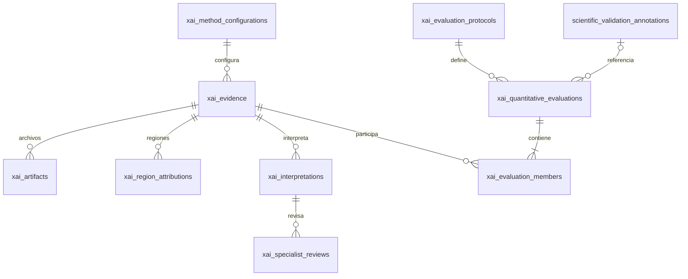

# DBV2.1 — Modelo XAI definitivo propuesto

Una explicación es `xai_evidence`. No se agregan `xai_explanations` ni `xai_error_analysis`. Se reutilizan cinco tablas XAI y se agregan cuatro conceptos que no tenían representación equivalente. El SQL y las fichas contienen todas sus columnas y restricciones.

## Entidades

| Tabla | Acción | Contrato |
|---|---|---|
| xai_method_configurations | NEW | Método extensible, implementación, versión, parámetros, canon y SHA-256 |
| xai_evidence | MODIFY | Una explicación concreta; referencias de contexto y configuración, entrada y checkpoint congelados |
| xai_artifacts | MODIFY | Archivos numéricos/visuales externos con URI, hash y metadatos |
| xai_region_attributions | NEW | Atribuciones por región, superpixel u otra unidad discreta |
| xai_evaluation_protocols | NEW | Nombre/familia de métrica, protocolo, versión, parámetros y hash |
| xai_quantitative_evaluations | MODIFY | Una medición por protocolo y conjunto de miembros, valor nullable y razón |
| xai_evaluation_members | NEW | N:M extensible evaluación–evidencia, sin columnas por algoritmo |
| xai_interpretations | KEEP | Interpretación redactada por autor, limitaciones y supersesión |
| xai_specialist_reviews | KEEP | Revisión de interpretación por especialista, razón y competencia acreditada |



La revisión especialista pertenece a una **interpretación**, no automáticamente a una región ni a una métrica. Se conserva esta relación existente porque registra un juicio humano y su objeto preciso. Una revisión apoyada no se deduce del valor de Agreement.

## Configuraciones e identidad

`method` es una clave en minúsculas no vacía, sin enum cerrado: `gradcam`, `shap`, `lime` y métodos futuros. Implementación y versión son explícitas. `parameters` JSONB contiene parámetros propios del método: target_layer, explainer/background strategy/sample count o segmentation/num_samples/num_features, según corresponda. No se agrega una familia de columnas por algoritmo.

`canonical_configuration` conserva el texto canónico UTF-8 del objeto con exactamente las claves method, implementation, implementation_version y parameters. Contrato del futuro productor: canonización JSON RFC 8785, sin NaN/Infinity, seguida de SHA-256 en hexadecimal minúsculo. Parámetros numéricos que no admitan representación interoperable se expresan como cadenas tipadas por el protocolo. No se reserializa JSONB para reconstruir bytes originales. El trigger verifica igualdad semántica del documento y SHA de sus bytes; la conformidad completa de la serialización canónica debe validarla SW-v2. UNIQUE(configuration_hash) identifica y permite reutilizar la configuración. No se implementa ese productor aquí.

El protocolo aplica la misma convención sobre metric_name, metric_family, protocol_name, protocol_version, parameters, normalization_strategy, perturbation_strategy y reference_definition; los dos últimos pueden ser JSON null. `protocol_hash` es UNIQUE. La FK compuesta `(protocol_id,metric_name)` impide declarar un nombre distinto del protocolo; metric_name en la medición sirve a filtros frecuentes y no es una segunda definición editable.

Las familias previstas son `faithfulness`, `stability`, `sparsity`, `agreement`, `localization`; el dominio no está cerrado a ellas. `concordance` de la candidata se sustituye conceptualmente por `agreement`; no se transforma ningún dato histórico en esta fase. Versionar protocolo distingue variantes y rangos de una misma familia. No se impone [0,1] a todas las métricas: una distancia o correlación puede tener otro rango.

## Explicación individual y contexto

`xai_evidence` conserva input URI/hash/contract, checkpoint FK/hash, clase objetivo, salida explicada, etapa, semilla, commit y snapshot de entorno. `method_configuration_id` sustituye method/method_version/implementation_path/method_configuration/configuration_hash duplicados; la vista recupera sus etiquetas mediante JOIN. `target_layer` registra la capa efectiva cuando corresponde, opcional incluso si existe un selector en parameters. `prediction_score` opcional representa probabilidad de la clase objetivo en [0,1]; no sustituye raw_output ni implica que todas las explicaciones tengan una predicción persistida. `generated_at` distingue producción y `created_at` registro.

`run_id`, `prediction_id`, `cell_prediction_id`, `evaluation_id` y vínculos de generación son opcionales. Se elimina la obligación de pertenecer a exactamente un padre entre explainability_results/cell_explanations/assessment_results: una evidencia nativa no necesita crear una solicitud ficticia; contextos compatibles pueden enlazarla a más de una ruta sin copiar los archivos. Los enlaces presentes siguen siendo FK y pasan las guardas de linaje. Se mantienen UNIQUE de padres existentes para impedir dos evidencias de la misma salida de generación.

`model_version_id` puede ser NULL cuando existe un checkpoint TRAIN antes de registrar la versión. En ese caso `run_id` es obligatorio, identifica su TRAIN y el artefacto debe pertenecer a él con SHA coincidente. Si existe versión, debe coincidir con el checkpoint y hash gobernados. El checkpoint permanece obligatorio: Grad-CAM/SHAP/LIME explican un predictor concreto y el archivo identifica sus pesos; esto no obliga a finalizar o publicar una versión para explicar. Las rutas celular o de predicción que requieren versión continúan comprobándola. No se inventan versiones para satisfacer FK.

El origen efectivo es exactamente uno de dataset_source_record, microscopy_image o input_artifact. Un crop celular usa microscopy_image y su predicción/crop congelado; no se confunde el hash del crop con el del frotis completo. El assessment conserva su FK compuesta `(attempt_id,sample_id)`. SHAP requiere un background manifest URI/hash, con muestras, orden y procedencia definidos por la configuración; no se reconstruye del overlay. Run→experimento/campaña y predicción→clasificación→imagen→frotis conservan relaciones navegables sin repetir experiment_id/campaign_id en cada explicación.

## Artefactos y regiones

`xai_artifacts` conserva evidence_id, role, ordinal, URI, SHA-256 obligatorio, byte_size, MIME, dtype, shape, axis_order, coordinate_space, disponibilidad y created_at. Las referencias a artifacts/assessment_artifacts permiten reutilizar un archivo ya persistido. No se almacena BYTEA ni millones de filas por píxel.

| Rol objetivo | Contenido |
|---|---|
| RAW_ATTRIBUTION | Tensor numérico original |
| SPATIAL_MAP | Proyección espacial numérica, distinguida del tensor original |
| SEGMENTATION | Etiquetas de regiones/superpíxeles |
| REGION_WEIGHTS | Pesos regionales en archivo |
| HEATMAP_RENDER | Representación visual cuantizada |
| OVERLAY | Visualización sobre la imagen |
| BACKGROUND_MANIFEST | Identidad de muestras de referencia |
| INPUT_MANIFEST | Identidad y orden de entradas |

**Visualización != evidencia numérica.** PNG no satisface RAW_ATTRIBUTION por sí mismo. dtype/shape pueden ser NULL en manifiestos y visuales donde no correspondan. SW-v2 debe validar formato real, coordenadas, disponibilidad y correspondencia entre mapa y render; PostgreSQL conserva metadata verificable, no inspecciona archivos. No se exige que toda explicación tenga todos los roles: una ruta histórica puede aportar sólo visualización, sin atribuirle una capacidad cuantitativa inexistente.

`xai_region_attributions` usa PK `(xai_evidence_id,region_type,region_index)`, evitando colisión entre distintas unidades discretas de la misma explicación. Incluye attribution_value finito, rank positivo opcional y region_definition JSONB opcional para geometría/metadatos. Para múltiples segmentaciones científicamente diferentes se generan configuraciones/evidencias distintas o se identifica el tipo/versionado de región; no se mezclan silenciosamente regiones incompatibles. La tabla sirve para consultar unas decenas/centenas de regiones, no para mapas densos.

## Métricas, N:M y congelación

`xai_quantitative_evaluations.metric_value` es nullable y finito si está definido. Si es NULL, `undefined_reason` debe ser no vacía; si hay valor, la razón es NULL. Nunca se transforma una métrica indefinida en 0. `sample_count` cuenta las muestras/perturbaciones efectivamente consideradas y es positivo; no es necesariamente el número de miembros.

PK `(evaluation_id,xai_evidence_id)` en `xai_evaluation_members` permite muchas evidencias por evaluación y muchas evaluaciones por evidencia. `member_role` describe su función (`reference`, `candidate`, `perturbed`, etc.) sin imponer nombres de métodos. Una misma evidencia aparece una vez por medición; los distintos roles deben representar miembros distintos, no inflar artificialmente n.

La pareja evaluación+miembros se inserta en una transacción. El constraint trigger diferido exige al menos un miembro; Agreement exige al menos dos y compara entrada, input contract, clase, salida, etapa y checkpoint con semántica NULL-safe. La compatibilidad metodológica completa, alineamiento y normalización siguen siendo responsabilidad del protocolo/SW-v2, especialmente para Stability con perturbaciones.

`membership_hash` se calcula sobre UTF-8 de líneas `uuid:member_role`, ordenadas por UUID textual con collation C, separadas por LF sin LF final; SHA-256 hexadecimal minúsculo. Los roles sólo permiten `[a-z][a-z0-9_]*`, de modo que no introducen delimitadores ambiguos. El trigger compara el conjunto exacto al COMMIT. Junto con append-only, impide agregar a posteriori miembros a una métrica ya registrada. Repetir un experimento cuantitativo puede crear otra evaluación con otro id aun con igual protocolo/semilla; no se prohíben réplicas científicas con una UNIQUE artificial.

## Localization y validación clínica

Se reutiliza `scientific_validation_annotations`: target_type, cell_detection_id/analysis_run_id/sample_id, autor y versión. Sus annotation_events mantienen historia. No es todavía un editor general de polígonos/ROI. La medición conserva FK a anotación, versión y manifiesto externo congelado URI/hash como unidad completa; el trigger valida la versión al insertar. El manifiesto describe la referencia geométrica experta, su imagen/crop, sistema de coordenadas y autor, cuando exista. Cambiar posteriormente la anotación no reescribe el manifiesto de una medición histórica.

Localization definida exige una referencia completa. Si no existe geometría adecuada, se registra métrica NULL con razón (`reference_not_available`, por ejemplo) o se omite la medición; no se fabrica ROI a partir del texto libre. El futuro productor debe comprobar correspondencia de referencia, versión y coordenadas. No se crea subsistema de anotaciones adicional.

Agreement no escribe ninguna revisión ni decision clínica. `xai_specialist_reviews` sigue ligada a una interpretación humana y a un usuario; ni el CHECK de métrica ni el trigger contienen un umbral de validez clínica.

## TP/TN/FP/FN sin nueva tabla

Para predicciones evaluadas, la clase positiva contractual es 1 = parasitized. `true_class` y `predicted_class` son fuentes relacionales; NULL conserva desconocimiento. El contexto incluye evaluation_id y su threshold_used. Consulta ilustrativa, **no ejecutada**:

```sql
SELECT e.id AS evaluation_id, p.id AS prediction_id, x.id AS evidence_id,
       CASE WHEN p.true_class = 1 AND p.predicted_class = 1 THEN 'TP'
            WHEN p.true_class = 0 AND p.predicted_class = 0 THEN 'TN'
            WHEN p.true_class = 0 AND p.predicted_class = 1 THEN 'FP'
            WHEN p.true_class = 1 AND p.predicted_class = 0 THEN 'FN'
            ELSE NULL END AS error_class,
       e.split, e.threshold_used, mc.method
FROM public.predictions p
JOIN public.evaluations e ON e.id = p.evaluation_id
JOIN public.xai_evidence x ON x.prediction_id = p.id
JOIN public.xai_method_configurations mc ON mc.id=x.method_configuration_id
WHERE x.evaluation_id IS NULL OR x.evaluation_id=e.id;
```

No se usa review_status como ground truth. Las predicciones celulares sin etiqueta experta no tienen TP/TN/FP/FN válidos; se requiere referencia disponible. Las filas de run_image_predictions conservan su finalidad de salida por imagen: no se inventa un vínculo con predictions por coincidencia de filename. SW-v2 deberá persistir los vínculos autoritativos de predicción/evaluación al generar la evidencia. Los conteos clínicos agregados no permiten identificar por sí solos qué imagen fue FN.
