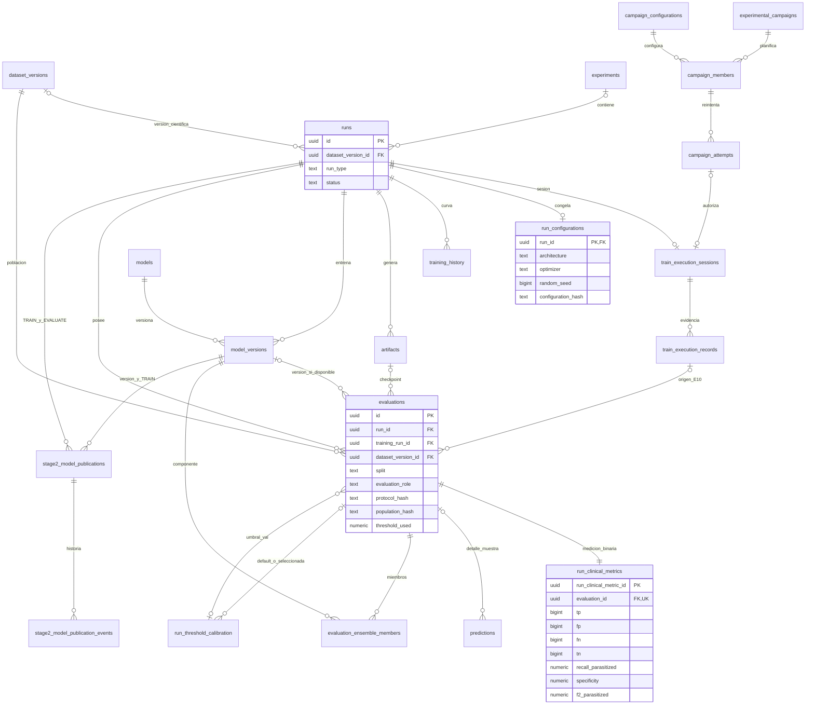
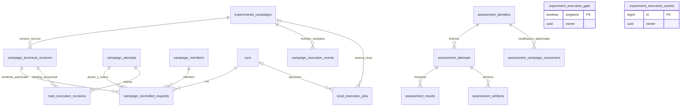
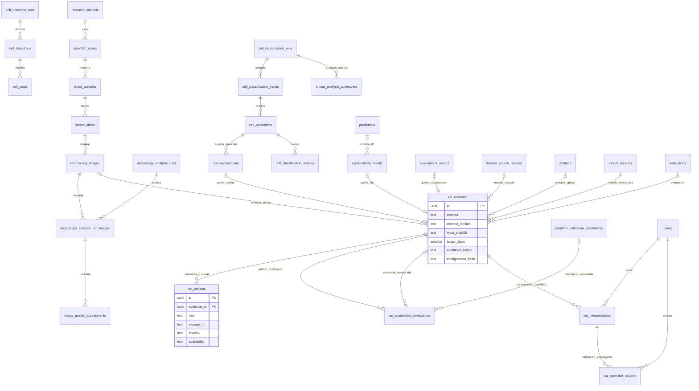

# E10.10.4 — Modelo relacional propuesto
> Actualización E10.10.5A: A-01 fue aprobada por el usuario. La sección final documenta la enmienda; el cuerpo original conserva su contexto histórico. Implementación y límites actuales: [e10_10_5_implementation.md](e10_10_5_implementation.md).

**103 tablas físicas.** Los siguientes diagramas separan dominios para lectura; todos residen en la instancia canónica, schema public. Los nombres son los del DDL. Las FK opcionales tienen cardinalidad 0..1; la existencia de FK por sí sola no garantiza «mínimo un hijo». El DDL añade constraint triggers donde se exige medición o ensemble completo.

## Experimento, evaluación y publicación

`confusion_matrices` y `classification_reports` son **vistas derivadas**, no tablas del ER físico. `run_metrics` queda para extensiones. EVALUATE de publicación conserva su run real; un assessment usa su propia identidad/attempt y puede proyectar al TRAIN propietario sin inventar un run técnico.

## Coordinación preservada

El gate/eventos globales se relacionan por token/guards, no se dibuja una FK inexistente. La definición real de la PK del gate es la del DDL/CSV; la representación conceptual del singleton no autoriza renombrarla. E10 mantiene exclusión global incluso si el job sólo reportó cálculo y aún no confirmó salida.

## Frotis y XAI transversal

XOR: exactamente un padre entre explicación ML/celular/assessment; exactamente un origen entre dataset/microscopy/artifact. En crop el hash es el de entrada efectiva, no el de toda la lámina. Modelo→TRAIN→experimento/campaña y predicción→imagen→muestra/caso se derivan; no se duplican FKs de cada ancestro. Cuatro conceptos separados: evidencia generada, medida cuantitativa, interpretación y validación. Ninguna flecha implica diagnóstico confirmado.

## Índice completo de tablas

El siguiente inventario enumera todas las tablas físicas del destino y su dominio/acción. El CSV sigue siendo el detalle de PK/FK actual y dependencias; el DDL define las FK nuevas. Las vistas no se cuentan como tablas.

| Tabla física objetivo | Acción |
| --- | --- |
| `alembic_version` | KEEP |
| `artifacts` | KEEP |
| `assessment_artifacts` | KEEP |
| `assessment_attempts` | KEEP |
| `assessment_campaign_consumers` | KEEP |
| `assessment_final_locks` | KEEP |
| `assessment_identities` | KEEP |
| `assessment_results` | REFACTOR |
| `audit_events` | KEEP |
| `blood_samples` | KEEP |
| `campaign_attempts` | KEEP |
| `campaign_configurations` | REFACTOR |
| `campaign_controlled_requests` | KEEP |
| `campaign_execution_events` | KEEP |
| `campaign_members` | KEEP |
| `campaign_technical_revisions` | KEEP |
| `cell_classification_events` | KEEP |
| `cell_classification_inputs` | KEEP |
| `cell_classification_reviews` | KEEP |
| `cell_classification_runs` | KEEP |
| `cell_crops` | KEEP |
| `cell_detection_events` | KEEP |
| `cell_detection_runs` | KEEP |
| `cell_detections` | KEEP |
| `cell_explanations` | REFACTOR |
| `cell_predictions` | KEEP |
| `clinical_identities` | PROTECTED |
| `dataset_materialization_activations` | PROTECTED |
| `dataset_materializations` | PROTECTED |
| `dataset_source_records` | PROTECTED |
| `dataset_split_assignments` | PROTECTED |
| `dataset_split_images` | PROTECTED |
| `dataset_split_statistics` | PROTECTED |
| `dataset_split_validation_checks` | PROTECTED |
| `dataset_splits` | PROTECTED |
| `dataset_version_sources` | PROTECTED |
| `dataset_versions` | PROTECTED |
| `datasets` | PROTECTED |
| `deployed_model_versions` | KEEP |
| `environment_packages` | KEEP |
| `errors` | KEEP |
| `execution_logs` | KEEP |
| `experiment_execution_events` | KEEP |
| `experiment_execution_gate` | KEEP |
| `experimental_campaigns` | KEEP |
| `experiments` | KEEP |
| `explainability_results` | REFACTOR |
| `identity_evidence` | PROTECTED |
| `image_analysis_jobs` | KEEP |
| `image_connected_components` | KEEP |
| `image_ingestion_batches` | KEEP |
| `image_quality_assessments` | KEEP |
| `local_execution_jobs` | KEEP |
| `microscopy_analysis_events` | KEEP |
| `microscopy_analysis_run_images` | KEEP |
| `microscopy_analysis_runs` | KEEP |
| `microscopy_images` | KEEP |
| `model_governance_backfill_audit` | KEEP |
| `model_versions` | KEEP |
| `models` | PROTECTED |
| `predictions` | REFACTOR |
| `quality_assessment_queue_items` | KEEP |
| `quality_gate_decisions` | KEEP |
| `research_subjects` | KEEP |
| `roles` | PROTECTED |
| `run_checkpoint_policy` | KEEP |
| `run_clinical_metrics` | REFACTOR |
| `run_dataset_images` | KEEP |
| `run_image_predictions` | KEEP |
| `run_io_records` | KEEP |
| `run_lineage` | KEEP |
| `run_metrics` | REFACTOR |
| `run_model_deployments` | KEEP |
| `run_threshold_calibration` | REFACTOR |
| `runs` | REFACTOR |
| `schema_migrations` | KEEP |
| `scientific_cases` | KEEP |
| `scientific_reviews` | KEEP |
| `scientific_validation_annotation_events` | KEEP |
| `scientific_validation_annotations` | KEEP |
| `scientific_validation_classification_runs` | KEEP |
| `scientific_validation_detection_runs` | KEEP |
| `scientific_validation_images` | KEEP |
| `scientific_validation_sessions` | KEEP |
| `smear_analysis_summaries` | KEEP |
| `smear_slides` | KEEP |
| `stage2_model_publication_events` | KEEP |
| `stage2_model_publications` | REFACTOR |
| `synthetic_data_runs` | KEEP |
| `train_execution_records` | KEEP |
| `train_execution_revisions` | KEEP |
| `train_execution_sessions` | KEEP |
| `training_history` | REFACTOR |
| `user_roles` | PROTECTED |
| `users` | PROTECTED |
| `run_configurations` | NEW |
| `evaluations` | NEW |
| `evaluation_ensemble_members` | NEW |
| `xai_evidence` | NEW |
| `xai_artifacts` | NEW |
| `xai_quantitative_evaluations` | NEW |
| `xai_interpretations` | NEW |
| `xai_specialist_reviews` | NEW |

## Enmienda A-01 aprobada — 2026-09-29

**A-01 RESUELTA POR DECISIÓN ARQUITECTÓNICA — E10.10.5A PUEDE REANUDARSE.** Autorización explícita del usuario, limitada a diseño, baseline y validación estática; no autoriza B ni cutover. El texto anterior conserva la decisión original. Sus hashes y la definición original de evaluations están en [e10_10_5a_design_before_a01.json](e10_10_5a_design_before_a01.json); el bloqueo original se conserva en [e10_10_5a_initial_block.md](e10_10_5a_initial_block.md).

- `evaluations.split` admite `external` además de los tres splits oficiales. `external_validation` permanece intacto en el dataset protegido; no se crea un alias ni mapping automático.
- Ámbito (`split`), población (`population_hash` y manifiesto), origen (`dataset_origin_id`, `dataset_origin_role` y evidencia de procedencia), protocolo (`protocol_hash/version/snapshot`) y finalidad (`purpose`) son conceptos independientes.
- External exige `purpose=complementary`, `evaluation_role=external_complementary`, manifiestos de población/procedencia recuperables con SHA-256 y FK a la PK existente `(dataset_version_id,dataset_id,role)` del origen registrado en `dataset_version_sources`, sin añadir UNIQUE al dominio protegido. La versión evaluada puede diferir de la versión de entrenamiento; se conserva íntegro el linaje TRAIN/checkpoint/modelo. No se crean versiones ni fuentes ficticias para completar esa FK.
- `source_kind=external_record` identifica nuevas entradas externas; `legacy` permite adopción con evidencia suficiente. No se hace pasar una entrada externa por evento E10 ni por assessment cuyo contrato actual sólo admite splits oficiales.
- Se prohíbe usar external como calibración, selección de checkpoint/modelo, VALIDATION sustitutiva o agregado TEST oficial. Los roles y la finalidad lo impiden en evaluations, el par de calibración exige val, y `vw_v2_model_comparison` sólo contiene train/val/test. `vw_v2_external_evidence` expone evidencia complementaria sin agregación, con población, protocolo y procedencia. El catálogo pasa de 32 a **33 vistas**; mantiene **103 tablas**.
- `run_clinical_metrics.split_name` sigue representando `external`; su trigger lo deriva de la evaluación externa trazada. Se conservan el lector/escritor legacy en la aplicación operativa. Adaptar esos escritores al contrato transaccional v2 corresponde a E10.10.5E: esta enmienda no afirma compatibilidad binaria de INSERT antiguos que carezcan de evaluation_id.
- La existencia de un URI/hash no certifica disponibilidad o validez científica del manifiesto. La adopción abortará sin mapping si falta evidencia; los servicios deben verificar procedencia y políticas de selección. No se modifican imágenes, asignaciones ni hashes históricos.
