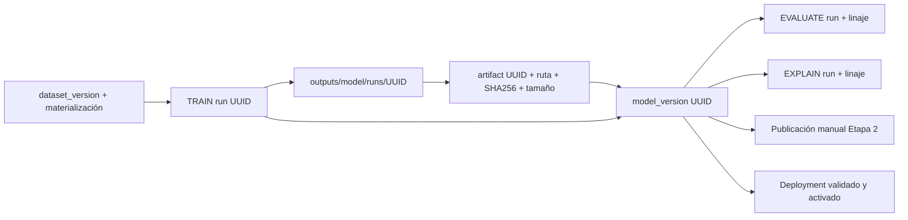

# Etapa 0A — Línea base del pipeline de modelos

Fecha: 2026-09-10. Dictamen: **APROBADA CON OBSERVACIONES**.

El dictamen califica la auditoría documental y su cobertura; no certifica ausencia de defectos, reproducibilidad bit a bit ni aptitud clínica. No se autoriza ni implementa la siguiente etapa.

## A. Identidad, alcance y método

- Revisión: `31348bf87f300e95872b86b9f20c41e97d26d66c`, rama `main`.
- Árbol inicial: sin diferencias de archivos versionados; un archivo no seguido preexistente: `docs/engineering/model_training_decoupling_design_2026-09-09.md`. No se modificó ni se tomó como implementación aprobada.
- Cambio concurrente observado al cierre: HEAD pasó a `d964cbfb8ee321fa7812d9a598fa949769faaef8` (incorporación del documento de diseño preexistente). `git diff --name-status 31348bf87f300e95872b86b9f20c41e97d26d66c HEAD` muestra exclusivamente ese documento añadido; no cambió el código auditado. El agente no hizo commits. Estado final: únicamente este informe sin seguimiento.
- Evidencia de identidad: `git rev-parse HEAD`, `git branch --show-current`, `git status --short`, `git diff --stat`.
- No se encontraron `AGENTS.md` en el repositorio ni en los ancestros inspeccionados. Se leyó el contrato `docs/engineering/postgresql_docker_single_instance.md`: instancia Compose `db`, puerto 5432, sin BD alternativa. Su aplicación en código está en `persistence/database.py:17–48`, `normalize_database_url`.
- Inspección estática de entrypoints, llamadas, constructores, SQL, servicios y consumidores. Se ejecutaron ocho pruebas existentes aisladas, sin entrenamiento ni acceso a BD, y un inventario agregado de archivos locales. No se ejecutaron migraciones, seeds, split, calibración, evaluación ni explicación operativas; no se instalaron dependencias ni se levantaron servicios.
- Documentos previos como `docs/engineering/model_training_pipeline.md`, `docs/audits/training_coupling_map_2026-09-09.md` e informes históricos son contexto, no evidencia de la BD actual. Los requisitos de registro único, dataset explícito y adaptadores son objetivos futuros.
- La única escritura en el repositorio de esta etapa es este informe nuevo. El caché de Matplotlib de la prueba se dirigió a `/private/tmp/etapa0a-mpl`; cachés generales a `/private/tmp/etapa0a-cache`; bytecode deshabilitado.

### Convención de referencias y verificación

Salvo indicación contraria, rutas como `training/trainer.py` son relativas a `malaria_dl_local_project/src/malaria_dl/`. `src/...`, `tests/...` y scripts `run_*` son relativos a `malaria_dl_local_project/`. Los números corresponden al árbol auditado. Las referencias identifican archivo, símbolo y líneas; los intervalos son de lectura, no cobertura de pruebas.

**E** = comprobación estática directa; **T** = prueba aislada ejecutada; **L** = lectura del filesystem actual; **NV** = estado operativo no verificado. Una afirmación E sobre una guarda no significa que haya sido aplicada con éxito a registros actuales.

## B. Mapa real de ejecución

| Entrada | Implementación y llamadas efectivas | Contrato observado / evidencia |
|---|---|---|
| `python -m src.train` | Adaptador → `training.trainer.main` → resolver dataset → loaders → constructores → callbacks/fit → calibración opcional → TEST opcional → snapshots/tracking/finalización | `src/train.py:1–10`; `training/trainer.py:1197–1259,1404–1568,1708–1827,2043–2049,2130–2450`. No es el registro quien construye. |
| `run_train_all_models.py` | Producto modelo × optimizador; subprocess `-m src.train`; secuencial, detiene al primer error salvo `--continue-on-error` | `build_train_command:71–115`, `main:161–207`. `--dry-run` sólo imprime; éxito significa códigos de salida cero. No hay identificador persistido de campaña en este script. |
| `python -m src.evaluate` | Adaptador → `evaluation.evaluator.main` → ModelVersionResolver → herencia dataset → cargar modelo → TEST → persistir métricas/linaje | `src/evaluate.py:1–8`; `evaluation/evaluator.py:195–245,291–426`. |
| `run_evaluate_all_trainings.py` | Inventario SQL de TRAIN completed y model_versions; selección de versión reciente por TRAIN; exclusiones por elegibilidad; subprocess con UUID versión y TRAIN | `fetch_training_inventory:68–148`, `build_evaluate_command:189–208`, `main:227–280`. Filtro de dataset opcional. |
| `python -m src.explain` | Adaptador → `explainability.pipeline.main`; resolver versión/dataset; cargar TRAIN y TEST; seleccionar casos TEST; LIME/SHAP/Grad-CAM; guardar y registrar | `src/explain.py`; `explainability/cli.py:1–6` es otra entrada, no otro motor; `pipeline.py:1240–1404,1410–1590`. TRAIN sirve de background; no confundirlo con evaluación final. |
| `run_explain_all_trainings.py` | Inventario equivalente a EVALUATE, subprocess con `--require-lineage` | `fetch_training_inventory:68–148`, `build_explain_command:189–213`, `main:233–292`. No asigna salida por ejecución. |
| `python -m src.calibrate` | Adaptador → `evaluation.calibration_cli.main`; threshold o temperature_scaling; escribe JSON y puede actualizar metadatos/tracking | `calibration_cli.py:30–90,406–507`; `threshold_calibration.py:54–60,154–279`; `probability_calibration.py:92–145`. Ruta separada de TRAIN. |
| `python -m src.ensemble` | Adaptador → `inference.ensemble.main`; carga modelos Keras y promedia scores con pesos; evalúa TEST | `inference/ensemble.py:29–70,87–209`. No es arquitectura entrenada por la campaña. |
| `python -m src.svm_features` | CNN como extractor → SVC RBF con probabilidades → TEST → joblib | `feature_engineering/svm_features.py:95–175`. Sí entrena un estimador, pero fuera del motor TRAIN y de MODEL_REGISTRY. |
| Preparar versión/release | Finalizador TRAIN y `PrepareModelReleaseService`; utilitario `create_release` para copia física | `governance/services/training_model_version_finalizer.py:67–250`; `prepare_release_service.py`, `_load_context:121–410`, `prepare_release:789–815`; `governance/releases.py:123–173`. Preparar no activa un deployment. |
| Publicar Etapa 2 / desplegar | `Stage2PublicationService.publish`; API governance; `ModelDeploymentService.create/activate`; CLI `scripts/deploy_model_version.py:10–20` | `governance/services/stage2_publication_service.py:100–183`; `deployment_service.py:51–81` valida activación. Son contratos distintos. |

El inventario masivo usa `DISTINCT ON` y `ORDER BY r.id, mv.created_at DESC` (`run_evaluate_all_trainings.py:73–113`, equivalente EXPLAIN): una versión reciente por entrenamiento, no todas las versiones. No hay desempate de fecha por UUID allí. El resolver individual por TRAIN, en cambio, exige exactamente una versión utilizable, aunque ordene por número (`model_version_resolver.py:44–53`). No equiparar ambas selecciones.

### API y frontend

`backend_api/app/routes/governance.py:156–175,203–218,304–336,387–389` expone preparación, publicación Etapa 2, publicación técnica y producción. `frontend/src/services/api.ts:1067–1237` consume estos endpoints. `frontend/src/pages/Runs.tsx:240–269` publica la versión elegida; `Stage2ReleaseDetail.tsx:40–83` presenta confirmación; `components/reports/Stage2PublicationPanel.tsx:19–29,62–77` permite publicar/reemplazar manualmente. No se encontró selección automática del ganador en el bucle de campaña (`run_train_all_models.py:179–207`).

`Stage2PublicationService._eligibility` exige TRAIN y EVALUATE completados (`stage2_publication_service.py:57–71`); esto no constituye un umbral clínico. Esta selección usa locks y control de reemplazo (`:100–148`), y no invoca por sí misma la validación de activación del otro servicio. El deployment tiene su propia validación de estado, evaluación formal, perfil de threshold, linaje, contrato, carga del modelo y hash (`deployment_service.py:51–81`). Mantener separadas finalización técnica, elegibilidad, revisión manual y evidencia clínica.

La publicación técnica utiliza `Stage2ModelAvailabilityService`, configurado por `backend_api/app/routes/governance.py:113–123` con environment production/alias champion. Su flujo prepara un paquete, exige calibración registrada, escribe manifest/threshold/checksums, ejecuta smoke técnico y activa sólo con PASS (`governance/services/stage2_availability_service.py:230–321,330–375`). El smoke no es validación clínica. La preparación de release además bloquea evaluación colapsada y ausencia de threshold evaluado en TEST (`prepare_release_service.py:560–575`). Estas guardas no deben atribuirse indiscriminadamente al servicio de selección manual Etapa 2.

## C. Configuración efectiva por arquitectura y optimizador

Estas tablas describen lo que resolvería el código con las entradas indicadas, **no los valores de una ejecución histórica**. Todos los modelos CNN del motor usan salida sigmoid de clase 1 parasitized, binary crossentropy y las métricas compiladas en `models/architectures.py`, `compile_binary_model:166–186`. Las firmas siguientes se inspeccionaron en ese archivo.

| Arquitectura / constructor | Firma y retorno | Motor individual sin overrides | Campaña sin overrides | Preprocesamiento / regularización |
|---|---|---|---|---|
| custom_cnn / `build_custom_cnn` | `(input_shape=(200,200,3), learning_rate=1e-4, optimizer_name='adam', l2_weight=1e-4)` → Model compilado | 50 épocas máximas base; fine tuning 0 | 100 base; 0 FT; weights none | auto → [0,1]; bloques 32/64/128/256 con BN; L2 en conv/dense; dense128, dropout .4. `architectures.py:203–243`. |
| vgg16 / `build_vgg16_transfer` | `(input_shape=(200,200,3), learning_rate=1e-4, optimizer_name='adam', trainable_backbone=False, weights='imagenet')` → `(model, base_model)` | 30 base; 0 FT; ImageNet | 100 base + hasta 20 FT; ImageNet | auto también [0,1]; `vgg16_imagenet` requiere elección explícita; GAP, dense1024, dropout .5; backbone congelado en base. `architectures.py:246–285`. |
| densenet121 / `build_densenet121_transfer` | Igual firma transfer + `dropout_rate=.5` → `(model, base_model)` | 30 base; 0 FT; ImageNet | 100 base + hasta 20 FT; ImageNet | [0,1] externo + Normalization ImageNet interna; GAP/dropout .5; llamada backbone `training=False`. `architectures.py:288–336`. |

Líneas de soporte comunes: `training/trainer.py:73–120,286–337,1468–1568`; campaña `:46–115,141–147`. En FT se descongelan las últimas **cuatro capas**, no cuatro bloques; se recompila creando otro optimizador (`trainer.py:1537–1544`, `architectures.py`, `unfreeze_last_layers`). En DenseNet, `training=False` es independiente de `layer.trainable`: no prueba por sí solo ausencia de gradientes; sí fija comportamiento de inferencia para capas sensibles a esa bandera. No se verificó numéricamente FT.

| Optimizador | LR inicial individual / FT solicitado sin LR | LR campaña base / FT | Construcción |
|---|---|---|---|
| Adam | 1e-4 / 1e-5 | 1e-4 / 1e-5 | `Adam(learning_rate=...)` |
| AdamW | 1e-4 / 1e-5 | 1e-4 / 1e-5 | `AdamW(learning_rate=...)`; error si no existe en Keras |
| SGD | 1e-4 / 1e-5 | 1e-3 / 1e-4 | momentum=.9 |
| Adadelta | 1e-4 / 1e-5 | 1.0 / 1.0 | resto de parámetros por defaults de la biblioteca |

`models/architectures.py:150–163`, `trainer.py:1254–1259`, `run_train_all_models.py:46–57`. FT no se ejecuta por declarar un LR: requiere backbone y épocas >0. AdamW no fija explícitamente weight_decay; no atribuirle un valor numérico sin conocer la versión efectiva de Keras. ReduceLROnPlateau está activo por fase: val_loss, factor .5, patience4, min_lr1e-6 (`trainer.py:375–422`); LR inicial no equivale a toda la trayectoria. Hay historial por época y por fase (`write_combined_training_history:509–645`).

### Descubrimiento, validación y precedencias

- `MODEL_REGISTRY` contiene tres constructores (`models/registry.py:1–12`). Búsqueda `rg -n MODEL_REGISTRY --glob '*.py'` sólo encontró definición/exportación: no lo consume el motor ni la campaña. Cambiarlo no basta. También hay listas/choices, defaults por modelo, ramas constructoras, parámetros FT y nomenclatura de tracking (`trainer.py:73–84,1472–1492`; campaña `:27–28,60–68,127–139`; `persistence/tracking.py:433–500`).
- La CLI rechaza nombres/opciones desconocidas por argparse y valida valores básicos, incompatibilidad DenseNet/VGG preprocessing y FT en custom (`trainer.py:286–337`). `ModelExecutionConfig` sólo valida execution_type (`src/model_execution_config.py:8–37`): no es un esquema específico por arquitectura. `CheckpointPolicyConfig.__post_init__` convierte tipos y valida nombre, pero no rangos numéricos (`checkpoint_policy.py:39–55`).
- `--max-epochs` > `--epochs` > default por modelo. CLI LR explícito > fallback común. TRAIN resuelve dataset y **sobrescribe** data_source/dataset_dir con physical y raíz gobernada, incluso si fueron declarados (`trainer.py:1197–1202`).
- `auto` es siempre rescale_0_1; la función de recomendación VGG16 es distinta (`data/preprocessing.py:25–44`). No asumir que recomendar equivale a aplicar. Augmentation activa salvo `--no-augment`; flip, rotación .07, traslación .2, zoom .2 y contraste .3 (`data/loaders.py:512–526`).
- EVALUATE/EXPLAIN priorizan preprocessing de la versión resuelta; en modo estricto rechazan override incompatible (`evaluator.py:226–229`, `explainability/pipeline.py:1278–1281`). img_size sigue llegando de argumentos; la campaña lo recupera del inventario. No inferir validación completa de input_signature sólo por persistirla.
- Se guardan configuración resuelta, argumentos, semilla, optimizador, augmentation, pesos iniciales, fases, monitor, rutas y dataset (`trainer.py:1260–1319`, `persistence/tracking.py:504–675`). Los defaults internos L2/dropout/últimas cuatro capas/momentum/parámetros omitidos del optimizador no forman un esquema completo de parámetros efectivos en ese dict; parte vive en código/modelo serializado. `pretrained_weights=none` sí corrige metadata de tracking (`tracking.py:610–616`).
- `set_random_seed(args.seed)` existe (`trainer.py:1404`); no basta para prometer identidad numérica entre hardware/versiones. La SVM paralela usa `SVC(... probability=True)` sin random_state explícito (`svm_features.py:155–157`).

## Contrato del dataset y selección clínica

### Dataset

TRAIN individual y campaña permiten omitir UUID (`trainer.py:277–280`, campaña `:147`). `resolve_governed_dataset` elige el primer trainable, ordenado por frozen_at/id; materialización READY/PASS por attempt_number/completed_at/id (`data/governed_dataset.py:53–111`). En una campaña sin UUID cada subprocess resuelve por separado: existe riesgo de datasets distintos si cambia el inventario entre runs.

La trainability exige FROZEN y doce checks bloqueantes PASS vigentes, incluyendo solapamientos, cobertura, conteos y presencia de clases; exige freeze_contract versión `malaria_patient_split_freeze_v1`, cuatro fingerprints y coincidencia de materialization_id; abre `PROJECT_ROOT/data/relative_root` (`governed_dataset.py:15–21,53–137`). Verifica presencia de fingerprints; **no recalcula el contenido de todas las imágenes** al consumir. Loader comprueba estructura, etiquetas y conteos; si falta metadata.json en modo gobernado genera metadata en memoria a partir de conteos (`loaders.py:103–189`). Eso no demuestra integridad byte a byte contra el manifiesto congelado.

`resolve_training_run_dataset` lee dataset_version_id del TRAIN; si es NULL devuelve None y, si existe, vuelve a resolver su trainability actual (`governed_dataset.py:146–163`). EVALUATE y EXPLAIN heredan raíz/UUID y rechazan discrepancia **cuando el TRAIN es gobernado** (`evaluator.py:207–221`, `pipeline.py:1255–1270`). Para histórico NULL permanece la ruta física/TFDS indicada/default; el UUID proporcionado no dispara esa rama ni demuestra herencia. `assert_run_dataset_snapshot_unchanged` existe (`:140–143`), pero esos entrypoints no comparan un snapshot completo persistido con el actual: heredan mediante versión y re-resolución.

El loader mantiene rutas físicas legacy y TFDS explícito (`loaders.py:238–254,290–338`). No son fallback automático de TRAIN gobernado. Calibración standalone, ensemble y SVM conservan consumo por ruta/data_source sin el resolver gobernado (`calibration_cli.py:406–450`, `ensemble.py:87–159`, `svm_features.py:95–143`).

El proyecto split es independiente. Sus constantes de 27.558 registros/201 pacientes (`malaria_dataset_split_project/src/malaria_split/persistence/bootstrap.py:27–28`), ratios .8/.1/.1 (`splitting/objective.py:9`) y semilla42 (`splitting/patient_group_stratified_v1.py:13`) afectan generación/validación upstream. El consumidor ML consulta checks ya persistidos, no ejecuta bootstrap/split. `formal_validation.py:136–137` compara conteos con 27.558: dependencia indirecta del contrato actual, no motivo para borrar constantes ni regenerar el dataset. El catálogo legacy de tracking también conserva total_images=27558 (`persistence/tracking.py:589–600`), distinto del snapshot gobernado por run.

### Checkpoint, Early Stopping, F2 y TEST

- Default individual: auc_with_min_recall=.98, threshold=.5, beta2, filtro colapso con fracción .05 (`checkpoint_policy.py:39–46`). Monitor explícito prevalece sobre política; incluso checkpoint_mode=min activa selección escalar (`trainer.py:347–351,1222–1248`). Campaña fuerza val_f2_parasitized/max tanto en checkpoint como ES (`run_train_all_models.py:98–107`), por lo que no aplica la restricción mínima de recall como condición de selección.
- ES usa internamente val_early_stopping_score/max, normalizando objetivos min/max y penalizando colapso (`checkpoint_policy.py:98–123`, `trainer.py:1515–1567`). No confundirlo con el nombre externo persistido. Checkpoint se comparte entre fases; los callbacks ES se reconstruyen por fase.
- Para auc_with_min_recall, si hay candidatos elegibles se maximiza AUC con desempates; si no, se elige mejor recall y policy_satisfied=False (`checkpoint_policy.py:370–417`). Si todas las épocas colapsan, se vuelven a admitir con warning (`:269–292`). La ruta explícita no aplica min_recall y usa el default policy_satisfied=True del resultado (`:223–240,420–453`): no interpretar ese booleano aislado como cumplimiento de recall o ausencia de colapso.
- F2 por época se calcula en Python con predicciones VAL, `ClinicalValidationMetricsCallback.on_epoch_end` (`checkpoint_policy.py:519–547`) → `compute_clinical_metrics` → sklearn fbeta_score **beta fijo 2.0** (`clinical_metrics.py:317–324`). El `--beta` configurable viaja a política/calibración, pero no modifica ese F2 por época. Debe documentarse su alcance.
- TRAIN carga train/val con include_test=False (`trainer.py:1410–1419`); aún valida estructura/conteos de las tres particiones mediante loader. Tras seleccionar, carga best_model.keras; si falta, falla y no lo sustituye por final_model (`:1708–1717`). Calibra sobre VAL y sólo después predice TEST (`:1734–1805`). La lectura de directorios/conteos TEST no es predicción ni selección con sus métricas.
- TEST final está habilitado por defecto y en campaña; `--skip-final-test-evaluation` prevalece (`trainer.py:242–251,307–308`). “Una vez” es por TRAIN; EVALUATE y su campaña lo vuelven a consultar. Comparar repetidamente modelos con TEST puede convertirlo en señal de selección humana: riesgo de protocolo, no prueba de leakage en fit.
- Calibración de threshold busca satisfacer recall y prioriza candidatos por especificidad y desempates; conserva warning/fallback (`threshold_calibration.py:126–263`). Rechaza split TEST (`:54–60`). Temperature scaling minimiza NLL en VAL (`probability_calibration.py:92–145`). No son lo mismo ni la calibración de temperatura se aplica automáticamente en TRAIN.
- EVALUATE/EXPLAIN individuales default threshold=.5; modo clinical lee metadata junto al checkpoint y rechaza ausencia de calibración clínica; valor numérico toma prioridad (`evaluator.py:31–35`, `pipeline.py:101–105`, `src/model_metadata.py:181–246`). No asumir que heredar dataset equivale a heredar automáticamente threshold.
- No hay class_weight ni sample_weight en ninguno de los dos fit del motor; la loss compilada es BCE, no focal (`trainer.py:1528–1533,1563–1568`, `architectures.py:166–186`). Soporte sample_weight en las métricas (`architectures.py:34–55,95–116`) no demuestra entrenamiento ponderado. Los datasets retornan pares imagen/etiqueta (`loaders.py`, preprocess y load_physical_split), no una tercera componente de pesos.
- Ensemble normaliza pesos por su suma sin validar aquí positividad o suma no nula; aplica un preprocessing externo común a todos (`ensemble.py:145–179`). Requiere metadata explícita del ensemble para threshold clinical (`:72–84`). No prueba compatibilidad entre datasets de los miembros.

## D. Persistencia, artefactos y comparación



El diagrama representa relaciones de código, no registros consultados en la BD actual.

| Objeto | Persistencia y resolución | Mutabilidad / interrupciones |
|---|---|---|
| TRAIN | UUID inicial; con tracking, snapshot usa run UUID (`trainer.py:818–822`); parámetros y runtime en runs; historia, métricas y predicciones mediante tracking (`persistence/tracking.py:504–675,878–1183`) | `outputs/<model>` es alias mutable, también entre optimizadores. Lock exclusivo y respaldo/restauración de latest (`trainer.py:1050–1142,2555–2561`). Una terminación abrupta no equivale a recuperación verificada. |
| Snapshot TRAIN | `snapshot_execution_artifacts` crea `runs/<id>` con exist_ok=False, copia archivos y rechaza nombres ambiguos (`trainer.py:783–815`) | Inmutable por convención y rechazo de directorio existente; no almacenamiento WORM. No hay transacción única que abarque filesystem y PostgreSQL. |
| Checkpoint / versión | `log_model_version` y finalizador; éste exige un checkpoint registrado, comprueba SHA256/tamaño, completa contrato/linaje y transiciona discovered→candidate (`trainer.py:2168–2195,2441–2449`; `training_model_version_finalizer.py:95–250`) | Versión gobernada ya resuelta puede reutilizarse; ambigüedad de artefactos se rechaza. No deducir ausencia porque no esté en releases. |
| EVALUATE | Resuelve UUID o coincidencia exacta ruta/hash; valida pertenencia TRAIN y hash (`model_version_resolver.py:44–90`); servicio de linaje exige un padre directo y ownership (`evaluation_training_lineage_service.py`, `_GET_DIRECT_LINEAGES`, clases Conflict/Cardinality/Ownership) | Salida `checkpoint.parent/evaluation`, nombres por stem (`evaluator.py:304,386–397`): reevaluar el mismo checkpoint reutiliza archivos aun con distinto run/threshold. Un padre por EVALUATE no significa un EVALUATE por TRAIN. |
| EXPLAIN | UUID versión/TRAIN, opcional evaluation_run_id; outputs registrados (`pipeline.py:1240–1254,1467–1590`) | Default `outputs/explainability` (`:112`), resumen fijo sobrescrito (`:1146–1148`), imágenes por caso/probabilidad (`:689–699`); campaña no pasa output-dir (`run_explain_all_trainings.py:189–213`). Puede mezclar archivos y perder resumen anterior. |
| Release físico | `create_release` copia a modelo/UUID, verifica hash y escribe manifest/model card/checksums (`governance/releases.py:123–173`) | Rechaza destino existente; elimina sólo release parcial propio al fallar. Utilidad inspeccionada, no ejecutada. |
| Preparación/publicación | Preparación prefiere checkpoint referenciado por versión o único snapshot; busca evaluación completada asociada; publicación registra TRAIN/EVALUATE/checkpoint y eventos (`prepare_release_service.py`, `_load_context`; `stage2_publication_service.py:23–54,100–183,225–239`) | Algunas selecciones por fecha: status_for_training elige versión reciente (`:88–98`), publicación anterior activa/reemplazo bajo locks (`:114–183`). No se verificó concurrencia real. |

Disponibles para comparar, según código: parámetros resueltos/argumentos, semilla, versiones de runtime, épocas y LR, política/monitor, threshold, metadata dataset, best/final model, historia CSV, predicciones y métricas TEST cuando habilitado, summaries y linaje (`trainer.py:1280–1319,1930–2049,2130–2430`; `persistence/run_repository.py:93–150`). No asumir completitud universal de registros históricos ni de errores absorbidos por safe_track (`run_repository.py:154–160`).

**Inventario local actual L:** mediante `Path.rglob`, lectura JSON y `Path.is_file`, sin leer imágenes ni exportar identificadores: 39 archivos `model_execution_summary.json`; 36 contienen best_checkpoint_path, las 36 rutas existen; 0 referencias no resueltas en ese campo; 80 archivos `.keras` bajo outputs. Hay aliases y snapshots: estos conteos **no** son 39 TRAIN distintos ni 80 modelos únicos. No se calcularon hashes de esos 80 archivos, no se cargaron con Keras ni se contrastaron con artifacts/model_versions. Los otros tres summaries no permiten inferir un checkpoint faltante. Las referencias registradas en BD quedan NV.

## E. Línea base de pruebas y acceso operativo

Se inspeccionaron completos los dos archivos de pruebas masivas antes de ejecutarlos: sólo construyen comandos, mockean `src.db.get_database_url` y leen código local. Se inspeccionó completa la prueba de argumentos TRAIN: sólo parse_args, sin llamar main/fit. Se inspeccionaron adaptadores e imports; se deshabilitó bytecode y se redirigieron cachés para la importación de TensorFlow/Matplotlib. No se agregaron pruebas funcionales.

Directorio de ejecución: `malaria_dl_local_project`.

```sh
PYTHONDONTWRITEBYTECODE=1 .venv/bin/python -B -m unittest discover -s tests -p 'test_run_*_all_trainings.py' -v
```

Resultado: **5/5 OK**, exit0, 0.148 s reportados por unittest. Verifica construcción de comandos con versión/TRAIN/dataset y loader DB mockeado; una prueba sólo comprueba texto fuente. No verifica que PostgreSQL acepte esos comandos ni que los UUID existan.

```sh
PYTHONDONTWRITEBYTECODE=1 MPLCONFIGDIR=/private/tmp/etapa0a-mpl XDG_CACHE_HOME=/private/tmp/etapa0a-cache .venv/bin/python -B -m unittest discover -s tests -p 'test_train_checkpoint_policy_args.py' -v
```

Resultado: **3/3 OK**, exit0, 0.002 s de pruebas (excluye imports). Comprueba default de política, aceptación beta2.5 y allow-collapsed. Mensajes de entorno: construcción de font cache temporal y ausencia de GPU soportada; no son fallos del producto ni evidencia de entrenamiento fallido. Ningún fallo previo o dependencia ausente observado en estas ocho pruebas.

Suites relevantes identificadas y **no ejecutadas**: `test_checkpoint_policy.py`, `test_early_stopping_policy.py`, `test_governed_dataset_contract.py`, `test_densenet_model.py`, `test_model_execution_config.py`, `test_training_model_version_finalizer.py`, `test_model_version_resolver.py`, `test_evaluate_lineage_tracking.py`, `test_explain_lineage_tracking.py`, `test_threshold_calibration.py`, `test_calibration.py`, `test_training_release_postgres.py`, `test_evaluation_training_lineage_postgres.py`, `test_train_integration.py`. Su presencia no cuenta como aprobación. Se evitó suite completa porque no se garantizó aislamiento de todas sus escrituras/imports, y esta etapa prohíbe entrenamiento incluso de smoke test operativo.

Acceso opcional: `docker compose ps --status running --services` devolvió exit1, denegación de acceso al socket Docker. No se escaló ni se cambió la conexión; no se usó localhost/otra BD ni se arrancó servicio. No se ejecutó SQL. Por tanto, esquema instalado, conteos, versiones entrenables, asociaciones, publicaciones activas e integridad registrada están **NO VERIFICADOS**. Esto es una restricción del entorno de auditoría, no una prueba de caída de PostgreSQL. Una futura lectura operativa debe usar la instancia autorizada y transacción explícita READ ONLY; no usar funciones de servicios con locks/escrituras como si fueran consultas inocuas.

## F. Registro de hallazgos

Las etapas futuras se nombran por objetivo; no se asigna numeración posterior no aprobada. Prioridad P1 = atender al diseñar los contratos; P2 = reproducibilidad/operación; P3 = claridad documental.

| ID / prioridad | Clasificación | Evidencia (archivo, símbolo, líneas) | Impacto | Etapa futura | Verificación |
|---|---|---|---|---|---|
| 0A-01 / P1 | Comportamiento comprobado | `trainer.py`, parse_args:277–280; `governed_dataset.py`, resolve:93–111; campaña:147 | UUID opcional/última entrenable: campaña puede resolver distinto dataset por run. Brecha respecto del requisito futuro, no defecto atribuido a un contrato ya implementado. | Dataset explícito | E; BD NV |
| 0A-02 / P1 | Comportamiento comprobado | `models/registry.py:1–12`; `trainer.py:84,1472–1492`; campaña:27–28,127–139 | Registro sin consumidores; agregar entrada no habilita entrenamiento/campaña. | Registro/adaptadores | E, búsqueda global |
| 0A-03 / P1 | Defecto confirmado | `explainability/pipeline.py`, parse_args:112, write_summary:1146–1148; campaña build_explain_command:189–213 | EXPLAIN masivo reutiliza resumen y directorio sin identidad del run; no conserva cada resultado como archivo independiente. | Artefactos por ejecución | E; no se provocó sobrescritura |
| 0A-04 / P1 | Riesgo potencial | `evaluation/evaluator.py`, main:304,386–397 | Reevaluaciones de igual checkpoint pueden sobrescribir artefactos referidos por runs anteriores. | Artefactos/reintentos | E; ocurrencia histórica NV |
| 0A-05 / P1 | Comportamiento comprobado | `governed_dataset.py`, resolve_training_run_dataset:146–163; evaluator:207–221; pipeline:1255–1270 | Herencia/rechazo implementados para TRAIN gobernado; histórico NULL conserva ruta legacy. | Contrato histórico/dataset | E; comandos T |
| 0A-06 / P1 | Riesgo potencial | `governed_dataset.py:114–137`; `loaders.py:103–189` | Fingerprints presentes y conteos no detectan por sí solos sustitución de bytes conservando cardinalidad. | Integridad al consumir | E; integridad actual NV |
| 0A-07 / P1 | Comportamiento comprobado | campaña:98–107; `trainer.py:1222–1248`; `checkpoint_policy.py:420–453` | F2 explícito prevalece, no impone recall mínimo; policy_satisfied aislado puede malinterpretarse. | Selección/métricas | E; parse defaults T |
| 0A-08 / P1 | Comportamiento comprobado | `checkpoint_policy.py:269–292,404–417`; `stage2_publication_service.py:57–71` | Fallback técnico conserva resultados degradados; completed/eligible no demuestra cumplimiento clínico. | Guardas/reportes/manual | E |
| 0A-09 / P2 | Riesgo potencial | `trainer.py:242–251,1799–1815`; evaluator:291–310 | Consulta TEST por cada TRAIN más EVALUATE; uso reiterado para elegir modelo comprometería evaluación final independiente. | Protocolo comparación | E; uso humano NV |
| 0A-10 / P2 | Mejora propuesta | `src/model_execution_config.py:8–37`; architectures constructores; trainer:1280–1319 | Consolidar configuración validada/efectiva incluyendo regularización, capas y defaults biblioteca; serialización actual parcial respecto de ese objetivo. | Configuración/adaptadores | E |
| 0A-11 / P2 | Comportamiento comprobado | `data/preprocessing.py:25–44`; campaña:112; architectures VGG16/DenseNet | auto conserva [0,1], incluso VGG16 ImageNet; no asumir preprocess_input recomendado. | Preprocessing por modelo | E; efecto en calidad NV |
| 0A-12 / P2 | Riesgo potencial | `calibration_cli.py:406–450`; `ensemble.py:145–179`; `svm_features.py:95–157` | Flujos fuera del motor gobernado; pesos ensemble sin guarda de suma/positividad y preprocessing común. | Adaptadores/extensiones | E |
| 0A-13 / P2 | Comportamiento comprobado | `trainer.py:783–822,1050–1142`; finalizer:133–163; resolver:77–89 | Existen snapshots TRAIN y validación de hash/linaje; preservar mecanismos al refactorizar. | Persistencia | E; presencia local L |
| 0A-14 / P2 | Riesgo potencial | `checkpoint_policy.py:519–547`; `clinical_metrics.py:317–324`; trainer:151–155 | beta configurable no altera F2 monitorizado; metadata puede inducir expectativa de F-beta distinto. | Semántica métricas | E; parser acepta beta2.5 T |
| 0A-15 / P2 | Comportamiento comprobado | `architectures.py:166–186`; `trainer.py:1528–1533,1563–1568` | No hay entrenamiento class/sample weighted ni focal en el motor auditado. Soporte en métricas no lo reemplaza. | Configuración de loss | E |
| 0A-16 / P2 | Riesgo potencial | inventarios masivos:73–113; resolver:48–53; publication:88–98 | Diferencias entre escoger reciente y exigir unicidad pueden producir inventarios y resoluciones distintos. | Descubrimiento/linaje | E; cardinalidades BD NV |
| 0A-17 / P3 | Comportamiento comprobado | rutas API/frontend en B; campaña:179–207 | Selección/publicación Etapa 2 manual; mantenerla al introducir campañas. | Publicación manual | E |

## G. Limitaciones, pendientes y cierre

1. No hay verificación actual de PostgreSQL ni de asociación de checkpoints locales con registros. No afirmar cantidad de TRAIN gobernados, estado de publicaciones o dataset operativo seleccionado a partir de auditorías pasadas.
2. Cobertura dinámica mínima: ocho tests de argumentos/comandos, sin fit, predict, calibración, explicación, servicios de publicación ni simulación de interrupciones. Los defectos de sobrescritura se establecen por destino y operación de escritura explícitos, no por daños inducidos.
3. No se abrió el contenido de imágenes, predicciones por persona ni credenciales. No se validaron hashes completos del dataset/checkpoints locales ni reproducibilidad numérica. Los paths de evidencias del informe no exponen nombres de pacientes.
4. Pendientes de diseño: política explícita para TRAIN históricos NULL; alcance del registro para SVM/ensembles; destino inmutable por EVALUATE/EXPLAIN; protocolo para reservar TEST; representación de defaults internos y versiones de biblioteca; semántica de beta y policy_satisfied. No requieren regenerar el split existente.
5. Futuro control operativo, si se habilita lectura autorizada: transacción READ ONLY para esquema/aggregates de dataset_versions/materializations/checks, runs/model_versions/artifacts/run_lineage y publicaciones; luego contrastar referencias antes de concluir que faltan archivos. Nada de esto se ejecutó ni se sustituyó por resultados inventados.

**Dictamen de Etapa 0A: APROBADA CON OBSERVACIONES.** Se entrega mapa de ejecución, configuración, dataset, selección, persistencia, pruebas y hallazgos con evidencia verificable. Las observaciones corresponden al alcance operativo NV y cobertura dinámica deliberadamente limitada. Se conserva el estado funcional; no se avanza a implementación.
