# Mapa de acoplamiento — flujo "entrenar todos los modelos"

Fecha: 2026-09-09
Rama: `main` · HEAD `d8c83423`
Rol: arquitecto de software senior — pipelines de ML, PostgreSQL 17, sistemas desacoplados
Método: lectura de código real (`malaria_dl_local_project/`), `git log`/`git show`,
introspección **solo lectura** de `malaria_experiments` (contenedor `capstone_db`,
PostgreSQL 17.9, usuario `julio`). **Ningún entrenamiento ni sentencia mutante ejecutada.**
Alcance: `run_train_all_models.py` y todo lo que consume el "catálogo implícito de modelos"
(`DEFAULT_MODELS` y equivalentes). **Fase 0 — investigación. No se propone diseño.**

Documento base que este mapa extiende (no reduplica):
[`docs/engineering/model_training_pipeline.md`](../engineering/model_training_pipeline.md)
(Hallazgos H1–H10). Anti-patrón estructural gemelo (head de Alembic hardcodeado en CI):
[`architecture_audit_2026-09-08.md`](architecture_audit_2026-09-08.md) §6.1.

---

## 0. Conclusión ejecutiva

1. **El "catálogo de modelos" no existe como artefacto único.** Es un conjunto emergente
   de **16 puntos de decisión** repartidos en **6 archivos** de `malaria_dl_local_project`.
   Ninguno es la fuente de verdad; cada uno reimplementa una porción del conocimiento
   "qué modelos hay y qué necesita cada uno".
2. **De esos 16 puntos, solo 3 son acoplamiento *real*** (el código no puede funcionar sin
   saber algo específico de la arquitectura): el **despacho de constructor**
   (`trainer.py:1472`), el **guard de doble normalización** de densenet
   (`trainer.py:333`) y la **recomendación de preprocesamiento** de la familia vgg
   (`preprocessing.py:40`). Los otros 13 son **acoplamiento accidental**: repetición
   evitable del mismo dato (el nombre del modelo escrito literal en 2 sitios, listas de
   `choices` paralelas, metadatos que podrían vivir junto al constructor, un flag de
   capacidad "soporta fine-tuning" codificado como `if` en vez de como dato).
3. **`MODEL_REGISTRY` nació desconectado y nunca estuvo conectado.** Único commit que lo
   toca en código: `679ac79a` (2026-07-25, "reorder dir", 129 archivos, +21.677/−21.044).
   Es un subproducto de empaquetar `src/` en `src/malaria_dl/`. **No hay commit de
   reversión** porque nunca hubo conexión que revertir. No hay razón técnica registrada;
   es abandono por omisión: el orquestador (`dc0a72d4`, 2026-07-18) es **una semana más
   antiguo** que el registry y nunca se retrofiteó.
4. **`MODEL_REGISTRY` cubre solo 1 de los 6 archivos.** Su forma actual (`nombre → callable
   constructor`) elimina exactamente los puntos P4 y P6 (validación de `--model` y despacho
   de arquitectura). **No** contiene: pesos preentrenados, epochs de fine-tune, capacidad
   de fine-tuning, modo de preprocesamiento, metadatos de catálogo, ni `n_layers` de
   descongelado. Conectarlo "tal cual" recuperaría ~20 % del problema y **perdería la
   información que hoy solo vive dispersa** si no se amplía su esquema primero.
5. **Los 12 runs históricos del 2026-08-18 (commit `92e36c72`) son reproducibles, pero no
   de forma autocontenida.** `runs.command` + `runs.execution_parameters->'cli_arguments'`
   graban el vector de argumentos **ya resuelto** (LR por optimizer, fine-tune-epochs por
   modelo como literales). Pero la **topología de la red** (`Dense(1024)`, `Dropout(0.5)`,
   `unfreeze_last_layers(n_layers=4)`, pila conv de `custom_cnn`) existe **solo en el
   código fuente de `92e36c72`**. Reproducir exige `git checkout 92e36c72`; la BD sola no
   basta. Un refactor que cambie la semántica de la config por modelo **rompe la
   trazabilidad histórica** salvo que preserve la capacidad de replay de esos
   `cli_arguments`.
6. **`run_evaluate_all_trainings.py` y `run_explain_all_trainings.py` NO tienen este
   problema**: descubren modelos dinámicamente desde `runs ⋈ models ⋈ model_versions`. El
   contraste no es casual — evaluar/explicar operan sobre lo que **ya existe** en BD;
   entrenar tiene que **definir algo que aún no existe**, y ahí es donde el catálogo
   implícito se materializa como código.
7. **Brecha de trazabilidad central:** no se registra (a) qué invocación de orquestador
   agrupó un lote, (b) si el árbol de trabajo tenía cambios sin commitear, (c) los
   paquetes Python exactos (`environment_packages` = **0 filas** para los 12 runs). Dos
   personas con `DEFAULT_MODELS` o `optimizer_learning_rates()` editados localmente
   producirían corridas **indistinguibles de una oficial** en casi todos los campos.

---

## 1. Grafo de dependencias

### 1.1 Diagrama

```mermaid
flowchart TB
    subgraph ORq["run_train_all_models.py (orquestador · stdlib pura)"]
        DM["P1 · DEFAULT_MODELS = [custom_cnn, vgg16, densenet121]<br/>línea 27 — también choices de --models (130-131)"]
        MTP["P2 · model_training_params(model)<br/>líneas 60-68 — model ∈ {vgg16,densenet121} → (ft_epochs=20, weights=imagenet)<br/>else → (0, none)"]
        OLR["P3 · optimizer_learning_rates(opt)<br/>líneas 46-57 — sgd→(1e-3,1e-4) · adadelta→(1.0,1.0) · resto→(1e-4,1e-5)"]
        DO["P0 · DEFAULT_OPTIMIZERS = [adam, adamw, sgd, adadelta] — línea 28"]
        BTC["build_train_command() — resuelve TODO a literales y arma argv"]
    end

    DM --> BTC
    MTP --> BTC
    OLR --> BTC
    DO --> BTC
    BTC -->|"subprocess: python -m src.train --model M --optimizer O --track-db …"| TR

    subgraph TR["src/malaria_dl/training/trainer.py (1 proceso / combinación)"]
        C4["P4 · --model choices=[custom_cnn,vgg16,densenet121] — línea 84"]
        C5["P5 · DEFAULT_MAX_EPOCHS_BY_MODEL {50,30,30} — líneas 73-77<br/>línea 296: DEFAULT_MAX_EPOCHS_BY_MODEL[args.model] (KeyError si falta)"]
        C7["P7 · guard: model==custom_cnn and ft_epochs>0 → error — líneas 328-332"]
        C8["P8 · guard: model==densenet121 and preprocessing==vgg16_imagenet → error — 333-337"]
        C9["P9 · model_internal_preprocessing = 'densenet_..' if model==densenet121 else None — 1310-1314"]
        C6["P6 · DESPACHO: if custom_cnn → build_custom_cnn (ret: model)<br/>elif vgg16 → build_vgg16_transfer (ret: model, base_model)<br/>else → build_densenet121_transfer (ret: model, base_model)<br/>líneas 1472-1492"]
        C10["P10 · fine-tune: if base_model and ft_epochs>0 → unfreeze_last_layers(base_model, n_layers=4) — 1537-1539"]
        C13["P13 · resolve_preprocessing_mode(args.model, …) — línea 1213"]
    end

    C4 --> C6
    C6 --> C10
    C6 -. "import directo — NO usa registry" .-> ARCH

    subgraph ARCH["src/malaria_dl/models/architectures.py"]
        BCC["build_custom_cnn(input_shape, lr, opt, l2) → compile_binary_model(model)"]
        BVG["build_vgg16_transfer(input_shape, lr, opt, trainable_backbone, weights) → (model, base_model)"]
        BDN["build_densenet121_transfer(… dropout_rate) → (model, base_model)<br/>capa Normalization ImageNet horneada en el grafo"]
        BOP["P16 · build_optimizer(opt, lr) — sgd momentum=0.9 hardcoded — líneas 150-164"]
        CBM["compile_binary_model — suite clínica de métricas + Dense(1,sigmoid)"]
    end

    subgraph REG["src/malaria_dl/models/registry.py — CÓDIGO MUERTO"]
        MR["P15 · MODEL_REGISTRY = {custom_cnn: build_custom_cnn, vgg16: build_vgg16_transfer, densenet121: build_densenet121_transfer}<br/>grep src/ tests/ → solo se referencia a sí mismo"]
    end

    subgraph TRK["src/malaria_dl/persistence/tracking.py"]
        MNTA["P11 · model_name_from_train_arg: vgg16 → vgg16_transfer_learning · else identidad — 433-436"]
        MNFC["P12 · model_name_from_checkpoint: partes del path → nombre canónico (6 nombres hardcodeados) — 439-454"]
        MDEF["P14 · model_defaults: nombre canónico → {model_type, framework, architecture, pretrained…}<br/>fallback silencioso model_type='unknown' — 457-501"]
    end

    subgraph PRE["src/malaria_dl/data/preprocessing.py"]
        RPM["P13b · recommended_preprocessing_mode: 'vgg16' in name → vgg16_imagenet · else rescale_0_1 — 40-44"]
    end

    C13 --> RPM
    C6 --> CBM
    BVG --> BOP
    BCC --> BOP
    BDN --> BOP

    subgraph DB["PostgreSQL malaria_experiments"]
        MODELS["models (INSERT plano por name — get_or_create_model)"]
        RUNS["runs (command, execution_parameters, git_commit=rev-parse HEAD)"]
        MV["model_versions (checkpoint_path, artifact_sha256, size)"]
    end

    TR --> MNTA --> MODELS
    MNFC --> MODELS
    MDEF --> MODELS
    TR --> RUNS
    TR --> MV

    subgraph DYN["run_evaluate_all_trainings.py · run_explain_all_trainings.py — SIN acoplamiento"]
        Q["SELECT … FROM runs r JOIN models m JOIN model_versions mv<br/>WHERE r.run_type='training' AND r.status='completed'<br/>→ descubre modelos, optimizer, img_size, preprocessing, checkpoint desde BD"]
    end
    MODELS -.-> Q
    MV -.-> Q
    RUNS -.-> Q
```



### 1.2 Qué exige el pipeline de un "modelo" para funcionar (contrato implícito)

Todo builder, para que el resto del flujo no rompa, **debe**:

| Exigencia | Dónde se asume | Tipo |
|---|---|---|
| Ser una función Python importable con firma `(input_shape, learning_rate, optimizer_name, …)` | `trainer.py:1473-1491` — llamada posicional/keyword explícita | real |
| Devolver `model` (from-scratch) **o** `(model, base_model)` (backbone) — **la arity depende del modelo** | `trainer.py:1472-1492` + `1537` (`base_model is not None`) | real |
| Salida `Dense(1, activation="sigmoid")`, `1 = parasitized` | `src/config.py POSITIVE_CLASS_INDEX`, toda la capa de métricas clínicas | real (contrato de dominio, no por-modelo) |
| Compilar con `compile_binary_model` → expone `val_f2_parasitized`, `val_auc`, etc. | política de checkpoint (`ClinicalCheckpointCallback`), EarlyStopping | real (uniforme) |
| Aceptar tensores RGB en `[0,1]` (preprocessing `auto` → `rescale_0_1`) salvo que hornee su normalización | `preprocessing.py:34-36`, densenet `architectures.py:315` | real, resuelto de forma inconsistente (ver P8/P13b) |
| `base_model` (si backbone) descongelable por `unfreeze_last_layers(base_model, n_layers=4)` | `trainer.py:1539` | real que exista; `n_layers=4` es política uniforme |
| El nombre CLI aparece como **segmento de la ruta** del checkpoint (`outputs/<model>/…`) | `tracking.py:439-454`, `common/paths.py` | accidental (identidad por convención de path) |
| Tener entrada en `model_defaults` o degrada a `model_type='unknown'` | `tracking.py:494-501` | accidental (metadato) |
| Grad-CAM: tener una última capa `Conv` localizable | `run_explain_all_trainings.py` (fase posterior) | real para EXPLAIN |

---

## 2. Los 16 puntos — acoplamiento real vs. accidental

Leyenda: **REAL** = el código no puede operar sin conocimiento específico de esa
arquitectura individual. **ACCIDENTAL** = repetición evitable de un dato que ya existe en
otro sitio, o política/capacidad codificada como rama en vez de como dato.

| # | Ubicación | Qué lee / decide | Clasificación | Justificación |
|---|---|---|---|---|
| **P0** | `run_train_all_models.py:28` `DEFAULT_OPTIMIZERS` | lista de 4 optimizers = producto cartesiano | **ACCIDENTAL** | El nombre del optimizer se repite en P0 + P3 + `trainer.py:119` (`choices`) + `build_optimizer` (P16). Cuatro sitios para el mismo enum. Ninguno aporta info que otro no tenga. |
| **P1** | `run_train_all_models.py:27` `DEFAULT_MODELS` (+ `choices=` líneas 130-131) | conjunto del lote y validación argparse del orquestador | **ACCIDENTAL** | Es *literalmente* la misma lista que P4 (`trainer.py:84`), escrita a mano en otro archivo. Cero diferencia semántica. El doble uso interno (default + choices) sí es una sola referencia — eso está bien. |
| **P2** | `run_train_all_models.py:60-68` `model_training_params()` | `model ∈ {vgg16,densenet121}` → `("20","imagenet")` · else `("0","none")` | **MIXTO** → mayormente **ACCIDENTAL** | Real: "¿este modelo tiene backbone preentrenable?" es un hecho de la arquitectura. Accidental: (a) la taxonomía binาria "backbone vs from-scratch" está hardcodeada por enumeración, no derivada; (b) `20` epochs de fine-tune es **política idéntica para todos los backbones**, no un dato por-modelo; (c) `imagenet` ya lo sabe el builder (`weights="imagenet"` es su default). |
| **P3** | `run_train_all_models.py:46-57` `optimizer_learning_rates()` | optimizer → `(lr, ft_lr)` | **ACCIDENTAL** | Cluster paralelo al de modelos. Es config por-optimizer, no por-arquitectura. Podría ser un dict de datos en un solo lugar en vez de una cadena de `if`. |
| **P4** | `trainer.py:84` `--model` `choices=[…]` | gate argparse de `src.train` | **ACCIDENTAL** | Duplica P1. Si `MODEL_REGISTRY` estuviera conectado, sería `choices=list(MODEL_REGISTRY)`. |
| **P5** | `trainer.py:73-77` `DEFAULT_MAX_EPOCHS_BY_MODEL` `{50,30,30}` (uso: línea 296) | epochs default si no se pasa `--max-epochs` | **ACCIDENTAL (además muerto en la práctica)** | El orquestador **siempre** pasa `--max-epochs 100`, así que estos valores nunca se usan desde la grilla. `DEFAULT_MAX_EPOCHS_BY_MODEL[args.model]` lanza `KeyError` si el nombre no está — acoplamiento frágil sin beneficio. |
| **P6** | `trainer.py:1472-1492` despacho de constructor | `if custom_cnn / elif vgg16 / else densenet121` → builder distinto, **arity de retorno distinta** | **REAL** | Cada arquitectura es un `callable` distinto que se construye distinto y devuelve distinto (`model` vs `(model, base_model)`). *Algo* tiene que mapear nombre→construcción. **Pero**: la forma `if/elif` con `else` como catch-all de densenet es peligrosa (un nombre nuevo mal enrutado entrena densenet en silencio), y es exactamente lo que `MODEL_REGISTRY` colapsaría a un `dict[name]`. Real el *qué*; accidental el *cómo* (if-chain duplicando el registry). |
| **P7** | `trainer.py:328-332` guard fine-tune | `model=="custom_cnn" and ft_epochs>0` → `parser.error` | **ACCIDENTAL** | Codifica la capacidad "custom_cnn no soporta fine-tuning" como comparación de string. Es un **atributo del modelo** (`supports_fine_tuning: bool`) escrito como rama. Se rompe con cualquier segundo modelo from-scratch. |
| **P8** | `trainer.py:333-337` guard preprocessing | `model=="densenet121" and preprocessing=="vgg16_imagenet"` → `parser.error` | **REAL** | densenet hornea su capa `Normalization` ImageNet en el grafo (`architectures.py:315-320`); aplicarle además el preprocessing caffe de vgg16 lo normalizaría dos veces → modelo corrupto. Es una **incompatibilidad física real** entre esa arquitectura y ese modo. (Podría expresarse como `incompatible_preprocessing: {…}` en un dato del modelo, pero la restricción en sí es real, no accidental.) |
| **P9** | `trainer.py:1310-1314` `model_internal_preprocessing` | `"densenet_imagenet_channel_mean_std" if model=="densenet121" else None` | **ACCIDENTAL** | Cadena descriptiva que va a `execution_parameters`. La info ("densenet normaliza internamente") ya está implícita en `model==densenet121` y, sobre todo, en el propio `.keras` (la capa existe en el grafo). Metadato redundante derivado por `if`. |
| **P10** | `trainer.py:1537-1539` dispatch fine-tune | `if base_model is not None and ft_epochs>0` + `unfreeze_last_layers(base_model, n_layers=4)` | **MIXTO** → mayormente **ACCIDENTAL** | Real: fine-tuning necesita un handle al backbone (que viene de la arity de P6). Accidental: `n_layers=4` es un número mágico **uniforme para todos los backbones**, no una propiedad por-modelo; y depende de la convención frágil de arity de P6. |
| **P11** | `tracking.py:433-436` `model_name_from_train_arg` | `"vgg16" → "vgg16_transfer_learning"`, resto identidad | **ACCIDENTAL** | Existe **únicamente** para tapar una inconsistencia histórica: la fila `models.name='vgg16'` (`model_type='unknown'`, creada 2026-07-25) vs la fila real `vgg16_transfer_learning`. Un accidente que generó una capa de traducción que a su vez es acoplamiento. Ver H5. |
| **P12** | `tracking.py:439-454` `model_name_from_checkpoint` | segmentos del path → 1 de 6 nombres canónicos hardcodeados (`vgg16`, `densenet121`, `custom_cnn`, `ensemble`, `cnn_features_svm`, `tta`) | **ACCIDENTAL** | EVALUATE/EXPLAIN resuelven la identidad del modelo parseando la **ruta del checkpoint en disco**. Frágil (depende de que el nombre aparezca como carpeta) y desincronizado (lista distinta a P1/P4: incluye `ensemble`/`svm`/`tta` que no son entrenables por la grilla). |
| **P13** | `preprocessing.py:25-36` `resolve_preprocessing_mode(model_name, requested)` | con `auto` → siempre `rescale_0_1` (ignora `model_name`) | **ACCIDENTAL (parámetro inerte)** | Recibe `model_name` pero **no lo usa** en modo `auto` (devuelve `rescale_0_1` fijo "por compatibilidad con checkpoints ya entrenados"). Firma acoplada sin necesidad. |
| **P13b** | `preprocessing.py:40-44` `recommended_preprocessing_mode` | `"vgg16" in name.lower()` → `vgg16_imagenet` · else `rescale_0_1` | **REAL** | vgg16 preentrenado en ImageNet **requiere** el preprocessing caffe (`preprocess_input`) para que los pesos sirvan; con `[0,1]` el transfer learning degrada. Es un hecho de esa familia de arquitecturas. (Substring match `"vgg16" in name` es la implementación accidental; la necesidad es real.) **Nota:** hoy la grilla corre con `--preprocessing auto` → P13 gana y devuelve `rescale_0_1` incluso para vgg16 — `recommended_preprocessing_mode` **no se invoca en el flujo de la grilla** (verificado: los 12 runs tienen `preprocessing_mode='rescale_0_1'`). Es acoplamiento real *latente*. |
| **P14** | `tracking.py:457-501` `model_defaults` | nombre canónico → `{model_type, framework, architecture, pretrained, pretrained_source}` | **ACCIDENTAL** | Metadatos de catálogo (para gobernanza). Podrían co-localizarse con el builder. Fallback silencioso a `model_type='unknown'` → un modelo nuevo sin entrada aquí degrada la gobernanza sin avisar. |
| **P15** | `registry.py:7-11` `MODEL_REGISTRY` | `nombre → callable builder` | **ACCIDENTAL (solución muerta)** | Es la estructura que colapsaría P4 y P6. Desconectada. El accidente es que existe y nadie la usa. |
| **P16** | `architectures.py:150-164` `build_optimizer` | optimizer → keras optimizer; `sgd` con `momentum=0.9` fijo | **ACCIDENTAL** | Despacho por-optimizer (par de P0/P3). `momentum=0.9` hardcodeado no queda registrado como hiperparámetro en BD salvo dentro del optimizer serializado del `.keras`. |

### 2.1 Resumen de la clasificación

| Categoría | Puntos | Implicación para el refactor |
|---|---|---|
| **REAL** (irreducible: el pipeline necesita el dato) | **P6** (mapa nombre→builder), **P8** (incompatibilidad densenet↔vgg16_imagenet), **P13b** (vgg necesita preprocessing caffe) | Estos 3 datos **tienen que existir** en algún lado. La pregunta de Fase 1 es *dónde* (junto al builder, en una tabla, en un archivo de config), no *si*. |
| **MIXTO** (necesidad real, implementación accidental) | P2 (capacidad backbone), P10 (handle de fine-tune) | El *hecho* ("tiene backbone", "se puede fine-tunear") es real; el valor asociado (`20` epochs, `n_layers=4`) es política uniforme que hoy se disfraza de dato por-modelo. |
| **ACCIDENTAL** (repetición pura o política-como-rama) | P0, P1, P3, P4, P5, P7, P9, P11, P12, P13, P14, P15, P16 | **13 de 16.** Todo esto colapsa si hay una única fuente de verdad. P5, P9, P11, P13 son además *inertes o muertos* hoy. |

**Lectura para Fase 1:** el problema es **~80 % accidental**. El núcleo real que hay que
diseñar con cuidado es minúsculo: un mapa nombre→constructor y **dos** restricciones de
preprocesamiento. Todo lo demás es consolidación.

---

## 3. Historia de `MODEL_REGISTRY`

### 3.1 Evidencia de git

```
$ git log --all --follow --format='%h %ai %an %s' -- src/malaria_dl/models/registry.py
679ac79a 2026-07-25 06:28:49 -0400 JULIO ALEJANDRO MORALES GUTIERREZ  reorder dir

$ git log --all -S 'MODEL_REGISTRY' --format='%h %ai %s'
003aa681 2026-09-08  Create model_training_pipeline.md          (doc — lo menciona como H2)
a9d60ead 2026-09-04  auditoria modelos                          (doc — informe_auditoria_modelos_dl.md)
679ac79a 2026-07-25  reorder dir                                (ÚNICO commit de código)

$ git cat-file -e 679ac79a~1:.../models/registry.py   →  fatal: path … does not exist
$ git grep -nE 'MODEL_REGISTRY|_MODEL_BUILDERS|BUILDERS = \{' 679ac79a~1 -- '*.py'   →  (vacío)
```

### 3.2 Cronología reconstruida

| Fecha | Commit | Evento |
|---|---|---|
| 2026-07-15 | `16776b85` "ejecución reproducible" | Se agrega `densenet121` como 3er modelo. **No existe registry** — el despacho ya era `if/elif` en el `src/train.py` monolítico. `run_train_all_models.py` tampoco existe aún. |
| 2026-07-18 | `dc0a72d4` "run_lineage" | **Nace `run_train_all_models.py`** ya con `DEFAULT_MODELS = [custom_cnn, vgg16, densenet121]` y `model_training_params()` con la misma lógica divergente de hoy. |
| 2026-07-25 | `679ac79a` "reorder dir" | Refactor masivo (129 archivos, +21.677/−21.044): `src/*.py` → paquete `src/malaria_dl/`. Se **crea** `src/malaria_dl/models/registry.py` (+13 líneas) como parte de la estructura nueva del paquete `models/`. **Nace ya desconectado**: el mismo commit deja `trainer.py` importando los builders individuales (`from src.models import build_custom_cnn, …`) y el despacho `if/elif` intacto. |
| 2026-08-18 | `92e36c72` | Corren los 12 entrenamientos gobernados. Registry sigue muerto. |
| 2026-09-04 / 09-08 | `a9d60ead`, `003aa681` | Dos auditorías **documentan** que está muerto (H2). Nadie lo conecta. |

### 3.3 Veredicto

- **Nació desconectado**, no "se conectó y se desconectó". No hay commit de reversión, **no
  hay razón técnica registrada** de por qué no se usó — es abandono por omisión durante un
  refactor grande donde el foco era mover archivos, no rediseñar el despacho.
- **Riesgo bajo de "hay una trampa oculta"**: el registry no rompió nada porque nunca se
  ejecutó. No hay evidencia de un intento fallido. La causa raíz es de secuencia: el
  orquestador y el `if/elif` son **más antiguos** que el registry y nadie volvió a
  tocarlos.

### 3.4 ¿`MODEL_REGISTRY` cubre lo que hacen los 16 puntos?

| Conocimiento disperso hoy | ¿En `MODEL_REGISTRY` actual? | Punto(s) |
|---|---|---|
| Nombre canónico del modelo | ✅ (las claves) | P1, P4 |
| Constructor de la arquitectura | ✅ (los valores) | P6 |
| Arity de retorno (`model` vs `(model, base_model)`) | ❌ implícita en cada callable | P6, P10 |
| ¿Usa pesos preentrenados? cuáles | ❌ (default del builder, no expuesto) | P2 |
| Epochs de fine-tune | ❌ | P2 |
| ¿Soporta fine-tuning? | ❌ | P7 |
| `n_layers` a descongelar | ❌ (constante en `unfreeze_last_layers`) | P10 |
| Modo de preprocesamiento requerido/recomendado | ❌ | P8, P13b |
| Preprocesamientos incompatibles | ❌ | P8 |
| Normalización interna (sí/no + descripción) | ❌ | P9 |
| `max_epochs` default | ❌ | P5 |
| Metadatos de catálogo (`model_type`, `framework`, `architecture`, `pretrained_source`) | ❌ | P14 |
| Nombre canónico ↔ token CLI ↔ segmento de path | ❌ | P11, P12 |

**Conclusión:** `MODEL_REGISTRY` en su forma actual cubre **2 de 13** ítems de conocimiento
(nombre + constructor). Conectarlo sin ampliarlo:
- **elimina** P4 y la mitad de P6 (el `if/elif`);
- **no toca** P2, P5, P7, P8, P9, P10, P11, P12, P13b, P14;
- **no pierde** información (los otros puntos siguen donde están) — pero deja el problema a
  medias y crea la tentación de "ya está resuelto".

El registry es un **buen gancho, mal esquema**. Fase 1 tiene que decidir la forma del
valor (¿callable? ¿dataclass con builder + capacidades + metadatos?) antes de conectarlo.

---

## 4. Riesgo de migración vs. runs históricos

### 4.1 Qué quedó grabado de los 12 runs (commit `92e36c72`, 2026-08-18)

Verificado en BD (`dataset_version_id = d8c0cab5-09dd-597f-9de7-7ca01aee2ec2`):

| Campo | Valor / cobertura | Suficiente para replay |
|---|---|---|
| `runs.command` | Vector `src/train.py …` **completo y resuelto** (ej. `--learning-rate 1e-3 --fine-tune-epochs 0` para custom_cnn+sgd) | ✅ es el argv exacto |
| `runs.execution_parameters->'cli_arguments'` | Namespace argparse serializado: `model, optimizer, learning_rate, fine_tune_learning_rate, fine_tune_epochs, pretrained_weights, preprocessing, seed, batch_size, img_size, max_epochs, target_recall, checkpoint_policy, early_stopping_*` … | ✅ redundante con `command`, más estructurado |
| `runs.execution_parameters` (resto) | `preprocessing_mode='rescale_0_1'`, `label_mapping_version='clinical_v1_parasitized_positive'`, `class_names`, `checkpoint_policy_config`, fingerprints del split, counts train/val/test (22180/2693/2685) | ✅ |
| `runs.git_commit` | `92e36c72be3aef7c1810c2347305a70bdafbee30` (los 12), `git_branch='main'` | ⚠️ HEAD only — sin chequeo de árbol sucio (ver §5) |
| `runs.random_seed` | `42` (los 12) | ✅ |
| `runs.python_version / tensorflow_version / keras_version` | `3.12.13` / `2.17.1` / `3.14.1` | ⚠️ strings, no lockfile |
| `environment_packages` | **0 filas para los 12 runs** | ❌ sin pip freeze — numérica no garantizada |
| `model_versions.artifact_sha256 / artifact_size_bytes` | presentes los 12 (`candidate`, `lineage_status='resolved'`) | ✅ permite verificar un artefacto reconstruido |
| `runs.host_name / machine / gpu_devices` | `MacBook-Pro-de-Julio.local` / `arm64` / `["/physical_device:GPU:0"]` (Metal) | ⚠️ GPU Metal → no bit-reproducible en otra plataforma |

### 4.2 Lo que NO está en BD y vive solo en el código de `92e36c72`

| Información | Dónde | Impacto si un refactor la mueve/renombra |
|---|---|---|
| Topología de `custom_cnn` (4 bloques `conv_bn_relu` 32→256, `Dense(128)`, `Dropout(0.4)`, `l2=1e-4`) | `architectures.py:203-243` @ `92e36c72` | replay exige `git checkout`; si el builder cambia de firma/nombre, el `cli_arguments` histórico ya no se puede re-ejecutar contra `HEAD` |
| `build_vgg16_transfer`: `Dense(1024)`, `Dropout(0.5)`, `trainable_backbone=False` inicial | `architectures.py:246-285` | idem |
| `build_densenet121_transfer`: capa `Normalization(mean=[.485,.456,.406], var=[.229²,.224²,.225²])`, `dropout_rate=0.5` | `architectures.py:288-336` | idem — y esta normalización **está horneada en el `.keras`**, así que el artefacto sí es autocontenido para *inferencia*, no para *reentrenamiento* |
| `unfreeze_last_layers(base_model, n_layers=4)` | `architectures.py:339-349` | `n_layers` no está en ningún parámetro registrado; cambiarlo altera silenciosamente qué significa "fine-tune" en runs futuros vs históricos |
| `build_optimizer`: `SGD(momentum=0.9)` | `architectures.py:160` | `momentum` solo sobrevive dentro del optimizer serializado del checkpoint |
| Traducción `optimizer → (lr, ft_lr)` y `model → (ft_epochs, weights)` | `run_train_all_models.py:46-68` @ `92e36c72` | **Bajo riesgo**: estos ya se resolvieron a literales en `command`/`cli_arguments`. Un refactor puede borrar las funciones sin perder la traza de qué se usó. |

### 4.3 Evaluación de riesgo

| Escenario de refactor | Riesgo para historial | Mitigación necesaria (a decidir en Fase 1) |
|---|---|---|
| Consolidar P1/P4/P5/P0/P3 en una fuente única, sin tocar builders ni firmas | **Bajo** | Los 12 `command` siguen re-ejecutables contra `HEAD` mientras las firmas de `build_*` y los nombres CLI no cambien. |
| Renombrar modelos (`vgg16` → `vgg16_transfer_learning` en todos lados; matar la fila huérfana) | **Medio** | `cli_arguments` histórico dice `"model": "vgg16"`. Hace falta una tabla de alias o un mapeo de compatibilidad para que EVALUATE/EXPLAIN sigan resolviendo runs viejos. `model_name_from_train_arg` (P11) ya es ese parche — no borrarlo sin sustituto. |
| Cambiar la firma de los builders (p. ej. pasar un objeto `ModelConfig` en vez de kwargs sueltos) | **Alto** | Los `cli_arguments` de 2026-08-18 dejan de mapear a la nueva API. Se necesita, o bien un shim que traduzca el namespace viejo, o aceptar que "reproducir un run < fecha_refactor" implica `git checkout` de ese commit (documentarlo explícitamente). |
| Mover valores de política (`ft_epochs=20`, `n_layers=4`, `max_epochs=100`) a config versionada | **Bajo-Medio** | Positivo para trazabilidad futura. Para el historial: registrar en la config nueva un "registro 0" que documente los valores implícitos que rigieron hasta el refactor. |

**Punto clave:** hoy la reproducibilidad histórica descansa en un solo pilar —
`runs.git_commit` apunta a `92e36c72` y ahí está *todo* el código. Cualquier diseño de
Fase 1 debe preservar ese pilar (el commit sigue siendo válido) **o** añadir uno nuevo
(config inmutable versionada) antes de erosionar el viejo.

---

## 5. Brecha de trazabilidad (evidencia concreta)

### 5.1 Lo que NO queda registrado en ningún lado (más allá de H3/H4/H8)

| # | Brecha | Evidencia |
|---|---|---|
| **T1** | **No hay identidad de lote.** Los 12 runs del 2026-08-18 no comparten ningún `batch_id` / `run_group` / `orchestrator_invocation_id`. Se infieren como "un lote" solo por: mismo `git_commit`, mismo `dataset_version_id`, ventana temporal contigua (18:18→00:12 UTC). | `runs` no tiene columna de agrupación; `grep batch_id / run_group` en el esquema → vacío. Si alguien hubiera corrido `--models custom_cnn` por separado, sería indistinguible de un lote parcial. |
| **T2** | **El orquestador no deja rastro de sí mismo.** `runs.command` graba `src/train.py …`, `runs.script_name = 'src.train'`. No se registra que `run_train_all_models.py` fue el padre, ni con qué argumentos se invocó (`--max-epochs`, `--models`, `--optimizers`, `--continue-on-error`). | `get_command_line()` (`run_repository.py:150`) = `" ".join(sys.argv)` del **subproceso**. El orquestador nunca escribe en BD (es "stdlib pura", `model_training_pipeline.md` §1.1). |
| **T3** | **No se detecta árbol de trabajo sucio.** `git_commit = git rev-parse HEAD` sin `git status --porcelain` ni diff. | `run_repository.py:93-104` `_run_git_command(["rev-parse","HEAD"])`. `grep -riE 'dirty|porcelain|uncommit' src/` → **sin resultados**. Un run con `DEFAULT_MODELS`/`optimizer_learning_rates()` editados y sin commitear graba el **mismo** `git_commit` que un run oficial. |
| **T4** | **Sin lockfile de entorno.** `environment_packages` = **0 filas** para los 12 runs. Solo strings sueltos `python_version`/`tensorflow_version`/`keras_version`. | `SELECT count(*) FROM environment_packages` = 0. `model_training_pipeline.md` H: se puebla "solo si se habilita explícitamente". La grilla no lo habilita. |
| **T5** | **Hiperparámetros hardcodeados en los builders no se registran como tales.** `SGD momentum=0.9`, `unfreeze n_layers=4`, `Dropout` rates, `l2=1e-4`, `Dense(1024)`/`Dense(128)`. | Solo sobreviven dentro del `.keras` serializado (topología + optimizer state) y en el código de `92e36c72`. No hay fila en `runs`/`run_*` que diga "n_layers=4". |
| **T6** | **`recommended_preprocessing_mode` (P13b) es acoplamiento real que hoy no se ejerce y no queda claro en la traza.** Los 12 runs usan `rescale_0_1` incluso para vgg16 (porque `--preprocessing auto` → P13 fija `rescale_0_1`). Que "vgg16 *debería* usar `vgg16_imagenet`" no está registrado como decisión ni como desviación. | `execution_parameters->>'preprocessing_mode' = 'rescale_0_1'` en los 4 runs vgg16. `preprocessing.py:34` comentario: "Default conservador: mantiene compatibilidad con checkpoints ya entrenados". |
| **T7** | **La lista efectiva de modelos de una corrida no se registra.** Si corres `--models custom_cnn vgg16` (sin densenet), no hay ningún registro de que densenet fue **excluido a propósito** vs. **falló** vs. **nunca se intentó**. | El orquestador solo imprime a stdout `Modelos: custom_cnn, vgg16`. Nada a BD. Contraste: `run_evaluate_all_trainings.py` **sí** imprime y podría registrar `EXCLUIDO: … | reason` (aunque tampoco lo persiste). |

### 5.2 Escenario concreto: dos personas, dos configs

**Persona A** (corrida "oficial"): `git checkout main` (HEAD `92e36c72`), sin editar nada,
`python run_train_all_models.py --dataset-version-id d8c0cab5-…`.

**Persona B**: en su working tree edita
`run_train_all_models.py:53` → `if optimizer == "sgd": return "5e-3", "5e-4"` (LR 5× mayor)
y `run_train_all_models.py:66` → añade `"custom_cnn"` al set de backbones (error),
**sin commitear**, y corre el mismo comando.

| Campo en `runs` | Persona A | Persona B | ¿Distinguible? |
|---|---|---|---|
| `git_commit` | `92e36c72` | `92e36c72` (¡árbol sucio no detectado!) | ❌ **NO** (T3) |
| `git_branch` | `main` | `main` | ❌ NO |
| `command` (sgd run) | `… --learning-rate 1e-3 …` | `… --learning-rate 5e-3 …` | ✅ **SÍ** — el literal resuelto delata el cambio de P3 |
| `command` (custom_cnn run) | `… --fine-tune-epochs 0 …` | `… --fine-tune-epochs 20 …` → **`src.train` aborta** por el guard P7 (`trainer.py:328`) | ⚠️ parcial — falla, deja `runs.status='failed'` + 1 fila `errors`, pero sin decir "config no versionada" |
| `execution_parameters->'cli_arguments'` | valores oficiales | valores editados (visibles) | ✅ SÍ para P3; el cambio de P2 se manifiesta como fallo |
| `environment_packages` | 0 filas | 0 filas | ❌ NO (T4) |
| identidad de lote | ninguna | ninguna | ❌ NO (T1) |

**Conclusión:** un cambio en una función del orquestador que se **resuelve a literal CLI**
(P2, P3) **sí** deja rastro — en `command`/`cli_arguments` — pero **hay que saber compararlo
contra lo que `92e36c72` habría producido** para notarlo; nada lo marca como anómalo. Un
cambio en algo que el orquestador **no pasa explícitamente** (topología en
`architectures.py`, `n_layers`, `momentum`) es **completamente invisible**: `command`,
`cli_arguments` y `git_commit` son idénticos a una corrida oficial. La corrida "no oficial"
solo se distingue si (a) alguien audita los literales del `command` con el código del commit
en la mano, o (b) el cambio dispara un guard y falla ruidosamente.

---

## 6. Preguntas abiertas para la Fase 1

> No son propuestas. Son las decisiones que este mapa revela que hay que tomar.

### 6.1 Sobre la forma de la config por modelo

1. **¿Inmutable y versionada, o mutable entre corridas?** ¿La configuración de un modelo
   (pesos, epochs de fine-tune, preprocessing, `n_layers`) debe poder cambiar entre
   corridas **sin** nueva migración/versión — como un parámetro operativo — o cada versión
   de config debe ser **inmutable y versionada** (estilo migración Alembic o
   `dataset_versions` con `freeze_contract`), de modo que un run apunte a
   `model_config_version_id` igual que hoy apunta a `dataset_version_id`?
2. **¿Dónde vive el valor de P6 (nombre→constructor)?** Opciones que el mapa deja sobre la
   mesa (sin elegir): (a) `MODEL_REGISTRY` ampliado a `dict[str, ModelSpec]` donde
   `ModelSpec` lleva builder + capacidades + metadatos; (b) archivo declarativo
   (YAML/TOML/JSON) + un registry que lo carga; (c) tabla en BD `model_catalog` poblada
   por migración. ¿El constructor Python **puede** salir del código, o es irreducible que
   una arquitectura Keras se defina en código y solo sus *parámetros* sean config?
3. **¿Qué es dato y qué es política?** P2 (`ft_epochs=20`), P10 (`n_layers=4`), P5
   (`max_epochs`), P16 (`momentum=0.9`) son hoy "por modelo" pero en la práctica son
   **uniformes**. ¿La config por modelo declara solo lo que **de verdad difiere** por
   arquitectura (builder, `needs_pretrained`, `preprocessing`, `supports_fine_tuning`,
   `incompatible_preprocessing`) y el resto es config **de corrida** (grilla) compartida?

### 6.2 Sobre el registry muerto

4. **¿Conectar `MODEL_REGISTRY` primero (quick win, elimina P4 + `if/elif` de P6) y ampliar
   después, o rediseñar el esquema completo antes de tocar el despacho?** Conectarlo tal
   cual no pierde información pero puede dar falsa sensación de "resuelto".
5. **¿Qué hace el sistema con un nombre de modelo desconocido?** Hoy P6 lo entrena como
   densenet en silencio (`else`), P14 lo marca `model_type='unknown'` sin avisar. ¿El
   contrato nuevo debe **fallar ruidosamente** ante un modelo no registrado?

### 6.3 Sobre el historial

6. **¿Se garantiza replay de los 12 runs de `92e36c72` contra el código post-refactor, o se
   acepta que "reproducir un run anterior al refactor" = `git checkout <commit>`?** Si se
   garantiza: hace falta un shim que traduzca los `cli_arguments` viejos a la API nueva.
   Si no: hay que **documentarlo explícitamente** y quizá sellar un
   `model_config_version` "v0 / pre-refactor" que capture los valores implícitos actuales.
7. **¿Se resuelve la doble identidad `vgg16` / `vgg16_transfer_learning` (H5) en este
   refactor o se deja el parche P11?** Tocarlo obliga a una capa de alias para runs
   históricos; no tocarlo perpetúa una fila `models` muerta y una función de traducción.

### 6.4 Sobre trazabilidad (prioridad declarada del usuario)

8. **¿El orquestador debe pasar a escribir en BD?** Hoy es "stdlib pura" a propósito.
   Registrar identidad de lote (T1), sus propios argumentos (T2) y el estado del árbol de
   trabajo (T3) implica darle acceso a PostgreSQL o hacer que `src.train` reciba y persista
   un `--batch-id` / `--orchestrator-args`.
9. **¿Se exige árbol limpio para una corrida gobernada?** Opciones: (a) `git status
   --porcelain` → si sucio, `runs.git_dirty = true` + guardar el diff; (b) rechazar la
   corrida si hay cambios sin commitear y `--track-db` está activo; (c) no hacer nada
   (status quo). Esto es lo que hace hoy indistinguible una corrida oficial de una editada.
10. **¿`environment_packages` (T4) debe poblarse siempre en corridas `--track-db`?** Hoy
    está desactivado por defecto y las 12 corridas gobernadas no tienen lockfile.
11. **¿La corrida debe registrar la lista de modelos *intentados* vs *completados* vs
    *excluidos* (T7)?** Hoy no hay forma de distinguir "no entrené densenet a propósito" de
    "densenet falló" mirando solo la BD.
12. **¿El modo de preprocesamiento *recomendado* (P13b) debe registrarse como decisión
    explícita aunque no se use (T6)?** vgg16 corre con `rescale_0_1` pese a que
    `recommended_preprocessing_mode` diría `vgg16_imagenet`; esa desviación no está
    documentada en ningún run.

---

## Anexo — Evidencia BD (solo lectura, 2026-09-09)

```
runs (run_type='training', dataset_version_id='d8c0cab5-09dd-597f-9de7-7ca01aee2ec2'):
  12 filas · status=completed · git_commit=92e36c72 (12/12) · git_branch=main · seed=42
  custom_cnn      : train_base     · adam/adamw/sgd/adadelta · release_status: 3× available_to_publish, 1× productive_stage2 (sgd)
  vgg16_transfer_learning : train_combined · adam/adamw/sgd/adadelta · available_to_publish
  densenet121     : train_combined · adam/adamw/sgd/adadelta · available_to_publish

models (4 filas):
  custom_cnn              cnn                tensorflow/keras  2026-07-24
  vgg16_transfer_learning transfer_learning  tensorflow/keras  2026-07-24
  densenet121             transfer_learning  tensorflow/keras  2026-07-25
  vgg16                   unknown            (NULL)            2026-07-25   ← fila huérfana (H5)

model_versions (12, para el dataset):  todas status=candidate · lineage_status=resolved · artifact_sha256 presente

run_lineage:  evaluates_checkpoint_from = 36   explains_checkpoint_from = 25
  → 36 evaluaciones para 12 trainings ⇒ EVALUATE se ha re-ejecutado varias veces sin
    problema (descubre desde BD, es re-ejecutable). Contraste con TRAIN (no reanudable).

environment_packages: 0 filas (total en la tabla)
execution_logs: 0 filas · errors: 1 fila

runs.command (ejemplo custom_cnn+sgd):
  'src/train.py' --model custom_cnn --max-epochs 100 --fine-tune-epochs 0 --img-size 200
  --batch-size 64 --seed 42 --learning-rate 1e-3 --fine-tune-learning-rate 1e-4
  --pretrained-weights none --optimizer sgd --checkpoint-monitor val_f2_parasitized … --track-db

runs.git_commit se obtiene con: _run_git_command(["rev-parse","HEAD"])  (run_repository.py:133)
  → sin git status --porcelain, sin diff, sin flag de árbol sucio (grep confirmado)
```

Consumidores dinámicos (sin acoplamiento, para contraste):
`run_evaluate_all_trainings.py:72-115` y `run_explain_all_trainings.py:71-114` — misma
query `SELECT … FROM runs r JOIN models m JOIN model_versions mv WHERE r.run_type='training'
AND r.status='completed'`. Descubren modelo, optimizer, img_size, batch_size, preprocessing
y checkpoint **desde BD**. El backend API (`backend_api/`) solo referencia nombres de
modelo en fixtures de test — lee de BD en producción. **El acoplamiento está 100 % contenido
en `malaria_dl_local_project/`.**
