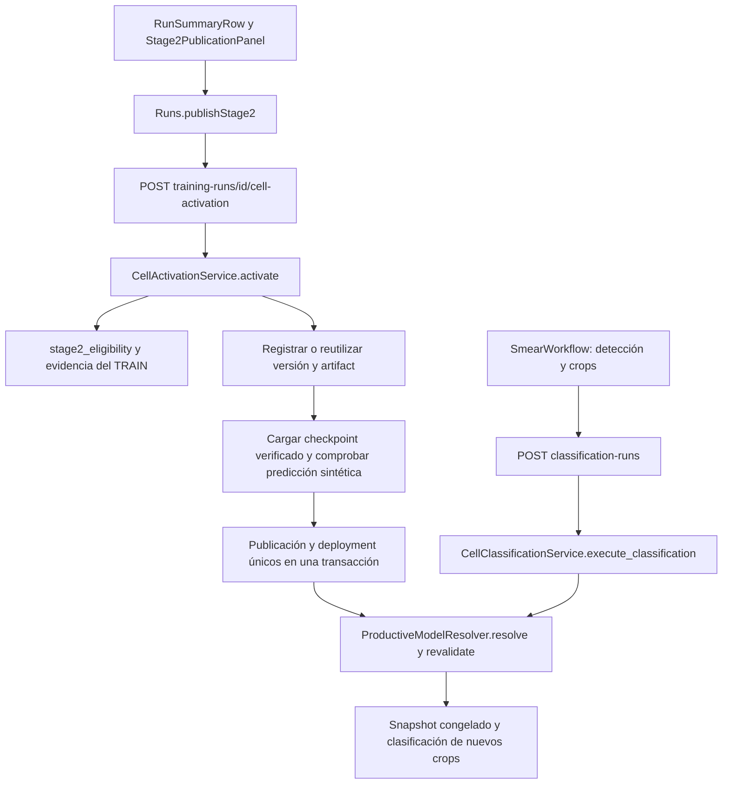

# Activación de modelos para Clasificación celular

Estado documental: `CURRENT_DOC`. Fecha: 2026-10-08.

## Regla y causa del bloqueo anterior

La única condición de habilitación es la decisión `eligible` del backend:
TRAIN completed + EVALUATE completed. Un intento verified, terminado y vinculado
exactamente al TRAIN satisface EVALUATE. EXPLAIN, métricas, registro de versión y
preparación operativa no participan de esa regla.

Antes de esta corrección, `Stage2PublicationPanel` mostraba «Activación pendiente»
cuando `eligible=true` pero `publishable=false`. Este último exigía además
model_version_id, deployment_readiness.ready y ausencia de technical_blockers.
`Runs.publishStage2` repetía esos filtros antes de llamar al backend.

`GET /api/training-runs/{training_run_id}/stage2-release-status` usa
`Stage2StatusService.status`. Su decisión científica ya era correcta; sus
impedimentos operativos eran MODEL_VERSION_NOT_REGISTERED y
E6_PUBLICATION_REFERENCE_UNSUPPORTED. El contrato anterior exigía
`stage2_model_publications.evaluation_run_id NOT NULL` y FK a runs.
`Stage2PublicationService._context` y `ProductiveModelResolver._fetch_candidates`
también dependían de evaluaciones representadas como RUN.

Ahora el botón depende de `eligible`; si el modelo está activo se muestra
«Modelo en Estado Activo» y el botón de activación está deshabilitado. El panel
conserva regla, estados, columnas, fechas, EXPLAIN, arquitectura y checkpoint.
Las comprobaciones de carga y persistencia ocurren durante la operación
expresamente solicitada y sus errores se muestran; no falsean la elegibilidad.

## Recorrido hasta los crops



El frontend conserva los endpoints de consulta. La nueva mutación identifica al
TRAIN, sin requerir previamente model_version_id. Usa los permisos y la auditoría
existentes. Un clic solicita la activación; solo el reemplazo requiere confirmación
adicional. La confirmación de reemplazo envía `replace_existing=true`; el servidor
vuelve a comprobar la selección dentro del bloqueo transaccional.

El servicio comparte la transacción auditada y abre un savepoint: cualquier fallo
revierte registro, publicación, eventos, deployment y resumen de liberación del
TRAIN. El bloqueo advisory de selección serializa activaciones; los índices
únicos impiden dos publicaciones activas por datasource/scope y dos deployments
activos en stage2/default. Se valida la carga antes de cambiar el deployment
activo. Una activación repetida del mismo modelo no crea registros nuevos.

La selección de crops procede de PostgreSQL, no de una variable estática.
`CellClassificationService.execute_classification` resuelve el modelo al comenzar;
`_create_or_existing` lo revalida bajo bloqueo antes de congelar la clasificación.
`ProductiveModelResolver.load` usa un caché por versión y SHA, y carga una copia
temporal de bytes verificados. Los snapshots históricos conservan publicación,
deployment, checkpoint, fuente de evaluación, umbral y configuración originales.
Las ejecuciones históricas pueden resolver el modelo inactivo que les corresponde.

## Persistencia y compatibilidad

Cadena Alembic v2 aplicada en desarrollo:
`pg_v2_baseline → cell_activation_v1 → cell_checkpoint_reuse_v2`.

- Publicaciones y eventos admiten `evaluation_run_id` **o**
  `evaluation_attempt_id`, exactamente uno. Se conserva la FK histórica a runs
  y se añade la FK al intento con ON DELETE RESTRICT.
- Los deployments admiten la calibración histórica o
  `threshold_assessment_attempt_id`. El umbral de este último procede de
  `identity.decision.effective`; no se fabrica una calibración científica.
- Los triggers validan intento verified, TRAIN, identidad de versión y
  correspondencia del checkpoint físico mediante propietario, SHA y tamaño.
  Publicaciones, fuente del umbral y snapshots no pueden intercambiar sus
  referencias científicas.
- El registro de versión se realiza durante la activación, con la identidad
  existente de la evaluación. Un artifact físico ya registrado para los mismos
  bytes del TRAIN se reutiliza. La identidad lógica del checkpoint se conserva
  en la evaluación y en los metadatos de versión; no se altera el historial.
- El flujo tradicional conserva sus FK, eventos y servicios de publicación y
  despliegue. No se inserta ningún RUN para representar un intento.

`make migrate-cell-activation` invoca explícitamente Alembic con
`-c alembic_v2.ini`. La vía de actualización solo acepta esta cadena y una base
v2 ya instalada, verifica el destino y se ejecuta transaccionalmente. Utiliza un
login temporal del rol migrador existente, eliminado al terminar. Comprueba las
huellas de las filas antes y después, excluyendo únicamente las nuevas columnas
nulas. No inicializa bases ni publica modelos.

## Evidencia del caso real

| Dato | Resultado verificado |
|---|---|
| TRAIN | bbbd5b60-afaa-4034-a504-a60ed642aafe, completed |
| EVALUATE | dded6222-12ae-407a-82c6-601e265e3f7d, verified y vinculado al TRAIN |
| Regla | eligible=true; ambas condiciones completadas |
| Modelo | custom_cnn; epoch_2.keras |
| Versión lógica | 3ffcb0ec-324f-43fb-8521-d55cbe81f229; aún sin fila operativa |
| Identidad lógica del checkpoint | 4294d2b2-690b-5884-a3cb-fc7f0eb3653d |
| Artifact físico reutilizable | 0d6a030e-d706-5a68-a390-d5a5ecd8a069 |
| Checksum | b27d794028914408e186b6703140f8e4c204fe67471801f2dfa9b3a2033b18f3 |
| Bytes | 5.150.164; acceso y hash comprobados por el selector de inferencia |
| Umbral | 0.5, decisión numérica persistida en la evaluación |
| Carga | Keras compile=False y predicción sintética válidas; sin TEST científico |
| Estado real final | No activado; botón habilitado. Ninguna publicación ni deployment creado |

Las migraciones conservaron exactamente las filas auditadas: 14 runs, 0
run_lineage, 0 model_versions, 14 artifacts, 0 publicaciones, 0 eventos de
publicación, 0 deployments, 1 intento, 1 identidad y 2.693 resultados de evaluación.

Consultas reproducibles (solo lectura):

```sql
BEGIN TRANSACTION READ ONLY;
SELECT r.id, r.status, a.id AS attempt_id, a.state,
       i.identity#>>'{model,training_run_id}' AS identity_train,
       i.identity#>>'{model,model_version_id}' AS version_identity,
       i.identity#>>'{model,checkpoint_artifact_id}' AS checkpoint_identity,
       i.identity->'decision' AS decision
FROM runs r JOIN assessment_identities i ON i.training_run_id=r.id
JOIN assessment_attempts a ON a.identity_id=i.id
WHERE r.id='bbbd5b60-afaa-4034-a504-a60ed642aafe'
  AND a.id='dded6222-12ae-407a-82c6-601e265e3f7d';
SELECT id,run_id,name,checksum,file_size_bytes FROM artifacts
WHERE checksum='b27d794028914408e186b6703140f8e4c204fe67471801f2dfa9b3a2033b18f3';
SELECT version_num FROM alembic_version;
SELECT conname,pg_get_constraintdef(oid) FROM pg_constraint
WHERE conrelid IN ('stage2_model_publications'::regclass,
                  'deployed_model_versions'::regclass);
SELECT id,model_version_id,evaluation_run_id,evaluation_attempt_id,is_active
FROM stage2_model_publications;
ROLLBACK;
```

## Archivos y validación

Cambios de esta implementación:

- `frontend/src/components/reports/Stage2PublicationPanel.tsx`:
  habilitación por eligible, texto activo exacto, error de la operación.
- `frontend/src/components/reports/RunSummaryRow.tsx`: texto activo.
- `frontend/src/components/reports/TrainingRunGroupCard.tsx`: conexión del panel
  con la activación; elimina la acción de desactivación del estado activo.
- `frontend/src/pages/Runs.tsx`: `publishStage2`, autorización y reemplazo.
- `frontend/src/services/api.ts`: `activateCellModel`; `frontend/src/types/api.ts`:
  fuente de evaluación nullable y referencia de intento.
- `backend_api/app/routes/governance.py`: `activate_cell_model` e inyección.
- `backend_api/app/schemas/cell_activation.py`: solicitud y respuesta tipadas.
- `backend_api/app/services/cell_activation.py`: operación atómica y smoke de carga.
- `backend_api/app/repositories/cell_activation.py`: persistencia y reutilización.
- `backend_api/app/services/stage2_status.py`: acción elegible independiente de
  preparación y resolución del artifact registrado.
- `backend_api/app/services/productive_model.py`: resolución, revalidación y
  snapshots compatibles con la fuente de intento.
- `backend_api/app/services/cell_classification.py`: proyección de esa trazabilidad.
- `malaria_dl_local_project/src/malaria_dl/governance/services/stage2_publication_service.py`:
  eventos con referencia tipada.
- `alembic_v2/versions/20261008_01_cell_activation.py`,
  `alembic_v2/versions/20261008_02_cell_checkpoint_reuse.py`,
  `alembic_v2/activation.py`, `alembic_v2/env.py`: migración compatible y acotada.
- `scripts/db/apply_cell_activation.py`, `scripts/db/migrate_cell_activation.py`:
  ejecución y evidencia de filas intactas.
- `docker-compose.cell-activation-test.yml`, `Makefile`: PostgreSQL efímero y pruebas.
- `backend_api/tests/test_cell_activation.py`,
  `backend_api/tests/test_cell_activation_read_only.py`,
  `backend_api/tests/test_stage2_status_read_only.py`: contratos y regresiones.
- `frontend/tests/stage2-status.test.mjs`,
  `frontend/tests/stage2-availability.test.mjs`,
  `frontend/tests/executions-promotion.test.mjs`,
  `frontend/tests/executions-lazy-loading.test.mjs`: estados y acciones del panel.
- `docs/README.md`, este informe y `docs/engineering/stage2_e6_eligibility.md`:
  índice vigente y diagnóstico anterior marcado como histórico.

El árbol también conserva los cambios visuales previos en
`frontend/src/styles/report-components.css`; esta corrección no rediseña el panel.

Validación por Makefile:

- `make test-cell-activation-backend`: PostgreSQL 17.9 efímero, esquema completo,
  migraciones por CLI e idempotencia; activación sintética, rol runtime,
  reemplazo, fallo de carga, rollback, FK, fuente incorrecta, reutilización,
  snapshots de nuevos crops e históricos y compatibilidad tradicional.
- `make test-stage2-status-backend`: regla, linaje y caso real en READ ONLY.
- `make test-cell-checkpoint-read-only`: carga técnica del checkpoint real,
  sin escrituras PostgreSQL ni publicación.
- `make test-stage2-status-frontend`: estados, errores y confirmaciones simuladas;
  TypeScript y compilación Vite.
- `git diff --check`.

Resultados finales del 2026-10-08:

| Validación | Resultado |
|---|---|
| Activación y clasificación, PostgreSQL aislado | 53 passed |
| Estado, elegibilidad y linaje, solo lectura | 49 passed |
| Checkpoint real, carga y predicción sintética | 1 passed |
| Frontend | 96 passed |
| TypeScript y Vite | Compilación correcta |
| Diff | Sin errores de espacios |

La compilación conserva el aviso de tamaño de bundle de Vite; no hubo errores.
La última consulta de desarrollo confirmó `cell_checkpoint_reuse_v2`, cero
publicaciones activas, cero deployments activos y cero roles temporales de
migración. El estado del caso real devuelve `eligible=true`,
`next_action=enable_for_stage2` y `model_version_registered=false`: la ausencia
del registro operativo ya no impide solicitar la activación.

No se ejecutó TRAIN, EVALUATE, EXPLAIN ni TEST científico. No se activó el modelo
real. La activación queda pendiente exclusivamente de una acción del usuario
en la interfaz. No se integró en main.
