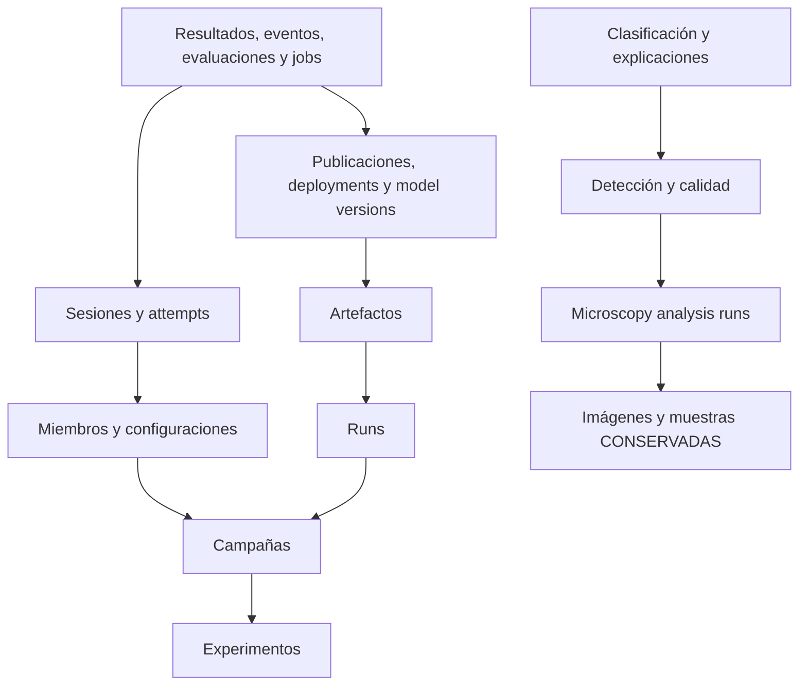

# RESET.1 — Auditoría y preparación de limpieza integral

Estado: **BLOQUEADO**. Fecha: 2026-09-28. Investigación, preparación y ensayo aislado; ninguna autorización de reset operativo se ha utilizado ni solicitado mediante estos scripts.

Se identificaron **1.053.081 filas candidatas** y **139.586 filas a conservar** en 97 tablas. No es posible demostrar cero historial con las restricciones actuales: el esquema rechaza DELETE de evidencia y campañas mediante guards incondicionales. Se reprodujo el rechazo en una restauración aislada, con claves foráneas y triggers habilitados y ROLLBACK obligatorio. No se implementó una excepción de mantenimiento ni se modificaron migraciones.

Los 43 checkpoints faltantes ya no son una dependencia de recuperación. Se conservaron sus identidades y hashes registrados en el manifiesto, con acción `ALREADY_MISSING`, sin fabricar archivos.

## 1. Evidencia e identidad

- Base canónica: `malaria_experiments`, usuario `julio`, esquema `public`, system identifier `7668020338728398886`.
- Revisión instalada: `20260915_01`; no se ejecutó Alembic upgrade/downgrade.
- Inventario SELECT inicial: `2026-09-28 21:11:37.593650+00:00`; comprobación final: `2026-09-28 21:19:54.085464+00:00`. Transacciones operativas `REPEATABLE READ READ ONLY`.
- HEAD al registrar runtime: `10dd402361f001b8d2b5190edc42b1476d8fa264`. Los documentos OP1–OP3 y los demás archivos existentes no se modificaron.
- Totales: 1.192.667 filas, 97 tablas, 97 PK, 208 FK, 786 constraints, 387 índices, 76 triggers de usuario y 100 funciones. Todos los constraints inventariados tienen `convalidated=true`.
- La lectura final confirmó igualdad de conteos y SHA-256 de contenido de las **97 tablas**, e igualdad del catálogo operativo. Los nueve schemas sintéticos preexistentes coinciden tabla por tabla con sus copias del backup restaurado; no fueron destino de escrituras.
- No había TRAIN, sesiones/attempts activos, jobs Local retenidos, evaluaciones activas ni análisis en procesamiento según los estados inventariados. Microscopía: 45 `ready_for_analysis`, 17 `review_required`, 11 `blocked`; son resultados históricos pendientes de revisión, no procesos ejecutándose. GlobalGate conservado: owner/db_pid/blocked_reason nulos y process_evidence vacío. No se detectó proceso TRAIN en el host. Esta observación no sustituye congelar escritores en una intervención futura.

Referencias: [OP1](e10_op1_preclaim_schema_guard.md), [OP2](e10_op2_migration_rehearsal.md), [OP3](e10_op3_operational_migration.md), [manifiesto completo](reset_1_full_history_manifest.json).

## 2. Alcance, fuentes protegidas e identidades

Se conserva toda la familia de datos fuente/versionado/split, no sólo la versión oficial: 2 datasets, 27.558 source records, 27.558 assignments, 27.558 identity evidence, 55.116 dataset_split_images, 201 identidades clínicas, una versión y una materialización. Se conservan también sus validaciones, estadísticas y referencias de auditoría.

Versión oficial `d8c0cab5-09dd-597f-9de7-7ca01aee2ec2`; materialización `e15dc166-1c4b-558e-b77b-727b1783430c`. Snapshot oficial: TRAIN 22.180 / VAL 2.693 / TEST 2.685. Fingerprints, separación de pacientes, asignaciones y bytes JSON de contratos permanecieron iguales en la comparación del backup/restauración y del estado operativo final.

**Microscopía fuente:** se conservan 73 sujetos, casos, muestras, frotis y lotes de ingesta, junto con 74 imágenes originales. Su uso por un análisis no convierte la imagen en resultado desechable. Se seleccionan las filas de análisis, calidad, detección, clasificación, revisiones y explicaciones, y se preservan las fuentes y sus auditorías. No se reutilizó el reset de frotis existente, cuyo alcance incluye borrar imágenes originales.

Se conservan los 4 registros de `models`, users/roles/user_roles, parámetros globales de GlobalGate, Alembic y schema_migrations. Las 36 `model_versions` son historial generado y están entre los candidatos. Los 42 archivos de arquitectura, configuraciones JSON y migraciones inventariados tienen SHA-256 en el manifiesto. El registry resuelve `custom_cnn`, `vgg16` y `densenet121`, con configuración válida, sin instanciar modelos ni iniciar ejecución científica.

Campañas candidatas:

- E9 `3acf89b7-dc42-4b7a-8e2a-ca6ea024c344`, 36 miembros, contract_hash `02a63b0c76dc600bcb17c7163699abf7dd4e5579643b6adbc783f50d30fcf1ba`.
- `ec442763-7eea-499d-a94f-9a3ddfb7c0f0`, otros 36 miembros.

Se preservó la identidad E9 en backup/evidencia antes de proponer su eliminación. Sus siete runs, attempt IDs, hashes de records, completion y verification están en `e9_before`. No se reconstruyó evidencia E10 ni se cambió el presupuesto.

## 3. Inventario y SELECT de identificación

Los números son una propuesta congelada, **no filas efectivamente borradas**. El preview usa IDs explícitos de PK; para las tres tablas grandes (`run_dataset_images`, `run_image_predictions`, `predictions`) usa los 99 run IDs congelados y exporta las PK concretas al activar `reset1_show_ids`. Las 825.048 relaciones run/dataset se eliminan como relaciones, conservando cada imagen fuente. Cualquier cambio posterior exige regenerar y revisar inventario/IDs/hashes.

`audit_events` mezcla seguridad, fuentes e historial: 1.527 IDs exclusivos de análisis/ejecución propuestos; 1.102 conservados. Se identifican por resource ID histórico o por resource_type exclusivamente analítico y evento científico, incluidas auditorías legacy cuyo análisis ya no existe. Se preservan seguridad, datasets, originales e ingesta. El SQL de borrado propuesto contiene la lista de IDs, nunca un DELETE por prefijo de evento. La clasificación automática no dejó casos pendientes; la revisión humana del conjunto sigue siendo necesaria.

| Tabla | Actuales | Candidatos a eliminar | A conservar | Dependencia FK / política |
|---|---|---|---|---|
| alembic_version | 1 | 0 | 1 | CONSERVAR; sin FK padre |
| artifacts | 4007 | 4007 | 0 | runs |
| assessment_artifacts | 0 | 0 | 0 | assessment_attempts |
| assessment_attempts | 0 | 0 | 0 | assessment_identities |
| assessment_campaign_consumers | 0 | 0 | 0 | assessment_identities, campaign_members, experimental_campaigns |
| assessment_final_locks | 0 | 0 | 0 | sin FK padre |
| assessment_identities | 0 | 0 | 0 | runs |
| assessment_results | 0 | 0 | 0 | assessment_attempts |
| audit_events | 2629 | 1527 | 1102 | users |
| blood_samples | 73 | 0 | 73 | CONSERVAR; scientific_cases, users |
| campaign_attempts | 11 | 11 | 0 | campaign_members, runs |
| campaign_configurations | 24 | 24 | 0 | experimental_campaigns |
| campaign_controlled_requests | 2 | 2 | 0 | campaign_attempts, campaign_members, campaign_technical_revisions, experimental_campaigns, runs |
| campaign_execution_events | 4 | 4 | 0 | experimental_campaigns |
| campaign_members | 72 | 72 | 0 | campaign_attempts, campaign_configurations, experimental_campaigns |
| campaign_technical_revisions | 2 | 2 | 0 | experimental_campaigns |
| cell_classification_events | 2473 | 2473 | 0 | cell_classification_runs, cell_detections, cell_predictions |
| cell_classification_inputs | 2290 | 2290 | 0 | cell_classification_runs, cell_crops, cell_detections |
| cell_classification_reviews | 6 | 6 | 0 | cell_predictions, users |
| cell_classification_runs | 46 | 46 | 0 | cell_classification_runs, cell_detection_runs, deployed_model_versions, stage2_model_publications, users |
| cell_crops | 2241 | 2241 | 0 | cell_detections |
| cell_detection_events | 181 | 181 | 0 | cell_detection_runs, microscopy_images |
| cell_detection_runs | 45 | 45 | 0 | microscopy_analysis_runs, users |
| cell_detections | 2241 | 2241 | 0 | cell_detection_runs, image_connected_components |
| cell_explanations | 1 | 1 | 0 | cell_predictions |
| cell_predictions | 2152 | 2152 | 0 | cell_classification_inputs |
| classification_reports | 120 | 120 | 0 | runs |
| clinical_identities | 201 | 0 | 201 | CONSERVAR; datasets |
| confusion_matrices | 60 | 60 | 0 | runs |
| dataset_materialization_activations | 0 | 0 | 0 | CONSERVAR; dataset_materializations, dataset_versions |
| dataset_materializations | 1 | 0 | 1 | CONSERVAR; dataset_versions |
| dataset_source_records | 27558 | 0 | 27558 | CONSERVAR; clinical_identities, datasets |
| dataset_split_assignments | 27558 | 0 | 27558 | CONSERVAR; clinical_identities, dataset_source_records, dataset_versions |
| dataset_split_images | 55116 | 0 | 55116 | CONSERVAR; dataset_materializations, dataset_versions, datasets |
| dataset_split_statistics | 1 | 0 | 1 | CONSERVAR; dataset_versions |
| dataset_split_validation_checks | 12 | 0 | 12 | CONSERVAR; dataset_versions |
| dataset_splits | 0 | 0 | 0 | CONSERVAR; datasets |
| dataset_version_sources | 1 | 0 | 1 | CONSERVAR; dataset_versions, datasets |
| dataset_versions | 1 | 0 | 1 | CONSERVAR; sin FK padre |
| datasets | 2 | 0 | 2 | CONSERVAR; sin FK padre |
| deployed_model_versions | 3 | 3 | 0 | deployed_model_versions, model_versions, run_threshold_calibration |
| environment_packages | 0 | 0 | 0 | runs |
| errors | 1 | 1 | 0 | runs |
| execution_logs | 0 | 0 | 0 | runs |
| experiment_execution_events | 4 | 4 | 0 | sin FK padre |
| experiment_execution_gate | 1 | 0 | 1 | CONSERVAR; sin FK padre |
| experimental_campaigns | 2 | 2 | 0 | audit_events, dataset_versions, experiments |
| experiments | 1 | 1 | 0 | sin FK padre |
| explainability_results | 3600 | 3600 | 0 | predictions, runs |
| identity_evidence | 27558 | 0 | 27558 | CONSERVAR; clinical_identities, dataset_source_records |
| image_analysis_jobs | 3 | 3 | 0 | artifacts, dataset_split_images, run_model_deployments |
| image_connected_components | 3734 | 3734 | 0 | cell_detection_runs, microscopy_analysis_run_images |
| image_ingestion_batches | 73 | 0 | 73 | CONSERVAR; blood_samples, research_subjects, scientific_cases, smear_slides, users |
| image_quality_assessments | 74 | 74 | 0 | microscopy_analysis_run_images, microscopy_analysis_runs, microscopy_images |
| local_execution_jobs | 1 | 1 | 0 | experimental_campaigns, runs |
| microscopy_analysis_events | 383 | 383 | 0 | microscopy_analysis_runs, microscopy_images |
| microscopy_analysis_run_images | 74 | 74 | 0 | microscopy_analysis_runs, microscopy_images |
| microscopy_analysis_runs | 73 | 73 | 0 | blood_samples, image_ingestion_batches, research_subjects, scientific_cases, smear_slides, users |
| microscopy_images | 74 | 0 | 74 | CONSERVAR; image_ingestion_batches, smear_slides, users |
| model_governance_backfill_audit | 0 | 0 | 0 | model_governance_backfill_audit |
| model_versions | 36 | 36 | 0 | artifacts, models, runs |
| models | 4 | 0 | 4 | CONSERVAR; sin FK padre |
| predictions | 99567 | 99567 | 0 | artifacts, dataset_split_images, datasets, deployed_model_versions, image_analysis_jobs, model_versions, runs |
| quality_assessment_queue_items | 73 | 73 | 0 | microscopy_analysis_runs, users |
| quality_gate_decisions | 16 | 16 | 0 | microscopy_analysis_runs, users |
| research_subjects | 73 | 0 | 73 | CONSERVAR; users |
| roles | 5 | 0 | 5 | CONSERVAR; sin FK padre |
| run_checkpoint_policy | 24 | 24 | 0 | artifacts, model_versions, runs |
| run_clinical_metrics | 60 | 60 | 0 | models, runs |
| run_dataset_images | 825048 | 825048 | 0 | dataset_split_images, runs |
| run_image_predictions | 98364 | 98364 | 0 | dataset_split_images, runs |
| run_io_records | 84 | 84 | 0 | dataset_materializations, dataset_versions, runs |
| run_lineage | 61 | 61 | 0 | artifacts, model_versions, runs |
| run_metrics | 2796 | 2796 | 0 | runs |
| run_model_deployments | 3 | 3 | 0 | deployed_model_versions, runs |
| run_threshold_calibration | 24 | 24 | 0 | artifacts, model_versions, runs |
| runs | 99 | 99 | 0 | dataset_versions, datasets, experimental_campaigns, experiments, models |
| schema_migrations | 23 | 0 | 23 | CONSERVAR; sin FK padre |
| scientific_cases | 73 | 0 | 73 | CONSERVAR; research_subjects, users |
| scientific_reviews | 15 | 15 | 0 | cell_detections, users |
| scientific_validation_annotation_events | 0 | 0 | 0 | scientific_validation_annotations, scientific_validation_sessions, users |
| scientific_validation_annotations | 0 | 0 | 0 | blood_samples, cell_detections, microscopy_analysis_runs, scientific_validation_sessions, users |
| scientific_validation_classification_runs | 0 | 0 | 0 | cell_classification_runs, scientific_validation_sessions |
| scientific_validation_detection_runs | 0 | 0 | 0 | cell_detection_runs, scientific_validation_sessions |
| scientific_validation_images | 0 | 0 | 0 | microscopy_images, scientific_validation_sessions |
| scientific_validation_sessions | 0 | 0 | 0 | users |
| smear_analysis_summaries | 43 | 43 | 0 | cell_classification_runs |
| smear_slides | 73 | 0 | 73 | CONSERVAR; blood_samples, users |
| stage2_model_publication_events | 9 | 9 | 0 | stage2_model_publications |
| stage2_model_publications | 4 | 4 | 0 | model_versions, runs |
| synthetic_data_runs | 0 | 0 | 0 | datasets, runs |
| train_execution_records | 360 | 360 | 0 | train_execution_sessions |
| train_execution_revisions | 0 | 0 | 0 | campaign_attempts, campaign_technical_revisions, experimental_campaigns |
| train_execution_sessions | 11 | 11 | 0 | campaign_attempts, runs |
| training_history | 926 | 926 | 0 | runs |
| user_roles | 1 | 0 | 1 | CONSERVAR; roles, users |
| users | 1 | 0 | 1 | CONSERVAR; sin FK padre |

Todas las tablas protegidas tienen selector `FALSE` y cero candidatos. No hay FK desde una tabla fuente protegida hacia una fila histórica seleccionada que requiera borrar fuentes. No se encontraron referencias UUID a los objetos raíz candidatos en los JSON inspeccionados de las tablas protegidas pequeñas; los JSON de datasets y las rutas fuente se conservan enteros. Esto no convierte una búsqueda de JSONB en una garantía universal sobre texto libre: archivos huérfanos quedan retenidos y la aprobación requiere revisar la evidencia indirecta.

## 4. Grafo y orden de eliminación

El manifiesto incluye las 208 aristas reales, columnas compuestas, acción ON DELETE, deferrabilidad y definición de cada constraint; también las funciones/triggers y todas las columnas JSONB. Se inspeccionaron referencias directas de archivos y JSON anidados en resultados, sesiones, contratos, deployments y outputs; para las tres tablas grandes se inspeccionaron los valores distintos de metadata sin duplicar un millón de filas.

El grafo completo tiene el ciclo `campaign_members.accepted_attempt_id → campaign_attempts → campaign_members`. La arista de aceptación ya es deferrable. Se calculó un orden hijo→padre de 71 tablas omitiendo **sólo para ordenar** las cuatro FK que ya son deferrable; no se elimina ni deshabilita ninguna FK. Un futuro procedimiento podría diferir esas cuatro durante su propia transacción y exigir `SET CONSTRAINTS ALL IMMEDIATE` al terminar. Los self-FK de deployments/versiones se inventariaron separadamente; borrar el conjunto explícito completo requiere validar todos sus hijos externos.

El orden detallado está en `delete_order` y en el plan SQL. Se revisaron también las aristas CASCADE/SET NULL: no se confía en cascadas para limpiar objetos desconocidos. Las FK RESTRICT causaron errores reales al probar DELETE de padres sin sus hijos, confirmando que siguen activas.

## 5. Publicaciones y deployments — preparación, sin retirada

Publicación activa: `81d69942-17eb-4999-a6bd-2b05779a65a4`.
Deployment activo stage2/default: `cf2f20d3-a1e0-499c-b5ab-501b7c1ae198`.
Model version: `172b7031-9f79-44e3-a7ad-2dc10a9ffd08`.
TRAIN: `623ad00c-0b03-4cf0-8f2c-bb9496efb496`.
EVALUATE: `243b1d73-8bae-4a23-a92d-ae2d4b15de31`.
Checkpoint artifact: `44577ce0-1a80-4971-9f3d-bd78d2a63bf4`.

Hay cuatro publicaciones totales y tres deployments; el resto está inactivo. Todas sus identidades/relaciones están en el manifiesto.

Procedimiento autorizado existente: ruta `POST /api/stage2-publications/{publication_id}/deactivate` (`router` con prefijo `/api`, incluido sin prefijo adicional en `app/main.py`), con principal que tenga `models.deactivate`, razón y X-Request-ID. La ruta en `backend_api/app/routes/governance.py` llama a `Stage2PublicationService.deactivate` y después a `Stage2AvailabilityService.deactivate`, que invalida caché. **No se llamó la ruta ni los servicios**.

Dependencia de atomicidad: esos servicios usan connection factories/transacciones separadas. No se debe asumir que una llamada HTTP participa en la transacción del futuro reset. Hace falta una decisión aprobada: retirar previamente en una ventana controlada, guardar backup/estado de compensación y recapturar inventario, o aprobar una integración de los servicios sobre una conexión transaccional compartida con efectos de caché posteriores. No se implementó ninguna de estas modificaciones. Retirar una publicación crea nueva auditoría: los IDs actuales dejan de ser el conjunto completo y deben recapturarse antes del DELETE.

Después del futuro reset no habrá modelo entrenado publicado para inferencia hasta entrenar y publicar uno nuevo. Las arquitecturas y configuraciones para nuevas campañas sí se conservan. No se promete inferencia productiva con cero model versions.

## 6. Backup nuevo y restauración verificada

Se ejecutó exclusivamente el procedimiento Docker-only `scripts/db/backup.sh`, con `CAPSTONE_BACKUP_DIR` apuntando a `backups/reset1` (ignorado por Git; directorio 0700 y dump 0600).

- Archivo: `/Users/julio/Desktop/Archivo/Magister UAI/Capstone MIA 2025 2/Desarrollo/SW/capstone/backups/reset1/capstone_20260928T211019Z.dump`.
- Tamaño: 86829694 bytes.
- SHA-256: `d9ab67dbbdbdb19d2df8500152d2b0f97c7e58d4aa48b26b420e21042356a927`.
- PostgreSQL origen/destino: 17.9; formato custom; revisión origen `20260915_01`.
- Restauración: exit 0, 10.364 s, 311 bloques COPY. Los datos COPY se preservaron byte a byte; sólo se remapearon referencias de esquema en DDL/funciones fuera de COPY.
- Destino: `capstone-reset1-5c7cd4c731`, DB `reset1_rehearsal`, esquema `capstone_test_reset1_5c7cd4c731`. Sin publicar puertos ni montar volúmenes operativos. No se usó `public` como destino de los datos operativos.
- Se crearon los owners de fixture y se concedió USAGE/CREATE del esquema remapeado a `julio`, porque las funciones SECURITY DEFINER restauradas necesitaban el acceso que tenían en el esquema origen. Esto fue exclusivamente preparación del clon, no una modificación de permisos operativos.
- Verificación real: 97/97 tablas, 1.192.667 filas y hashes de contenido iguales al origen; nueve schemas históricos restaurados comparados con SELECT. No se declaró válido sólo por exit 0 o por `pg_restore --list`.
- Se retiró únicamente el contenedor desechable y su volumen tras validar etiqueta RESET.1 y ausencia de volúmenes compartidos. Dump y evidencia permanecen disponibles.

Para el reset futuro se exige **otro backup nuevo después de congelar escritores y fijar el estado de publicaciones**, con copia en almacenamiento duradero autorizado, SHA-256 y restore verificado en destino distinto. El backup de esta auditoría no autoriza un reset posterior con datos que hayan cambiado. Respaldar también archivos generados antes de cuarentena; PostgreSQL no incluye sus bytes. Los 43 ausentes se registran como ausentes, sin exigir restaurarlos.

## 7. Manifiesto de archivos y cuarentena propuesta

Hay **6.538 ubicaciones canónicas** a partir de 6.569 referencias/entradas; se deduplicaron aliases de bind mounts, rutas host/contenedor y stage2 URI. Incluye 113 `.keras` presentes. Cada entrada contiene ruta, ubicación canónica, aliases cuando corresponde, propietarios mediante `file_owner_entities`, run/análisis asociado cuando existe, existencia, tamaño, SHA-256 medido y acción propuesta. Los propietarios no resueltos están expresamente vacíos y retenidos; no se inventó una asociación.

| Acción propuesta | Ubicaciones |
|---|---|
| ALREADY_MISSING | 53 |
| PRESERVE_DIRECTORY_REVIEW | 3 |
| PRESERVE_SOURCE_OR_CONFIGURATION | 98 |
| QUARANTINE_AFTER_APPROVAL | 5970 |
| REVIEW_UNOWNED_DO_NOT_MOVE | 414 |

Los 53 `ALREADY_MISSING` incluyen exactamente los **43 checkpoints E9**. En los archivos ausentes `sha256` y tamaño medido son null; el hash/tamaño registrado de E9 permanece separado en `registered_e9_checkpoint`. Los otros diez ausentes también se identifican sin fabricación. Los 98 archivos fuente/configuración y los tres directorios compartidos/protegidos no son candidatos de movimiento.

Los 414 archivos sin propietario registrado incluyen resultados planos, archivos en directorios de runs sin relación vigente, markers de directorio y locks. Deben clasificarse individualmente: no se autoriza moverlos por estar bajo outputs. El inventario no prueba cobertura de discos externos, otras máquinas ni volúmenes no conectados; cualquier ubicación externa declarada deberá incorporarse antes de aprobar la limpieza integral.

Cuarentena futura, todavía no implementada ni ejecutada:

1. Congelar manifest SHA-256 y IDs; verificar nuevamente canonicalización, propietarios, referencias preservadas, symlinks, tamaño/hash y exclusividad. Deduplicar por ubicación física; no mover raíces de dataset, proyecto, storage ni directorios compartidos.
2. Crear un journal fuera de las tablas candidatas con operación autorizada, backup, ubicación original y destino individual. Estados: PREPARED, QUARANTINED, SQL_COMMITTED, RESTORED, PURGE_APPROVED. No autorizar acciones `REVIEW_*` ni `PRESERVE_*`.
3. Copiar a cuarentena privada conservando estructura/metadata, verificar SHA-256 antes de retirar el original. Si se usa rename en el mismo filesystem, registrar el movimiento antes y después y garantizar restauración idempotente. No asumir atomicidad entre filesystems.
4. Mantener servicio detenido para esos objetos. Fallo SQL o validación: ROLLBACK y restauración por manifiesto sin sobrescribir un destino diferente; verificar cada hash y habilitar servicio sólo después de resolver todos los conflictos.
5. Confirmar SQL únicamente con todas las postcondiciones y una autorización posterior separada. Mantener cuarentena/backup durante la ventana de recuperación. Borrado físico definitivo sólo con otra aprobación de recuperación/retención; nunca acoplado irreversiblemente al DELETE.

## 8. Plan transaccional y guardas

`full_history_reset_preview.sql` abre READ ONLY, produce el cuadro de 97 tablas, valida conteos contra el manifiesto, muestra revisión, GlobalGate y catálogo FK. Con `psql -v reset1_show_ids=1` exporta PK de todos los candidatos; por defecto evita imprimir más de un millón de IDs.

`full_history_reset_plan.sql` es un **borrador bloqueado**: `ON_ERROR_STOP`, `BEGIN READ ONLY`, excepción incondicional `RESET1_NOT_AUTHORIZED` antes del primer DELETE, y sólo ROLLBACK, sin sentencia COMMIT. Contiene la propuesta completa por IDs para revisión. Aun suprimiendo accidentalmente el bloque DO, READ ONLY impide ejecutar DML. No existe flag/env var que conceda autorización. No quitar guardas para convertir este borrador en un procedimiento operativo.

Una futura implementación autorizada requiere, en este orden: identidad canónica y revisión esperadas; mantenimiento sin nuevos escritores; ausencia de TRAIN/análisis/jobs/assessments; GlobalGate libre conservado; backup nuevo restaurable; inventario/hashes actualizados; retirada aprobada coordinada; locks de las tablas afectadas con timeouts; comprobación de IDs y ausencia de nuevas dependencias; borrado hijo→padre por IDs; validación inmediata de FK; anti-joins de todas las FK; cero candidatos e historial residual; comparación de hashes de tablas fuente/usuarios/roles/models/configuración y archivos protegidos; autorización separada de confirmación. Cualquier diferencia obliga ROLLBACK.

No se reutilizan `scripts/db/purge.py` (usa `session_replication_role=replica`, borra models y confirma por subsistema) ni `scripts/storage/reset_smear_analysis.py` (deshabilita triggers y borra fuentes). Contradicen expresamente RESET.1. No se cambia GlobalGate, retry, heartbeat, ResultService ni release/deployment.

## 9. Dry-run y resultados verificables

Se ejecutaron 17 DELETE de una PK concreta cada uno en el clon, cada prueba dentro de SAVEPOINT y rollback, más un ROLLBACK exterior incondicional. No son un reset completo exitoso: prueban por qué el borrado completo es imposible bajo las restricciones actuales.

| Tabla probada | SQLSTATE | Rechazo real |
|---|---|---|
| train_execution_records | P0001 | TRAIN_RECORD_IMMUTABLE |
| train_execution_sessions | P0001 | TRAIN_HISTORY_IMMUTABLE |
| campaign_attempts | P0001 | ATTEMPT_HISTORY_IMMUTABLE |
| experimental_campaigns | P0001 | CAMPAIGN_DELETE_FORBIDDEN |
| campaign_members | P0001 | FROZEN_MEMBER_IMMUTABLE |
| campaign_technical_revisions | P0001 | TECHNICAL_HISTORY_IMMUTABLE |
| campaign_controlled_requests | P0001 | TECHNICAL_HISTORY_IMMUTABLE |
| experiment_execution_events | P0001 | EXECUTION_HISTORY_IMMUTABLE |
| cell_crops | 55000 | cell analysis result and review rows are append-only |
| cell_detections | 55000 | cell analysis result and review rows are append-only |
| cell_predictions | 55000 | cell classification inputs, predictions, summaries, events and reviews are append-only |
| cell_explanations | 55000 | cell_explanations cannot be deleted |
| microscopy_analysis_runs | 23503 | update or delete on table "microscopy_analysis_runs" violates foreign key constraint "image_quality_assessments_analysis_run_id_fkey" on table "image_quality_assessments" |
| stage2_model_publication_events | P0001 | stage2_model_publication_events es append-only |
| stage2_model_publications | 23503 | update or delete on table "stage2_model_publications" violates foreign key constraint "stage2_model_publication_events_publication_id_fkey" on table "stage2_model_publication_events" |
| deployed_model_versions | 23503 | update or delete on table "deployed_model_versions" violates foreign key constraint "fk_predictions_deployed_model_version" on table "predictions" |
| audit_events | P0001 | audit_events is append-only |

Después de los savepoints: hashes de 97/97 tablas iguales al estado restaurado anterior, catálogo igual y triggers habilitados; **208 comprobaciones FK sin huérfanos**. El rollback conserva dataset, split, identidad E9, auth y models. Las FK de padres se comprobaron antes de eliminar hijos deliberadamente para verificar su protección; sus errores 23503 son dependencias de orden, no excepciones de mantenimiento.

Pruebas de los SQL entregados, remapeados sólo para validación en el clon:

- Preview: exit 0; **97/97 conteos coinciden** con candidatos y filas a conservar.
- Plan: exit 3 de psql; `RESET1_NOT_AUTHORIZED` antes de DML. No sentencia COMMIT.
- Preflight OP1 sobre el clon sin migrar: `E10_SCHEMA_NOT_READY`, como corresponde a `20260915_01`. No se reservó un intento Docker ni Local.
- Estado vacío de runs/análisis/campañas: **NO DEMOSTRADO**. Después del rollback siguen 99 runs, 2 campañas, 72 miembros, 11 attempts, 11 sessions, 360 records y 1 Local job, exactamente como antes. No se presenta conservación por rollback como prueba de un reset que terminó correctamente.
- No se ejecutó TRAIN, TEST, inferencia, reanudación E9 ni migración. No se realizaron regresiones científicas E10.9/E10.10; no sería correcto declararlas aprobadas para un estado vacío no alcanzado.

## 10. Coordinación con E10.OP3

`20260922_01` añade el contrato de eventos E10, pero no elimina los guards de historial de `20260915_01`. Migrar antes no desbloquea el DELETE; resetear antes tampoco hace aprobar OP1. Ninguno de los dos órdenes actuales permite el reset íntegro solicitado sin resolver previamente la incompatibilidad de mantenimiento.

Secuencia propuesta, condicionada a nuevas aprobaciones: resolver un diseño de mantenimiento compatible con guards/FK sin modificar migraciones aprobadas → repetir ensayo íntegro y recuperación → aprobar retirada/reset en `20260915_01` → demostrar estado vacío y fuentes preservadas → backup nuevo de ese estado → aprobar separadamente OP3 y migrar por su procedimiento → OP1 READY Docker/Local y validaciones E10.9/E10.10 sin intentos accidentales → autorizar una nueva campaña. Este orden reduce la evidencia histórica que cruza la migración, pero **no está habilitado todavía**. Se deben resolver también los blockers propios de OP3 que sigan aplicando.

E10.9/E10.10 seguirán necesitando sesiones/eventos nuevos válidos, fencing, contigüidad y hash de records; no se fabrica backfill ni se convierte un run legacy a E10. Conservar registry/configuración y el GlobalGate libre evita usar el reset como un cambio de reglas de claim. No se implementó E10.11.

## 11. Recuperación y dependencias para revisión humana

Antes de iniciar: si falla identidad, quietud, publicación, backup o manifiesto, no comenzar. Durante SQL: ROLLBACK y devolver cuarentena verificada. Después de SQL y antes de habilitar servicio: conservar writers detenidos; ante una discrepancia, restaurar el backup completo y su estado de archivos en un destino limpio verificado y aplicar un cutover aprobado. Después de habilitar servicio: detener nuevamente escritores, inventariar nuevas transacciones y obtener aprobación del punto de recuperación para no descartar datos nuevos silenciosamente. Un downgrade Alembic no sustituye restaurar datos. La recuperación no exige los 43 archivos que ya estaban ausentes.

Dependencias concretas:

- **B1 — DELETE incompatible con el contrato vigente.** TRAIN_RECORD_IMMUTABLE, TRAIN_HISTORY_IMMUTABLE, ATTEMPT_HISTORY_IMMUTABLE, CAMPAIGN_DELETE_FORBIDDEN, FROZEN_MEMBER_IMMUTABLE, TECHNICAL_HISTORY_IMMUTABLE y guards append-only clínicos/auditoría no tienen excepción utilizable por este plan. Resolver requiere diseño y autorización de mantenimiento separados; no basta aprobar la ejecución del script actual.
- **B2 — Propiedad de archivos.** Resolver los 414 archivos retenidos y excluir explícitamente markers/locks/configuración/compartidos; revisar directorios compartidos y confirmar cobertura de cualquier almacenamiento externo antes de afirmar limpieza integral.
- **B3 — Retirada y atomicidad.** Aprobar el procedimiento de baja de la publicación/deployment identificados y su recuperación; el endpoint vigente no ofrece atomicidad conjunta con el reset. Recapturar los IDs de eventos nuevos antes de borrar.

Checklist pendiente: aprobar B1/B2/B3; disponer de backup durable nuevo + restore; ensayar eliminación íntegra y recuperación con cero historial y cero huérfanos; repetir hashes/fingerprints de fuentes y configuración; verificar scripts contra esa evidencia; otorgar autorización posterior separada para reset y, en otra etapa, migración. No se pide aprobación de despliegue de un procedimiento todavía bloqueado.

## 12. Archivos creados

- `docs/engineering/e10_execution_refactor/reset_1_full_history_audit.md`.
- `docs/engineering/e10_execution_refactor/reset_1_full_history_manifest.json`.
- `scripts/reset/full_history_reset_preview.sql`.
- `scripts/reset/full_history_reset_plan.sql`.

El dump se conserva fuera de Git. Helpers y logs de esta sesión están en `/private/tmp/reset1_tools`; la evidencia de resultados, catálogos, IDs, hashes, rollback y restore está incorporada al manifiesto. No se hicieron commits, modificaciones de código funcional ni cambios de configuración científica.

**RESET.1 — BLOQUEADO, con dependencias concretas: B1 (guards inmutables), B2 (propiedad de archivos), B3 (retirada/atomicidad).**

Detenido para revisión humana. No ejecutar el reset ni la migración operativa.
