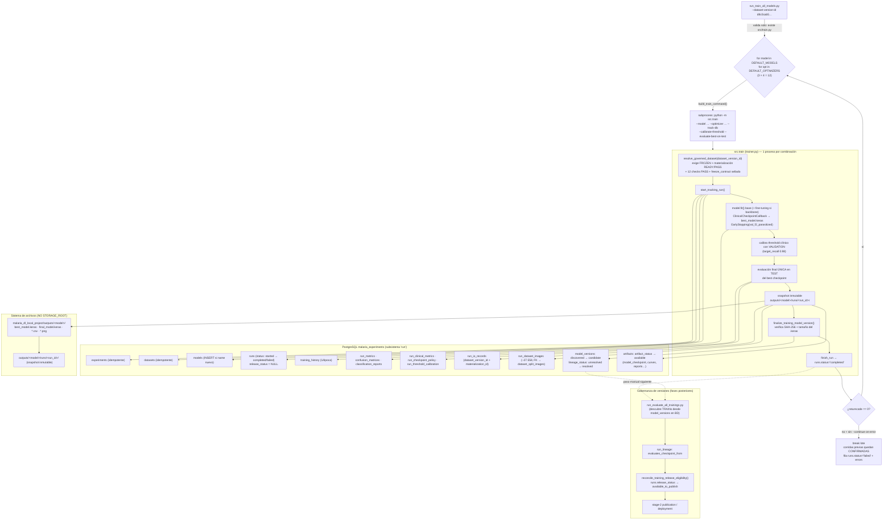

# Pipeline de entrenamiento de modelos (`run_train_all_models.py`)

Fecha: 2026-09-08
Rama: `main` · HEAD `f44f8063`
Autor: revisión asistida (Claude Code), rol arquitecto de software senior — pipelines de ML
Método: lectura de código real (`malaria_dl_local_project/`), introspección **solo lectura**
de `malaria_experiments` (contenedor `capstone_db`, PostgreSQL 17.9, usuario `julio`),
`git log`/`git show`, y ejecución de `run_train_all_models.py --dry-run` +
`python -m src.train --help`. **Ningún entrenamiento real ni sentencia mutante ejecutada.**

Referencias que este documento **no** reduplica:
- Mapa de tablas del subsistema `run` (28 tablas): [`docs/operations/subsystem_data_purge.md`](../operations/subsystem_data_purge.md) §8 y [`docs/audits/cell_vs_microscopy_resolution_2026-09-08.md`](../audits/cell_vs_microscopy_resolution_2026-09-08.md) §8.
- Contrato `cell`/`microscopy` y FK cruzadas run↔dataset↔cell: [`docs/audits/cell_vs_microscopy_resolution_2026-09-08.md`](../audits/cell_vs_microscopy_resolution_2026-09-08.md) §9.
- Anti-patrón estructural equivalente (head de Alembic hardcodeado en CI): [`docs/audits/architecture_audit_2026-09-08.md`](../audits/architecture_audit_2026-09-08.md) §6.1 y [`docs/audits/alembic_ci_gate_fix_2026-09-08.md`](../audits/alembic_ci_gate_fix_2026-09-08.md).
- Guía científica del flujo (train→evaluate→explain): [`docs/guia_entrenamiento_patient_split.md`](../guia_entrenamiento_patient_split.md).
- Linaje evaluación/explicabilidad: [`docs/evaluation_and_explainability_lineage.md`](../evaluation_and_explainability_lineage.md).

---

## 0. Conclusión ejecutiva

1. **`run_train_all_models.py` es un orquestador de subprocesos, no un motor de
   entrenamiento.** Genera el producto cartesiano `modelos × optimizers` y ejecuta un
   `python -m src.train …` por combinación. Con los valores por defecto son **12
   ejecuciones** (`{custom_cnn, vgg16, densenet121} × {adam, adamw, sgd, adadelta}`).
2. **"Todos los modelos" es una lista fija en código, no una tabla de catálogo ni un
   directorio de configs.** El conjunto está hardcodeado en **`run_train_all_models.py:27`
   (`DEFAULT_MODELS`)** y se repite —con lógica divergente— en al menos **6 puntos de 4
   archivos** (ver §Fase 2 y Hallazgo H1). Existe un `MODEL_REGISTRY` que resolvería esto
   de forma dinámica (`src/malaria_dl/models/registry.py:7`) **pero nadie lo importa**
   (Hallazgo H2).
3. **`--dataset-version-id d8c0cab5-09dd-597f-9de7-7ca01aee2ec2` es válido y entrenable
   hoy.** Es `Malaria Patient Split v1`, `status=FROZEN` (2026-08-18), materialización
   `READY`/`PASS`, los 12 checks bloqueantes en `PASS`, `freeze_contract` sellado. Ya se
   entrenó la grilla completa contra él el 2026-08-18 (12 `runs` `completed`).
4. **El orquestador no tiene transacción de lote.** Cada `src.train` es un proceso
   independiente con su propio ciclo de vida en BD. Un fallo a mitad de lote deja las
   corridas ya terminadas **confirmadas**, una fila `runs.status='failed'` con hijos
   parciales, y —por defecto— **aborta el resto**. No hay rollback ni reanudación.
5. **El entrenamiento no toca `STORAGE_ROOT`.** Escribe en el árbol
   `malaria_dl_local_project/outputs/<model>/` (aliases mutables) y
   `outputs/<model>/runs/<run_id>/` (snapshot inmutable). `STORAGE_ROOT`
   (`/app/var/storage`) es del backend y del pipeline de frotis, no de este flujo.
6. **"Entrenamiento terminado" ≠ "modelo disponible para gobernanza".**
   `runs.release_status` pasa a `available_to_publish` **solo después** de que exista una
   corrida `evaluation` `completed` enlazada por `run_lineage` — es decir, tras ejecutar
   `run_evaluate_all_trainings.py` (Hallazgo H8).

---

## Fase 1 — Trazado del flujo de ejecución

### 1.1 Punto de entrada y qué valida antes de arrancar

Archivo: [`malaria_dl_local_project/run_train_all_models.py`](../../malaria_dl_local_project/run_train_all_models.py) (212 líneas, sin dependencias fuera de la stdlib).

`main()` (líneas 161-207) hace **una sola validación previa**:

```python
if not (project_dir / "src" / "train.py").exists():   # línea 165
    print("ERROR: no se encontró src/train.py …"); return 2
```

**No valida:**
- que `--dataset-version-id` exista o sea entrenable (eso lo hace cada subproceso
  `src.train` al invocar `resolve_governed_dataset`, ver §1.4);
- conectividad a PostgreSQL;
- disponibilidad de GPU;
- que la materialización física del dataset esté en disco;
- espacio en disco / colisión con corridas previas (ese lock es por-modelo dentro de
  `src.train`, `trainer.py:1088` `acquire_training_output_lock`).

Tras la validación, imprime proyecto + listas resueltas y entra en el doble bucle
`for model in args.models: for optimizer in args.optimizers:` (líneas 179-198).

### 1.2 Tabla de argumentos — `run_train_all_models.py`

| Argumento | Default | Efecto real | ¿Llega a `src.train`? |
|---|---|---|---|
| `--project-dir` | `.` | Directorio de trabajo (`cwd`) de cada subproceso; debe contener `src/train.py`. | No como flag; es el `cwd`. |
| `--models` | `["custom_cnn","vgg16","densenet121"]` | Subconjunto a ejecutar. `choices` **fijo** a esas 3 cadenas (`argparse` rechaza cualquier otra). | Sí, `--model <m>` una vez por iteración. |
| `--optimizers` | `["adam","adamw","sgd","adadelta"]` | Subconjunto de optimizers. `choices` **fijo** a esas 4. | Sí, `--optimizer <o>`. |
| `--max-epochs` | `100` | Épocas máximas de la fase base. **Sobrescribe** el default por-modelo de `src.train` (`DEFAULT_MAX_EPOCHS_BY_MODEL` = 50/30/30, `trainer.py:73`). EarlyStopping decide el corte real. | Sí, `--max-epochs`. |
| `--img-size` | `200` | Lado del cuadrado de entrada. | Sí, `--img-size`. |
| `--batch-size` | `64` | Batch. | Sí, `--batch-size`. |
| `--seed` | `42` | Semilla (`tf.keras.utils.set_random_seed`). | Sí, `--seed`. |
| `--target-recall` | `0.98` | Sensibilidad objetivo para la calibración de threshold clínico con `validation`. | Sí, `--target-recall`. |
| `--early-stopping-patience` | `12` | Paciencia de EarlyStopping (épocas sin mejora). | Sí, `--early-stopping-patience`. |
| `--dataset-version-id` | `None` | UUID del split gobernado. **Si se omite**, cada `src.train` resuelve la versión entrenable más reciente (`resolve_governed_dataset(None)`). | Sí, `--dataset-version-id` (solo si no es `None`, `run_train_all_models.py:111`). |
| `--dry-run` | `False` | Imprime cada comando y **no ejecuta** (`run_command` retorna 0 sin `subprocess.run`). No consulta la BD. | — |
| `--continue-on-error` | `False` | Si está: continúa el lote tras un fallo y reporta al final. Si **no** está (default): al primer `returncode != 0` rompe el bucle interno **y** el externo → aborta el lote. | — |

**Flags que el orquestador fija y el usuario NO puede cambiar** (hardcodeados en
`build_train_command`, líneas 71-115):

`--fine-tune-epochs` (0 para `custom_cnn`, 20 para backbones — `model_training_params`,
línea 60), `--pretrained-weights` (`none` / `imagenet` según modelo),
`--learning-rate` / `--fine-tune-learning-rate` (por optimizer:
`sgd`→`1e-3`/`1e-4`, `adadelta`→`1.0`/`1.0`, resto→`1e-4`/`1e-5` — `optimizer_learning_rates`,
línea 46), `--checkpoint-monitor val_f2_parasitized`, `--checkpoint-mode max`,
`--early-stopping`, `--early-stopping-monitor val_f2_parasitized`,
`--early-stopping-mode max`, `--early-stopping-min-delta 0.0001`,
`--restore-best-weights`, `--reject-prediction-collapse`, `--min-class-fraction 0.05`,
`--calibrate-threshold`, `--evaluate-best-on-test`, `--preprocessing auto`,
`--positive-label parasitized`, **`--track-db`** (siempre — no se puede lanzar la grilla
sin persistir en PostgreSQL).

### 1.3 Qué significa "todos los modelos" (cita de archivo y línea)

**Es una lista fija en código Python, no BD ni directorio de configs.** El "catálogo"
efectivo son estas seis fuentes de verdad divergentes:

| # | Ubicación | Contenido | Rol |
|---|---|---|---|
| 1 | `run_train_all_models.py:27` `DEFAULT_MODELS` | `["custom_cnn","vgg16","densenet121"]` | conjunto del lote + `choices` de `--models` |
| 2 | `run_train_all_models.py:60-68` `model_training_params()` | `if model in {"vgg16","densenet121"}: return "20","imagenet"` else `"0","none"` | fine-tune epochs + pesos por modelo |
| 3 | `src/malaria_dl/training/trainer.py:84` | `choices=["custom_cnn","vgg16","densenet121"]` | validación de `--model` en `src.train` |
| 4 | `src/malaria_dl/training/trainer.py:73-77` `DEFAULT_MAX_EPOCHS_BY_MODEL` | `{"custom_cnn":50,"vgg16":30,"densenet121":30}` | default de épocas cuando no se pasa `--max-epochs` |
| 5 | `src/malaria_dl/training/trainer.py:1472-1492` | `if args.model == "custom_cnn": … elif "vgg16": … else: densenet121` | **despacho real de la arquitectura** (nota: `custom_cnn` devuelve `model`; los backbones devuelven `(model, base_model)`) |
| 6 | `src/malaria_dl/persistence/tracking.py:433-436, 439-454, 457-501` | `model_name_from_train_arg`, `model_name_from_checkpoint`, `model_defaults` | nombre canónico en `models` + metadatos de catálogo |

Fuente complementaria: `src/malaria_dl/data/preprocessing.py:40-44`
`recommended_preprocessing_mode` (`"vgg16" in name → vgg16_imagenet`).

**`MODEL_REGISTRY`** (`src/malaria_dl/models/registry.py:7-11`) mapea exactamente
`{"custom_cnn": build_custom_cnn, "vgg16": build_vgg16_transfer, "densenet121":
build_densenet121_transfer}` — que es *la* estructura que eliminaría los puntos 3-5 — pero
`grep` sobre todo `src/` y `tests/` confirma que **solo se referencia a sí mismo**
(Hallazgo H2).

### 1.4 El ID `d8c0cab5-09dd-597f-9de7-7ca01aee2ec2` (verificación en BD, solo lectura)

```
dataset_versions:      id = d8c0cab5-09dd-597f-9de7-7ca01aee2ec2
                       name = "Malaria Patient Split v1"
                       status = FROZEN        frozen_at = 2026-08-18 18:06:25 UTC
dataset_materializations: id = e15dc166-1c4b-558e-b77b-727b1783430c
                       status = READY   reconciliation_status = PASS   attempt_number = 1
                       relative_root = malaria_dataset_versions/d8c0cab5-09dd-597f-9de7-7ca01aee2ec2
dataset_split_validation_checks: 12/12 requeridos en PASS, blocking_for_validation = t
                       (assignment_count, class_presence_{train,val,test}, duplicate_cross_split_overlap,
                        identity_conflicts, identity_coverage, patient_{train_val,train_test,val_test}_overlap,
                        source_record_count, split_completeness)
methodology_json.freeze_contract:
   version = "malaria_patient_split_freeze_v1"          ✅ (exigido por governed_dataset.py:115)
   fingerprints.{patient_assignment,record_assignment,source_population,clinical_identity}_sha256  ✅ presentes
   dataset_materialization_id = e15dc166-…  == materialización READY  ✅ (governed_dataset.py:124)
```

Contra la query real de elegibilidad (`governed_dataset.py:53-81` `_trainable_rows`):
`dv.status='FROZEN'` ✅ · `LATERAL` materialización `status='READY' AND
reconciliation_status='PASS'` ✅ · `NOT EXISTS` check requerido sin `PASS` más reciente ✅.

**Materialización física en disco:** `data/malaria_dataset_versions/d8c0cab5-…/{train,val,test}/{parasitized,uninfected}/*.png`
— **27.558 archivos** presentes (`root.is_dir()` en `governed_dataset.py:127`).

**Veredicto: entrenable ahora mismo.** Evidencia adicional: 12 `runs` `training`
`completed` contra este `dataset_version_id` el 2026-08-18 (commit `92e36c72`), que es
exactamente una corrida completa de `run_train_all_models.py` (3 modelos × 4 optimizers).

> ⚠️ **Fricción de entorno no documentada (Hallazgo H6).** **No existe ningún `.env`
> versionado** (`.gitignore:38-40` ignora `.env` y `.env.*`, solo `!.env.example`;
> `git ls-files` no lista ninguno — misma constatación que
> [`architecture_audit_2026-09-08.md`](../audits/architecture_audit_2026-09-08.md) §6
> punto 5). Los `.env.example` versionados **no** definen `DATABASE_URL`: declaran que lo
> inyecta Docker Compose hacia `db:5432`. Pero el pipeline ML carga `PROJECT_ROOT/.env`
> (`persistence/database.py:14,52`) y `normalize_database_url` **exige** hostname `db`
> (`database.py:42`) y puerto `5432` (`:44`). Consecuencia: correr `python -m src.train` /
> `run_train_all_models.py` **en el host** requiere, o bien ejecutar dentro del contenedor
> `backend` (donde `db` resuelve por la red de Compose), o bien una configuración local
> **no versionada** cuyo `DATABASE_URL` use host `db` resoluble (p. ej. una entrada
> `db` en `/etc/hosts`). Un `DATABASE_URL` local con host `localhost` —la elección natural
> al copiar parámetros de conexión— es **rechazado** por `database.py:42` **antes** de
> cualquier llamada a PostgreSQL: verificado en vivo, `resolve_governed_dataset('d8c0cab5-…')`
> con esa configuración lanza `RuntimeError: "DATABASE_URL solo permite el hostname db"`.
>
> Nada de este requisito de host está documentado, y sin embargo **todas** las corridas
> gobernadas de TRAIN corrieron en el host: `runs.host_name = MacBook-Pro-de-Julio.local`,
> `machine=arm64`, GPU Metal `/physical_device:GPU:0`, Python 3.12.13, TF 2.17.1.
> `guia_entrenamiento_patient_split.md:24-27` dice lo contrario ("ejecutarse dentro del
> servicio `backend`, nunca con Python del host").

### 1.5 Ciclo de vida de una corrida — filas creadas, orden, tablas

Cada `python -m src.train … --track-db` (subproceso del orquestador) recorre
`trainer.py:main()` (líneas 1197-2569). Con `--track-db` el orden de escritura en BD es:

**A. Arranque (`start_tracking_run`, `tracking.py:504` → `run_repository.py`):**

| Orden | Tabla | Función | Nota |
|---|---|---|---|
| 1 | `experiments` | `create_experiment` (`run_repository.py:207`) | `"Capstone Malaria Classification"`, idempotente por nombre. Hoy: 1 fila. |
| 2 | `datasets` | `get_or_create_dataset` (`:230`) | `"NIH/NLM Malaria Cell Images"`, idempotente. |
| 3 | `models` | `get_or_create_model` (`:290`) | `INSERT` plano si el `name` no existe; si existe, reusa `id`. Nombre canónico vía `model_name_from_train_arg` (`vgg16`→`vgg16_transfer_learning`). |
| 4 | `runs` | `start_run` (`:340`) | `status='started'`, `started_at=NOW()`, `run_type='training'`, `execution_type` (`train_base` \| `train_combined`), `dataset_version_id` = el UUID gobernado, entorno (git commit/branch, TF/Keras, GPU, host). |

**B. Durante / al cerrar el entrenamiento (mismo proceso, mismo `run_id`):**

| Momento | Tabla(s) | Función |
|---|---|---|
| Post-`fit` base y post fine-tuning | `training_history` (1 fila/época, `phase` ∈ `training_base`/`fine_tuning`) | `log_training_history` (`tracking.py:1038`) |
| Post-selección de checkpoint | `runs` (UPDATE: `completed_epochs`, `best_epoch`, `checkpoint_monitor/mode`, `best_validation_value`, `stopped_epoch`, `execution_parameters`) | `update_execution_tracking` (`tracking.py:716`) |
| Tras evaluación final única en `test` | `run_metrics` (métricas escalares, `split_name='test'`), `confusion_matrices` (1), `classification_reports` (1/clase), `run_clinical_metrics` (1) | `log_metrics_and_reports` (`tracking.py:878`) |
| Snapshot inmutable en disco creado | `artifacts` (~21 filas: `model_checkpoint`×2 [best+final], `metrics_json`, `training_history_csv`, `training_curve`×3, `classification_report_csv`×2, `model_execution_summary`×2, `other`×9) | `log_output_artifacts` → `log_artifacts_from_directory` (`run_repository.py:1032`) |
| Linaje de imágenes | `run_dataset_images` (**1 fila por imagen usada**; ~27.558 con `usage_context` train/validation/evaluation) — hace UPSERT previo en `dataset_split_images` vía `register_physical_split_images` (`data/registry.py:435,530`) | `record_run_dataset_images` (`tracking.py:1396`) |
| Versión del modelo | `model_versions` (1 fila, `status='discovered'`, `lineage_status='unresolved'` por default de tabla) | `log_model_version` (`run_repository.py:1593`) |
| Política de checkpoint | `run_checkpoint_policy` (1) | `record_checkpoint_policy` (`tracking.py:1267`) |
| Calibración de threshold (si `--calibrate-threshold`) | `run_threshold_calibration` (1) | `record_threshold_calibration` (`tracking.py:1281`) |
| Contrato E/S de la corrida | `run_io_records` (1, con `dataset_version_id` + `dataset_materialization_id`) | `record_run_io` (`tracking.py:1185`) |
| **Finalización de gobernanza** | `model_versions` (UPDATE `status='candidate'`, `lineage_status='resolved'`, `checkpoint_path`, `artifact_sha256`, `artifact_size_bytes`, `class_mapping`, `input/output_signature`), `artifacts` (UPDATE `artifact_status='available'`), `run_checkpoint_policy` / `run_threshold_calibration` (UPDATE `model_version_id`) | `finalize_training_model_version` (`governance/services/training_model_version_finalizer.py:67`) — bajo `pg_advisory_xact_lock`, verifica **SHA-256 y tamaño** del `.keras` contra `artifacts.checksum`/`file_size_bytes`. Idempotente. |
| Cierre | `runs` (UPDATE `status='completed'`, `finished_at`, `duration_seconds`) | `finish_tracking_run` → `finish_run` (`run_repository.py:537`) |

Tablas de `run` que este flujo **no** escribe en TRAIN: `predictions`,
`run_image_predictions`, `explainability_results` (las llenan EVALUATE/EXPLAIN),
`run_lineage` (la llenan los hijos EVALUATE/EXPLAIN vía `--source-training-run-id`),
`errors`/`execution_logs`/`environment_packages` (solo en fallo o si se habilita
explícitamente), `deployed_model_versions` / `run_model_deployments` /
`stage2_model_publications*` (despliegue/gobernanza posterior).

**`runs.release_status`**: **queda `NULL` al terminar TRAIN.** No lo toca ni `finish_run`
ni `finalize_training_model_version`. Se materializa a `available_to_publish` /
`not_available` recién cuando `reconcile_training_release_eligibility`
(`governance/services/training_release_eligibility_service.py:158`) corre — y eso solo
ocurre dentro de `evaluation_terminal_service.py:80`, al cerrar una corrida `evaluation`
enlazada por `run_lineage` con `relationship_type='evaluates_checkpoint_from'`. Confirmado
en BD: el run de ejemplo `01671e58…` quedó `release_status='available_to_publish'` y tiene
3 filas `run_lineage` hijas (1 `evaluation` `completed` + 2 `explainability`).

### 1.6 Qué pasa si un modelo falla a mitad del lote

**Dentro de `src.train`** (`trainer.py:2555-2567`): cualquier `BaseException` →
`restore_latest_artifact_backup` (revierte los aliases `outputs/<model>/*.keras` etc. al
último estado bueno) + `fail_tracking_run` → `fail_run` (`run_repository.py:625`) marca
`runs.status='failed'`, `finished_at=NOW()`, y escribe 1 fila en `errors`. La
`model_version` queda en `status='discovered'` (nunca promovida a `candidate`) y sus
`artifacts` sin `artifact_status='available'`. El `.training.lock` se libera en `finally`.

**En el orquestador** (`run_train_all_models.py:179-207`): no hay transacción de lote —
cada combinación es un proceso aparte.
- **Sin `--continue-on-error` (default):** primer `returncode != 0` → `break` del bucle
  de optimizers → `if failures and not args.continue_on_error: break` del bucle de
  modelos → **el lote se detiene**. Las corridas ya `completed` quedan **confirmadas** en
  BD (con su `model_version` `candidate` y artefactos). `main()` retorna `1` y lista
  `FALLÓ: model=…, optimizer=…, returncode=…`.
- **Con `--continue-on-error`:** registra el fallo y sigue con la siguiente combinación;
  al final imprime todos los fallos. Riesgo: si el fallo es sistémico (p. ej. DB caída o
  `--dataset-version-id` inválido) intentará y fallará las 12.

**Estado intermedio posible:** una corrida abortada por señal externa (`kill -9`) entre
`finish_run` (COMMIT del `completed`) y el resto del bloque de tracking dejaría un `runs`
`completed` con `model_version` `candidate` pero sin `run_io_records` / `run_lineage`
completos. `finalize_training_model_version` es idempotente y `record_run_io` se puede
reintentar, pero **no hay un reconciliador automático** que barra corridas `completed`
incompletas de TRAIN (a diferencia de `run_evaluate_all_trainings.py`, que sí re-inventaría
desde BD).

### 1.7 Dependencias externas reales

| Dependencia | Detalle (evidencia) |
|---|---|
| **Cómputo** | GPU usada en todas las corridas gobernadas (`runs.gpu_available = t`, `gpu_devices = ["/physical_device:GPU:0"]`, backend Metal en macOS arm64). CPU-only funcionaría pero sin evidencia de tiempos. |
| **Tiempo por corrida** (`runs.duration_seconds`, GPU Metal, dataset v1, 2026-08-18) | `custom_cnn`: **525–1.045 s** (14–29 épocas efectivas). `vgg16` (train_combined, +20 fine-tune): **2.057–3.205 s** (37–59 épocas). `densenet121` (train_combined): **1.475–1.923 s** (33–44 épocas). **Lote completo ≈ 5–5,5 h** (suma de las 12 corridas del 2026-08-18: 18:18→00:12 UTC). |
| **Dataset** | Lee **archivos materializados en disco** bajo `data/malaria_dataset_versions/<version_id>/{train,val,test}/` (`load_malaria_splits(data_source="physical", governed=True)`, `trainer.py:1410`). **No** lee `dataset_split_images` para entrenar; sí lo consulta/UPSERT para el linaje `run_dataset_images`. |
| **STORAGE_ROOT** | **No se usa en TRAIN.** Salidas en `malaria_dl_local_project/outputs/<model>/` (`OUTPUT_DIR`, `src/malaria_dl/common/paths.py:7`). `artifacts.path` guarda rutas absolutas a ese árbol. La promoción a `STORAGE_ROOT`/`releases/` es de la fase de release posterior ([`docs/model_release_process.md`](../model_release_process.md)). |
| **PostgreSQL** | Obligatorio con `--track-db` (siempre activo desde el orquestador). Hostname **debe** resolver a `db:5432` (`database.py:42`). |
| **Pesos ImageNet** | `vgg16`/`densenet121` descargan pesos `imagenet` vía Keras (`KERAS_HOME=./data/keras`). `custom_cnn` usa `--pretrained-weights none`. |
| **Lock de salida** | `outputs/<model>/.training.lock` (`fcntl.flock`, `trainer.py:1088`) impide dos TRAIN simultáneos del **mismo** modelo. El orquestador es secuencial, así que no colisiona consigo mismo. |

### 1.8 Diagrama de flujo



---

## Fase 2 — Cómo agregar un modelo nuevo al flujo "todos los modelos"

### 2.1 Procedimiento exacto verificado contra el código

Supongamos un modelo nuevo `efficientnet_b0` (backbone transfer-learning). Hay que tocar
**4 archivos, ≥6 puntos**, en este orden:

**Paso 1 — Arquitectura** ·
[`src/malaria_dl/models/architectures.py`](../../malaria_dl_local_project/src/malaria_dl/models/architectures.py)

Añadir `build_efficientnet_b0_transfer(input_shape, learning_rate, optimizer_name,
trainable_backbone=False, weights="imagenet", …)`. **Contrato de salida obligatorio**
(lo que asume todo el resto del pipeline):
- salida `Dense(1, activation="sigmoid")` — `1 = parasitized`, `0 = uninfected`
  (`src/config.py` `POSITIVE_CLASS_INDEX`);
- compilar con `compile_binary_model(model, learning_rate, optimizer_name)`
  (`architectures.py:166`) — inyecta la suite clínica de métricas
  (`recall_parasitized`, `specificity`, `balanced_accuracy`, `auc`, `pr_auc`) que
  `val_f2_parasitized` y la política de checkpoint necesitan;
- **forma de retorno**: `custom_cnn` devuelve `model`; los backbones devuelven la tupla
  `(model, base_model)` — el `base_model` es lo que `unfreeze_last_layers` descongela para
  fine-tuning. Elegí la convención según el tipo (ver Paso 4).
- Si el backbone requiere su propia normalización, **hornearla dentro del grafo** como
  hace `densenet121` (`architectures.py:314-320`, capa `Normalization` con mean/std
  ImageNet) en lugar de depender de `--preprocessing` — así el `.keras` es
  autocontenido y evaluación/inferencia no necesitan saber el modo.

**Paso 2 (opcional pero recomendado) — Registry** ·
`src/malaria_dl/models/registry.py:7`

Añadir `"efficientnet_b0": build_efficientnet_b0_transfer` a `MODEL_REGISTRY`. Hoy es
cosmético (nadie lo lee), pero mantenerlo consistente evita que el registry se pudra más
(y es el gancho para el refactor de H1/H2).

**Paso 3 — Orquestador** ·
[`run_train_all_models.py`](../../malaria_dl_local_project/run_train_all_models.py)

- `DEFAULT_MODELS` (línea 27): añadir `"efficientnet_b0"`.
- `model_training_params()` (líneas 60-68): decidir `fine_tune_epochs` y
  `pretrained_weights`. Si es backbone: `if model in {"vgg16","densenet121","efficientnet_b0"}: return "20","imagenet"`.

**Paso 4 — CLI de entrenamiento** ·
[`src/malaria_dl/training/trainer.py`](../../malaria_dl_local_project/src/malaria_dl/training/trainer.py)

- `parse_args`, `--model` `choices` (línea 84): añadir `"efficientnet_b0"`.
- `DEFAULT_MAX_EPOCHS_BY_MODEL` (líneas 73-77): añadir `"efficientnet_b0": 30`
  (solo aplica si alguien llama `src.train` sin `--max-epochs`; el orquestador siempre
  pasa `--max-epochs 100`).
- Import del builder (línea 41-47, `from src.models import …`): añadir
  `build_efficientnet_b0_transfer`.
- **Despacho de arquitectura** (líneas 1472-1492): añadir la rama
  ```python
  elif args.model == "efficientnet_b0":
      model, base_model = build_efficientnet_b0_transfer(
          input_shape=input_shape, learning_rate=learning_rate,
          optimizer_name=args.optimizer, weights=pretrained_weights,
      )
  ```
- Si el modelo **no** admite fine-tuning (rama tipo `custom_cnn`), añadir el guard de
  `parse_args` equivalente a `trainer.py:328-332`.
- Si necesita un preprocesamiento incompatible con algún modo, añadir el guard tipo
  `trainer.py:333-337`.

**Paso 5 — Catálogo / tracking** ·
[`src/malaria_dl/persistence/tracking.py`](../../malaria_dl_local_project/src/malaria_dl/persistence/tracking.py)

- `model_defaults()` (líneas 457-501): añadir entrada
  `"efficientnet_b0": {"model_type": "transfer_learning", "framework":
  "tensorflow/keras", "architecture": "EfficientNetB0 + binary head", "pretrained": True,
  "pretrained_source": "imagenet"}`. **Si se omite**, la fila en `models` se crea con
  `model_type='unknown'`, `framework=NULL`, `architecture=NULL` (fallback de la línea
  494-501) — funcional pero degrada la gobernanza.
- `model_name_from_train_arg` (línea 433): solo hace falta tocarlo si el nombre CLI
  difiere del nombre canónico deseado en `models` (como `vgg16` → `vgg16_transfer_learning`).
- `model_name_from_checkpoint` (líneas 439-454): añadir `if "efficientnet_b0" in parts:`
  para que EVALUATE/EXPLAIN puedan resolver el modelo desde la ruta del checkpoint.

**Paso 6 — Preprocesamiento** (si aplica) ·
`src/malaria_dl/data/preprocessing.py:40-44` `recommended_preprocessing_mode`.

**Paso 7 — Tests.** Patrón existente: `tests/test_densenet_model.py` (arquitectura),
`tests/test_governed_dataset_contract.py` (usa `build_train_command`),
`tests/test_training_selection.py`. Añadir un `test_efficientnet_model.py` análogo.

**Lo que NO hay que hacer:**
- **No** hay migración Alembic. `models` y `model_versions` se pueblan en runtime por
  `get_or_create_model` (`run_repository.py:290`, `INSERT` plano por `name`) y
  `log_model_version`. El catálogo de modelos es **dato, no esquema**. Confirmado: las 4
  filas actuales de `models` se crearon todas en runtime (2026-07-24/25), ninguna
  migración las define.
- **No** hay archivo de configuración YAML/JSON aparte del código.
- **No** hay paso de aprobación/gobernanza para que un modelo *participe del
  entrenamiento*. La gobernanza (`model_versions.status` discovered→candidate→…,
  `release_status`, stage-2) opera **sobre las versiones producidas**, no sobre el
  registro del tipo de modelo. `finalize_training_model_version._contract()`
  (`training_model_version_finalizer.py:40-64`) deriva `input/output_signature`
  genéricamente para cualquier modelo `(N,H,W,3) → (N,1)`, así que **no requiere código
  por-modelo**.

### 2.2 Caso de referencia real en git

**Commit `16776b85` — "ejecución reproducible" (2026-07-15)** es donde se agregó
`densenet121` como tercer modelo. `git show 16776b85` sobre los archivos relevantes:

| Archivo | Cambio |
|---|---|
| `src/models.py` (+56) | `+ from tensorflow.keras.applications import DenseNet121, VGG16` · `+ def build_densenet121_transfer(...)` con capa `densenet_imagenet_normalization` interna |
| `src/train.py` (+684, era el monolito pre-refactor) | `+ choices=["custom_cnn","vgg16","densenet121"]` · `+ elif args.model == "vgg16": … + model, base_model = build_densenet121_transfer(...)` · guards `if args.model == "densenet121" and args.preprocessing == "vgg16_imagenet"` · `+ "densenet_imagenet_channel_mean_std" if args.model == "densenet121"` |
| `src/tracking_integration.py` (+213) | entradas de `densenet121` en `model_defaults` / `model_name_from_checkpoint` |
| `tests/test_densenet_model.py` (nuevo, +54) | test de arquitectura dedicado |

**Salvedad como caso de referencia:** `16776b85` es un commit grande y mezclado (toca
también backend, frontend, explicabilidad, 2 SQL de `db/init/`), no un PR quirúrgico
"añadir un modelo". `run_train_all_models.py` todavía no existía (llegó en `dc0a72d4`, ya
con los 3 modelos). Es decir: **no hay en el historial un ejemplo limpio de alguien
añadiendo un modelo al orquestador**; `16776b85` es lo más cercano y confirma los puntos
de toque de §2.1 (Pasos 1, 4, 5, 7).

### 2.3 Pasos manuales no evidentes

1. **Ejecutar `run_evaluate_all_trainings.py` después.** El TRAIN por sí solo deja
   `runs.release_status = NULL` y `model_versions.status = 'candidate'`. El modelo nuevo
   **no aparece como "disponible para publicar"** hasta que exista una `evaluation`
   `completed` enlazada (`reconcile_training_release_eligibility`, §1.5). El evaluador
   descubre el TRAIN automáticamente desde BD (query en
   `run_evaluate_all_trainings.py:72-115`, filtra por `model_versions.status IN
   ('candidate','validated','approved','deployed') AND lineage_status='resolved' AND
   checkpoint_artifact_id IS NOT NULL AND artifact_sha256 IS NOT NULL`), así que **no** hay
   que editar el evaluador para el modelo nuevo — solo correrlo.
2. **El orquestador siempre pasa `--max-epochs 100`**, ignorando cualquier entrada nueva
   en `DEFAULT_MAX_EPOCHS_BY_MODEL`; ese default por-modelo solo aplica al llamar
   `python -m src.train` directo sin `--max-epochs`.
3. **`run_explain_all_trainings.py`** para los mapas Grad-CAM/LIME/SHAP: idem, descubre
   desde BD. Grad-CAM localiza la última capa convolucional automáticamente; una
   arquitectura sin capa `Conv` identificable puede romper esa parte.
4. **No tocar `MODEL_REGISTRY` no rompe nada hoy** (está muerto), pero si algún día se
   cablea, un modelo ausente de él sí rompería.
5. **`models.name` es efectivamente inmutable una vez creado** (INSERT-only por nombre).
   Si el primer TRAIN del modelo nuevo corre con un nombre y luego se cambia
   `model_name_from_train_arg`, quedan dos filas en `models` — exactamente el estado
   `vgg16` vs `vgg16_transfer_learning` que existe hoy (Hallazgo H5).

### 2.4 Fragilidades detectadas (no corregidas — fuera de alcance)

Ver sección Hallazgos.

---

## Hallazgos

| ID | Severidad | Hallazgo |
|---|---|---|
| **H1** | **Alto** | **Lista de modelos hardcodeada y replicada en ≥6 puntos de 4 archivos**, con lógica divergente (fine-tune epochs, pesos, max-epochs, despacho de arquitectura, metadatos de catálogo, preprocesamiento). Agregar un modelo exige editar todos en sincronía; olvidar uno degrada silenciosamente (p. ej. `model_defaults` faltante → `model_type='unknown'` en `models`). Es el **mismo anti-patrón estructural** que el head de Alembic hardcodeado en `ci.yml:48` ([`architecture_audit_2026-09-08.md`](../audits/architecture_audit_2026-09-08.md) §6.1). |
| **H2** | **Alto** | **`MODEL_REGISTRY` (`src/malaria_dl/models/registry.py:7`) es código muerto.** Define exactamente el mapa `nombre → builder` que permitiría descubrimiento dinámico y eliminaría los puntos 3-5 de H1. `grep` sobre `src/` y `tests/`: solo se referencia a sí mismo. Solución a medio construir. |
| **H3** | Medio | **El orquestador no valida `--dataset-version-id` antes de lanzar.** `main()` solo comprueba que exista `src/train.py` (`run_train_all_models.py:165`). Un ID inválido/no-entrenable se descubre recién en el primer subproceso; con `--continue-on-error` intenta y falla las 12. Un pre-check de 1 query (`resolve_governed_dataset` / `list_trainable_dataset_versions`) evitaría 12 arranques inútiles de TensorFlow. |
| **H4** | Medio | **Sin transacción ni bookmark de lote.** Fallo a mitad de grilla (default) → corridas previas confirmadas, `runs.status='failed'` con hijos parciales, resto abortado, sin reanudación. No hay reconciliador que barra TRAINs `completed` con tracking incompleto (a diferencia de la ruta EVALUATE, que re-inventaría desde BD). |
| **H5** | Bajo | **Doble identidad `vgg16`.** `models` tiene `vgg16_transfer_learning` (12 versiones, en uso) y una fila huérfana `vgg16` (`model_type='unknown'`, creada 2026-07-25 antes del mapeo). `model_name_from_train_arg` (`tracking.py:433`) tapa el síntoma pero la fila muerta persiste. |
| **H6** | Medio | **Documentación vs. realidad — host vs. contenedor + requisito de entorno no documentado.** Toda corrida gobernada de TRAIN (`runs.host_name`) se ejecutó en el host macOS con GPU Metal; `guia_entrenamiento_patient_split.md:24-27` afirma "nunca con Python del host". **No hay `.env` versionado** (`.gitignore:38-40`; ver [`architecture_audit_2026-09-08.md`](../audits/architecture_audit_2026-09-08.md) §6 punto 5) y los `.env.example` no definen `DATABASE_URL`. Correr TRAIN en el host exige un `DATABASE_URL` local (no versionado) con host `db` resoluble o ejecutar dentro del contenedor `backend`: `database.py:42` rechaza cualquier otro hostname (incl. `localhost`) antes de conectar. Nada de esto está documentado. |
| **H7** | Bajo | **Documentación vs. código — fine-tune epochs.** `guia_entrenamiento_patient_split.md` §3 Opción A usa `--fine-tune-epochs 10` (vgg16) y `6` (densenet); el orquestador hardcodea `20` para ambos (`run_train_all_models.py:66-68`). Los resultados de la grilla y los de los comandos individuales de la guía no son comparables. |
| **H8** | Medio | **"Entrenado" no implica "disponible".** `runs.release_status` queda `NULL` tras TRAIN; solo pasa a `available_to_publish` tras una `evaluation` `completed` enlazada por `run_lineage` (`training_release_eligibility_service.py` invocado desde `evaluation_terminal_service.py:80`). Paso manual siguiente obligatorio y no evidente: `run_evaluate_all_trainings.py`. |
| **H9** | Bajo | **`src/model_governance/reconcile_training_versions.py`** (CLI standalone, sin documentar) duplica `finalize_training_model_version`, que `trainer.py:2444` ya invoca inline al cerrar cada TRAIN exitoso. Ya señalado en [`architecture_audit_2026-09-08.md`](../audits/architecture_audit_2026-09-08.md) §5.3; sigue huérfano y puede alterar `model_versions`. |
| **H10** | Info | **`--track-db` no es opcional desde el orquestador** (`build_train_command` lo fija). No existe un modo "grilla sin persistencia" para pruebas. `--dry-run` sí evita todo (no consulta BD). |

---

## Referencias cruzadas

- **Tablas del subsistema `run` (28)** y su fecha de creación / disparadores append-only:
  no se reproducen aquí — ver [`docs/audits/cell_vs_microscopy_resolution_2026-09-08.md`](../audits/cell_vs_microscopy_resolution_2026-09-08.md) §8 y
  [`docs/operations/subsystem_data_purge.md`](../operations/subsystem_data_purge.md) §"Subsistemas y flags" (`--run`).
- **FK cruzadas run↔dataset↔cell** (relevantes si se purga: `runs.dataset_version_id →
  dataset_versions` RESTRICT, `run_dataset_images.image_id → dataset_split_images`
  CASCADE): [`docs/audits/cell_vs_microscopy_resolution_2026-09-08.md`](../audits/cell_vs_microscopy_resolution_2026-09-08.md) §9.1-9.2.
- **Guarda de purga sobre trabajo activo** — aborta si hay `dataset_versions` en
  `DRAFT/GENERATED/VALIDATED` o `runs` en curso: [`docs/operations/subsystem_data_purge.md`](../operations/subsystem_data_purge.md) §"Guardas" (3).
- **Resolución cell vs. microscopy** (rigor de método aplicado también aquí):
  [`docs/audits/cell_vs_microscopy_resolution_2026-09-08.md`](../audits/cell_vs_microscopy_resolution_2026-09-08.md).
- **Fase EVALUATE / EXPLAIN y linaje `run_lineage`**:
  [`docs/evaluation_and_explainability_lineage.md`](../evaluation_and_explainability_lineage.md),
  [`docs/guia_entrenamiento_patient_split.md`](../guia_entrenamiento_patient_split.md) §4-5.
- **Gobernanza de versiones posterior (release / stage-2 / deployment)**:
  [`docs/model_release_process.md`](../model_release_process.md),
  [`docs/model_governance_schema.md`](../model_governance_schema.md),
  [`docs/four_step_model_production_flow.md`](../four_step_model_production_flow.md).
- **Anti-patrón "lista hardcodeada vs. descubrimiento dinámico"** ya corregido en el gate
  de Alembic: [`docs/audits/alembic_ci_gate_fix_2026-09-08.md`](../audits/alembic_ci_gate_fix_2026-09-08.md).

---

## Anexo — Evidencia `--dry-run` (sin entrenar)

`python run_train_all_models.py --dry-run --dataset-version-id d8c0cab5-09dd-597f-9de7-7ca01aee2ec2`
(ejecutado 2026-09-08, no entrena — `run_command` retorna 0 sin `subprocess.run`):

```
Proyecto: …/malaria_dl_local_project
Modelos: custom_cnn, vgg16, densenet121
Optimizers: adam, adamw, sgd, adadelta

# 12 comandos, uno por combinación. Ejemplos representativos:

python -m src.train --model custom_cnn  --max-epochs 100 --fine-tune-epochs 0  --img-size 200 --batch-size 64 --seed 42 \
  --learning-rate 1e-4 --fine-tune-learning-rate 1e-5 --pretrained-weights none \
  --optimizer adam --checkpoint-monitor val_f2_parasitized --checkpoint-mode max \
  --early-stopping --early-stopping-monitor val_f2_parasitized --early-stopping-mode max \
  --early-stopping-patience 12 --early-stopping-min-delta 0.0001 --restore-best-weights \
  --reject-prediction-collapse --min-class-fraction 0.05 --calibrate-threshold --target-recall 0.98 \
  --evaluate-best-on-test --dataset-version-id d8c0cab5-09dd-597f-9de7-7ca01aee2ec2 \
  --preprocessing auto --positive-label parasitized --track-db

python -m src.train --model vgg16       --max-epochs 100 --fine-tune-epochs 20 --pretrained-weights imagenet --optimizer sgd \
  --learning-rate 1e-3 --fine-tune-learning-rate 1e-4  … (resto idéntico)

python -m src.train --model densenet121 --max-epochs 100 --fine-tune-epochs 20 --pretrained-weights imagenet --optimizer adadelta \
  --learning-rate 1.0  --fine-tune-learning-rate 1.0   … (resto idéntico)
```

`python -m src.train --help` confirma `--model {custom_cnn,vgg16,densenet121}` (required)
y el resto de la superficie CLI descrita en §2.1.
