# Storage B.3C.2 — Inventario SQL y referencias legacy

Decisión: **INVENTARIO SQL Y LEGACY APROBADO** como diagnóstico. La purga sigue bloqueada por triggers append-only/protected; esta decisión no autoriza ni demuestra que un borrado sea ejecutable.

## Estado y ejecución

Estado Git inicial: rama `main`, HEAD `d71bded27e550fc356d6831bc85a2ddc1d838e9b`; `git status --short` vacío; `git diff --check` correcto. No se encontraron AGENTS.md dentro del repositorio ni su directorio padre recorrido. No se ejecutaron reset, backup, DML, DDL, Alembic, build, reinicios ni operaciones sobre el índice Git.

Se consultó el esquema desde `backend` utilizando exclusivamente `DATABASE_URL`. Base y usuario se identifican mediante huellas sanitizadas, sin DSN, host ni credenciales:

- database: SHA-256 `addf48ca3a15b5c2`.
- username: SHA-256 `901be86d450c504e`.
- PostgreSQL 17.9; Alembic `20260901_01`.
- `SHOW transaction_read_only`: **on**; transacción REPEATABLE READ terminada en ROLLBACK.
- Duración final: **5.547 s**. Límites: statement 30 s; lock 5 s. `jit=off` sólo local.
- **25 tablas, 16,231 IDs clínicos, 2,590 storage keys** (una fila por referencia de columna, no por archivo único).
- **184 validaciones, cero FAIL**, cero referencias entrantes desde entidades preservadas, cero auditorías ambiguas.
- Los dos primeros intentos del reporte ampliado alcanzaron statement_timeout; ambos finalizaron con rollback. Materializar la evidencia en CTE y las parejas tipo/ID eliminó el trabajo repetido. No se aumentó el timeout.

## Alcance demostrado y linaje

Raíces funcionales: `microscopy_analysis_runs` (50) e `image_ingestion_batches` (53). Las ingestas pertenecen al flujo científico de `ImageIngestionService`: crea/vincula sujeto, caso, muestra, slide e imágenes, incluidos lotes que aún no tienen análisis (`backend_api/app/services/image_ingestion.py:345–447`). No se selecciona `runs` como raíz. Sujeto/caso/muestra/slide se alcanzan por FK desde las raíces; las imágenes se alcanzan por batch o asociación a análisis. Descendientes por JOIN explícito. Todas las filas observadas de las 25 tablas están cubiertas, pero el SQL no presupone esta igualdad: las filas sin linaje se preservan y producen FAIL `unscoped_rows:*`.

```mermaid
flowchart LR
  subject[research_subjects] --> case[scientific_cases]
  case --> sample[blood_samples]
  sample --> slide[smear_slides]
  slide --> batch[image_ingestion_batches]
  batch --> image[microscopy_images]
  batch --> analysis[microscopy_analysis_runs]
  analysis --> association[microscopy_analysis_run_images]
  image --> association
  analysis --> detection[cell_detection_runs]
  detection --> component[image_connected_components]
  component --> cell[cell_detections]
  cell --> crop[cell_crops]
  detection --> classification[cell_classification_runs]
  classification --> input[cell_classification_inputs]
  crop --> input
  input --> prediction[cell_predictions]
  prediction --> explanation[cell_explanations]
  classification --> summary[smear_analysis_summaries]
```

Las flechas muestran padre → hijo. El orden de purga sería el inverso según la tabla siguiente; eventos, revisiones y calidad también están incluidos. `cell_predictions` es clínico; `predictions` es experimental y queda fuera.

## Tablas, PK y fingerprints

Todas las PK de estas tablas son realmente `id`, verificadas en pg_constraint; esto no se infirió del nombre. Las tablas preservadas incluyen PK compuestas (por ejemplo scientific_validation_images). El SQL documenta todas las FK, incluidas compuestas, valida el contrato del catálogo y cuenta toda referencia entrante fuera del conjunto. No atraviesa las FK hacia usuarios, modelos, publicaciones o despliegues para ampliar targets.

| Orden | Tabla | PK | Cantidad | Padre de referencia principal | Fingerprint MD5 |
|---:|---|---|---:|---|---|
| 1 | cell_explanations | id | 13 | cell_explanations.cell_prediction_id → cell_predictions.id | `0824fcb512059aaf5ba30ae852585264` |
| 2 | cell_classification_reviews | id | 4 | cell_explanations.cell_prediction_id → cell_predictions.id | `3486330bff87c1165cca139182738a4c` |
| 3 | cell_classification_events | id | 2191 | cell_classification_inputs.classification_run_id → cell_classification_runs.id | `13954b8bfdaffac618ea5ce3e5d0a098` |
| 4 | smear_analysis_summaries | id | 34 | cell_classification_inputs.classification_run_id → cell_classification_runs.id | `8efac16c8aff0ba4073e0950823686d3` |
| 5 | cell_predictions | id | 1901 | cell_predictions.classification_input_id → cell_classification_inputs.id | `061d6d38623ea0a6149b47e491777fce` |
| 6 | cell_classification_inputs | id | 2291 | cell_classification_inputs.classification_run_id → cell_classification_runs.id | `b980ef122c92e9b3cad7d864745eb6da` |
| 7 | cell_classification_runs | id | 41 | cell_detections.detection_run_id → cell_detection_runs.id | `9789e85835320d1b8724c2afd3d5c299` |
| 8 | scientific_reviews | id | 11 | scientific_reviews.entity_id → cell_detections.id | `365282b4d029f220e4516cef8ce7f58b` |
| 9 | cell_crops | id | 2505 | cell_crops.cell_detection_id → cell_detections.id | `23eada081280439590a6d5051475a367` |
| 10 | cell_detection_events | id | 182 | cell_detections.detection_run_id → cell_detection_runs.id | `311ac4f1fe5fa4f25a7898a51ef51148` |
| 11 | cell_detections | id | 2505 | cell_detections.detection_run_id → cell_detection_runs.id | `094055d5a188166adfd3cf37bfb5a418` |
| 12 | image_connected_components | id | 3718 | cell_detections.detection_run_id → cell_detection_runs.id | `9669c51d1b98ca2e627e5260d886b645` |
| 13 | cell_detection_runs | id | 45 | microscopy_analysis_run_images.analysis_run_id → microscopy_analysis_runs.id | `b7f2bb39502c8304ef53abf3a1d8f9b0` |
| 14 | quality_gate_decisions | id | 4 | microscopy_analysis_run_images.analysis_run_id → microscopy_analysis_runs.id | `9f44c71e4eda18b24296c402c6e48ff6` |
| 15 | quality_assessment_queue_items | id | 50 | microscopy_analysis_run_images.analysis_run_id → microscopy_analysis_runs.id | `d06683857c267f1381777639147cd726` |
| 16 | microscopy_analysis_events | id | 258 | microscopy_analysis_run_images.analysis_run_id → microscopy_analysis_runs.id | `593a2c162cee269a239ff9d3a6860f91` |
| 17 | image_quality_assessments | id | 52 | microscopy_analysis_run_images.analysis_run_id → microscopy_analysis_runs.id | `4028572e2316de07c6a90c29070b27e4` |
| 18 | microscopy_analysis_run_images | id | 52 | microscopy_analysis_run_images.analysis_run_id → microscopy_analysis_runs.id | `e80bdce94a1ba506cce0b0a4ae635015` |
| 19 | microscopy_analysis_runs | id | 50 | microscopy_analysis_runs.ingestion_batch_id → image_ingestion_batches.id | `1023a8fb46cf80a7a477329e6b1f4a3d` |
| 20 | microscopy_images | id | 59 | microscopy_images.slide_id → smear_slides.id | `90f24076bfaaf1cf53cd033ba9ba8850` |
| 21 | image_ingestion_batches | id | 53 | microscopy_images.slide_id → smear_slides.id | `c70492346b2b1a7a1c6d9f05bdfc62c5` |
| 22 | smear_slides | id | 53 | smear_slides.sample_id → blood_samples.id | `b3e5ee9c0521696d1605811f58d00f31` |
| 23 | blood_samples | id | 53 | blood_samples.case_id → scientific_cases.id | `2fc49cbe4ec8ec45228558fb8b07a6ee` |
| 24 | scientific_cases | id | 53 | scientific_cases.subject_id → research_subjects.id | `e79c5a2843be1886df79305641f0e3ac` |
| 25 | research_subjects | id | 53 | raíz sujeto | `4957beb5fa945de95726bf8d11112429` |

`cell_classification_runs.retry_of_run_id` es una autorreferencia: si se ejecutara por fila, reintentos descendientes antes que el origen; un borrado por conjunto completo debe contener todas las referencias internas. El inventario valida referencias entrantes fuera del conjunto. No se ha preparado un template de borrado: era opcional y los triggers requieren una decisión separada antes de diseñar una purga.

Los fingerprints son MD5 de arrays JSONB de PK, todas las FK, campos de estado/origen relevantes y storage keys, agregados por PK con collation C y separador newline. No son firmas de seguridad ni hashes de todos los datos clínicos: detectan cambios del conjunto y sus relaciones/keys. No contienen contraseñas, tokens, secretos ni binarios. Auditoría incluye un fingerprint por evento sobre identidad/tipo/acción/resultado y sólo escalares que coinciden exactamente con la evidencia clínica; no exporta payloads completos.

## Evidencia exacta y preservación

Los CSV de [smear_inventory_evidence](smear_inventory_evidence/README.md) son documentación de la observación, **no manifiestos operacionales**. No alimentan ningún reset. Incluyen una fila por ID y por storage key, orden estable, conteos, fingerprints y las validaciones completas.

Las referencias clínicas corresponden exclusivamente a microscopy_images.storage_key, cell_crops.relative_storage_key, cell_explanations.heatmap_storage_key y overlay_storage_key. Se informan tamaño y SHA-256 esperado; no se exportan rutas absolutas del host. No se demostró otro archivo clínico persistido. Staging carece de PK y no se convierte en objetivo de este inventario SQL.

Se excluyen explícitamente users, roles, user_roles, runs, run_lineage, TRAIN/EVALUATE/EXPLAIN, release_*, model_versions, artifacts, datasets, dataset_versions, predictions, image_analysis_jobs, stage2_model_publications, deployed_model_versions, todas las scientific_validation_* y explainability_results. Se comprueban además todas las tablas con PK del catálogo inspeccionado: igualdad exacta de IDs y keys en columnas UUID/JSON/path/storage_key, sin usar campos de secretos. Una coincidencia conservadora genera FAIL; no implica borrado. Las FK entrantes se comparan con todas sus columnas, no sólo el primer UUID. Las claves con namespaces no clínicos o rutas inseguras generan FAIL.

## Auditoría

- `clinical_delete_target`: **970**.
- `security_preserved`: **122**.
- `experimental_preserved`: **0**.
- `unrelated_preserved`: **4**.
- `ambiguous`: **0**.

Fingerprint MD5 del conjunto de auditorías clínicas: `310e78840b955e3ca6e75eb03f0c66c8`. Los 970 eventos se inventarían separadamente de las 25 tablas: **17.201 IDs candidatos incluyendo auditoría**.

La lista permitida relaciona cada resource_type con su tabla exacta; incluye los tipos emitidos en ScientificService y los tipos research_subject, blood_sample y smear_slide emitidos por ImageIngestionService. Se exige igualdad de resource_id y PK de esa misma tabla. Seguridad y recursos experimentales tienen prioridad de preservación. Un escalar JSON que coincide con un ID o key clínico sin relación de tipo demostrada queda **ambiguous**, nunca se convierte en target por una coincidencia parcial. Una ruta de API clínica sin evidencia tipada también queda ambiguous. Se clasifican todos los eventos y se exportan sus IDs en audit_classification.csv. Si en otra ejecución aparecen ambiguos, bloquean la purga.

## Búsquedas por análisis, muestra e Historial

`/frotis/historial/{id}` usa **microscopy_analysis_runs.id**, no un ID de historial independiente: frontend/src/pages/SmearAnalysisHistory.tsx:65 construye la URL con item.analysis_run_id; router.ts:26 declara la ruta.

[smear_analysis_lineage_lookup.sql](../../scripts/storage/sql/smear_analysis_lineage_lookup.sql) contiene tres consultas completas, seguras por defecto (NULL UUID devuelve cero filas). Para cliente con parámetros sustituir el NULL de cada consulta por `:analysis_id`, `:sample_id` o `:history_id`. Historial y análisis usan la misma condición `a.id = CAST(:analysis_id AS uuid)`; muestra usa `bs.id = CAST(:sample_id AS uuid)`. Reconstruyen sujeto, caso, muestra, slide, batch, análisis, asociación de imágenes, componentes, detecciones, crops, clasificación, inputs, predicciones celulares, explicaciones y resumen. Una muestra puede tener varias ingestas/análisis; las filas reflejan ese fan-out y no deben contarse como IDs únicos sin DISTINCT.

## Rutas y consumidores

Se combinaron `rg -n -i --hidden` (respetando ignorados), `git grep -n -I` (incluye texto rastreado ignorado), `git ls-files`, `git ls-files --others --exclude-standard`, y `git check-ignore -v --no-index`. No se trataron binarios como texto. Se añadieron las construcciones segmentadas `var` / `storage` de artifacts.py:75–78 y sólo variables de storage de .env, sin copiar secretos. La captura inicial precede a estos entregables para evitar autorreferencias recursivas; los nuevos SQL/CSV/Markdown son documentación de diagnóstico, sin consumidores operacionales.

La búsqueda cubrió backend, frontend, ambos proyectos ML, scripts, Makefile, Dockerfiles, Compose, .github, Alembic, pruebas, documentos, texto rastreado y texto no rastreado/no ignorado. No hubo coincidencias literales del patrón en frontend ni proyectos ML; frontend sí consume indirectamente los endpoints de artefactos y explicaciones (api.ts:585,831,1202,1343–1384). No se afirma ausencia de consumidores a partir de una búsqueda literal.

Se registraron **409 referencias** en **50 archivos**. [legacy_references.csv](smear_inventory_evidence/legacy_references.csv) incluye archivo, línea, símbolo, tipo de objeto, ruta, categoría, consumidores, impacto, recomendación y evidencia por coincidencia.

- `canonical_runtime`: 73.
- `docker_build_context`: 5.
- `documentation_current`: 114.
- `documentation_historical`: 8.
- `ignored_local_data`: 18.
- `legacy_fallback`: 5.
- `preserved_model_artifact`: 15.
- `test_fixture`: 171.

Hallazgo runtime principal: `ALLOWED_ARTIFACT_ROOTS` (artifacts.py:30–38) admite el namespace legacy model-explanations, y `resolve_artifact_path` (55–111) rebasa paths absolutos históricos por sus segmentos var/storage. Es **legacy_fallback activo en el código**, no código obsoleto. La allowlist restringe la compatibilidad de storage a modelos; no añade roots clínicos alternativos.

Cadena de consumidores verificada: resolve_artifact_reference → resolve_artifact_by_id → resolve_artifact_path; `/artifacts/file` llama al servicio (routes/artifacts.py:16), y el router se registra en main.py:52. `_artifact_reference` de services/explainability.py:86–96 llama al resolver; enrich_explainability_items se usa en routes/explainability.py y routes/runs.py. CaseGradCamService usa el resolver para inputs, resultados existentes y checkpoints; su factory por defecto ModelExplanationStorage se construye desde routes/explainability.py:16 y se llama desde el endpoint de generación. Se verificaron imports, llamadas, inyección de factories, registro FastAPI, frontend, pruebas test_artifacts_api.py/test_case_gradcam_service.py y documentación local_storage.md/cell_gradcam.md. Las búsquedas por los nombres de módulo y símbolo no localizaron otro registro dinámico que cambie estas cadenas.

`ModelExplanationStorage.persist` escribe exclusivamente bajo `/app/var/artifacts/model-explanations` usando ARTIFACTS_ROOT; no es fallback legacy. Compose fija únicamente `/app/var/storage` para almacenamiento clínico. `.dockerignore` excluye ambos directorios legacy del build, y los mounts efectivos no montan sus directorios del host. `.gitignore` no elimina los binarios que ya están en el índice. Los documentos prompt*_precheck/validation son evidencia histórica; la mención sin /app en docs/architecture/cell_detection_data_model.md:190 es documentación vigente desactualizada, candidata a corregirse en fase posterior.

**Candidatos de código obsoleto: ninguno con evidencia suficiente.** Los scripts de reconciliación/reset tienen consumidores CLI/Makefile/documentales; no se ejecutaron. Ningún objeto se considera obsoleto por falta de una llamada textual aislada.

## Archivos locales y explicación de modelo

Se enumeraron **2388 archivos locales**, **2366 ignorados no rastreados**, y **22 rastreados, 3.920.544 bytes**. Los 22 rastreados siguen coincidiendo con el valor esperado, calculado del sistema de archivos y contrastado con el índice. Se separan en legacy_tracked_files.csv; todos los locales figuran en legacy_local_files.csv con bytes, namespace, extensión, SHA-256, referencia DB, clasificación y recomendación. git check-ignore --no-index confirma reglas de exclusión incluso para los ya rastreados.

- `cell-explanations`: 12 rastreados, 306,752 bytes.
- `microscopy-images`: 9 rastreados, 3,580,843 bytes.
- `model-explanations`: 1 rastreados, 32,949 bytes.

De los 22 rastreados, 19 tienen referencia PostgreSQL clínica exacta. Dos PNG celulares carecen de referencia en columnas path/storage_key/JSON: son candidatos huérfanos, no eliminación autorizada. El cruce se hace por key completa, normalizando únicamente prefijos var/storage conocidos; no por UUID parcial ni por basename. Una key duplicada en los dos árboles no demuestra cuál copia utilizaba el runtime. No se verificó presencia del archivo clínico en el volumen canónico ni igualdad de sus bytes con el volumen: esto pertenece a reconciliación futura.

El archivo `var/storage/model-explanations/6e0550f2-2bc3-472e-a2d9-9f2800088218/9a4dc3e0-79df-49ab-92fe-a1444d60d014/gradcam_overlay.png` (32.949 bytes) queda **preserved_model_artifact**. No hay fila explainability_results con ese ID, ni ruta model-explanations en artifacts/explainability_results, ni referencia exacta en las columnas path/storage_key/JSON inspeccionadas. La predicción `6e0550f2-2bc3-472e-a2d9-9f2800088218` sí existe. Por tanto, la asociación al nombre del directorio es histórica, no una FK demostrada entre este PNG y un TRAIN/EXPLAIN actual; no se inventa model_version ni run_id. Los servicios de modelos sí tienen consumidores activos. El archivo concreto no existe en el contenedor y resolve_artifact_path devuelve 404 (lectura directa, sin request HTTP ni evento de auditoría).

No debe reemplazarse este archivo por una ruta bajo STORAGE_ROOT clínico. Si se decide retener acceso, habrá que migrarlo a ARTIFACTS_ROOT y crear/ajustar sólo referencias autorizadas en una fase separada, verificar su checksum y lector, antes de retirar el árbol legacy. Si se concluye que es residual, documentar esa decisión antes de retirarlo del índice. La ausencia de referencia PostgreSQL no prueba ausencia de URLs guardadas o consumidores externos.

El documento ajeno de auditoría apareció durante la sesión y se inventarió como documentation_current. Su afirmación general de que producción no lee legacy debe acotarse al almacenamiento clínico: artifacts.py mantiene el lector de compatibilidad de modelos descrito arriba. No se modificó ese documento.

## Validaciones y siguiente fase

El SQL principal sólo utiliza BEGIN, SET, SHOW, WITH/SELECT y ROLLBACK; no tiene sentencias mutantes, DDL ni cambios de triggers. El SQL de búsqueda mantiene el mismo contrato. No se creó template de eliminación (opcional). Se ejecutaron ambos SQL como lectura y las validaciones estáticas; las búsquedas con UUID NULL devolvieron cero filas y con UUID reales devolvieron 70/54/70 filas para análisis/muestra/historial (un análisis y una muestra en cada resultado); `docker compose config --quiet` y `git diff --check` pasaron. No se ejecutaron pruebas de integración que escriben en PostgreSQL ni pruebas que crean archivos de storage.

Los 14 triggers de DELETE en las tablas candidatas/auditoría se listan en purge_blocking_triggers.csv. Las funciones de Alembic rechazan mutaciones append-only, por ejemplo reject_cell_analysis_row_mutation y prevent_audit_event_mutation. **La fase siguiente debe resolver primero el contrato de purga frente a estas protecciones, sin ejecutar el reset existente ni deshabilitar triggers por inferencia.** Luego repetir este inventario, comparar fingerprints, resolver nuevos conflictos/ambiguos, reconciliar las keys en el volumen canónico y acordar el tratamiento de los tres archivos sin referencia. Sólo después diseñar y autorizar un mecanismo de purga compatible con ese contrato.

Estado Git final: nuevos SQL e informes/evidencias de este diagnóstico y un archivo ajeno aparecido durante el trabajo, `docs/audits/architecture_audit_2026-09-08.md`, que no se creó ni modificó; sus referencias de storage también se incorporaron al inventario; rama y HEAD iguales al inicio; sin staging, commit, push, stash ni limpieza. Se comparó nuevamente el contenido, tamaño y mtime de los 2.388 archivos legacy y el estado Git de los dos árboles. No se eliminó ni modificó ningún registro ni archivo científico. Los procesos normales de la aplicación no se detuvieron; la evidencia PostgreSQL corresponde al snapshot de la transacción, no a un bloqueo permanente contra cambios concurrentes.
