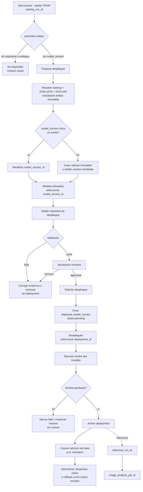

# Auditoría de integración: Ejecuciones → despliegue

## 0. Alcance y conclusiones ejecutivas

Esta auditoría se realizó sobre el backend FastAPI, el frontend React, las
migraciones PostgreSQL, los servicios de tracking/gobernanza/inferencia, los scripts
operativos y sus pruebas. La integración debe ser **aditiva** y debe reutilizar la
arquitectura ya implementada:

```text
training_run_id
  → model_version_id
  → deployed_model_version_id
  → inference_run_id
  → image_analysis_job_id
```

El `training_run_id` es sólo el punto de entrada para preparar o continuar una
promoción. La identidad desplegable es siempre `model_version_id`; la inferencia usa
un `deployed_model_version_id` activo o un alias gobernado que resuelve exactamente
uno. `best_model.keras`, `checkpoint_path` y el nombre del modelo son evidencia o
compatibilidad operativa, no identidad.

Hallazgo central: la base de datos y la capa de dominio de deployments ya existen y
son suficientemente completas para reutilizarlas. Faltan la fachada de aplicación
que prepare una liberación desde un training run, los comandos gobernados para
validar/aprobar versiones, el smoke test y el rollback como nueva revisión, además
de las acciones y navegación correspondientes en el frontend.

No se requieren tablas nuevas para runs, versiones, releases, environments, aliases,
deployments, inferencia o jobs. En particular, no se debe crear una tabla
`model_deployments`: la entidad canónica ya es `deployed_model_versions`.

La convención clínica es inmutable en esta integración:

```text
0 = uninfected
1 = parasitized
positive_label = parasitized
score_name = probability_parasitized
```

## 1. Arquitectura existente

### 1.1 Backend y persistencia

- FastAPI se inicia en `backend_api/app/main.py`.
- Las lecturas de ejecuciones están en `backend_api/app/routes/runs.py` y se apoyan
  en `backend_api/app/services/run_lineage.py`.
- La API gobernada está concentrada en
  `backend_api/app/routes/governance.py`.
- La conexión por datasource está en `backend_api/app/db.py`.
- El dominio y persistencia de gobernanza están en
  `malaria_dl_local_project/src/model_governance/`.
- `ModelVersionResolver` es la resolución autoritativa de una versión a un
  checkpoint registrado, con comprobación de ownership, estado, linaje, SHA-256 y
  mapping clínico.
- `ModelDeploymentService` valida, crea, activa, desactiva/retira y resuelve aliases.
- `TraceableInferenceService` resuelve un deployment activo, crea el inference run,
  crea el image job y persiste la predicción trazable.

La API no contiene middleware de autenticación ni dependencias de autorización. Los
POST existentes son técnicamente accesibles si el proceso FastAPI está expuesto. El
frontend, por decisión previa, no presenta esas acciones y declara la página de
deployments como sólo lectura.

### 1.2 Training, evaluación y explicabilidad

Todos los procesos son filas de `runs`, diferenciadas por `run_type`:

- `training`;
- `evaluation`;
- `explainability`;
- `inference`.

`run_lineage` enlaza training con evaluation/explainability mediante
`evaluates_checkpoint_from` y `explains_checkpoint_from`. Para nuevas escrituras
gobernadas, los triggers exigen también `model_version_id` y
`checkpoint_artifact_id`.

El entrenamiento:

1. guarda inicialmente el mejor checkpoint bajo el alias operativo
   `outputs/<modelo>/best_model.keras`;
2. materializa un snapshot por ejecución bajo
   `outputs/<modelo>/runs/<training_run_id>/`;
3. registra los archivos en `artifacts` con tamaño y SHA-256;
4. todavía usa `run_tracker.log_model_version`, escritor histórico que inserta la
   fila básica de `model_versions`.

Esta última parte es una brecha: `log_model_version` no usa
`model_governance.repository.create_model_version` y no completa por sí solo todos
los campos gobernados añadidos por la migración 024. El backfill conservador puede
completarlos cuando existe coincidencia inequívoca.

Evaluación y explicabilidad ya aceptan `model_version_id` mediante
`ModelVersionResolver`, y conservan la entrada legacy por path con advertencia. En
modo estricto, la identidad gobernada es obligatoria. `ModelVersionResolver` también
puede resolver desde `source_training_run_id` sólo si existe exactamente una
model_version utilizable, por lo que no se debe usar “la más reciente” ante
ambigüedad.

### 1.3 Release, model version y deployment son conceptos distintos

- `model_versions` representa la versión inmutable gobernada.
- `scripts/release_model_version.py` y
  `model_governance/releases.py:create_release` validan y copian el artefacto a
  `releases/<modelo>/<model_version_id>/`, generan manifest y snapshots, pero **no
  insertan la model_version en PostgreSQL**.
- `scripts/backfill_model_versions.py` crea filas gobernadas en DB para artefactos
  ya registrados y resueltos, pero no copia un release.
- `create_model_version` es el escritor de dominio que valida ownership
  training/artifact y evita reutilización silenciosa de hashes.
- `deployed_model_versions` representa revisiones operativas con threshold,
  preprocessing, mapping y políticas congeladas.

Por tanto, “Preparar despliegue” necesita una única fachada transaccional/idempotente
que coordine lo existente. No debe invocar dos flujos independientes que puedan
dejar un release en filesystem sin fila DB, o una fila DB apuntando a una copia que
no terminó.

### 1.4 Deployment, alias e inferencia

`ModelDeploymentService.validate_activation` comprueba:

- `lineage_status=resolved`;
- estado de versión `approved` o `validated`;
- training run, artifact y SHA-256;
- mapping `0=uninfected`, `1=parasitized`,
  `positive_label=parasitized`;
- preprocessing y firmas de entrada/salida;
- evaluación formal completada;
- threshold profile de la misma model_version;
- archivo presente, hash correcto, framework soportado y carga del modelo.

`create` crea un deployment `pending`. `activate` revalida, toma locks y desactiva
atómicamente el deployment activo del mismo
`(deployment_name, environment, alias)` antes de activar el nuevo. La caché se
invalida por `model_version_id`.

Hay una inconsistencia que debe resolverse antes de exponer rollback: el esquema y
la documentación de gobernanza establecen que promoción/rollback crean una nueva
revisión con `supersedes_deployment_id`/`rollback_of_deployment_id`, mientras
`activate` permite reactivar una fila `inactive`. Para rollback se debe respetar la
regla más fuerte del esquema: **crear una nueva revisión**, no reactivar el registro
histórico.

`TraceableInferenceService` ya materializa la cadena:

```text
deployed_model_versions
  → runs(run_type=inference)
  → run_model_deployments
  → image_analysis_jobs
  → predictions
```

No acepta paths físicos desde el cliente.

### 1.5 Frontend actual

El frontend es React 19 + TypeScript + Vite:

- no usa React Router;
- `App.tsx` mantiene `PageKey` e IDs seleccionados en estado;
- `Layout.tsx` implementa el menú colapsable “Modelo IA”, breadcrumb, persistencia
  en `localStorage`, teclado y ARIA;
- la etiqueta visible actual para `page='runs'` es “Entrenamientos”, aunque la
  pantalla muestra el título “Ejecuciones”;
- `Runs.tsx` consume `GET /runs/grouped-lineage`;
- `TrainingRunGroupCard` contiene la fila TRAIN y las tarjetas hijas;
- `RunSummaryRow` es el componente de la tarjeta/fila TRAIN y contiene
  “Ver detalle”;
- `RunLineageChildCard` renderiza EVALUATE y EXPLAIN, con sus acciones actuales;
- `ModelVersions.tsx` lista, filtra y abre un detalle de model versions;
- `Deployments.tsx` lista deployments y no ofrece acciones;
- `api.ts` sólo implementa GET para gobernanza;
- `types/api.ts` contiene contratos de lectura básicos;
- no existe store/contexto de permisos, autenticación, feature flags, toast,
  snackbar o notificaciones globales;
- sí existe un modal específico dentro de `Explainability.tsx`, con estilos
  reutilizables `audit-modal-*`, pero no existe un componente genérico ni wizard.

Los estilos de reporting se concentran en
`frontend/src/styles/report-components.css`; layout, tablas, estados, botones,
paneles y modal se apoyan también en `frontend/src/styles.css`. Los componentes
reutilizables relevantes son `DataTable`, `StatusBadge`, `Loading`,
`ReportBadge`, `LineageBadge`, `ReportFilters` y `ReportSelectFilter`.

## 2. Tablas y vistas reutilizadas

| Tabla/vista | Uso en el flujo | Decisión |
|---|---|---|
| `runs` | Training, evaluation, explainability e inference runs | Reutilizar |
| `artifacts` | Identidad física registrada, checksum, tamaño y disponibilidad | Reutilizar |
| `models` | Catálogo/model_id del training | Reutilizar |
| `model_versions` | Identidad oficial del modelo liberado y lifecycle | Reutilizar |
| `run_lineage` | TRAIN → EVALUATE/EXPLAIN con version/artifact | Reutilizar |
| `run_checkpoint_policy` | Checkpoint seleccionado y satisfacción de política | Reutilizar |
| `run_threshold_calibration` | Threshold gobernado y ligado a model_version | Reutilizar |
| `run_clinical_metrics` | Evidencia clínica de evaluación | Reutilizar |
| `deployed_model_versions` | Revisión inmutable de deployment | Reutilizar |
| `run_model_deployments` | Binding inference run ↔ deployment/version | Reutilizar |
| `image_analysis_jobs` | Job trazable de análisis de imagen | Reutilizar |
| `predictions` | Resultado con deployment/version/run/job | Reutilizar |
| `vw_run_dashboard` | Resumen de ejecuciones | Reutilizar |
| `vw_evaluation_lineage` | Evaluation runs vinculados | Reutilizar |
| `vw_explainability_lineage` | Explainability runs vinculados | Reutilizar |

No hay catálogo separado de environments. `environment` es texto no vacío dentro
de `deployed_model_versions`. Tampoco hay tabla de aliases: `alias` forma parte del
slot de deployment. El enum Python admite `candidate`, `challenger`, `champion` y
`experimental`; la DB sólo exige texto no vacío, por lo que API y DB deben
normalizar la misma allowlist antes de habilitar escrituras UI. `production` aparece
como concepto de environment, no como alias canónico.

## 3. Servicios y funciones reutilizados

| Servicio/función | Responsabilidad reutilizable | Observación |
|---|---|---|
| `grouped_run_lineage_payload` | Obtener trainings y EVALUATE/EXPLAIN vinculados | Hoy no incluye estado de promoción |
| `resolve_source_training_run` | Resolver ownership exacto training/checkpoint | Rechaza conflicto y ambigüedad |
| `inventory_artifacts` / `resolve_lineage` | Inventariar y resolver checkpoint por path/hash | Útil como fallback controlado |
| `validate_model_artifact` / `sha256_file` | Validación física e integridad | Reutilizar, no reimplementar |
| `create_release` | Copia inmutable y manifest de release | Debe coordinarse con DB |
| `create_model_version` | Alta gobernada de model_version | Escritor definitivo |
| `ModelVersionResolver.resolve` | Resolver model_version a checkpoint | Escritor/lector autoritativo |
| `ModelVersionResolver.validate_evaluation` | Asegurar que evaluation pertenece a la versión | Reutilizar en validación |
| `ModelDeploymentService.validate_activation` | Preflight de despliegue | Exponer mediante una fachada segura |
| `ModelDeploymentService.create` | Crear deployment pending | Reutilizar |
| `ModelDeploymentService.activate` | Cutover atómico del alias | Reutilizar para promoción |
| `ModelDeploymentService.transition` | Desactivar o retirar | Reutilizar |
| `ModelDeploymentService.resolve_alias` | Resolver un alias activo único | Reutilizar |
| `TraceableInferenceService.infer` | Inferencia trazable y persistencia | Reutilizar para smoke test |
| `model_governance.repository.get_lineage` | Reconstrucción de linaje extremo a extremo | Reutilizar |

## 4. Endpoints

### 4.1 Endpoints existentes a reutilizar

| Método | Endpoint | Uso |
|---|---|---|
| GET | `/runs/{training_run_id}` | Obtener detalle del training run |
| GET | `/runs/{training_run_id}/checkpoint-policy` | Política/checkpoint seleccionado |
| GET | `/runs/{training_run_id}/artifacts` | Artefactos registrados |
| GET | `/runs/grouped-lineage` | TRAIN con EVALUATE/EXPLAIN vinculados |
| GET | `/api/model-versions` | Listado y evidencia resumida |
| GET | `/api/model-versions/{model_version_id}` | Detalle de versión |
| GET | `/api/model-versions/{model_version_id}/lineage` | Linaje de versión |
| GET | `/api/deployments` | Historial de deployments |
| GET | `/api/deployments/active` | Slots activos |
| GET | `/api/deployments/{deployed_model_version_id}` | Detalle de deployment |
| POST | `/api/deployments` | Crear deployment pending |
| POST | `/api/deployments/{id}/activate` | Activar/cutover |
| POST | `/api/deployments/{id}/deactivate` | Desactivar |
| POST | `/api/deployments/{id}/retire` | Retirar |
| POST | `/api/image-analysis-jobs` | Inferencia trazable |
| GET | `/api/image-analysis-jobs/{id}` | Estado del job |
| GET | `/api/image-analysis-jobs/{id}/predictions` | Resultado del job |
| GET | `/api/inference-runs/{id}` | Run de inferencia |

`GET /runs/{id}` obtiene el training run individual. Los procesos EVALUATE/EXPLAIN
se obtienen hoy de manera agrupada con `/runs/grouped-lineage`; no existe un endpoint
dedicado por training run.

### 4.2 Endpoints mínimos que faltan

Los siguientes endpoints deben incorporarse en la misma ruta de gobernanza, usando
los servicios existentes:

| Método | Endpoint definitivo propuesto | Responsabilidad |
|---|---|---|
| GET | `/api/training-runs/{id}/promotion-status` | Resolver estado del botón, IDs y causa; no muta |
| POST | `/api/training-runs/{id}/prepare-release` | Resolver o crear exactamente una model_version idempotente |
| POST | `/api/model-versions/{id}/validate` | Ejecutar validaciones y pasar candidate → validated |
| POST | `/api/model-versions/{id}/approve` | Aprobación humana auditada, validated → approved |
| POST | `/api/model-versions/{id}/reject` | Rechazo humano auditado con causa |
| POST | `/api/deployments/{id}/smoke-test` | Ejecutar evidencia controlada antes de activar |
| POST | `/api/deployments/{id}/rollback` | Crear una nueva revisión basada en una revisión histórica |

No se propone un segundo `POST /release` ni un endpoint paralelo
`/model-deployments`. `prepare-release` es una fachada sobre
`create_release`/`create_model_version`, y todos los endpoints operativos siguen
usando `deployed_model_versions`.

El POST existente `/api/deployments` debe conservarse, pero se recomienda:

- eliminar o ignorar `activate=true` desde el frontend para mantener create,
  smoke-test y activate como pasos separados;
- exigir `Idempotency-Key`, actor autenticado y reason cuando aplique;
- no confiar en `deployed_by` enviado libremente por el cuerpo;
- devolver errores de validación estructurados, no sólo
  `Operación rechazada: <tipo>`.

### 4.3 Contrato de `promotion-status`

Debe devolver como mínimo:

```json
{
  "training_run_id": "uuid",
  "state": "ready_to_prepare",
  "action": "prepare_release",
  "label": "Preparar despliegue",
  "enabled": true,
  "reason_code": null,
  "reason": null,
  "model_version_id": null,
  "deployed_model_version_id": null,
  "model_version_status": null,
  "deployment_status": null
}
```

La consulta debe detectar cardinalidad. Más de una model_version utilizable para el
training, más de un deployment pending aplicable o un checkpoint con ownership
conflictivo no se resuelve por fecha: devuelve estado ambiguo y deshabilita.

## 5. Componentes frontend reutilizados

| Componente/archivo | Reutilización |
|---|---|
| `Runs.tsx` | Carga y agrupación de Ejecuciones |
| `TrainingRunGroupCard.tsx` | Contenedor exclusivo de acción de promoción TRAIN |
| `RunSummaryRow.tsx` | Tarjeta/fila TRAIN y botón “Ver detalle” existente |
| `RunLineageChildCard.tsx` | Mantener acciones actuales de EVALUATE/EXPLAIN |
| `ModelVersions.tsx` | Validar, aprobar/rechazar y solicitar deployment |
| `Deployments.tsx` | Activar, desactivar, retirar y rollback |
| `App.tsx` | Navegación actual por `PageKey` y selección de IDs |
| `Layout.tsx` | Menú Modelo IA y breadcrumbs |
| `api.ts` | Cliente único hacia `backend_api` |
| `types/api.ts` | Contratos de promotion/model/deployment |
| `StatusBadge` / `ReportBadge` | Estados de versión y deployment |
| `DataTable` / `Loading` | Listados y estados de carga |
| estilos `audit-modal-*` | Base visual para diálogo, previa extracción |

No existe un wizard genérico. Conviene extraer un `Modal` accesible a
`frontend/src/components/Modal.tsx` y construir un diálogo de preparación pequeño;
no duplicar el modal específico de Explainability. Para operaciones asíncronas
también falta un mecanismo mínimo de feedback: un componente de alerta inline
reutilizable o un `NotificationProvider`. No se debe simular éxito sólo cambiando el
estado local.

## 6. Funcionalidad existente y faltante

### Ya existe

- tracking de training/evaluation/explainability;
- agrupación de linaje en Ejecuciones;
- snapshot por training run y artifacts con checksum;
- esquema y entidad de model version;
- resolución estricta de model version;
- copia inmutable de release y manifest;
- validación técnica previa a deployment;
- creación de deployment pending;
- activación con cutover de alias;
- desactivación y retiro;
- inferencia trazable con deployment/version/run/job;
- páginas de Modelos liberados, Despliegues y Trazabilidad;
- endpoints de lectura y endpoints backend operativos de deployments.

### Falta o está incompleto

- endpoint idempotente training run → estado de promoción;
- endpoint idempotente training run → resolver/crear model_version;
- coordinación atómica/compensable entre release físico y model_version DB;
- escritor de entrenamiento alineado con `create_model_version`;
- endpoints y servicio de lifecycle candidate → validated → approved/rejected;
- selección explícita de la evaluación/explicabilidad correcta cuando hay varias;
- preflight de deployment expuesto sin crear un registro;
- smoke test definido, persistido y exigido para activar;
- rollback que cree nueva revisión con `rollback_of_deployment_id`;
- actualización consistente de `model_versions.status` a `deployed`, si esa
  semántica se conserva;
- allowlist/configuración única de environments y aliases;
- autenticación, roles, permisos e identidad de actor;
- idempotency keys y auditoría de comandos HTTP;
- frontend de escritura y feedback de operaciones;
- navegación dirigida por `model_version_id`/`deployment_id`;
- pruebas de estados del botón y de la secuencia completa.

## 7. Matriz de requisitos

| Requisito | Ya existe | Reutilizar | Cambio necesario | Archivo |
|-----------|-----------|------------|------------------|---------|
| Obtener training run | Sí | `GET /runs/{id}` | Ninguno para detalle | `backend_api/app/routes/runs.py` |
| Obtener EVALUATE/EXPLAIN | Sí, agrupado | `grouped_run_lineage_payload` | Filtrar/embebir por training en promotion-status | `backend_api/app/services/run_lineage.py` |
| Encontrar checkpoint inmutable | Parcial | artifacts, checkpoint policy, resolver, SHA | Resolver cardinalidad y nunca escoger alias mutable | `model_version_resolver.py`, `releases.py` |
| Obtener model_version | Sí | GET de gobernanza | Añadir filtro/estado por training | `backend_api/app/routes/governance.py` |
| Crear model_version | Sí, dominio/script | `create_model_version` | Fachada idempotente prepare-release | `model_governance/repository.py`, ruta/servicio nuevo |
| Copiar release inmutable | Sí | `create_release` | Coordinar con DB y compensación | `model_governance/releases.py` |
| Validar versión | Parcial | resolver + `validate_activation` | Servicio/endpoint de lifecycle y errores estructurados | `model_deployment_service.py`, ruta nueva |
| Aprobar/rechazar versión | No | estados/constraints existentes | Servicio y endpoints auditados | servicio/ruta de gobernanza |
| Crear deployment pending | Sí | `ModelDeploymentService.create` | Permisos, idempotencia y UI | `governance.py`, `api.ts`, `ModelVersions.tsx` |
| Smoke test | No | `TraceableInferenceService` | Caso de prueba configurado, evidencia y gate | servicio/ruta nueva |
| Activar deployment | Sí | `activate` | Permisos, gate smoke y UI | `model_deployment_service.py`, `Deployments.tsx` |
| Cambiar champion | Sí, por cutover | mismo slot/alias | UI y política de environment | `model_deployment_service.py` |
| Desactivar/retirar | Sí | `transition` | Permisos, reason y UI | `governance.py`, `Deployments.tsx` |
| Reactivar | Sí técnicamente | `activate(inactive)` | Limitar a reactivación operacional; no usar como rollback histórico | `model_deployment_service.py` |
| Rollback | Esquema sí; servicio no | campos `rollback_of`/`supersedes` | Crear nueva revisión y activar atómicamente | `model_deployment_service.py` |
| Estado del botón TRAIN | No | grouped lineage + gobernanza | Endpoint agregado y componente de acción | `TrainingRunGroupCard.tsx`, `RunSummaryRow.tsx` |
| Acción sólo en TRAIN | Estructura lo permite | `RunSummaryRow` | Pasar action sólo desde group TRAIN | `TrainingRunGroupCard.tsx` |
| EVALUATE/EXPLAIN sin deploy | Sí | `RunLineageChildCard` | Mantener sin callbacks de promoción | `RunLineageChildCard.tsx` |
| Navegar a versión/deployment | Parcial, sólo páginas | `PageKey` | Conservar ID seleccionado/deep link | `App.tsx`, páginas |
| Permisos | No | — | Autenticación y autorización backend primero | `backend_api/app/main.py`, dependencias nuevas |
| Notificaciones | No | paneles/error existentes | Feedback común accesible | componentes/estilos frontend |
| Modal/wizard | Modal específico | estilos de Explainability | Extraer modal genérico; diálogo corto | `Explainability.tsx`, componente nuevo |
| Environments | Campo libre | `deployed_model_versions.environment` | Config/allowlist; no tabla nueva | configuración y esquema API |
| Aliases | Enum parcial | `DeploymentAlias` y slot único | Alinear validación API/DB | `entities.py`, schemas de API |
| Inferencia trazable | Sí | servicio y endpoints existentes | Sólo integración del smoke | `traceable_inference.py` |
| Convención clínica | Sí | mappings/constraints existentes | No modificar | migrations, resolver, deployment service |

## 8. Flujo final



## 9. Estados del botón de la tarjeta TRAIN

El backend, no el frontend, decide el estado. El botón se renderiza únicamente en la
fila TRAIN. `TrainingRunGroupCard` debe pasar la acción a `RunSummaryRow`; las
instancias EVALUATE/EXPLAIN siguen en `RunLineageChildCard` sin prop de promoción.

| Prioridad | Condición autoritativa | Texto | Acción |
|---:|---|---|---|
| 1 | Training no completado, checkpoint no gobernado, evaluación requerida ausente/no completada, artifact ausente/hash inválido | `No disponible` | Deshabilitado; tooltip/ayuda con causa |
| 1 | Más de una version candidata utilizable, ownership conflictivo o más de un deployment pendiente aplicable | `No disponible` | Deshabilitado; causa “linaje ambiguo” |
| 1 | Model version `rejected` o `retired` sin otra versión utilizable | `No disponible` | Deshabilitado; causa exacta |
| 2 | Training listo y ninguna model_version | `Preparar despliegue` | Abre diálogo y ejecuta prepare-release |
| 3 | Model version `discovered`, `candidate` o `validated`, aún no aprobada | `Ver modelo liberado` | Navega a Modelos liberados con ID |
| 4 | Model version `approved`/`deployed` y ningún deployment aplicable | `Continuar despliegue` | Navega a Modelos liberados con ID y CTA de solicitud |
| 5 | Existe deployment `pending` o `failed` recuperable | `Ver despliegue pendiente` | Navega a Despliegues con deployment ID |
| 6 | Existe deployment `active` | `Ver despliegue` | Navega a Despliegues con deployment ID |

Reglas adicionales:

- un deployment activo tiene precedencia visual sobre estados anteriores;
- `inactive`/`retired` no se presenta como activo; si la model_version sigue
  aprobada, el estado vuelve a “Continuar despliegue”, salvo que exista una revisión
  pending;
- nunca inferir “aprobada” sólo por tener evaluation;
- nunca resolver una ambigüedad tomando `ORDER BY created_at DESC LIMIT 1`;
- mostrar `reason_code` estable y una explicación segura, sin paths internos;
- mantener “Ver detalle” como acción secundaria independiente.

## 10. Reglas de navegación

1. Ejecuciones inicia o continúa la promoción, pero no valida ni activa.
2. “Preparar despliegue” conserva `training_run_id` sólo durante la resolución.
   Cuando existe/crea la versión, navega con `model_version_id`.
3. Modelos liberados recibe `model_version_id`, enfoca la fila/detalle y es el único
   lugar para validar, aprobar/rechazar y solicitar un deployment.
4. Tras crear el deployment, la navegación cambia a
   `deployed_model_version_id`; no vuelve a depender del training run.
5. Despliegues recibe `deployment_id`, enfoca la revisión y es el único lugar para
   smoke, activar, desactivar, retirar y rollback.
6. EVALUATE y EXPLAIN conservan “Ver evaluación” y “Ver explicabilidad”; no exponen
   “Preparar despliegue”.
7. Cambiar datasource limpia los IDs seleccionados para evitar navegación cruzada.
8. Mientras no se incorpore React Router, `App.tsx` debe mantener
   `selectedModelVersionId` y `selectedDeploymentId`. Para enlaces recargables y
   auditoría operativa, la mejora recomendada es URL estable:
   `/model-versions/:id` y `/deployments/:id`; no es requisito para el primer corte,
   pero sí antes de producción multiusuario.
9. La etiqueta de menú debe unificarse como “Ejecuciones” para coincidir con el
   alcance de TRAIN/EVALUATE/EXPLAIN.

## 11. Reglas de permisos

No hay permisos implementados; por ello ninguna acción de escritura debe habilitarse
en producción antes de incorporar autorización backend. Ocultar botones no es una
medida de seguridad.

Matriz mínima recomendada:

| Capacidad | Rol sugerido |
|---|---|
| Ver runs, versiones, deployments y linaje | `model_viewer` |
| Preparar release y validar técnicamente | `ml_engineer` o `model_releaser` |
| Aprobar/rechazar model version | `model_approver`, separado del preparador |
| Crear deployment pending y smoke test | `model_deployer` |
| Activar/desactivar/retirar en experimental | `model_deployer` |
| Activar/cambiar champion/rollback en production | `deployment_admin` |

Reglas obligatorias:

- autenticación y autorización se ejecutan en FastAPI;
- actor se obtiene del principal autenticado, no del body;
- aprobación y activación guardan actor, timestamp, reason e idempotency key;
- separación de funciones para `production`;
- el frontend consume capacidades devueltas por sesión sólo para UX;
- `datasource`, environment, deployment slot y recurso se incluyen en la decisión;
- CORS y métodos deben ajustarse al cliente autenticado;
- `dry_run` es lectura/preflight y no concede permiso de escritura;
- errores 401/403 son distintos de 409 de estado.

## 12. Riesgos

1. **Doble fuente release/DB.** `create_release` copia archivos pero no crea DB;
   `create_model_version` crea DB pero no copia. La fachada debe ser idempotente y
   compensable.
2. **Writer histórico del training.** `run_tracker.log_model_version` no llena todos
   los campos gobernados. Preparar puede depender de backfill si no se corrige en un
   cambio posterior.
3. **Ambigüedad.** Un training puede tener varias model versions; un path genérico
   puede compartir hash. Nunca elegir por “último”.
4. **Inconsistencia de estados.** Python permite activar versiones `validated`,
   mientras el trigger DB exige `approved`/`deployed` para `status=active`. El
   contrato definitivo debe exigir `approved` para activación.
5. **Rollback divergente.** El servicio permite reactivar `inactive`; el esquema
   exige nueva revisión para rollback histórico.
6. **Smoke test sin modelo de evidencia.** No hay estado/campo específico. En el
   primer corte puede registrarse en `metadata` y en el inference run/job existente;
   si se requieren múltiples aprobaciones o retención formal, evaluar luego una
   tabla de eventos, no antes.
7. **Aliases/environments desalineados.** Python tiene enum; DB acepta texto libre.
8. **Sin autenticación.** Los endpoints POST existentes carecen de protección.
9. **Errores opacos.** `safe()` oculta detalles útiles y no entrega códigos de causa.
10. **Concurrencia.** Dos preparaciones simultáneas pueden crear copias/filas si no
    se usa una clave única y lock por training/artifact.
11. **Estado UI obsoleto.** El frontend debe recargar `promotion-status` después de
    cada comando y no actualizar optimistamente estados clínicos.
12. **Filesystem local.** La copia release y la comprobación de existencia dependen
    de paths locales; en despliegues distribuidos se requiere artifact store común.
13. **Semántica `deployed` de model_version.** No hay servicio que sincronice ese
    estado; decidir si es derivado o persistido antes de implementarlo.
14. **Mutabilidad accidental de aliases legacy.** `best_model.keras` no puede entrar
    en un deployment sin resolver al artifact inmutable y verificar SHA-256.

## 13. Estrategia de rollback

### Rollback de deployment clínico

1. Seleccionar una revisión histórica compatible del mismo
   `(deployment_name, environment, alias)`.
2. Revalidar model version, artifact, SHA-256, threshold, mapping, firmas y carga.
3. Crear una **nueva** fila `deployed_model_versions` copiando los snapshots
   congelados de la revisión estable.
4. Informar `rollback_of_deployment_id=<deployment fallido>` y
   `supersedes_deployment_id=<deployment actualmente activo>`.
5. Ejecutar smoke test sobre la nueva revisión.
6. Activar/cambiar alias dentro de una transacción que serialice el slot.
7. Dejar la revisión desplazada `inactive`; retirar requiere una acción explícita.
8. Invalidar caché. No copiar sobre `best_model.keras`, no mutar la model_version y
   no borrar inferencias históricas.

### Rollback de aplicación

- desplegar backend primero con endpoints aditivos y feature flag de UI apagado;
- el frontend antiguo sigue funcionando porque se conservan todos los GET y
  `PageKey`;
- apagar las acciones de promoción sin retirar las lecturas;
- no revertir migraciones 024–027 ni borrar columnas/tablas con evidencia;
- si prepare-release falla después de copiar pero antes de registrar, mover el
  directorio incompleto a cuarentena o eliminar sólo el directorio UUID recién
  creado y no referenciado;
- si falla después de crear la model_version, no borrarla: marcar la operación
  fallida en metadata/auditoría y reintentar idempotentemente.

## 14. Archivos que deben modificarse

### Backend/dominio

- `backend_api/app/routes/governance.py`: nuevos contratos/endpoints; separar
  preflight de mutación y errores estructurados.
- `backend_api/app/main.py`: dependencias de autenticación/autorización y CORS.
- `backend_api/app/services/run_lineage.py`: reutilizar/proyectar estado por training.
- `malaria_dl_local_project/src/model_governance/releases.py`: idempotencia y
  coordinación de release sin cambiar su identidad.
- `malaria_dl_local_project/src/model_governance/repository.py`: reutilizar
  `create_model_version`; helpers de lookup/idempotencia, no nuevos modelos.
- `malaria_dl_local_project/src/model_deployment_service.py`: alinear approved,
  smoke gate y rollback como nueva revisión.
- `malaria_dl_local_project/src/model_version_resolver.py`: reutilizar sin relajar
  comprobaciones.
- `malaria_dl_local_project/src/traceable_inference.py`: reutilizar para smoke con
  contexto controlado, no crear otra inferencia.
- `malaria_dl_local_project/src/run_tracker.py` o
  `tracking_integration.py`: en fase posterior, reemplazar el writer legacy de
  model_version por el gobernado.

Se recomienda un servicio de aplicación nuevo y delgado, por ejemplo
`malaria_dl_local_project/src/model_release_service.py`, que orqueste resolución,
release y repositorio. No debe contener un segundo ORM/repositorio.

### Frontend

- `frontend/src/App.tsx`: IDs seleccionados y navegación entre las tres áreas.
- `frontend/src/components/Layout.tsx`: unificar etiqueta “Ejecuciones”.
- `frontend/src/pages/Runs.tsx`: cargar promotion-status para trainings visibles.
- `frontend/src/components/reports/TrainingRunGroupCard.tsx`: pasar sólo a TRAIN la
  acción.
- `frontend/src/components/reports/RunSummaryRow.tsx`: acción secundaria y causa.
- `frontend/src/pages/ModelVersions.tsx`: selección por ID, validación,
  aprobación/rechazo y solicitud.
- `frontend/src/pages/Deployments.tsx`: detalle y acciones operativas.
- `frontend/src/services/api.ts`: POST, headers, cuerpos y errores tipados.
- `frontend/src/types/api.ts`: contratos de promoción, validación y comandos.
- `frontend/src/styles/report-components.css` y `frontend/src/styles.css`: estados,
  diálogo y feedback, preservando el design system.
- `frontend/src/components/Modal.tsx` y un componente de feedback accesible, si se
  extraen como piezas comunes.

### Tests y documentación

- `backend_api/tests/test_governance_api.py`;
- nuevo test del servicio de release/promotion;
- `malaria_dl_local_project/tests/test_model_deployment_service.py`;
- `malaria_dl_local_project/tests/test_model_governance_postgres.py`;
- `malaria_dl_local_project/tests/test_model_releases.py`;
- `frontend/tests/model-ai-navigation.test.mjs`;
- nuevos tests de estado del botón/navegación;
- `docs/model_release_process.md`;
- `docs/model_deployment_and_inference.md`;
- `docs/frontend_model_ai_navigation.md`.

No se prevé una migración para el flujo mínimo. Si el smoke gate o auditoría
requieren evidencia estructurada no representable de forma segura en
`runs`/`image_analysis_jobs`/`metadata`, esa decisión debe tratarse como una
migración posterior y no como duplicación de deployments.

## 15. Plan exacto de implementación

1. **Cerrar contratos de dominio.** Acordar que activación exige `approved`,
   rollback crea una revisión nueva, aliases permitidos son
   `candidate/challenger/champion/experimental` y definir environments permitidos.
2. **Agregar autenticación y permisos backend.** Proteger también los POST ya
   existentes antes de exponerlos en UI; actor desde el principal.
3. **Implementar lookup de promoción read-only.** Crear
   `GET /api/training-runs/{id}/promotion-status` con reglas de cardinalidad,
   causas estables y los IDs canónicos.
4. **Implementar servicio prepare-release.** Validar run completado, policy,
   artifact ownership/hash, EVALUATE/EXPLAIN; reutilizar una model_version única o
   coordinar `create_release` + `create_model_version` con idempotencia.
5. **Añadir tests de prepare-release.** Cubrir reintento, concurrencia, artifact
   ausente, hash distinto, alias mutable, dos versiones y linaje ambiguo.
6. **Implementar lifecycle de model_version.** Endpoints validate,
   approve/reject con transiciones permitidas, timestamps, actor y reason.
7. **Alinear validación de deployment.** Exigir `approved`, exponer preflight
   estructurado y conservar `ModelDeploymentService.create` para pending.
8. **Implementar smoke test.** Usar `TraceableInferenceService` con una imagen
   controlada/configurada; guardar `inference_run_id`, `image_analysis_job_id`,
   resultado y actor como evidencia; bloquear activate sin smoke exitoso vigente.
9. **Implementar rollback correcto.** Nueva revisión con vínculos históricos,
   smoke y cutover transaccional; mantener deactivate/retire existentes.
10. **Extender cliente y tipos frontend.** Soportar métodos/cuerpos/headers,
    códigos de error y permisos.
11. **Integrar Ejecuciones.** Consultar promotion-status, mostrar el botón sólo en
    TRAIN y conservar todas las acciones actuales de EVALUATE/EXPLAIN.
12. **Integrar Modelos liberados.** Foco por `model_version_id`, validación,
    aprobación/rechazo y creación pending.
13. **Integrar Despliegues.** Foco por `deployment_id`, smoke, activate,
    deactivate, retire y rollback según permiso.
14. **Añadir feedback y accesibilidad.** Modal común, loading por acción,
    confirmación para cutover/retire/rollback, foco restaurado y anuncios
    `aria-live`.
15. **Pruebas integrales.** Backend unitario, PostgreSQL real, concurrencia de
    alias/idempotencia, frontend de estados/navegación, build y smoke E2E.
16. **Despliegue progresivo.** Backend y permisos primero; UI bajo feature flag en
    experimental; validar auditoría y rollback; habilitar production al final.

## 16. Criterios de aceptación

- El botón de promoción existe sólo en TRAIN.
- El primer clic parte de `training_run_id`, pero toda navegación posterior usa
  `model_version_id` o `deployed_model_version_id`.
- Reintentar prepare-release no duplica release ni model_version.
- Un linaje ambiguo queda bloqueado con causa visible.
- Ningún endpoint acepta `checkpoint_path`, `model_path` o `best_model.keras` desde
  el frontend como identidad.
- No se crea otra tabla/servicio paralelo de deployments.
- EVALUATE y EXPLAIN conservan sus acciones actuales y no despliegan.
- Una versión no aprobada no puede activarse.
- Crear deployment produce `pending`; smoke y activate son pasos distintos.
- Champion se cambia atómicamente y existe como máximo un activo por slot.
- Rollback crea un nuevo `deployed_model_version_id`.
- Retirar/desactivar no destruye runs, jobs, predicciones ni linaje.
- Toda acción registra actor, reason cuando corresponda e idempotency key.
- La inferencia conserva la cadena completa hasta `image_analysis_job_id`.
- Se preserva exactamente la convención clínica indicada al inicio.

