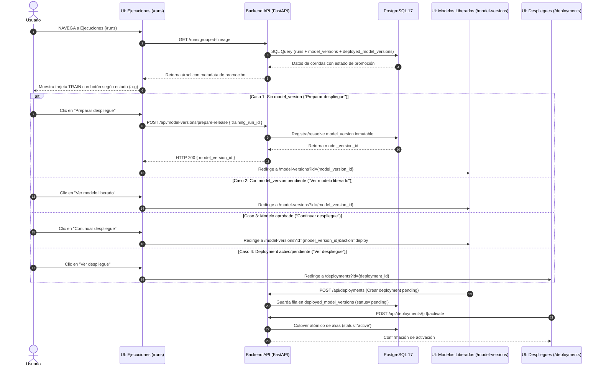

# Auditoría de Integración: Promoción de Modelos desde Ejecuciones hasta Despliegues

**Fecha:** 2026-07-22  
**Autor:** Arquitecto de Software Senior, Ingeniero MLOps y Desarrollador Full-Stack  
**Proyecto:** Capstone MIA — Universidad Adolfo Ibáñez  

---

## 1. Arquitectura Existente

El sistema cuenta con un release gobernado e inmutable previa y exitosamente validado en la Etapa 0. La arquitectura de linaje responde al flujo:

$$\text{training\_run\_id} \longrightarrow \text{model\_version\_id} \longrightarrow \text{deployed\_model\_version\_id} \longrightarrow \text{inference\_run\_id} \longrightarrow \text{image\_analysis\_job\_id}$$

El **`training_run_id`** actúa como el punto de entrada para localizar la corrida física y preparar la liberación, pero **nunca es la identidad final del modelo desplegado**.

La interfaz respeta la separación estricta de responsabilidades entre tres módulos de la plataforma:

1. **Ejecuciones (`/runs`)**: Visualiza el árbol de linaje *read-only* de entrenamientos, evaluaciones y explicabilidades. Permite iniciar o continuar la promoción únicamente desde la tarjeta **TRAIN**.
2. **Modelos Liberados (`/model-versions`)**: Permite inspeccionar artefactos inmutables (`model_version_id`), validar linaje completo, aprobar la versión y solicitar la creación de un nuevo despliegue.
3. **Despliegues (`/deployments`)**: Permite activar, desactivar, retirar o ejecutar rollback de despliegues gobernados (`deployed_model_version_id`) por entorno y alias.

---

## 2. Tablas Reutilizadas

El diseño no duplica tablas del esquema relacional en PostgreSQL 17:

- `runs`: Registro principal de ejecuciones de tipo `training`, `evaluation`, `explainability`.
- `run_lineage`: Relaciones transaccionales de linaje entre corridas padre e hijo (`evaluates_checkpoint_from`, `explains_checkpoint_from`).
- `artifacts`: Registro de archivos físicos (checkpoints Keras/TensorFlow) con sus checksums SHA-256.
- `model_versions`: Registro inmutable de la versión liberada de un modelo (`artifact_sha256`, `preprocessing_profile_snapshot`, `class_mapping`).
- `deployed_model_versions`: Instancia de despliegue por entorno (`production`, `staging`, `experimental`), vinculada a un umbral y alias (`champion`, `candidate`).
- `run_threshold_calibration`: Parámetros y métricas de la calibración del umbral diagnóstico.

---

## 3. Servicios Reutilizados

No se crean servicios duplicados; se extienden los componentes MLOps existentes:

- **`ModelDeploymentService` (`src/model_deployment_service.py`)**:
  - `validate_activation(model_version_id, threshold_profile_id)`: Valida la presencia de artefacto, hash SHA-256, firmas, preprocesamiento y evaluación formal.
  - `create(...)`: Crea un registro en `deployed_model_versions` con estado `pending`.
  - `activate(deployment_id, actor)`: Realiza el cutover atómico de alias en PostgreSQL y limpia la caché de inferencia.
  - `transition(deployment_id, status, actor, reason)`: Pasa despliegues a `inactive` o `retired`.
- **`repository` (`src/model_governance/repository.py`)**:
  - `create_model_version(...)`, `get_model_version(...)`, `create_deployed_model_version(...)`.
- **`releases` (`src/model_governance/releases.py`)**:
  - `create_release(...)`: Copia inmutable direccionada por UUID, verificación de checksum SHA-256 y generación de manifiestos.

---

## 4. Endpoints Reutilizados y a Exponer

### Endpoints Existentes Reutilizados:
- `GET /runs/grouped-lineage`: Retorna el árbol agrupado de corridas. *(Se enriquecerá para retornar el estado de promoción)*.
- `GET /api/model-versions`: Lista las versiones de modelos liberados.
- `GET /api/model-versions/{id}`: Detalle de una versión de modelo.
- `GET /api/deployments`: Lista despliegues.
- `GET /api/deployments/active`: Lista despliegues activos por entorno.
- `POST /api/deployments`: Crea un nuevo despliegue en estado `pending`.
- `POST /api/deployments/{id}/activate`: Transición atómica a `active`.
- `POST /api/deployments/{id}/deactivate`: Transición a `inactive`.
- `POST /api/deployments/{id}/retire`: Transición definitiva a `retired`.

### Endpoints Nuevos Necesarios:
- `POST /api/model-versions/prepare-release`: Recibe `training_run_id` y crea/resuelve la `model_version_id` correspondiente en la base de datos si aún no existía, o retorna la existente.

---

## 5. Componentes Frontend Reutilizados

- `Runs.tsx` (`frontend/src/pages/Runs.tsx`): Página del menú Ejecuciones.
- `TrainingRunGroupCard.tsx` (`frontend/src/components/reports/TrainingRunGroupCard.tsx`): Tarjeta grupal del linaje.
- `RunSummaryRow.tsx` (`frontend/src/components/reports/RunSummaryRow.tsx`): Fila contenedora de la tarjeta TRAIN, donde se alojará el nuevo botón de promoción.
- `RunLineageChildCard.tsx` (`frontend/src/components/reports/RunLineageChildCard.tsx`): Tarjetas de EVALUATE y EXPLAIN (se mantienen sin cambios ni botones de despliegue directo).
- `ModelVersions.tsx` (`frontend/src/pages/ModelVersions.tsx`): Página del menú Modelos liberados.
- `Deployments.tsx` (`frontend/src/pages/Deployments.tsx`): Página del menú Despliegues.

---

## 6. Funcionalidad Faltante

1. **Backend**:
   - Extensión de la consulta SQL `TRAINING_RUNS_SQL` en `backend_api/app/services/run_lineage.py` para realizar `LEFT JOIN` con `model_versions` y `deployed_model_versions`, adjuntando al objeto `training`:
     - `model_version_id`
     - `model_version_status`
     - `model_version_lineage_status`
     - `deployment_id`
     - `deployment_status`
     - `deployment_alias`
     - `deployment_environment`
   - Creación del endpoint `POST /api/model-versions/prepare-release` en `backend_api/app/routes/governance.py`.
2. **Frontend**:
   - Definición de tipos TypeScript actualizados en `frontend/src/types/api.ts`.
   - Método `prepareRelease(trainingRunId)` en `frontend/src/services/api.ts`.
   - Componente de botón de promoción dinámico en `RunSummaryRow.tsx` evaluando la matriz de 7 estados.
   - Diálogo Modal de Promoción Rápida para configurar entorno (`production`, `staging`, `experimental`) y alias (`champion`, `candidate`).
   - Soporte de filtrado/navegación mediante URL query parameters en `ModelVersions.tsx` (`?id=...`) y `Deployments.tsx` (`?id=...`).

---

## 7. Archivos a Modificar

| Archivo | Rol | Descripción de la Modificación |
| :--- | :--- | :--- |
| `backend_api/app/services/run_lineage.py` | Backend Service | Modificar `TRAINING_RUNS_SQL` para incluir `LEFT JOIN` a `model_versions` y `deployed_model_versions`. |
| `backend_api/app/routes/governance.py` | Backend Route | Añadir endpoint `POST /api/model-versions/prepare-release`. |
| `frontend/src/types/api.ts` | Frontend Types | Añadir campos de promoción a `RunDashboard`. |
| `frontend/src/services/api.ts` | Frontend API | Implementar función `prepareRelease(trainingRunId)`. |
| `frontend/src/components/reports/RunSummaryRow.tsx` | Frontend Component | Agregar la lógica visual y renderizado del botón de promoción únicamente en tarjetas TRAIN. |
| `frontend/src/pages/Runs.tsx` | Frontend Page | Agregar manejadores de navegación y modal de preparación de despliegue. |
| `frontend/src/pages/ModelVersions.tsx` | Frontend Page | Leer query param `id` para enfocar/resaltar la versión seleccionada. |
| `frontend/src/pages/Deployments.tsx` | Frontend Page | Leer query param `id` para enfocar/resaltar el despliegue seleccionado. |

---

## 8. Diagrama Mermaid del Flujo Completo

---

## 9. Matriz de Estados del Botón (Tarjeta TRAIN)

La lógica visual del botón aplica **exclusivamente a la tarjeta TRAIN**:

| Estado | Condición Backend / Base de Datos | Texto del Botón | Clase CSS / Estilo | Acción / Comportamiento | Destino de Navegación |
| :---: | :--- | :--- | :--- | :--- | :--- |
| **a** | Entrenamiento incompleto (`status != 'completed'`), o sin artefacto válido de checkpoint. | **No disponible** | `btn-disabled` | Botón deshabilitado con tooltip indicando causa ("Entrenamiento no finalizado"). | Ninguno. |
| **b** | Entrenamiento finalizado (`completed`), checkpoint válido, pero `model_version_id IS NULL`. | **Preparar despliegue** | `btn-primary` | Invoca `POST /api/model-versions/prepare-release` y redirige. | `/model-versions?id={new_id}` |
| **c** | `model_version_id` existe, pero `status IN ('discovered', 'candidate', 'draft')` (pendiente de validación/aprobación). | **Ver modelo liberado** | `btn-secondary` | Redirige al detalle del modelo liberado para su evaluación formal. | `/model-versions?id={mv_id}` |
| **d** | `model_version_id` existe y está `approved` o `validated`, pero sin despliegue activo ni pendiente. | **Continuar despliegue** | `btn-success` | Redirige a solicitar la creación del despliegue. | `/model-versions?id={mv_id}&action=deploy` |
| **e** | Despliegue creado en estado `pending` o `inactive`. | **Ver despliegue pendiente** | `btn-warning` | Redirige a la pantalla de Despliegues resaltando la instancia pendiente. | `/deployments?id={dep_id}` |
| **f** | Despliegue en estado `active` (`environment` y `alias` vigentes). | **Ver despliegue** | `btn-info` | Redirige a la pantalla de Despliegues resaltando el despliegue activo. | `/deployments?id={dep_id}` |
| **g** | Modelo con `status = 'rejected'`, `lineage_status = 'ambiguous'`, o retenido por fallo de auditoría. | **No disponible** | `btn-disabled-danger` | Botón deshabilitado mostrando tooltip de causa ("Modelo rechazado" / "Linaje ambiguo"). | Ninguno. |

---

## 10. Reglas de Navegación y Enrutamiento

1. **Tarjeta TRAIN como único punto de entrada**: Ningún botón de promoción se renderizará en las tarjetas de `EVALUATE` o `EXPLAIN`. Estas tarjetas mantienen sus acciones de consulta de detalle existentes (`onRunSelect`).
2. **Conservación de Filtros y Estado**: Al navegar entre `/runs`, `/model-versions` y `/deployments`, la aplicación preservará la selección activa de `datasource` (ej. `malaria`).
3. **Soporte para Query Parameters de Enfoque (`?id=...`)**:
   - `/model-versions?id={model_version_id}` abrirá automáticamente la vista de modelos y enfocará/seleccionará la fila del modelo.
   - `/deployments?id={deployment_id}` abrirá la vista de despliegues y seleccionará la fila del despliegue.

---

## 11. Reglas de Permisos y Gobernanza

1. **Auditoría de Actor (`deployed_by`)**: Las operaciones de mutación (`prepare-release`, `create_deployment`, `activate`, `deactivate`, `retire`) requerirán identificar al actor que ejecuta la acción.
2. **Validación Inmutable de Artefactos**: `ModelDeploymentService` continuará validando que el archivo físico en disco coincida exactamente con el `artifact_sha256` registrado antes de permitir cualquier activación.
3. **Restricción de Entornos**: Despliegues en entorno `production` exigirán obligatoriamente que `model_version.status == 'approved'` y `has_evaluation == TRUE`.

---

## 12. Riesgos e Identificación

- **Riesgo 1: Intentar preparar despliegue sobre entrenamientos con artefactos ausentes.**
  - *Mitigación*: El backend validará la existencia física y el checksum del archivo `.keras` antes de registrar la `model_version`. Si no existe, responderá un error 422 manejado limpiamente en UI.
- **Riesgo 2: Múltiples solicitudes simultáneas de preparación de release sobre la misma corrida.**
  - *Mitigación*: El backend utilizará consultas idempotentes (`ON CONFLICT` o búsqueda previa por `training_run_id`), devolviendo la `model_version_id` existente sin duplicar registros.

---

## 13. Estrategia de Rollback

En caso de fallos durante un despliegue promovido desde una corrida de entrenamiento:
1. El usuario puede dirigirse al menú **Despliegues**.
2. Al ejecutar la desactivación o retiro del despliegue activo, el servicio `ModelDeploymentService.activate(...)` de una versión previa ejecutará la conmutación atómica de alias.
3. La columna `rollback_of_deployment_id` almacenará el ID del despliegue sustituido para trazabilidad post-mortem.

---

## 14. Plan de Implementación Ordenado

| Paso | Tarea | Componente | Descripción |
| :---: | :--- | :--- | :--- |
| **1** | Enriquecimiento SQL de Linaje | Backend (`run_lineage.py`) | Añadir `LEFT JOIN` a `model_versions` y `deployed_model_versions` en `TRAINING_RUNS_SQL`. |
| **2** | Endpoint `prepare-release` | Backend (`governance.py`) | Exponer `POST /api/model-versions/prepare-release`. |
| **3** | Tipos TypeScript y API Client | Frontend (`types/api.ts`, `api.ts`) | Actualizar tipos de `RunDashboard` e implementar `api.prepareRelease`. |
| **4** | Lógica visual del Botón TRAIN | Frontend (`RunSummaryRow.tsx`) | Renderizar el botón dinámico según los 7 estados de la matriz. |
| **5** | Enrutamiento e Integración UI | Frontend (`Runs.tsx`, `ModelVersions.tsx`, `Deployments.tsx`) | Conectar la navegación por parámetros `?id=...` entre páginas. |
| **6** | Pruebas de Integración y E2E | QA / Tests | Ejecutar suites de prueba de Backend (`pytest`), Frontend (`vitest`) y verificación E2E. |

---

## 15. Matriz de Requisitos vs Cambio Necesario

| Requisito | Ya existe | Reutilizar | Cambio necesario | Archivo |
| :--- | :---: | :---: | :--- | :--- |
| Entrada desde tarjeta TRAIN con `training_run_id` | **SÍ** | `Runs.tsx`, `RunSummaryRow.tsx` | Añadir botón de promoción dinámico en tarjeta TRAIN. | `frontend/src/components/reports/RunSummaryRow.tsx` |
| Separación clara de los 3 menús (Ejecuciones, Liberados, Despliegues) | **SÍ** | `Layout.tsx`, Router | Mantener rutas y conectar navegación cruzada con query params `?id=...`. | `frontend/src/App.tsx`, `frontend/src/pages/*` |
| Matriz determinista de 7 estados del botón (a-g) | **PARCIAL** | `StatusBadge.tsx` | Implementar evaluador de estado de promoción en componente frontend. | `frontend/src/components/reports/RunSummaryRow.tsx` |
| Endpoint para preparar release desde `training_run_id` | **PARCIAL** | `src/model_governance/releases.py` | Exponer endpoint HTTP `POST /api/model-versions/prepare-release`. | `backend_api/app/routes/governance.py` |
| Metadata de promoción en respuesta de ejecuciones | **NO** | `vw_run_dashboard` | Enriquecer `TRAINING_RUNS_SQL` con `LEFT JOIN` a `model_versions` y `deployed_model_versions`. | `backend_api/app/services/run_lineage.py` |
| Linaje inmutable `training_run` -> `model_version` -> `deployment` | **SÍ** | `src/model_deployment_service.py` | Ninguno (conservar arquitectura inmutable). | N/A |
| Convención clínica `0=uninfected`, `1=parasitized` | **SÍ** | `src/model_governance/entities.py` | Ninguno (conservar mapeo clínico estandarizado). | N/A |

---

## Resumen Final de Hallazgos y Elementos

- **Elementos Existentes Reutilizados:** Sistema completo de `model_versions`, `deployed_model_versions`, `ModelDeploymentService`, `TraceableInferenceService`, menú `Modelo IA`, vistas `Modelos liberados` y `Despliegues`.
- **Elementos Faltantes a Implementar:** Endpoint `POST /api/model-versions/prepare-release`, `LEFT JOIN` de promoción en `TRAINING_RUNS_SQL`, evaluador dinámico de los 7 estados del botón TRAIN en `RunSummaryRow.tsx`, navegación con foco `?id=...` en `ModelVersions.tsx` y `Deployments.tsx`.
- **Endpoints Definitivos:**
  - `GET /runs/grouped-lineage` (enriquecido)
  - `POST /api/model-versions/prepare-release` (nuevo)
  - `GET /api/model-versions` y `GET /api/model-versions/{id}`
  - `POST /api/deployments` y `POST /api/deployments/{id}/activate`
- **Orden Exacto de Implementación:**
  1. SQL `run_lineage.py` -> 2. Endpoint `governance.py` -> 3. API Frontend -> 4. Botón `RunSummaryRow.tsx` -> 5. Navegación en Páginas -> 6. Tests Integrales.
