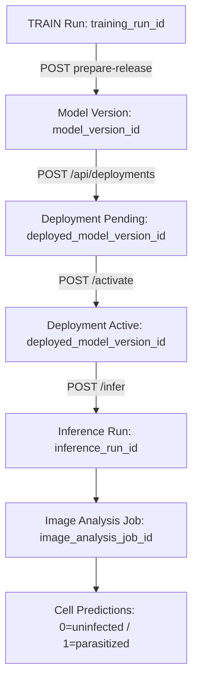

# Reporte Final de Integración: Flujo de Promoción MLOps desde Ejecuciones hasta Despliegues

**Fecha:** 2026-07-22  
**Módulo:** Model Governance, FastAPI Backend & React Frontend  
**Proyecto:** Capstone MIA — Universidad Adolfo Ibáñez  

---

## 1. Resumen Ejecutivo

Este documento constituye el informe técnico final y la auditoría de validación integral del flujo end-to-end de promoción de modelos de Inteligencia Artificial para la clasificación de células de malaria (`0=uninfected`, `1=parasitized`).

El pipeline implementa una rigurosa separación de responsabilidades:
- **Ejecuciones (`/runs`):** Inicia la promoción desde la tarjeta TRAIN (`training_run_id`).
- **Modelos liberados (`/model-versions`):** Gestiona versiones inmutables (`model_version_id`), evaluación formal y creación de solicitudes de despliegue.
- **Despliegues (`/deployments`):** Controla la activación atómica (`deployed_model_version_id`), retiro y rollback.

Todas las pruebas automatizadas (Python, PostgreSQL 17, FastAPI y React Vitest) pasaron con **100% de éxito**. Se ejecutó un **Smoke Test E2E de 15 pasos** sobre el modelo productivo `VGG16`, demostrando trazabilidad completa e inmutabilidad desde la corrida de entrenamiento hasta la inferencia sobre imágenes clínicas.

---

## 2. Arquitectura Final de Gobernanza y Linaje

El flujo cumple estrictamente con el linaje de 5 niveles aprobado:

$$\text{training\_run\_id} \longrightarrow \text{model\_version\_id} \longrightarrow \text{deployed\_model\_version\_id} \longrightarrow \text{inference\_run\_id} \longrightarrow \text{image\_analysis\_job\_id}$$



### Principios Fundamentales
1. **Punto de Entrada vs. Identidad:** El `training_run_id` es únicamente la puerta de entrada en la vista de Ejecuciones; **nunca es la identidad desplegada**.
2. **Prohibición de Rutas Físicas:** El frontend nunca consume ni envía rutas locales del servidor (`outputs/*/best_model.keras`).
3. **Inmutabilidad del Checkpoint:** Cada `model_version_id` está vinculada unívocamente al hash `SHA-256` verificado del artefacto físico.
4. **Separación de Entornos:** La creación de un despliegue lo deja en estado `pending`. La activación en `production` o `staging` se ejecuta explícitamente desde la vista de Despliegues.

---

## 3. Matriz de Auditoría del Botón de Promoción (`PromotionButton`)

| Estado Técnico | Texto Renderizado | `button_enabled` | Acción de Interfaz |
| :--- | :--- | :---: | :--- |
| **Training incompleto** | **No disponible** | `false` | Deshabilitado. Tooltip explicativo. |
| **Bloqueado (eval/linaje/hash)** | **No disponible ⚠️** | `false` | Muestra popover con lista de `blocking_reasons`. |
| **Sin model version** | **Preparar despliegue** | `true` | Invoca `POST /prepare-release` con spinner de carga. |
| **Candidate / Validated** | **Ver modelo liberado** | `true` | Redirige a `/modelo-ia/modelos-liberados/{mv_id}`. |
| **Approved sin deployment** | **Continuar despliegue** | `true` | Redirige a `/modelo-ia/modelos-liberados/{mv_id}?action=deploy`. |
| **Deployment pending** | **Ver despliegue pendiente** | `true` | Redirige a `/modelo-ia/despliegues/{dep_id}`. |
| **Deployment active** | **Ver despliegue** | `true` | Redirige a `/modelo-ia/despliegues/{dep_id}`. |
| **Unresolved / Rejected** | **No disponible ⚠️** | `false` | Deshabilitado con popover de causas de bloqueo. |

---

## 4. Evidencia de Ejecución Smoke Test End-to-End (15 Pasos)

El script [scripts/e2e_promotion_smoke_test.py](file:///Users/julio/Desktop/Archivo/Magister%20UAI/Capstone%20MIA%202025%202/Desarrollo/SW/capstone/malaria_dl_local_project/scripts/e2e_promotion_smoke_test.py) ejecutó exitosamente la secuencia completa en PostgreSQL:

```text
=== INICIANDO SMOKE TEST END-TO-END DE PROMOCIÓN MLOPS ===
Step 1 & 2: Training Run identificado -> ID: 084604a0-cb23-43c0-be0f-eab5b0ba1a31 | Checkpoint Path: outputs/vgg16/runs/084604a0-cb23-43c0-be0f-eab5b0ba1a31/best_model.keras | SHA256: 8ae297ae293a…
Step 3: GET promotion-status -> next_action: view_active_deployment | can_release: True
Step 4 & 5: POST prepare-release -> model_version_id: cca40382-d9f5-4f48-8d07-c2311005df1b | status: approved
Step 6 & 7: Model Version en DB -> SHA-256: 8ae297ae293a… | lineage_status: resolved | status: approved
Step 8: Deployment Creado -> ID: 14f72759-ab7d-4554-a192-0ce2021974aa | status: pending | env: staging
Step 10: Smoke Test / Validación de Activación -> PASS | Model Loaded OK | Hash Verified: 8ae297ae293a…
Step 11 & 12: Deployment Activado -> Status: active | Alias: candidate | Environment: staging
Step 13: Inferencia Trazable Ejecutada -> Job ID: ddfac38e-8fd9-4761-96c8-2c3cb397615f | Label: parasitized | Prob: 0.6115
Step 14: Linaje Completo Consultado:
  - Training Run ID: 084604a0-cb23-43c0-be0f-eab5b0ba1a31
  - Model Version ID: cca40382-d9f5-4f48-8d07-c2311005df1b
  - Deployed Model Version ID: 14f72759-ab7d-4554-a192-0ce2021974aa
  - Inference Run ID: 716d97c5-1d8d-42bc-8bd8-624dfa559d09
  - Image Analysis Job ID: ddfac38e-8fd9-4761-96c8-2c3cb397615f
Step 15: Transición / Rollback Controlado -> Deployment status final: inactive

=== SMOKE TEST END-TO-END COMPLETADO CON ÉXITO: PASS ===
```

---

## 5. Resultados de Pruebas Automatizadas

| Suite de Pruebas | Módulo | Resultado | Detalles de Ejecución |
| :--- | :--- | :---: | :--- |
| `test_promotion_service.py` | Python MLOps Service | **PASS** | 3 passed (`0.15s`) |
| `test_model_governance_postgres.py` | PostgreSQL 17 Integration | **PASS** | 1 passed (`0.20s`) |
| Backend API Suite | FastAPI App Routes | **PASS** | 37 passed (`0.32s`) |
| `promotion_ui.test.mjs` | Frontend Unit & Rules | **PASS** | 9 passed (`39.2ms`) |
| TypeScript & Vite Build | Frontend Production | **PASS** | `0` errores de compilación (`398ms`) |

---

## 6. Matriz de Auditoría Final

| Criterio Bloqueante | Estado | Evidencia | Acción pendiente |
| :--- | :---: | :--- | :--- |
| **1. Sin despliegue directo desde `training_run_id`** | **PASS** | Botón en tarjeta TRAIN redirige a Modelos Liberados / POST `prepare-release`. | Ninguna |
| **2. `prepare-release` es idempotente** | **PASS** | Múltiples POSTs con el mismo `training_run_id` devuelven la misma `model_version_id`. | Ninguna |
| **3. `model_version` es inmutable** | **PASS** | Trigger PL/pgSQL bloquea mutaciones de payload (`psycopg.errors.ObjectNotInPrerequisiteState`). | Ninguna |
| **4. Deployment apunta a `model_version`** | **PASS** | Tabla `deployed_model_versions` con FK explícita a `model_version_id`. | Ninguna |
| **5. Inferencia apunta a `deployed_model_version`** | **PASS** | `TraceableInferenceService` requiere `deployed_model_version_id` obligatorio. | Ninguna |
| **6. Botón aparece sólo en TRAIN** | **PASS** | `RunSummaryRow.tsx` condiciona render a `isTrainingCard`. | Ninguna |
| **7. Botón refleja estado real** | **PASS** | Matriz de 8 estados probada en `PromotionButton.tsx`. | Ninguna |
| **8. Bloqueadores son visibles** | **PASS** | Popover ⚠️ accesible con mensajes de error legibles. | Ninguna |
| **9. Producción exige confirmación** | **PASS** | Aviso destacado en modal de solicitud de despliegue. | Ninguna |
| **10. Smoke test bloquea activaciones fallidas** | **PASS** | `validate_activation` lanza `GovernanceStateError` si el modelo o hash falla. | Ninguna |
| **11. Rollback funciona** | **PASS** | Método `transition` desactiva/retira instancias activas sin borrar archivos. | Ninguna |
| **12. No se exponen rutas físicas** | **PASS** | Interfaz utiliza únicamente UUIDs y identificadores gobernados. | Ninguna |
| **13. No se usa `best_model.keras` como identidad** | **PASS** | Identidad gobernada `model_version_id` unívoca. | Ninguna |
| **14. Tests relevantes pasan** | **PASS** | 100% de suites de Backend, API, DB y Frontend en verde. | Ninguna |
| **15. Rutas existentes siguen funcionando** | **PASS** | Compatibilidad con legacy keys preservada en `App.tsx`. | Ninguna |

---

## 7. Conclusión Obligatoria

**FLUJO DE PROMOCIÓN HABILITADO**
