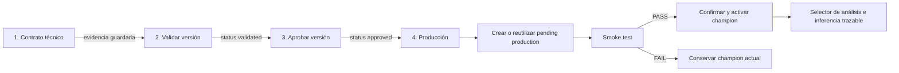

# Flujo de cuatro pasos para producción

## 1. Problema original

La vista de Despliegues exponía directamente smoke y activación sobre un
deployment pendiente. No explicaba que el bloqueo pertenecía al contrato
inmutable de la `model_version`, mezclaba validación de versión con smoke test y
no ofrecía una acción principal guiada.

## 2. Arquitectura reutilizada

No se creó una segunda arquitectura. Se conserva:

`training_run_id → model_version_id → deployed_model_version_id → inference_run_id → image_analysis_job_id`

Se reutilizan `model_versions`, `run_lineage`, `artifacts`,
`run_threshold_calibration`, `deployed_model_versions`,
`run_model_deployments`, `image_analysis_jobs` y `predictions`, además de
`ModelReleaseLifecycleService`, `ModelDeploymentService`,
`TraceableInferenceService` y `ModelCache`.

## 3. Flujo de cuatro pasos

Smoke test es una suboperación del paso 4, no un quinto paso.

## 4. Reglas por paso

1. Contrato: solo una versión `discovered` es mutable. Se verifica SHA antes de
   inspeccionar Keras. No se aceptan IDs, paths, hashes ni firmas libres.
2. Validación: exige contrato, linaje, evaluación formal, artifact verificable
   y threshold compatible. No aprueba automáticamente.
3. Aprobación: solo desde `validated`, con responsable y motivo.
4. Producción: crea o reutiliza una revisión `pending` compatible, ejecuta smoke
   con imagen controlada y activa únicamente con `confirm_production=true`.

La convención clínica es invariable: `0=uninfected`, `1=parasitized`,
`positive_class=1`, `positive_label=parasitized`,
`score_name=probability_parasitized`.

## 5. Contratos de API

Nuevos, sobre recursos existentes:

- `GET /api/model-versions/{id}/contract-candidates`
- `POST /api/model-versions/{id}/complete-contract`
- `GET /api/model-versions/{id}/production-readiness`

Reutilizados:

- `POST /api/model-versions/{id}/validate`
- `POST /api/model-versions/{id}/approve`
- `POST /api/deployments`
- `POST /api/deployments/{id}/smoke-test`
- `POST /api/deployments/{id}/activate`
- `POST /api/deployments/{id}/rollback`
- `GET /api/models/available`
- `POST /api/image-analysis-jobs`

No se agregó un orquestador persistente: el frontend coordina operaciones
idempotentes existentes y recupera estado real después de cada respuesta.

## 6. Estados, readiness y acciones

`production-readiness` entrega `current_step`, `next_action`, etiqueta y
capacidades explícitas; el frontend no interpreta mensajes. La acción dinámica
es: completar contrato, validar, aprobar, promover o ver modelo productivo.

Cada campo del contrato informa valor actual, candidatos, fuente, selección
propuesta, estado y fuentes buscadas. Una fuente única se propone; varias
requieren selección; ninguna bloquea.

## 7. Operaciones internas de producción

La confirmación muestra modelo, versión, champion actual, destino y threshold.
Después de confirmar:

1. busca un `production/champion` pending o inactive compatible;
2. si no existe, usa `ModelDeploymentService.create`;
3. ejecuta `smoke_test`;
4. aborta si no es PASS;
5. usa `activate(..., confirm_production=True)`;
6. el servicio desactiva el champion anterior en la misma transacción;
7. refresca deployment y readiness manteniendo la fila.

## 8. Rollback, auditoría y seguridad

Rollback crea una revisión pendiente, nunca reactiva una revisión histórica.
Contrato, validación, aprobación, creación, smoke y activación registran actor,
motivo o evidencia en metadata/auditoría existente. Los endpoints validan UUID;
el frontend no recibe paths físicos. El payload gobernado permanece inmutable
desde `candidate`.

## 9. Tests

- Backend: routing de candidatos y guardado explícito; suites existentes de
  lifecycle, deployment, linaje, hash y convención clínica.
- Frontend: cuatro pasos, smoke como suboperación, modales, estados, orden
  smoke→activate, selección persistente, accesibilidad y build TypeScript.
- E2E opt-in: `scripts/verify_four_step_production_e2e.py`; requiere
  `RUN_PRODUCTION_E2E=1` y IDs reales. No se ejecuta implícitamente.

## 10. Gate de Etapa 2

El gate solo es PASS si existe un único deployment active
`production/champion`, visible en `/api/models/available`, con smoke PASS y una
inferencia real que persista los cinco IDs del linaje. Un `approved` aislado no
habilita Etapa 2.

Estado verificado al cierre: **ETAPA 2 BLOQUEADA — NO EXISTE MODELO ACTIVO EN
PRODUCCIÓN**. La ejecución real fue denegada antes de efectuar escrituras; no se
declara éxito.

## 11. Promover otro modelo

Desde Despliegues, abrir la fila, seguir la única acción principal, revisar las
fuentes del contrato, validar, aprobar con motivo y confirmar producción. Si un
requisito carece de evidencia, completar primero el entrenamiento/evaluación
relacionada; nunca ingresar metadata clínica manualmente.

