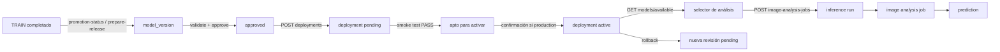

# Diagnóstico y cierre del flujo de disponibilidad de modelos

## 1. Resumen ejecutivo

El repositorio ya tenía las entidades gobernadas `model_versions`,
`deployed_model_versions`, `run_model_deployments`, `image_analysis_jobs` y
`predictions`. No se creó una arquitectura paralela. El flujo se interrumpía
después de preparar la versión: las páginas **Modelos liberados** y
**Despliegues** eran deliberadamente read-only, no existía un smoke test
operable, las mutaciones no propagaban `datasource` y la pantalla de análisis
solo mostraba predicciones históricas.

La prueba E2E encontró además cuatro defectos de ejecución que no eran visibles
en una auditoría estática:

1. las rutas relativas del artifact store se resolvían desde el proceso web;
2. un snapshot SQLAlchemy con UUID/fechas no era serializable como JSON;
3. un job `running` se insertaba sin `started_at`;
4. el mismo parámetro se vinculaba a `predictions.image_id` (text) y
   `predictions.source_image_id` (uuid), causando inferencia fallida.

Todos fueron corregidos reutilizando los servicios y tablas existentes.

## 2. Flujo esperado y flujo encontrado



Antes del cambio el flujo real terminaba en `model_version` o en un deployment
`pending`. La API tenía create/activate, pero la UI no los invocaba; tampoco
había una condición comprobable de smoke test ni un consumidor de
`GET /api/deployments/active`.

## 3. Caso real utilizado

La evidencia positiva usa un run real visible en `malaria_experiments`, clonado
a la base aislada `capstone_availability_e2e`:

| Identificador | Valor |
|---|---|
| `training_run_id` | `084604a0-cb23-43c0-be0f-eab5b0ba1a31` |
| `evaluation_run_id` | `f7ee2be9-773e-43f1-8384-9190dbd0b77a` |
| `explainability_run_id` | No registrado; es opcional |
| `artifact_id` | `625b0a10-7564-4c47-93d9-b432ea18fc55` |
| `model_version_id` | `cca40382-d9f5-4f48-8d07-c2311005df1b` |
| `threshold_profile_id` | `eb682c13-856d-43a4-8aa9-2aa4df3c1b7c` |
| threshold | `0.42`, `validated`, split `val` |
| SHA-256 | `8ae297ae293a164c849b905e49e463fe55e4ca4ec9709dc46b81e2ace3e77e0c` |

La identidad siempre fue la cadena
`training_run_id → model_version_id → deployed_model_version_id`; el alias
`best_model.keras` no se envía desde el frontend ni identifica el deployment.

También se reprodujo el caso problemático `custom_cnn`:

- training: `371a9e75-2e87-4c22-b1d0-8f249007cc33`;
- model version: `8f5277bd-e2bb-4dff-a4d6-821f9f5a60e7`;
- deployment production pending: `8c76f936-d60b-48d3-9e40-6848c892cb34`.

Aunque figura aprobado, sus snapshots de mapping, preprocessing y firmas están
vacíos. El smoke devuelve `FAIL`; la validación se conserva.

## 4. Punto de falla, mensaje y causa raíz

| Punto | Mensaje observado | Causa raíz | Corrección |
|---|---|---|---|
| Modelos liberados | “acciones … no están habilitadas” | UI read-only | Acciones validate, approve y create pending |
| Despliegues | Sin botones operativos | UI read-only y sin smoke gate | Smoke, activate, deactivate, retire y rollback |
| Create deployment | `artefacto inexistente` | ruta relativa resuelta desde CWD | resolución contra raíz del proyecto |
| Create deployment | snapshot no serializable | UUID/datetime en RowMapping | snapshot JSON normalizado |
| Image job | constraint `status_timestamps` | `running` sin `started_at` | timestamp del inference run |
| Prediction | `text versus uuid` | parámetro compartido por columnas de distinto tipo | bindings separados |
| Error de inferencia | transacción abortada ocultaba causa | actualización FAIL en transacción inválida | savepoint y auditoría de fallo |
| Multi-datasource | escritura podía ir a DB por defecto | servicios globales sin datasource | factory transaccional por datasource |

## 5. Estados antes y después

La creación siempre produce `pending`. La activación requiere:

- model version `approved` o `deployed`;
- linaje `resolved`;
- artifact, hash, framework, mapping, preprocessing y firmas válidos;
- evaluación formal y threshold de la misma versión;
- evidencia `metadata.smoke_test.status = PASS`;
- confirmación explícita si `environment = production`.

El cutover desactiva el active anterior del mismo
`(deployment_name, environment, alias)` y no borra revisiones. El rollback crea
otra fila `pending` con `rollback_of_deployment_id` y
`supersedes_deployment_id`; luego debe ejecutar su propio smoke y activación.

## 6. Endpoints definitivos

| Método y endpoint | Uso |
|---|---|
| `GET /api/training-runs/{id}/promotion-status` | Resolver estado desde TRAIN |
| `POST /api/training-runs/{id}/prepare-release` | Obtener/crear model version idempotente |
| `GET /api/model-versions` | Lista, evaluación y threshold profile |
| `POST /api/model-versions/{id}/validate` | Validación técnica explícita |
| `POST /api/model-versions/{id}/approve` | Aprobación con actor y motivo |
| `POST /api/model-versions/{id}/reject` | Rechazo explícito |
| `POST /api/deployments` | Crear revisión `pending` |
| `POST /api/deployments/{id}/smoke-test` | Inferencia controlada y evidencia |
| `POST /api/deployments/{id}/activate` | Cutover; producción exige confirmación |
| `POST /api/deployments/{id}/deactivate` | Desactivar |
| `POST /api/deployments/{id}/retire` | Retirar |
| `POST /api/deployments/{id}/rollback` | Crear revisión de rollback pending |
| `GET /api/models/available` | Fuente del selector real |
| `POST /api/image-analysis-jobs` | Inferencia por `deployed_model_version_id` |

Todas las mutaciones frontend propagan `datasource`. El cliente nunca envía
`checkpoint_path`.

## 7. Evidencia E2E

La prueba opt-in usa PostgreSQL 17 y el modelo Keras real, no un predictor que
retorna PASS fijo.

| Evidencia | Valor |
|---|---|
| deployment experimental inicial | `09fa8bc3-7400-4a41-85d0-d73789a5d1d1`, luego `inactive` por cutover |
| deployment experimental activo | `05fefd8d-40d0-4673-a059-87427a49ea82` |
| revisión rollback pending | `7d836512-433e-47eb-952d-7eae9b57fa95` |
| deployment production activo aislado | `0968648f-e312-4b02-b33f-85b1bb88e560` |
| smoke | `PASS`, con image/model/deployment/hash/timestamp |
| inference run | `c2584079-7935-4264-9381-48bdc47cd66f` |
| image analysis job | `2b4677c2-85a8-404d-a855-1786832c3b11` |
| prediction | `3ba6f8ab-c119-4ef6-a2f0-9a3a162586f2` |
| resultado | clase `1`, label `parasitized` |

Se comprobó por SQL:

`prediction → deployed_model_version → model_version → training_run`.

El deployment activo apareció en `GET /api/models/available` antes de ejecutar
la inferencia. La activación production sin confirmación retornó 409 y la misma
revisión se activó al enviar `confirm_production=true`.

## 8. Evidencia frontend

- `RunPromotionAction` continúa existiendo solo en la tarjeta TRAIN.
- EVALUATE y EXPLAIN conservan sus acciones y no crean deployments.
- `ModelVersions` valida, aprueba y crea el deployment pendiente.
- `Deployments` muestra el smoke y sus errores, exige confirmación de production
  y administra transiciones/rollback.
- `UploadedPredictions` ahora consume `GET /api/models/available`, usa el
  `deployed_model_version_id` seleccionado y ejecuta el image job.
- Hay estados de loading/error y botones deshabilitados durante operaciones.

No existe una dependencia de navegador/E2E DOM en el proyecto. La cobertura
frontend disponible valida integración fuente/contratos y el build; la prueba
de ejecución completa se hace con FastAPI TestClient, PostgreSQL y TensorFlow.

## 9. Archivos modificados

- `backend_api/app/routes/governance.py`
- `backend_api/tests/test_model_availability_e2e_postgres.py`
- `malaria_dl_local_project/src/model_deployment_service.py`
- `malaria_dl_local_project/src/model_release_lifecycle_service.py`
- `malaria_dl_local_project/src/traceable_inference.py`
- `frontend/src/App.tsx`
- `frontend/src/pages/ModelVersions.tsx`
- `frontend/src/pages/Deployments.tsx`
- `frontend/src/pages/UploadedPredictions.tsx`
- `frontend/src/services/api.ts`
- `frontend/src/types/api.ts`
- tests frontend de promoción y navegación

No se agregaron tablas, modelos ORM ni migraciones.

## 10. Matriz del flujo

| Paso | Página o componente | Acción | Endpoint | Entidad resultante | Resultado |
|---|---|---|---|---|---|
| 1 | Ejecuciones / TRAIN | Preparar despliegue | `POST …/prepare-release` | model version | Idempotente |
| 2 | Modelos liberados | Validar | `POST …/validate` | validated | Gate técnico |
| 3 | Modelos liberados | Aprobar | `POST …/approve` | approved | Actor/motivo |
| 4 | Modelos liberados | Crear deployment | `POST /api/deployments` | pending | Sin auto-activate |
| 5 | Despliegues | Smoke | `POST …/smoke-test` | evidencia JSON | PASS/FAIL real |
| 6 | Despliegues | Activar | `POST …/activate` | active | Cutover atómico |
| 7 | Predicciones | Seleccionar | `GET /api/models/available` | deployment seleccionado | Solo active/aprobado |
| 8 | Predicciones | Analizar | `POST /api/image-analysis-jobs` | run/job/prediction | Linaje completo |
| 9 | Despliegues | Rollback | `POST …/rollback` | nueva revisión pending | Historia preservada |

## 11. Matriz de verificación

| Verificación | Estado | Evidencia | Observación |
|---|---|---|---|
| Promotion status y prepare release | PASS | suites existentes | Idempotencia cubierta |
| Validación/aprobación | PASS | API/UI y gate reutilizado | No hay auto-aprobación |
| Deployment pending | PASS | E2E PostgreSQL | Identidad por UUID |
| Smoke PASS | PASS | Keras real + imagen registrada | SHA y serialización |
| Smoke FAIL | PASS | snapshot custom_cnn incompleto | No debilita gate |
| Activación experimental | PASS | E2E aislado | active visible |
| Confirmación production | PASS | 409 sin confirmación; active con ella | Base aislada |
| Champion anterior inactive | PASS | evidencia SQL | Misma ranura |
| Rollback | PASS | revisión pending con FK | Sin reactivar histórica |
| Selector de modelos | PASS | `/api/models/available` | Usa deployment id |
| Inferencia/linaje | PASS | run/job/prediction SQL | Resultado clínico válido |
| Producción operativa actual | PARTIAL | deployment real sigue pending | No se mutó sin confirmación humana |
| Autenticación corporativa | PARTIAL | actor/motivo auditados | Falta integrar IdP/RBAC |
| Browser E2E | NOT APPLICABLE | no existe framework en repo | Recomendado en fase posterior |

## 12. Tests ejecutados

- proyecto ML: `352 OK`, `1 skipped` opt-in;
- backend API: `36 passed` antes del E2E; el test nuevo queda skipped por
  defecto;
- E2E PostgreSQL/TensorFlow: `3 passed`;
- frontend: `20 passed`;
- TypeScript y build Vite de producción: PASS;
- migraciones: no se agregó ninguna; se reutilizó el esquema 024–027 ya
  probado por la suite existente.

Comando reproducible E2E:

```bash
createdb --template=malaria_experiments capstone_availability_e2e
cd backend_api
MALARIA_DATABASE_URL=postgresql://julio@localhost:5432/capstone_availability_e2e \
RUN_MODEL_AVAILABILITY_E2E=1 \
../malaria_dl_local_project/.venv/bin/python -m pytest \
tests/test_model_availability_e2e_postgres.py -q -s
```

## 13. Procedimiento para disponibilizar otro modelo

1. En **Ejecuciones**, abra un TRAIN completed y pulse **Preparar despliegue**.
2. Revise los bloqueadores y abra su model version.
3. En **Modelos liberados**, ejecute **Validar** con threshold profile.
4. Ingrese responsable/motivo y ejecute **Aprobar**.
5. Elija primero `experimental` y cree el deployment pendiente.
6. En **Despliegues**, seleccione una imagen controlada y ejecute smoke.
7. Si el resultado es PASS, active la revisión.
8. En **Predicciones**, seleccione el deployment activo y ejecute el análisis.
9. Repita para production y marque la confirmación explícita.

## 14. Rollback

En un deployment active, seleccione una revisión histórica de la misma ranura,
ingrese motivo y pulse **Crear rollback pendiente**. La nueva revisión debe
pasar smoke y luego activarse. El cutover deja inactive la revisión actual; no
se borran artefactos ni filas históricas.

## 15. Riesgos pendientes

El principal riesgo es de autorización: el sistema registra `actor` y motivo,
pero no valida una identidad autenticada ni roles. Antes de exponer las
mutaciones fuera de una red controlada debe integrarse el IdP/RBAC real. También
conviene agregar Playwright/Cypress cuando el repositorio adopte un framework
de navegador. Los model versions históricos con snapshots vacíos deben
reconstruirse desde evidencia verificable o rechazarse; nunca completarse con
defaults silenciosos.
