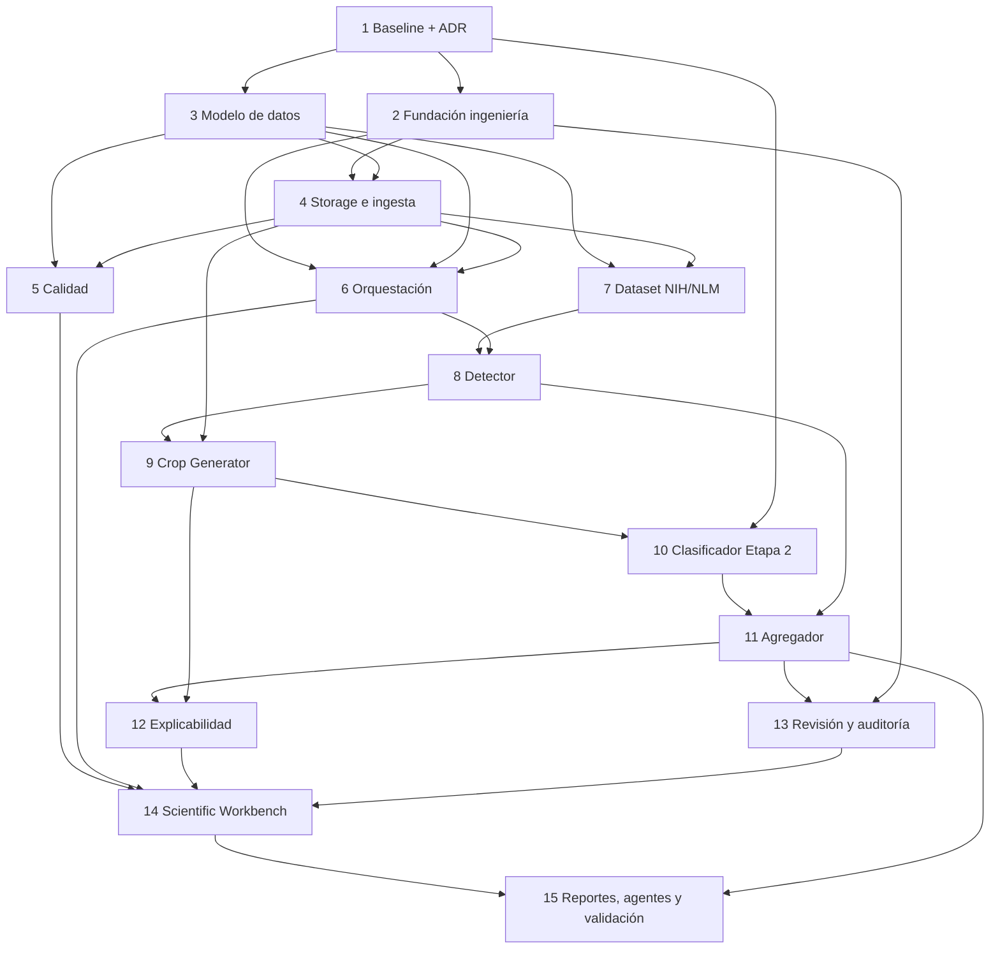

# Mapa de dependencias — Entrega 2

## Corrección del orden propuesto

La secuencia 1–15 es válida como macro-orden, con cuatro ajustes:

1. Prompt 1 debe resolver antes de código la relación publicación/deployment/default, contratos de storage, job y detector, vocabulario no diagnóstico y límites MVP.
2. Prompt 2 debe incluir autenticación/RBAC mínima, correlation ID, configuración única, CI y entornos; no postergarlos a la UI.
3. Prompt 3 debe modelar también policy/pipeline version, audit events y attempts de jobs para evitar migraciones correctivas inmediatas.
4. Prompt 7 puede desarrollar parsers en paralelo con 4–6 usando fixtures; la descarga real requiere storage estable y políticas de datos.

## Bloqueantes y camino crítico

Camino crítico: **ADR → modelo de dominio → storage/ingesta → jobs/worker → dataset/anotaciones → detector → crops → clasificador → agregación → revisión/XAI → workbench → validación**.

Bloqueantes:

- Identidad inferible Etapa 2 y default único.
- Esquema de subject/sample/slide/full image y auditoría.
- URI/checksum/inmutabilidad mediante `StorageProvider`.
- Semántica de job, claim/lease/retry/idempotencia.
- Contrato de coordenadas del detector y manifest patient-aware.

## Paralelización segura

Tras Prompt 1:

- CI/config/auth base puede avanzar junto al diseño SQL.
- Parser Point/Polygon con fixtures puede avanzar junto a storage.
- Detector simulado y contrato pueden avanzar junto al worker.
- Wireframes del workbench pueden avanzar, pero su implementación espera contratos API.
- Report manifest y protocolo métrico pueden diseñarse antes del viewer.

No paralelizar cambios a `predictions`, publicación/default y job schema sin un único ADR/owner de contrato.

## Dependencias por dominio

- **Datos**: pseudónimo → sample → slide/capture → image → tile/detection/crop → prediction/result/review.
- **BD**: baseline 029 → Alembic → dominio → storage records/policies → job attempts/events → resultados/reviews.
- **Backend**: auth/unit-of-work/storage → ingest/QC/jobs → detector/crops/classifier → aggregation/XAI/review/report.
- **Frontend**: auth/session + contratos tipados → muestra/QC/progreso → viewer/inspector → review/report.
- **IA**: patient split → annotations → detector metrics → crops → classifier calibration → aggregation/XAI/E2E.
- **Infra**: perfiles/CI → worker con cola PostgreSQL → health/readiness/metrics → backups/restore.

## Gates

|Gate|Condición|
|---|---|
|G0|ADRs aprobados; mapping clínico y lenguaje experimental congelados|
|G1|Migraciones efímeras up verificadas; tests legacy verdes|
|G2|Upload inmutable/idempotente y traversal/MIME/size cubiertos|
|G3|Worker recupera crash, respeta prioridad y no duplica artifacts|
|G4|Split por paciente sin leakage; manifest reproducible|
|G5|Detector fake E2E y detector real con métricas acordadas|
|G6|Crop/classification lineage completo con checkpoint/threshold|
|G7|Agregado no diagnóstico y XAI policy reproducibles|
|G8|Auto/humano separados, RBAC y audit before/after|
|G9|Workbench accesible; reporte manifiesta limitaciones|
|Release|Suite, E2E efímera, restore drill y revisión científica|

## Estrategia de compatibilidad

Mantener TRAIN/EVALUATE/EXPLAIN e inferencia actual; crear tablas especializadas y vistas compatibles; no reescribir migraciones 001–029; mantener adaptadores `src.*`; resolver el clasificador nuevo mediante `model_version`; conservar releases/checkpoints; feature flag para rutas Frotis; rollback por alias/revisión, no por mutación.

## Secuencia recomendada de prompts

1. Architecture Baseline + ADRs (**cerrado por Baseline v1.1**).
2. Fundación: settings, Alembic baseline, CI, auth/RBAC, logging/correlation.
3. Dominio y auditoría: subjects a reviews/pipeline policies en esquema.
4. StorageProvider e ingesta inmutable.
5. QC versionado y gate.
6. Cola/worker/jobs/attempts/progreso.
7. NIH/NLM, parsers, manifest y patient split.
8. CellDetector, fake, annotation adapter, RBCNet spike/adapter, tiling/NMS.
9. Crop Generator y artifacts trazables.
10. CellClassifier adapter al modelo default gobernado.
11. Agregación y manifest de reproducibilidad.
12. XAI automático/selectivo/on-demand.
13. Revisión, anotaciones, versionado y auditoría.
14. Scientific Workbench.
15. Reportes, agentes restringidos y validación E2E.

## Estado Prompt 2

La fundación local/test/demo, PostgreSQL 17 efímero, baseline Alembic, auth/RBAC inicial,
correlation/logging, health/readiness y CI quedaron implementados. Docker fue retirado del
alcance operativo. Gate G1 depende de los gates locales PostgreSQL y autenticación.
Prompt 3 puede depender de la revisión `20260726_01`; no debe alterar 001–029.
