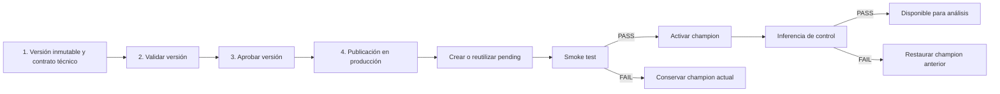

# Flujo simplificado de publicación de modelos

## Arquitectura

La fuente de verdad sigue siendo:

`training_run → model_version inmutable → deployed_model_version production/active/champion → inference_run → image_analysis_job`

No se añadieron tablas ni estados productivos manuales al training run. La
marca “Modelo activo en producción” se deriva consultando el deployment activo
de su `model_version`.

## Cuatro pasos



Smoke test e inferencia de control son suboperaciones del cuarto paso.

## Artifact inmutable y contrato

`ModelContractService` reutiliza el artifact registrado. Es apto cuando su URI
es inmutable o su ubicación pertenece al snapshot específico
`outputs/<modelo>/runs/<training_run_id>/`; una referencia genérica no es
aceptada. Antes de inspeccionar Keras se recalcula SHA-256. El archivo no se
reescribe.

El manifest se registra en metadata gobernada con IDs, hash, tamaño, framework,
preprocessing, mapping, firmas, evaluación y threshold. El guardado ocurre
mientras la versión está `discovered` y luego cambia a `candidate`, congelando
su payload mediante el trigger existente.

Convención obligatoria:

```json
{
  "0": "uninfected",
  "1": "parasitized",
  "positive_class": 1,
  "positive_label": "parasitized",
  "score_name": "probability_parasitized"
}
```

Una evidencia incompatible bloquea la operación. No se reciben paths, hashes ni
IDs de identidad editables desde el frontend.

## Validación y aprobación

La validación reutiliza `ModelReleaseLifecycleService.validate` y
`ModelDeploymentService.validate_activation`: verifica artifact, hash, linaje,
contrato, evaluación, threshold, carga del modelo y mapping clínico. Cambia
únicamente a `validated`.

La aprobación reutiliza `ModelReleaseLifecycleService.approve`, exige actor y
motivo, y solo acepta `validated`. No activa deployments.

## Publicación

`ModelDeploymentService.publish_to_production` orquesta sin convertir staging:

1. exige `approved`, actor, motivo y confirmación;
2. exige exactamente un threshold compatible;
3. crea o recupera una revisión `production/champion/pending`;
4. verifica artifact y contrato mediante el servicio existente;
5. ejecuta smoke con una imagen registrada;
6. activa solo con PASS;
7. deja inactive el champion anterior del mismo slot;
8. invalida caché mediante el mecanismo existente;
9. ejecuta inferencia trazable;
10. persiste los IDs de verificación en metadata;
11. si la inferencia falla, desactiva la revisión nueva y restaura el champion
    anterior.

Un reintento recupera el deployment compatible o devuelve la publicación
activa ya verificada.

## Readiness y botones

`GET /api/model-versions/{id}/production-readiness` devuelve códigos y flags:

- `build_production_model_version` / `can_build_package`;
- `validate_model_version` / `can_validate`;
- `approve_model_version` / `can_approve`;
- `publish_to_production` / `can_publish`;
- `view_production_model` / `is_active_in_production`.

La pantalla conserva los cuatro pasos y muestra:

- Completar o Generar versión productiva;
- Validar versión;
- Aprobar versión;
- Publicar en producción;
- Ver modelo productivo cuando corresponde.

Los botones deshabilitados incluyen el motivo mediante `title`; la fila y el
scroll se conservan después de cada actualización.

## Endpoints

Nuevos o extendidos:

- `GET /api/model-versions/{id}/production-package-preview`
- `POST /api/model-versions/{id}/build-production-package`
- `POST /api/training-runs/{id}/build-production-model-version`
- `GET /api/model-versions/{id}/production-readiness`
- `POST /api/model-versions/{id}/publish-to-production`

Reutilizados internamente:

- `POST /api/model-versions/{id}/validate`
- `POST /api/model-versions/{id}/approve`
- creación, smoke, activación y rollback de deployments;
- `/api/models/available`;
- creación de image analysis jobs e inferencia trazable.

## Rollback y seguridad

Rollback sigue creando una revisión pendiente; nunca muta el payload ni
reactiva una revisión histórica. La publicación no desactiva el champion hasta
que el smoke de la nueva revisión es PASS. UUID, SHA, ownership del artifact,
mapping clínico, actor, motivo y confirmación se validan en backend.

## Tests

Las suites cubren routing, confirmación, contratos frontend, cuatro pasos,
modales, prevención de doble clic, orden lógico de publicación, build
TypeScript y las validaciones existentes de artifact, hash, mapping, smoke,
activación, inferencia y rollback. La prueba PostgreSQL real es opt-in y no usa
datos ficticios.

## Gate de Etapa 2

Solo se muestra habilitada cuando la versión está approved, el artifact y SHA
son válidos, el contrato está completo y existe un deployment
`production/active/champion` con smoke PASS, inferencia real persistida,
visibilidad para análisis y rollback disponible.

El resultado operacional debe verificarse al finalizar la ejecución E2E; no se
deduce de una marca visual.
